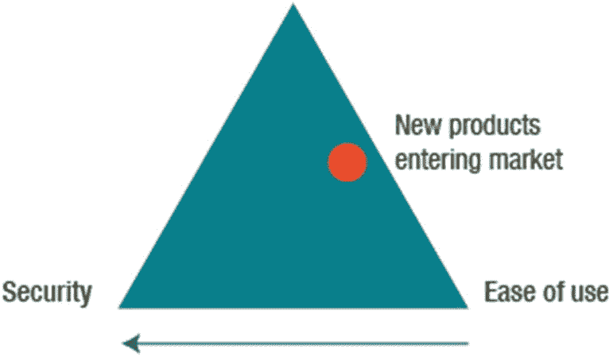

# 一、道德黑客入门

在本章中，您将了解道德黑客行为的五个阶段以及不同类型的黑客攻击。

本章结束时，您将能够

*   确定道德黑客的五个阶段。

*   识别不同类型的黑客攻击。

## 道德黑客

公司雇佣道德黑客做非法黑客做的事情:利用漏洞。道德黑客也被称为安全测试员(T0)或渗透测试员(T2)。在本章中，您将了解保护网络免受攻击所需的技能。在学习每一章的过程中，你将关注下面列出的要点。

在整本书中，假设上层管理人员认同组织的信息资产需要得到保护这一事实。还假设高层管理人员已经制定了适当的安全策略来支持他们认可的安全需求。

*   **信息:**信息资产必须得到保护。

*   **假设:**假设高层管理人员认识到安全的需要，并且有一个安全策略来定义对象在安全域中如何交互。

*   **挑战:**你的任务是通过警惕那些出于自己的动机使用类似基础设施的人来防止基础设施被利用。

*   **解决方案:**雇佣具有恶意黑客能力的道德黑客。

## 弱点

需要记住的是，*漏洞*是可以被操纵的弱点，而*威胁*是可能危及安全的行为或事件。考虑已识别的弱点如何影响安全性。思考以下问题:

*   由于分析、设计、操作或组织失败而导致的目标弱点

*   由于系统安全程序、基础设施设计或可被利用的控制措施而导致的信息系统缺陷

*   弱点、设计错误或实现错误导致危及设备、网络、应用程序或协议安全的意外事件

## 攻击

“评估目标”是被保护资产的名称。这可以是 IT 系统、产品或组件。攻击是针对目标采取的蓄意行动，目的是影响系统的机密性、完整性、可用性或真实性。攻击可以是主动的，也可以是被动的，可以从组织内部或外部发起。需要注意的各种类型的攻击包括:

*   **主动攻击**改变目标系统以影响隐私、可信度和可访问性。

*   **被动攻击**在不影响系统状态的情况下破坏系统数据的机密性。

*   **内部攻击**由授权用户从网络内部发起。

*   **外部攻击**由攻击者在没有网络授权的情况下进行。

## 安全性与功能性和易用性

安全性是功能性和易用性之间的权衡。可以说，许多产品都设计成开箱即用。启用默认配置和软件后，安全性会受到影响。图 [1-1](#Fig1) 展示了安全性、功能性和易用性之间的关系。走向安全性通常意味着远离功能性和易用性。进入市场的新产品通常是功能性和易用性之间的平衡，因此对用户来说安全性较低。

图 1-1

安全性、功能性和易用性

## 攻击的各个阶段

安全漏洞利用漏洞。暴露是由于漏洞造成的损失。一旦暴露，攻击者收集机密信息并掩盖他们的踪迹。简要介绍一下攻击的各个阶段，如下所示。未来的章节将提供更深入的讨论。

*   **侦察:**在侦察阶段，也就是计划阶段，攻击者收集尽可能多的目标信息。简单的旧研究可能是这个阶段的第一个活动。然后，攻击者可以继续使用其他侦察方法，如翻垃圾箱或扫描。考虑侦察方法的类型:被动(攻击者不直接与系统交互，如社会工程或翻垃圾箱)或主动(攻击者使用工具直接与系统交互)。后者可能包括使用工具来检测开放端口、路由器位置、网络映射和操作系统细节。

*   **扫描:**在扫描阶段，攻击者试图识别特定的漏洞。漏洞扫描器是使用最广泛的工具。端口扫描器用于识别提供正在运行的服务类型线索的监听端口。

    扫描是侦察阶段的逻辑扩展，但它涉及更深入的探测，这被认为是主动侦察的扩展。

*   **获得访问权限:**获得访问权限通常是攻击者的目标。但是，请记住，情况并不总是如此。例如，拒绝服务攻击会导致资源不可用，攻击者不一定要获得对该资源的访问权才能成功。影响攻击者能否成功获得访问权限的因素有几个，如目标系统的体系结构和配置、技能水平或获得的访问权限级别。

*   **保持访问:**一旦攻击者成功获得访问权限，他们需要通过安装后门或 rootkit 来保持访问权限。例如，为了不被发现，攻击者还会通过更改日志文件来消除任何证据。

    组织可以使用入侵检测系统(IDS)或蜜罐来检测潜在的入侵者。

*   **掩盖踪迹:**要知道攻击者会抹去他们存在的所有证据。Netcat 或其他木马等工具可用于删除日志文件中的证据。其他选项包括隐写术、在其他数据中隐藏数据和隧道(在另一个协议中携带一个协议)。

## 黑客攻击的类型

攻击者可以通过几种方式利用他们发现的漏洞来访问组织的网络。这些攻击可以分为四类。

*   **操作系统:**增加的功能放大了复杂性。

*   **应用级:**对于应用开发者来说，安全性并不总是优先考虑的问题。

*   **收缩包装代码:**开发者使用从其他来源获得批准的免费库和代码。

*   **错误配置:**建立有效的配置，删除所有不必要的应用程序和服务。

## 骇客主义

*黑客行动主义*是一个结合了*黑客*和*行动主义*的术语。为了提高对政治或社会议程的认识，黑客行动主义者使用黑客技术。政府实体和跨国公司是目标之一。以下是与黑客活动主义相关的黑客类别类型的示例:

*   黑帽子为了不正当的目的雇佣计算机技能。

*   白帽子将他们的力量用于防御目的。

*   灰色帽子相信完全的公开。

*   自杀黑客渴望成为他们目标的殉道者。

## 道德黑客

道德黑客受雇于威胁评估和安全。值得注意的是，一个有道德的黑客得到了雇佣他们的组织的同意。道德黑客使用与攻击者相同的技术和工具。道德黑客必须具备以下技能:对软件和硬件的透彻了解，对网络和编程的良好理解，以及安装和管理几种操作系统的知识。

道德黑客寻找三个基本问题的答案:

*   攻击者会在目标上看到什么？

*   攻击者如何使用这些信息？

*   攻击者对目标的尝试是否被识别？

## 脆弱性研究

由于攻击者使用研究来寻找漏洞，这对好人也很重要。不断有新产品推出，你必须跟上最新的技术。

还有许多黑客网站，你可以监控信息。两个值得访问的优秀网站是**美国计算机应急准备小组** ( [`www.us-cert.gov/`](http://www.us-cert.gov/) )和**国家漏洞数据库** ( [`https://nvd.nist.gov/`](https://nvd.nist.gov/) )。

## 道德黑客任务

当您接受道德黑客任务时，记住以下步骤很重要:

1.  您首先与客户进行初次会面，提供概述并准备一份保密协议。

2.  保密协议写道，道德黑客得到了客户的完全同意。

3.  然后，您创建一个团队并准备测试时间表。进行测试时，可以采取两种方法之一:黑盒或白盒测试。使用黑盒测试，测试人员没有关于系统的先验知识或信息。白盒测试正好相反:测试人员对系统有预先的了解。例如，测试人员被告知网络拓扑结构，并被提供一张显示公司所有路由器、交换机、防火墙和指令检测系统(IDS)的网络图。

4.  测试完成后，您分析结果并准备一份报告提交给客户。

## 计算机犯罪

计算机犯罪可以通过使用计算机或以计算机为目标来实现。作为一名道德黑客，留意颁布的法律并遵守法律是很重要的。要了解更多信息，请查阅**网络安全加强法案** ( [`http://beta.congress.gov/bill/113th-congress/house-bill/756`](http://beta.congress.gov/bill/113th-congress/house-bill/756) )。

## 摘要

在本章中，您了解了道德黑客、黑客行动主义以及不同类型的黑客和黑客攻击。现在，您已经知道了攻击的五个阶段，并对漏洞研究和相关工具有了基本的了解。您可以描述道德黑客测试目标网络的不同方式。最后，您了解犯罪的各种类别，以及了解该领域的法律对于保持合规性的重要性。

## 资源

*   **美国计算机应急准备小组:** [`www.us-cert.gov/`](http://www.us-cert.gov/)

*   **国家漏洞数据库:** [`https://nvd.nist.gov/`](https://nvd.nist.gov/)

*   **网络安全加强法案:** [`http://beta.congress.gov/bill/113th-congress/house-bill/756`](http://beta.congress.gov/bill/113th-congress/house-bill/756)