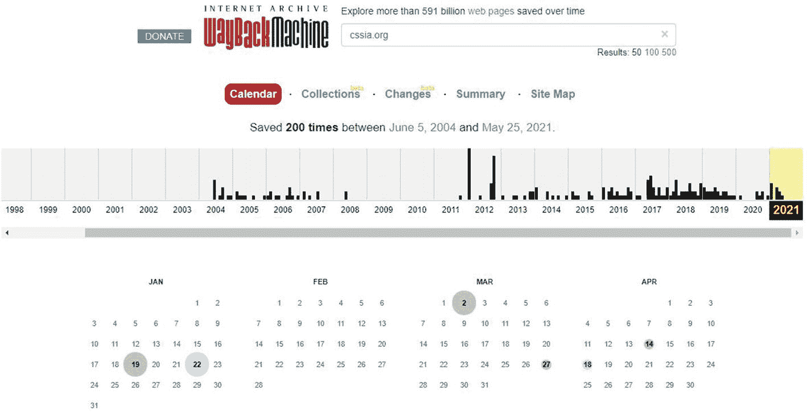
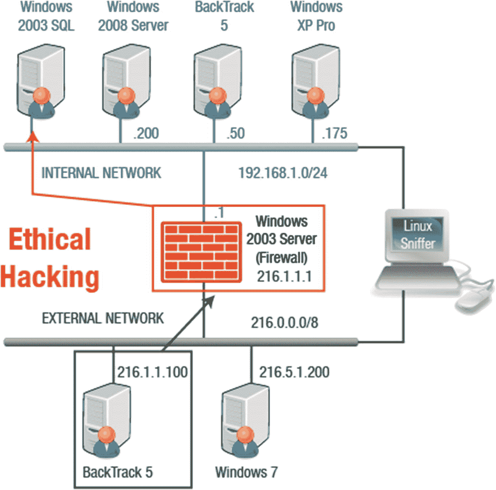
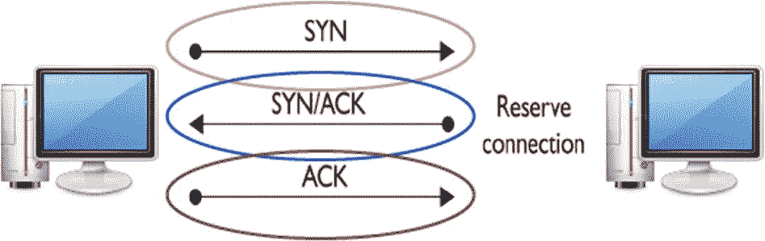
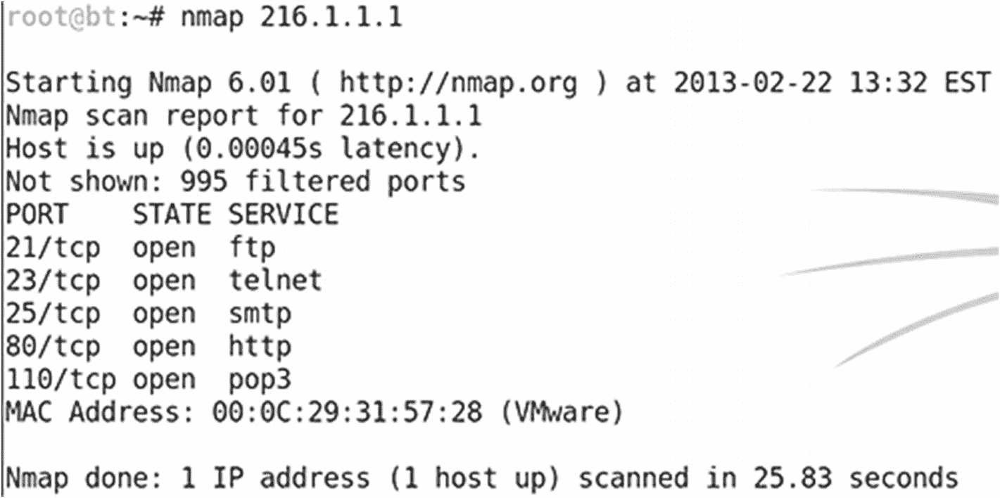
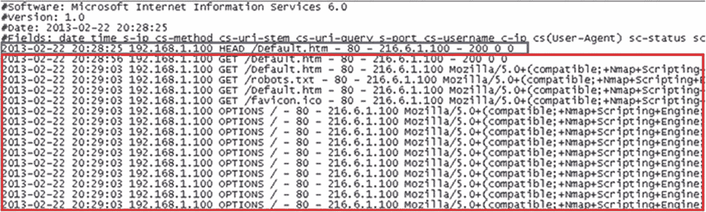
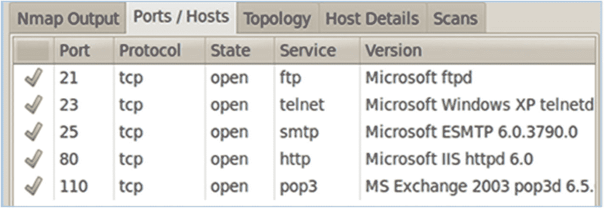
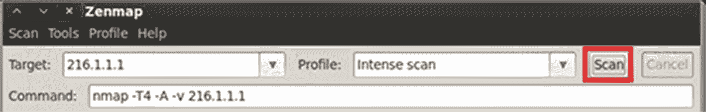

# 二、足迹和侦察/扫描网络

在本章中，您将了解足迹以及使用这种技术可以搜索到什么类型的信息，包括如何识别黑客可能想要获取的信息类型。在本章中，您将了解各种信息收集工具和方法。本章还将介绍其他几个概念:端口扫描、网络扫描、漏洞扫描、传输控制协议(TCP)通信标志、端口扫描类型和扫描对策。

本章结束时，您将能够

*   确定足迹流程中寻求的信息类型。

*   描述信息收集工具和方法。

*   解释 DNS 枚举。

*   执行主动和被动侦察。

*   认识端口扫描、网络扫描和漏洞扫描之间的区别。

*   识别 TCP 标志类型。

*   识别端口扫描的类型。

*   确定扫描对策。

## 足迹

互联网上有各种资源可以帮助您决定如何构建公司的网络。发现组织网络细节的机制被称为*足迹*。用于收集目标信息的探测技术被称为*侦察*。足迹是一个非侵入性的过程。您没有获得对数据的未授权访问。有许多工具可以帮助合法地收集大量信息，这被称为*竞争情报*。当你在组合中加入创新时，你就扩展了竞争情报。网络攻击通常始于从公司网站收集的信息。

WHOIS 工具用于收集有关 IP 地址和域名的信息。它还可以用来识别公司的电子邮件帐户。您可以使用 URL 来查找正在使用的 web 服务器和操作系统，以及 IT 工作人员的姓名。足迹是三个攻击前阶段的第一步。足迹搜索的信息包括域名、电话号码、身份验证、访问控制列表、IP 地址、服务和 id 的存在。

## 信息收集方法

攻击者可以从网页、搜索引擎、网站内的高级搜索功能、搜索上市公司或提取网站档案中获取信息。要开始收集信息，请考虑以下准则:

1.  获取初始信息(域名)。

2.  找到网络范围(Nslookup，WHOIS)。

3.  确认活动计算机(ping)。

4.  发现开放的端口或接入点(端口扫描器)。

5.  检测操作系统(远程登录查询)。

6.  绘制网络图。

## 存档网站

Wayback Machine ( [`www.archive.org/`](http://www.archive.org/) )是一个让人们能够访问网站存档版本的平台。访问 Wayback 机器的人将输入一个 URL，选择一个特定的日期，然后浏览网站的存档版本(图 [2-1](#Fig1) )。

图 2-1

一些存档的信息可供 CSSIA 使用( [`http://cssia.org/`](http://cssia.org/) )

### 搜索公共记录

公开信息可能不会立即提供揭示数据，但它可以用来构建一个更大的画面。各种网站提供公开记录的信息:

*   谷歌( [`www.google.com`](http://www.google.com) )

*   VitalRec.com ( [`www.vitalrec.com`](http://www.vitalrec.com)

*   总机( [`www.switchboard.com`](http://www.switchboard.com)

*   zaba arch . com([`www.zabasearch.com`](http://www.zabasearch.com)

*   USA.gov([`www.usa.gov`【T2”)](http://www.usa.gov)

### 工具

WHOIS ( [`www.whois.com`](http://www.whois.com) )实用程序用于收集 IP 地址和域名信息。回想一下，DNS 使用名称服务器来解析名称。确定公司使用的名称服务器后，您可以尝试传输 DNS 服务器负责的所有记录。这叫做`zone transfer`。要确定组织的主 DNS 服务器，请查找包含授权起始(SOA)记录的 DNS 服务器。确定主 DNS 服务器后，执行另一次区域转移以查看网络上的所有主机。这些信息有助于形成组织的网络图。

使用的一些工具根据它们帮助收集的信息类型进行分类:

域名搜索

*   WHOIS ( [`www.whois.com`](http://www.whois.com) `)`

*   `SmartWhois.com`

*   主动 Whois 网络工具( [`www.tucows.com/preview/1597378/Active-Whois-Browser`](http://www.tucows.com/preview/1597378/Active-Whois-Browser) )

DNS 信息工具

*   `ViewDNS.info`

*   DNS 枚举器( [`https://code.google.com/p/dnsenum/`](https://code.google.com/p/dnsenum/) )

*   spider boot([`www.spiderfoot.net/`](http://www.spiderfoot.net/)`)`

*   `Nslookup`(Linux 和 Windows 中的内置命令)

区域转移

*   DNStuff ( [`www.dnsstuff.com/`](http://www.dnsstuff.com/)

*   过期域名( [`www.expireddomains.net/`](http://www.expireddomains.net/) `)`

### 定位网络范围

现在，您可以继续定位目标系统的网络范围。诸如 NeoTrace 和 Visual Route 之类的 Traceroute 工具可能有用。可以检测到 Traceroute 实用程序的使用，但其他工具本质上是被动的。

一些选项包括

*   ARIN ( [`www.arin.net/`](http://www.arin.net/)

*   `Traceroute`(Linux 内置命令)

*   三维示踪路线( [`www.d3tr.de/`](http://www.d3tr.de/)

*   迈克菲视觉追踪( [`www.mcafee-neotrace-professional.com-about.com/`](http://www.mcafee-neotrace-professional.com-about.com/) )

*   可视化道路( [`www.visualroute.com/`](http://www.visualroute.com/)

*   路径分析器 Pro ( [`www.pathanalyzer.com/`](http://www.pathanalyzer.com/) )

*   触摸屏( [`www.touchgraph.com/navigator`](http://www.touchgraph.com/navigator) )

*   虐待( [`www.paterva.com/web6/`](http://www.paterva.com/web6/)

其他有用的工具包括网络蜘蛛，它可以获取电子邮件地址并将其存储在数据库中。想想垃圾邮件发送者。像 GEO spiders 这样的其他工具可以在世界地图上绘制网络活动。谷歌地球提供几乎任何地点的图像和地理信息。

最后，有许多元搜索引擎工具将用户的请求发送到其他几个搜索引擎，然后显示聚合的结果，包括 Dogpile、WebFerret、Robots.txt、WTR 网络开膛手 2 和网站观察者。

### 对目标进行主动和被动侦察

在开始扫描之前，您应该清楚地了解连接到 Internet 的网络是如何工作的。

我的攻击机器有一个 216.6.1.100 的公共 IP 地址，如图 [2-2](#Fig2) 所示。示例中被扫描的组织有一个 216.1.1.1 的公共 IP 地址。防火墙计算机本身没有安装 web 服务器软件。实际上，像 FTP 或 HTTP 这样的 web 服务运行在 Windows 2003 SQL 上，而不是防火墙本身。当请求这些服务时，防火墙会将这些请求重新路由到在内部网络上运行的 Windows 2003 SQL server。因此，尽管 Windows 2003 SQL 没有直接链接到 Internet，但由于防火墙的重定向，Internet 用户可以使用该计算机上的服务。

图 2-2

网络攻击

### 扫描网络

在攻击者识别目标系统并进行侦察后，攻击者将继续进入目标系统。通过网络扫描，攻击者可以获得有关目标的信息，如使用的操作系统和正在运行的服务。

扫描是一种扩展的侦察形式，攻击者试图找到侵入目标系统的方法。正确理解 TCP、UDP 和 ICMP 协议对于理解本章的目标非常重要。

需要注意的是，在互联网协议中，65，535 是一个 IP 地址中可用的 TCP 和 UDP 端口的数量。您需要知道攻击者在攻击哪些端口，以便保护这些端口。当攻击者发现开放服务时，找到漏洞并不困难。端口扫描分析一系列 IP 地址，以识别正在运行的服务。网络扫描调查网络上的活动，如跟踪数据流和网络设备的功能，并可以检测网络上的活动主机。漏洞扫描主动识别网络上的安全漏洞，以评估系统可能被利用的位置。

扫描的目的可以是为了以下任何一个目标:

*   识别网络上的实时系统。

*   找出哪些端口是开放的。

*   找出目标的操作系统。

*   找出正在运行和/或正在监听的服务。

*   找出 IP 地址。

*   识别特定的应用。

*   查找网络上任何系统的漏洞。

### 扫描方法

了解扫描方法对于选择完成此任务所需的适当工具至关重要。有五个步骤可以指导扫描过程:检查活动系统、检查开放端口、识别操作系统、扫描漏洞和探测网络。

记住这五个步骤，以下附加因素也很重要:

*   ping 扫描是一种扫描技术，用于确定映射到网络上活动系统的 IP 地址范围。

*   熟悉三次握手和指导主机间连接的 TCP 通信标志，有助于选择扫描方法。

*   如果知道目标系统上运行的操作系统，这对攻击者来说是一个很大的优势。标题抓取可用于帮助识别操作系统。

*   有许多工具可用于漏洞扫描，包括 Nessus、SAINT 和 GFI·兰加德。

### 三次握手

回忆一下三次握手(图 [2-3](#Fig3) )。从远程系统接收 SYN 数据包的系统，如果其端口是开放的，则用 SYN/ACK 数据包进行响应。最后，发送系统发送一个 ACK。如果一个端口被关闭并收到初始 SYN 数据包，它会发回一个 RST/ACK 数据包。

图 2-3

三次握手

### TCP 标志

下面的列表包括 TCP 标志的类型以及每种标志的用途:

*   `URG`:将传入数据标记为紧急

*   `ACK`:确认已成功获取数据包

*   `PUSH`:确保在发送或接收端对数据进行优先排序和处理，并在数据传输开始和结束时使用

*   `SYN`:开始两台主机之间的三方握手

*   `FIN`:断开使用`SYN`标志形成的连接

*   `RST`:当当前连接不需要的段进入时使用。它还表示远程主机已重置连接。

### 端口扫描的类型

端口扫描有几种类型。熟悉每一个都很重要。

1.  **SYN 扫描:**通过三次握手，攻击者的计算机发送初始 SYN 数据包。如果攻击者收到一个 SYN/ACK 数据包作为响应，攻击者会迅速响应一个 RST/ACK 数据包来关闭会话，从而使连接无法完成。攻击者知道该端口是打开的。

2.  **连接扫描:**通过连接扫描，完成三次握手，这使得该扫描很容易被检测到。

3.  **空扫描:**在空扫描中，所有数据包标志关闭。关闭的端口会用 RST 数据包响应空扫描。如果没有收到数据包，端口打开的可能性很高。

4.  **圣诞节扫描:**通过圣诞节扫描，设置`FIN`、`PSH`和`URG`标志。关闭的端口将使用 RST 数据包对此类数据包做出响应。

5.  **ACK 扫描:**ACK 扫描用于通过防火墙，防火墙是一种过滤设备。过滤设备寻找 SYN 数据包。如果被攻击的端口返回 RST 数据包，该端口将不会被过滤。

6.  **FIN 扫描:**通过 FIN 扫描，FIN 数据包被发送到目标。如果端口关闭，将返回一个 RST 数据包。

7.  **UDP 扫描:**通过 UDP 扫描，UDP 数据包被发送到目标计算机。“端口不可达”的响应意味着端口被关闭。

### 使用 Nmap

Nmap 是一个应用程序，可用于在 Linux、Mac 或 Windows 环境中识别网络上的计算机。还可以用来评估机器上打开了哪些传输控制协议(TCP)和用户数据报协议(UDP)端口(图 [2-4](#Fig4) )。Nmap 可以提供远程机器正在使用的操作系统的指示。

图 2-4

Nmap 显示五个开放端口

*   如果不使用任何开关，Nmap 将能够成功抵御阻止 ICMP 的系统。

*   默认 Nmap 扫描会扫描许多端口，但不是所有端口。

*   通过互联网扫描系统时，您不会看到 MAC 地址。

### Zenmap(泽纳 map)

Zenmap 是 nmap 的 GUI 前端(图 [2-5](#Fig5) )。在 Zenmap 工具中输入相同的 IP 地址。扫描完成后，点击端口/主机查看结果(图 [2-6](#Fig6) )。网络日志文件显示了 Zenmap 的扫描结果(图 [2-7](#Fig7) )。

图 2-7

Zenmap 扫描和网络日志文件

图 2-6

Nmap 扫描结果

图 2-5

Zenmap 是 nmap 的 GUI 前端

### 制作包装

使用 Fping ( [`www.fping.com/`](http://www.fping.com/) )，您可以在命令提示符下指定一系列 IP 地址，也可以创建一个包含多个 IP 地址的文件，并将其用作输入文件。这包含在回溯软件中。

Hping ( [`www.hping.org/download`](http://www.hping.org/download) )可以通过手工制作或修改数据包绕过过滤设备。要了解更多信息，请在命令行中键入`Hping -help`。

### 扫描对策

您可以采取各种措施来防止扫描失败:

*   利用防火墙，它应该可以检测到探针。

*   安装网络入侵检测系统。它应该确定各种工具使用的操作系统检测方法。

*   关闭任何不需要的端口。

*   部署工具来检测端口扫描。

## 摘要

有许多工具可以帮助您保护组织的网络。该过程涉及足迹，或通过使用侦察在网络上查找信息，侦察是用于查找信息的检测方法。您了解了攻击者如何使用网络扫描来获取目标的信息。

## 资源

*   **时光倒流机:** [`www.archive.org/`](http://www.archive.org/)

*   **CSSIA:**T3`http://cssia.org/`T4】

*   **谷歌:**T3`www.google.com`T4】

*   **VitalRec.com**T3:T5`www.vitalrec.com`T6】

*   **总机:** [`www.switchboard.com`](http://www.switchboard.com)

*   **Zabasearch.com**T3:T5`www.zabasarch.com`T6】

*   **USA.gov**T3:T5`www.usa.gov`T6】

*   **Whois:**T3`www.whois.com`T4】

*   **SmartWhois:** [`http://smartwhois.com/`](http://smartwhois.com/)

*   **主动 Whois 网络工具:** [`www.tucows.com/preview/1597378/Active-Whois-Browser`](http://www.tucows.com/preview/1597378/Active-Whois-Browser)

*   **ViewDNS:** [`http://viewdns.info/`](http://viewdns.info/)

*   **DNS 枚举器:** [`https://code.google.com/p/dnsenum/`](https://code.google.com/p/dnsenum/)

*   **蜘蛛脚:** [`www.spiderfoot.net/`](http://www.spiderfoot.net/)

*   **DNStuff:** [`www.dnsstuff.com/`](http://www.dnsstuff.com/)

*   **过期域名:** [`www.expireddomains.net/`](http://www.expireddomains.net/)

*   **ARIN:**T3`www.arin.net/`T4】

*   **3D Traceroute:**T3`www.d3tr.de/`T4】

*   **迈克菲视觉追踪:** [`www.mcafee-neotrace-professional.com-about.com/`](http://www.mcafee-neotrace-professional.com-about.com/)

*   **视觉路线:** [`www.visualroute.com/`](http://www.visualroute.com/)

*   **路径分析器 Pro:** [`www.pathanalyzer.com/`](http://www.pathanalyzer.com/)

*   **触摸式:** [`www.touchgraph.com/navigator`](http://www.touchgraph.com/navigator)

*   **马尔蒂戈:** [`www.paterva.com/web6/`](http://www.paterva.com/web6/)

*   **Fping** [`www.fping.com/`](http://www.fping.com/)

*   **平** [`www.hping.org/download`](http://www.hping.org/download)