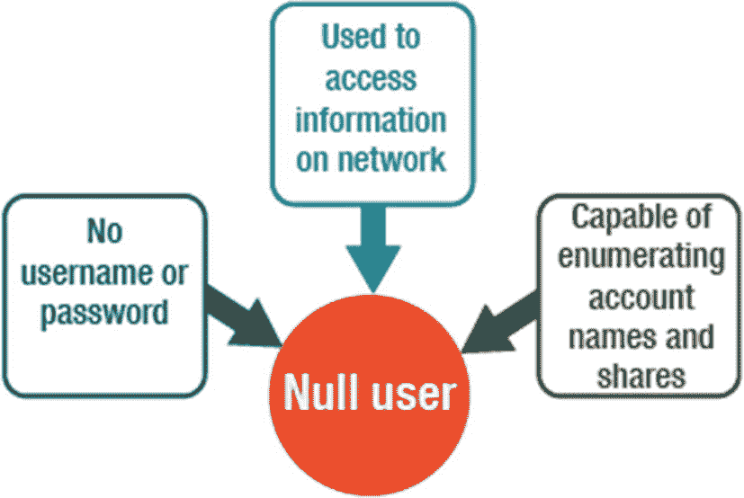
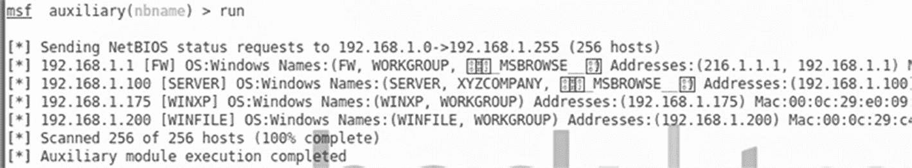
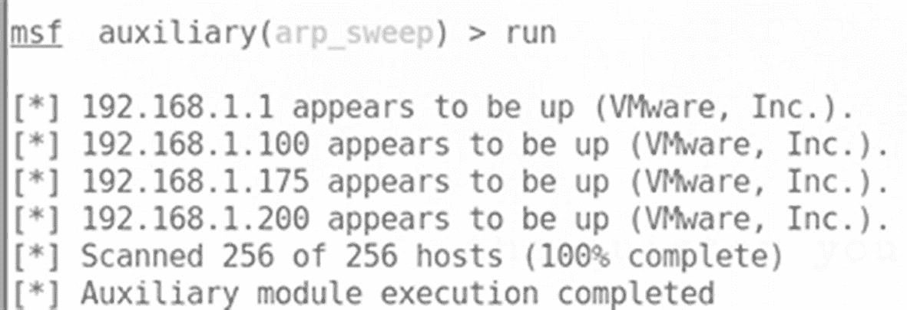
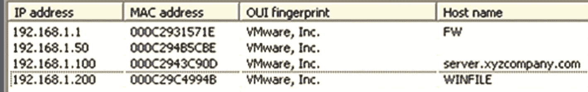
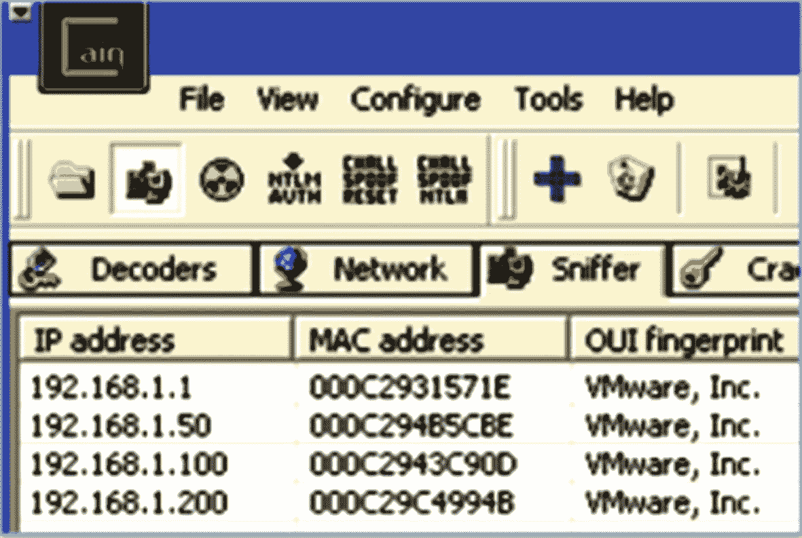

# 三、枚举

枚举涉及到连接到系统，因此它将端口扫描提升到下一个级别。由于枚举是测试中更具侵入性的部分，作为一个有道德的黑客，你必须得到组织的许可。您正试图使用员工登录帐户检索信息并获得对服务器的访问权限。在本章中，您将学习枚举技术，如何建立空会话，以及如何识别枚举对策。你将学习涉及主动和被动枚举的重要概念。

本章结束时，您将能够

1.  解释枚举技术。

2.  了解如何建立空会话。

3.  确定枚举对策。

4.  执行主动和被动枚举。

## 危害系统的步骤

枚举是危害系统的第一步。攻击者主动连接到目标以获取信息。从那里，攻击者试图识别密码。一旦攻击者获得了使用帐户访问系统的权限，他们就会试图获得管理员权限。攻击者安装提供目标信息的应用程序，并隐藏它们，使管理员无法识别它们。攻击者擦除他们使用过的路径的任何痕迹。

危及系统安全有六个基本步骤:

1.  枚举

2.  密码破解

3.  权限提升

4.  跟踪保持

5.  文件隐藏

6.  应用程序执行

## 枚举

枚举被列为组成系统的第一步，是一个涉及到与目标建立活动连接的过程。枚举信息的类型可以分为四类:网络资源和共享、用户和组、审核设置和应用程序标题。

要进行身份验证，操作系统需要一个用户帐户。Windows 还支持一种独特的用户类型，称为空用户(图 [3-1](#Fig1) )。空值没有用户名和密码，但可以用来访问网络上的某些信息。null 能够枚举帐户名和共享。

图 3-1

空用户

对于空会话，不提供任何用户和密码凭据。这是到网络共享 IPC$的匿名连接。要建立空会话，请在命令提示符下键入下面显示的命令行命令。从空会话中，攻击者可以调用 API 并使用远程过程调用来获取有关密码、用户和服务的信息。对策包括使用过滤器端口、禁用 SMB 服务、检查 HKLM、配置安全策略和限制远程访问。

`net use \\192.168.1.101\IPC$ "" /user:""`

从 Windows Vista 和 Server 2008 开始，空会话不可用，甚至管理员也无法启用。

## NetBIOS 基础

一个 **NetBIOS** 名( [`https://searchnetworking.techtarget.com/definition/NetBIOS`](https://searchnetworking.techtarget.com/definition/NetBIOS) )可以是 16 个字符，其中 15 个是计算机名。最后一个字符保留为十六进制字符，用于标识计算机上运行的服务。NetBIOS 是一个 API，资源共享协议可以访问它，以便按名称引用计算机。计算机名不可路由。

设置 NetBIOS 的进度阶段如下所示:

1.  一种 Windows 编程接口，使计算机能够通过局域网(LAN)进行通信

2.  文件和打印机可以共享。

3.  利用 UDP 端口 137(服务器服务)、138(数据报服务)和 139 (TCP)端口(会话服务)

4.  15 个字符的限制适用于 NetBIOS 名称，即分配给系统的计算机名称。

5.  在网络上，NetBIOS 名称必须是唯一的。

## 命令行工具

Windows 操作系统内置了几个命令行工具。建议您查看一下可用的各种参数和开关。

*   `netstat`显示网络连接、路由表和网络协议统计。

*   `nbstat`是 NetBios 的诊断工具，用于诊断 NetBios 名称解析问题。

## SNMP 枚举

简单网络管理协议( [`https://networkencyclopedia.com/simple-network-management-protocol-snmp/`](https://networkencyclopedia.com/simple-network-management-protocol-snmp/) )用于维护和管理路由器、集线器和交换机。它是应用层协议。攻击者对主信息库(MIB)感兴趣，因为它是存储描述被监控资源的数据的地方。

*   分配给受管系统和网络管理站的代理

*   获取过程信息

*   MIB 是用要监控的资源建立的。

*   默认社区字符串包含字符 PUBLIC。

*   攻击者寻找启用了 SNMP 和默认团体字符串的目标主机。

*   对于枚举，内置 SNMP 对象将是可见的。

如果不打算使用管理和监视组件，请不要安装它，这一点很重要。重要的 SNMP 枚举对策如下:

*   限制对空会话共享的访问。

*   删除 SNMP 代理或关闭 SNMP 服务。

*   更改社区字符串。

*   实现组策略安全选项。

## 使用 Windows 命令行工具发现主机

像 nmap、zenmap、tcpdump 和 Wireshark 这样的工具允许您枚举主机，但是也可以使用一些内置于 Windows 中的命令。表 [3-1](#Tab1) ，包括任务 2 中用于枚举 Windows 主机的命令列表。

表 3-1

任务 2 中用于枚举 Windows 主机的命令

| 

命令

 | 

结果

 |
| --- | --- |
| `net view` | 枚举同一工作组中的计算机 |
| `net view/domain` | 枚举所有工作组和域 |
| `net view/domain: workgroup` | 枚举工作组中的机器 |
| `net view/domain: XYZcompany` | 枚举工作组 XYZcompany 中的机器 |

## 使用 Metasploit 发现主机

Metasploit 中有大量的扫描器。使用搜索扫描仪命令列出它们。ARP 扫描可以针对一个网络，如图 [3-2](#Fig2) 所示。Netbios 扫描程序可以获取计算机名列表，如图 [3-3](#Fig3) 所示。

图 3-3

Netbios 扫描

图 3-2

Arp 扫描

## 利用该隐

Cain 是一个密码恢复工具( [`https://resources.infosecinstitute.com/topic/password-cracking-using-cain-abel/`](https://resources.infosecinstitute.com/topic/password-cracking-using-cain-abel/) )，用于各种类型的密码，如网络、计算机、无线等。您可以使用 MAC 地址扫描器扫描子网中的所有主机(图 [3-4](#Fig4) )。通过选择每一个并选择解析主机名，显示结果(图 [3-5](#Fig5) )。

图 3-5

Cain 扫描结果

图 3-4

和凯恩一起做扫描

## 摘要

枚举是测试过程中需要组织许可的部分。在本章中，您学习了特定的枚举技术、如何建立空会话以及各种枚举对策。您还了解了主动枚举和被动枚举之间的区别。

## 资源

*   **NetBIOS:**T3`https://searchnetworking.techtarget.com/definition/NetBIOS`T4】

*   **简单网络管理协议:** [`https://networkencyclopedia.com/simple-network-management-protocol-snmp/`](https://networkencyclopedia.com/simple-network-management-protocol-snmp/)

*   **隐:** [`https://resources.infosecinstitute.com/topic/password-cracking-using-cain-abel/`](https://resources.infosecinstitute.com/topic/password-cracking-using-cain-abel/)