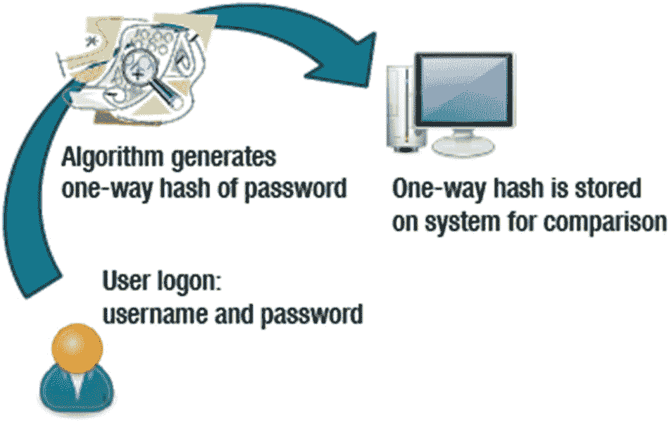
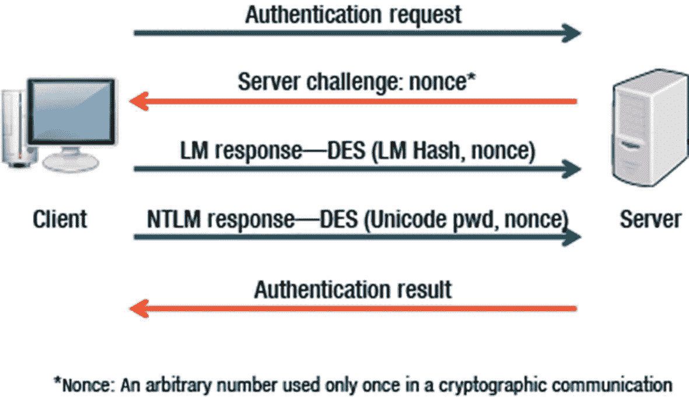
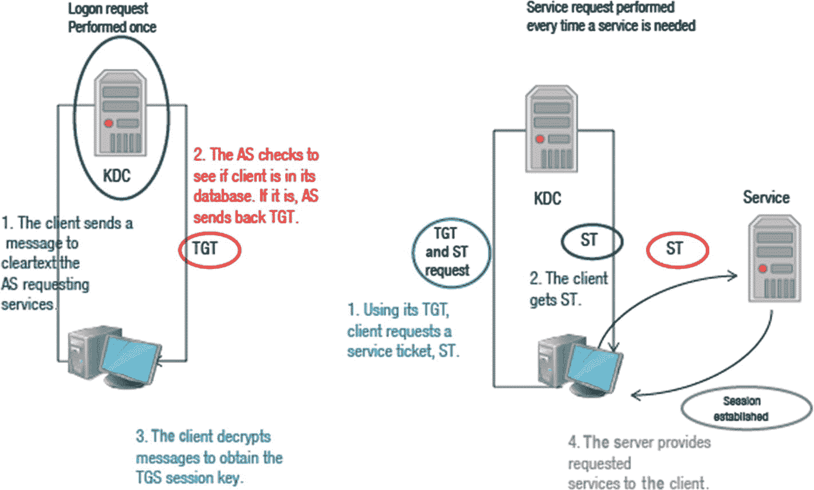
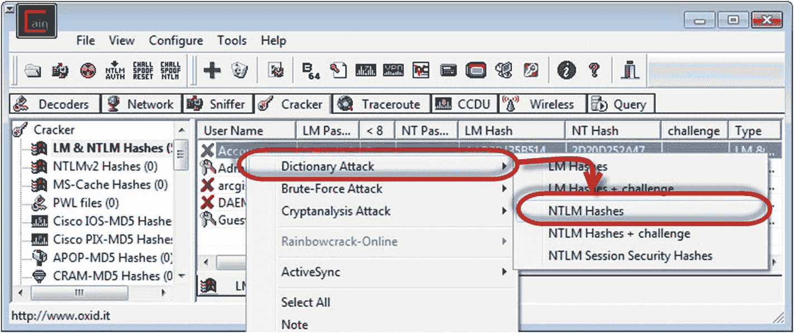
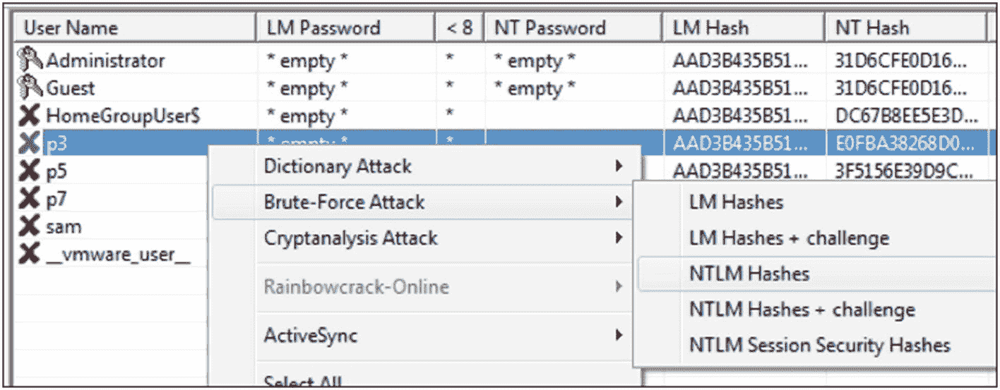

# 四、系统攻击

在本章中，您将了解系统黑客，包括能够识别各种类型的密码攻击、使用密码破解工具以及检测密码破解对策。系统黑客包括使用 rootkits 和其他工具来掩盖攻击者的踪迹，这也将在本章中讨论。

本章结束时，您将能够

*   识别不同类型的密码攻击。

*   使用密码破解工具。

*   识别各种密码破解对策。

*   识别隐藏文件的不同方法。

*   了解如何检测 rootkit。

*   识别可用于掩盖攻击者踪迹的工具。

## 密码攻击:被动在线攻击

在完成枚举和扫描阶段后，攻击者会寻找安全配置较弱的用户帐户或主机。系统黑客包括破解密码、使用键盘记录器和使用间谍软件。安装 rootkits 和使用隐写术也属于系统黑客的范畴。

密码是最常用的身份验证形式。四种类型的密码攻击是被动的、主动的、离线的和非技术性的。

*   **被动:**通过被动密码破解攻击，攻击者嗅探网络流量，以查明是否有任何密码信息被泄露。
    *   线嗅探只在公共冲突域中起作用，攻击者在局域网的一个系统上运行嗅探器。

    *   中间人和重放攻击同时嗅探连接的两端。这在 telnet 和无线技术中很常见，由于 TCP 序列号和速度的原因，很难实现。重放攻击使用嗅探器获取数据包，提取信息，然后将数据包放回服务器。

*   **主动:**密码猜测是比较有效的主动在线攻击技术之一。通过侦察和计数收集的信息现在可能是有用的。主动在线攻击的一个例子包括密码猜测。当攻击者构建包含外语单词、专有名称和常用密码的大型字典时，就会出现密码猜测。在这种情况下，攻击者扫描用户配置文件来寻找线索。

*   **离线:**密码不应该以纯文本格式存储。通常使用散列算法。下面详细介绍了一些可用的离线攻击。
    *   预先计算的哈希根据系统范围的列表验证登录用户名和密码。包含列表的文件必须始终加密，因为如果文件具有可读格式的加密密码，哈希函数就可以被攻击者识别。

    *   音节攻击是暴力攻击和字典攻击的混合，利用字典中单词的每种可能组合。

    *   如果攻击者有一些密码细节(即密码包含两位数)，就会发生基于规则的攻击。

    *   在网络分布式攻击中，攻击利用网络未使用的处理能力来解密密码。运行 DNA 客户端的机器可以访问安装在中央位置的 DNA manager。

    *   当密码哈希表(称为彩虹表)产生并保存在内存中时，就会发生彩虹攻击。彩虹表可用于从密文中检索明文密码。

*   **非技术性:**密码攻击不一定意味着技术正在被使用。有时，密码攻击可能是一些敏锐的观察或他人操纵的结果。非技术性攻击的例子包括肩冲浪、键盘冲浪和社会工程。

## 密码攻击示例

攻击者只需要获得存储在系统上的单向散列的副本，就可以开始成功的密码攻击(图 [4-1](#Fig1) )。

图 4-1

密码攻击

## 空会话

可以通过连接到共享来建立空会话，而无需提供用户名或密码。空会话允许未经身份验证的主机收集数据，如密码策略、本地计算机上的用户名和帐户锁定策略。

可以使用命令`Net View \\TargetComputerName`列出共享资源。端口 139 或 445 必须打开，空会话才能成功。

在 Windows 网络中，空会话的存在允许

*   资源枚举的受信任域

*   用于用户身份验证和枚举的域外计算机

*   用于验证和列出资源的系统帐户

NetBIOS 空会话允许对 Windows NT/2000 进行读写访问，对 XP 和 2003 进行读访问。预防措施包括防火墙、禁用 TCP/IP 上的 Netbios、将`RestrictAnonymous=1`添加到`HKLM\SYSTEM\CurrentControlSet\Control\LSA`。桌面哨兵这样的工具可以让你看到谁连接到你的机器，给你一个用户名和 IP 地址。

有关更多信息，请阅读空会话漏洞( [`http://msdn.microsoft.com/en-us/library/ms913275(v=winembedded.5).aspx`](http://msdn.microsoft.com/en-us/library/ms913275%2528v%253Dwinembedded.5%2529.aspx) )

## 证明

基于 Windows 的系统采用质询-响应身份验证协议来验证远程文件访问请求。Kerberos 已经取代 NTLM 成为 Active Directory 环境中的默认身份验证协议。NTLM 仍然在域控制器不可用的情况下使用。查看图 [4-2](#Fig2) 和下面概述的步骤。

图 4-2

证明

1.  到服务器的网络路径由客户端建立。

2.  服务器用一条用于确定客户端身份的质询消息来响应。

3.  客户端使用两个哈希密码值(存储在服务器上)中的一个或两个来响应质询。如果哈希值被攻击者获取，攻击者可以在不知道密码的情况下进行身份验证。

## Kerberos 操作

Kerberos 使用强大的加密技术向服务器证明客户机的身份，而服务器又可以向客户机验证自己的身份。

为了说明 Kerberos 身份验证服务是如何工作的，考虑一下您的驾驶执照。你可以向其他人出示你的执照，以证明你就是你所声称的那个人。因为其他方信任颁发许可证的州，所以他们会接受您的许可证作为您身份的证明。

颁发许可证的州类似于 Kerberos 身份验证服务，许可证充当客户端到服务器的票证。

图 4-3

Kerberos 操作

*   Kerberos 服务器包括所有拥有领域服务授权的用户的用户 id 和散列密码。

*   Kerberos 服务器还与它授予访问票的每台服务器交换秘密密钥。

*   认证的基础是 Kerberos 环境中的票证。票证在两个阶段的过程中与客户端一起使用。第一个票证是由 AS 提供给请求客户端的票证授予票证(TGT)。然后，客户机可以将这个票证提交给 Kerberos 服务器，请求访问特定的服务器。这个客户端到服务器的票证(也称为服务票证)用于获得对服务器领域中的服务的访问。

*   由于可以对整个会话进行加密，这可以防止可能在网络上捕获的项目(如密码)的潜在不安全传输。

*   票是有时间戳的，也是有寿命的，所以试图重用一张票是行不通的。见图 [4-3](#Fig3) 。

## 密码破解对策

了解与密码破解相关的对策非常重要。

*   LAN Manager 或 LM 哈希是运行 DOS、Windows 3.11、95、ME、NT、2000、XP 和 Windows 2003 的系统的默认哈希。

*   NT 哈希是用于 Windows Vista、7、8、Server 2008 和 Server 2012 的默认哈希。Kerberos 身份验证在早期版本中不可用。

*   LM 哈希不如 NT 哈希安全。

要禁用 LM 哈希，您需要

1.  使用组策略实现 NoLMHash 策略。

2.  通过编辑注册表实现 NoLMHash 策略。

3.  找到 HKEY _ LOCAL _ MACHINE \ SYSTEM \ current Control set \ Control \ Lsa，点击 **Add Key，**，键入`NoLMHash`。

4.  使用长度超过 15 个字符的密码(LM 哈希不能用于该长度的密码)。

## 提升权限

默认情况下，Windows Vista 禁用管理员帐户，第一个创建的用户拥有管理权限。默认情况下，只有系统帐户可以访问位于 c 盘根目录下的系统卷信息文件夹。系统卷信息文件夹包含系统还原所需的文件。与提升权限相关的关键术语如下:

*   **系统帐户**是为 Windows 操作系统保留的，对驱动器具有唯一的访问权限。

*   **网络服务**是一个预定义的本地帐户，其权限低于需要访问网络的计算机上运行的系统程序所使用的系统。

*   本地服务由运行在不需要访问网络的计算机上的系统程序使用。

## 密码破解

其他可用于转储散列的基于命令行的工具有`pwdump`和`fgdump`。Windows 将散列后的密码存储在`C:\Windows\System32\Config`的 SAM 文件中。Cain 是一个可以转储这些散列的程序。破解密码的三种方法是字典攻击、密码分析攻击和暴力攻击。参见图 [4-4](#Fig4) 和 [4-5](#Fig5) 。

图 4-5

密码分析攻击的示例

图 4-4

暴力攻击的示例

## 按键记录程式

键盘记录器可以是基于硬件的，也可以是基于软件的。键盘记录器捕获用户的击键，将数据记录在文件中，并根据配置的设置保存、通过电子邮件发送或传输文件。

用户通常不知道他们正在被监视，攻击可以是基于硬件或软件的方法。对策包括保持反病毒软件最新，寻找可疑的进程运行，并物理检查计算机硬件。

## 隐藏文件

计算机文件具有诸如文件长度、创建、访问和最后修改时间以及是否隐藏、存档或只读等属性。`attrib`命令用于显示或改变文件属性。

Microsoft NTFS 文件系统包含称为备用数据流的分支，用于存储作者或标题属性或图像缩略图。API 和命令行工具可以用来创建和访问分叉。Windows 资源管理器和`DIR`命令忽略分叉。

fork 是与文件系统对象相关联的字节流，每个文件至少有一个 fork。分支可能包含文件的主要数据，或者只是元数据( [`www.2brightsparks.com/resources/articles/ntfs-alternate-data-stream-ads.html`](http://www.2brightsparks.com/resources/articles/ntfs-alternate-data-stream-ads.html) )。

## rootkits

Rootkit 检测是棘手的，因为 rootkit 可以破坏会发现它的软件。如果 rootkit 在内核中，删除是复杂的或几乎不可能的。重新安装操作系统可能是根除问题的唯一方法。

Rootkits 隐藏某些进程或程序的存在，使其无法被正常方法(审计、日志、IDS)检测到。它们为攻击者提供对计算机的特权访问，并被配置为跟踪流量、生成日志文件和创建后门，以便攻击者能够持续访问系统。攻击者可以通过使用备用数据流几乎完全隐藏系统内部的文件。

下面列出了检测 rootkits 的三个步骤:

1.  在可能被感染的操作系统中运行 dir `/s /b /ah`和`dir /s /b /a-h`并保存结果。

2.  引导到干净的 CD，在同一个驱动器上运行`dir /s /b /ah`和`dir /s /b /a-h`，并保存结果。

3.  对这两组结果运行 CD 上的 WinDiff 的干净版本。

当检测到 rootkit 时，可以采取对策。被动对策是备份除二进制文件之外的所有关键数据，并从可信来源执行全新安装。您也可以使用代码校验和。另一个选择是用最少的设备驱动程序在安全模式下启动，这使得 rootkit 的隐藏文件可见。

## 密写

隐写术是一种将数据隐藏在其他数据后面的技术。完成此操作后，图像、声音、文本、音频或视频文件中未使用的数据位将被其他数据替换。最低有效位插入法通常用于隐藏数据。可以使用隐藏数据的二进制表示来覆盖图像中每个字节的最低有效位。隐写术工具创建图像调色板的副本。每个像素的 8 位二进制数的 LSB 被替换为隐藏消息中的一位，在复制的调色板中创建新的 RGB 颜色，并将像素更改为新 RGB 颜色的 8 位二进制数。

隐写分析是检测使用隐写术隐藏的消息并提取数据的过程。隐写分析工具使用检测、提取或销毁方法。

## 覆盖轨道

攻击者通过试图销毁证据来清理自己。Rootkits 可以完全禁用日志记录，并丢弃所有现有的日志。Auditpol.exe 可以禁用审核，并且可以通过 DumpEventLog、事件查看器、ElSave 和 WinZapper 来清除事件日志。其他工具，摆脱攻击者的踪迹是证据消除器，无痕，轨道橡皮擦亲，装甲工具，零轨道。

## 摘要

在本章中，您了解了攻击者如何破解密码，并了解了防止这种情况发生的对策。您现在了解了隐藏文件的不同方式以及攻击者安装 rootkits 的原因。最后，您现在知道攻击者使用什么工具来掩盖他们的踪迹。

## 资源

*   **空会话漏洞:** [`http://msdn.microsoft.com/en-us/library/ms913275(v=winembedded.5).aspx`](http://msdn.microsoft.com/en-us/library/ms913275%2528v%253Dwinembedded.5%2529.aspx)

*   **叉子:** [`www.2brightsparks.com/resources/articles/ntfs-alternate-data-stream-ads.html`](http://www.2brightsparks.com/resources/articles/ntfs-alternate-data-stream-ads.html)