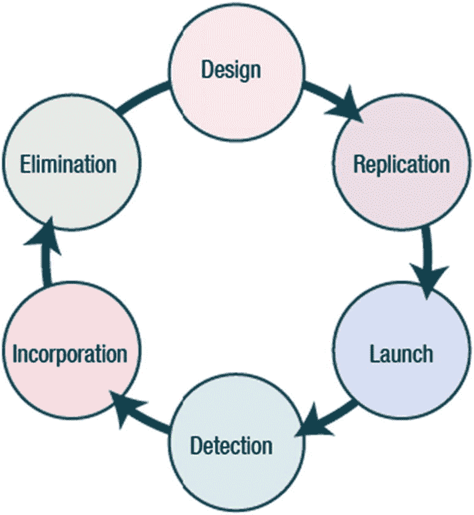

# 五、木马、后门、病毒和蠕虫

许多恶意程序包含病毒、蠕虫、木马和 rootkits 的特征。这些恶意程序是出于多种原因编写的，包括恶作剧、经济利益或传播政治信息。在本章中，您将了解木马感染系统的各种方式、需要注意的具体对策以及如何识别病毒，包括病毒检测方法和对策。

本章结束时，您将能够

1.  解释木马如何感染系统。

2.  识别木马使用的端口和木马对策。

3.  识别病毒的症状。

4.  描述病毒是如何工作的。

5.  确定病毒类型、病毒检测方法和病毒对策。

## 木马

木马是恶意程序，会对系统的硬件和软件造成相当大的损害。后门是不遵循通常要求的安全和身份验证程序而访问设备的方法。

网络上或计算机系统内传输数据的合法通信路径被称为*公开通道*。传递信息并违反安全策略的通道被称为*隐蔽通道*。为了创建隐蔽通道，可以操纵公开通道。木马是一种简单的隐蔽通道。

木马，或简称为木马，是一种恶意软件，表面上是一种正常的可用程序，但实际上包含病毒。在特洛伊战争中，希腊人利用木马进入特洛伊城。同样，木马会在未被发现的情况下进入受害者的计算机，并拥有与受害者相同级别的权限。它会错误地将远程系统作为攻击源。

木马窃取敏感信息，存储非法资料，并被用作盗版软件的 FTP 服务器。木马以隐藏模式运行，可以改变注册表或其他自动启动方法。

后门是一种用来绕过系统中常用的身份验证方法的方法。木马可以通过多种方式渗透到系统中，包括即时消息应用程序、互联网中继缓存、附件、物理访问、浏览器和电子邮件软件错误、文件共享、虚假程序和免费软件，以及访问可疑网站。

## 木马攻击的迹象

了解指示木马攻击的症状非常重要。

*   光盘抽屉自动打开/关闭

*   电脑屏幕闪烁或倒置

*   背景/壁纸设置会自动更改

*   颜色设置会自动更改

*   防病毒会自动禁用

*   日期和时间更改

*   鼠标指针消失

*   弹出窗口突然出现

如果一个系统出现了上面提到的任何症状，那么就应该更仔细地看看这个系统到底发生了什么。

## 木马使用的端口

对活动连接的状态和木马使用的端口有一个基本的了解，将使您能够确定系统是否已经受损。查看表 [5-1](#Tab1) 中木马使用的端口。

表 5-1

木马使用的端口

| 

特洛伊人

 | 

草案

 | 

港口

 |
| --- | --- | --- |
| 后孔口 | 用户数据报协议(User Datagram Protocol) | 31337 或 31338 |
| 深喉 | 用户数据报协议(User Datagram Protocol) | 2140 和 3150 |
| NetBus | 三氯苯酚 | 12345 和 12346 |
| 打地鼠 | 三氯苯酚 | 12361 和 12362 |
| net beans 2 | 三氯苯酚 | Twenty thousand and thirty-four |
| 女朋友 | 三氯苯酚 | Twenty-one thousand five hundred and forty-four |
| 家伙 | 三氯苯酚 | Sixty-five thousand |
| 邪恶 | 文件传送协议 | Twenty-three thousand four hundred and fifty-six |
| 七层以下 | 三氯苯酚 | 6711, 671, 6713 |
| 末日之门 | TCP， UDP | 10067, 10167 |

## Netstat 命令

`netstat`命令可用于确定哪些端口正在监听。图 [5-1](#Fig1) 显示了一个`netstat`命令的结果，指示活动连接并识别哪些端口正在监听。

图 5-1

Netstat 结果

## 木马的类型

木马可根据其运行方式分为以下几类:

*   **远程访问木马**提供对受害系统的完全控制。

*   **数据发送木马**可以安装键盘记录程序，并提供访问机密数据的途径。

*   **破坏性木马**会删除目标系统上的文件。DoS 攻击木马允许攻击者发起分布式拒绝服务攻击。

*   **代理木马**将目标电脑变成代理服务器，让攻击者可以访问该电脑。

*   **FTP 木马**开放 21 号端口，允许攻击者通过 FTP 连接。

*   **其他木马**可以禁用防病毒软件，创建 ICMP 隧道，或允许攻击者绕过防火墙。

## ICMP 隧道

任意数据被注入通过 ICMP 隧道发送到远程设备的回送数据包中。以同样的方式，远程机器通过将响应注入另一个 ICMP 数据包并返回来进行响应。客户端使用 ICMP 回应请求数据包进行所有通信，而代理则使用回应回复数据包。此漏洞的存在是因为用于管理 ICMP 数据包的 RFC 允许任何回应回复或回应消息 ICMP 数据包的任意数据长度。

通过混淆真实的流量，ICMP 隧道可能被用来绕过防火墙规则。模糊暗示你隐藏了交流的真正意义。根据 ICMP 隧道程序的配置，这种形式的通信也可以归类为两台机器之间的加密通信信道。如果没有足够深入的数据包检测或日志分析，网络管理员就无法识别网络中的这种流量。见图 [5-2](#Fig2) 。

图 5-2

ICMP 隧道

## 用于创建木马的工具

这里根据类别列出了一些可用于创建木马的工具。不用说，攻击者不难找到用木马渗透受害者系统的方法。

*   **后门工具**包括 Tini、Icmd、NetBus、Netcat。

*   **隐藏工具**包括 Wrappers、EXE Maker、Pretator、Restorator、俄罗斯方块。

*   **远程访问工具**包括 VNC、RemoteByMail 和 Atelier Web Remote Commander。

*   **Shell 和隧道工具**包括 Windows Reverse Shell、Perl-Reverse-Shell、XSS Shell、XSS 隧道和隐蔽通道隧道工具。

*   **其他工具**包括 SHTTPD 服务器、木马构建工具包、Rapid Hacker、SARS 木马通知、T2W(木马转蠕虫)。

## 特洛伊对策

有许多对策可以减少成为受害者的机会。通过实现列出的措施可以避免木马感染。

1.  不要从未知网站下载文件。

2.  不要在程序中使用预览窗格。

3.  在您的桌面上运行防病毒、防火墙和入侵检测软件。

4.  删除可疑的设备驱动程序。

5.  扫描可疑的开放端口、正在运行的进程和注册表项。

6.  运行木马扫描程序。

7.  下载有用文件的同时，不要下载其他程序；这可能会导致病毒感染，窃取您的个人数据。

## 检测工具

要检测木马，请扫描可疑的开放端口。然后扫描可能正在运行的可疑进程。扫描注册表。使用 Wireshark 等工具扫描可疑的网络活动。最后，运行木马扫描程序。可以用来检测木马的其他工具有 Netstat、fPort、TCPView、CurrPorts、PrcView、Msconfig、Autoruns 和 HijackThis。

## 后门对策

列出的对策将有助于保护系统不被创建后门，从而为攻击者提供访问权限。下载电子邮件附件或安装从互联网下载的应用程序时，应始终小心谨慎。如果站点为文件下载提供了哈希值，请确保在下载文件后验证该值，以确保文件未被篡改。您应该使用能够识别木马签名的防病毒软件包，并使用最新的安全补丁更新您的应用程序。

## 对策工具

有许多对策工具可供使用。旨在帮助检测木马的反木马软件可以与防病毒程序一起运行。与防病毒软件一样，反木马软件也必须保持最新。

*   **反木马软件**包括 TrojanHunter、Comodo BOClean、Spyware Doctor、SPYWAREfighter。

*   **后门工具**包括 Tripwire、系统文件验证、MD5sum.exe、微软 Windows Defender。

## 过程监视器

木马可以隐藏在任意数量的。Microsoft 操作系统中的. exe 文件。诸如进程监视器之类的工具可以用来监视系统进程文件。它可以从微软网站免费下载。它显示实时文件系统、注册表和进程或线程活动。见图 [5-3](#Fig3)

图 5-3

流程监控汇总示例

## 恶意软件工具:毒藤

用户友好的恶意软件应用程序(如 Poison Ivy Remote Access 木马)经常被网络犯罪分子用来进行许多利用后的活动，如加载恶意软件、执行程序、停用服务、中断进程和窃取信息。

Poison Ivy 是一种高度危险的恶意软件工具，因为它允许黑客通过加密连接与受害者的机器建立持续连接。毒藤在许多引人注目的事件中被用作攻击工具，包括 2011 年对 RSA 网络的攻击。

在实验室中，您可以设置 Poison Ivy 客户端，引诱受害者启动恶意文件，并利用带有 Poison Ivy 的受害者机器。见图 [5-4](#Fig4) 。

图 5-4

毒常春藤听港口

## 病毒和蠕虫

虽然病毒和蠕虫都是会对计算机造成损害的恶意程序，但了解它们之间的区别是很重要的。随着本章的继续，重点将是仔细看看病毒与蠕虫。

*   病毒需要一个主机、一个程序或一个文件才能从一台电脑传播到另一台电脑。病毒是通过人类活动传播的，比如打开附件或运行程序。

*   一个**蠕虫**是自我复制的。不需要人工操作。蠕虫利用安全漏洞通过网络在计算机之间传播。

## 病毒的症状

识别病毒的症状意味着您可以更快地采取行动，以减少对您的系统或网络的损害。

需要注意的症状包括:

1.  程序加载时间较长。

2.  硬盘总是满的。

3.  未知文件不断出现。

4.  键盘或计算机发出奇怪的声音或蜂鸣声。

5.  电脑显示器显示奇怪的图形。

6.  文件名变得奇怪，经常让人认不出来。

7.  一个程序的大小不断变化。

8.  系统上的内存似乎正在使用中。

病毒和蠕虫感染造成的损害可分为三类:

*   **技术损害**因为内存、CPU 时间、网络带宽等资源被浪费。

*   **道德或法律损害**由未经授权的数据修改、版权或所有权问题导致。

*   心理伤害，如信任问题和缺乏知识导致了混乱。

## 病毒生命的各个阶段

任何具有基本编程知识的人都可以创建病毒，并且有许多工具可用于设计病毒。复制需要一段时间。对于病毒，需要人的行动来启动病毒。在用户注意到前面提到的症状之一后，病毒被识别为威胁。反病毒软件公司在他们的产品中加入了一个补丁，这样用户就可以安装更新并清除病毒。图 [5-5](#Fig5) 显示了病毒在其整个生命周期中的各个阶段。

图 5-5

病毒生命的各个阶段

## 感染阶段

病毒有两个阶段，真的。首先是感染阶段，然后是攻击阶段。一旦病毒被触发，事件序列将继续，直到用户注意到症状并采取适当的措施。

一旦病毒被触发，它就会破坏其宿主的文件和程序，或者执行与应用程序运行无关的任务。参见图 [5-6](#Fig6) 。

图 5-6

感染阶段

## 病毒的类型

病毒的不同之处在于它们如何将自己添加到目标主机的代码中，以及它们如何作用于目标系统。这里有三种类型的病毒:

*   **外壳病毒:**在外壳病毒中，病毒代码在目标宿主程序的代码周围形成一层，原代码移动到新的位置，病毒就采取了自己的身份。

*   **附加病毒:**附加病毒将代码附加到宿主代码的开头，因此病毒代码在宿主代码之前执行。

*   **入侵型病毒:**入侵型病毒会将其代码覆盖在主机的程序代码上，因此原始代码无法正常执行。

## 什么病毒会攻击

病毒分类的另一种方式是基于它们感染的东西。一个常见的目标是引导扇区，它是计算机启动时在磁盘上执行的一个区域。

**程序病毒**感染可执行程序文件或带有。exe，。com，或者。比如 sys。**多重病毒**感染程序文件，进而影响引导扇区。**网络病毒**利用计算机网络的命令和协议进行复制。

**源代码病毒**更不寻常，因为编写它们需要技巧，而且有许多类型的源代码。**宏病毒**在应用程序运行时执行一系列操作。

## 病毒如何感染

病毒也可以根据它们如何感染目标系统来分类。一个**终止并停留**的常驻病毒会一直留在内存中，直到系统重新启动。一种短暂的 T2 病毒 T3 的生命依赖于它的宿主。当它的附加程序结束时，病毒也就终止了。一个**伴随病毒**与目标程序文件具有相同的文件名。一旦特定的程序被执行，病毒就会感染计算机。**多态病毒**通过改变自身特征来躲避杀毒程序。隐形病毒在运行时会改变和破坏服务调用中断。当执行操作的请求涉及这些服务调用时，病毒会中断并替换该调用。

空洞病毒填充程序的空白空间，是更难编写的病毒。**隧道病毒**通过拦截操作系统的中断处理程序，试图在防病毒程序下安装，逃避检测。**伪装病毒**将自己伪装成正版应用程序，很容易被反病毒程序追踪。还有**可引导光盘病毒**可以通过载入光盘进入系统。

## 自我修改病毒

防病毒程序扫描模式或病毒签名，病毒签名是病毒的一部分。如果发现模式匹配，防病毒程序会将该文件标记为已感染。对于自我修改型病毒，代码会在每次感染时被修改。可变密钥加密使用加密密钥，每个受感染文件使用不同的密钥组合。为了操纵新执行的文件，变形代码病毒重写它们自己，而多态代码病毒用加密的多态代码的副本感染文件。

## 最糟糕的计算机病毒

花一些时间来回顾一些最著名的病毒和蠕虫。

1.  “我爱你”蠕虫是一个 VBScript。它通过微软的电子邮件客户端传播。它利用了一个名为`LOVE-LETTER-FOR-YOU.TXT.vbs`的文件附件，当它打开时，会将自身复制到 Windows 系统目录中。蠕虫修改了注册表，以便在系统启动时运行。

2.  梅利莎病毒也通过访问受害者在微软 Outlook 中的联系人进行传播。这种病毒降低了计算机的安全设置。该病毒的目标是 Word 文档模板。Melissa 因其生成的大量电子邮件而使许多服务器不堪重负。

3.  **SQL Slammer** 利用了微软 SQL Server 中的缓冲区溢出漏洞。虽然该蠕虫不包含破坏性的有效载荷，但它确实产生了大量的网络流量。

4.  **Nimda** 使用了五种不同的感染方法，成为互联网上传播最广的蠕虫，影响运行 Windows 操作系统的工作站和服务器。“nimda”这个名字实际上是“admin”的反向拼写。

5.  安娜·库尔尼科娃电脑蠕虫用一张网球比赛的照片作为诱惑打开附件。

## 文件扩展名

检查未知文件的文件扩展名是确定文件安全性的好方法。

| 您熟悉下面列表中的文件类型吗？。计算机输出缩微胶片。初始化设置文件的后缀名。快捷方式。容器。动态服务器页面. MP3。半铸钢ˌ钢性铸铁(Cast Semi-Steel)。车辆注册号。动态链接库。脚本。装甲兵基础训练(Basic Armor Training)ˌ教学法学士(Bachelor of Arts in Teaching)ˌB.A.T.Industries PLC(在英国的世界最大的香烟公司)。[计]系统复制命令（system 的简写） |

## 对策

病毒扫描程序是必备的。在新病毒被发现后，病毒的特征字符串被识别。您的防病毒软件必须用新的签名更新，以便扫描您的内存文件和系统扇区。尽管病毒扫描程序可以在程序执行前对其进行检查，并且是检查新软件中已知病毒的最简单的方法，但它们是一种被动的解决方案。

完整性检查器读取并记录集成数据，以便为这些文件和系统扇区生成签名。有些还能够分析病毒引起的变化类型。

拦截是指请求操作系统采取对程序造成威胁的行动。如果它发现一个请求，拦截器会弹出并在继续之前要求用户交互。

概述了处理病毒或蠕虫时的标准事件响应。杀毒软件是检测攻击的必备工具。要跟踪进程，以下实用程序很有用:

*   `Handle.exe`:显示系统中任何进程的打开句柄信息。

*   `Listdll.exe`:显示命令行参数和所有使用的相关 dll。

*   `Fport.exe`:报告所有打开的 TCP/IP 端口，并将它们映射到应用程序。

*   `Netstat.exe`:显示网络连接和网络协议统计。

## 防病毒软件

防病毒软件(图 [5-7](#Fig7) )需要安装、更新并运行才能最有效。有很多选择。

图 5-7

微软安全基础

## 利用恶意软件

黑客经常使用像 Dark Comet 这样的恶意软件程序来保持与受害者机器的连接。然后，黑客能够通过该连接对受害者执行恶意任务。

在图 [5-8](#Fig8) 中，Windows 7 使用广域网上的公共 IP 地址。Windows 2003 SQL 位于防火墙之后，防火墙将流量重定向到 SQL。

图 5-8

在广域网上使用公共 IP 地址的 Windows 7

在图 [5-9](#Fig9) 中，SQL 注入为受害者提供了一个黑暗彗星的连接。

图 5-9

SQL 注入和暗彗星

## 利用这种联系

与受害机器的连接提供了许多可能的操作。一旦连接到受害机器，攻击者就可以操纵目标机器，就好像他们坐在键盘后面一样(图 [5-10](#Fig10) )。

图 5-10

暗彗星连接

## 摘要

恶意程序是为了让攻击者受益而编写的，并且出于多种原因而被创建。这些程序包含病毒、蠕虫、木马和 rootkits 的特征。在本章中，您学习了木马感染受害者系统的方式、对策以及木马使用的端口。现在，您可以在对策中识别病毒的症状、病毒类型和病毒检测方法。最后，您了解病毒是如何工作的，并且熟悉后门和蠕虫的概念。