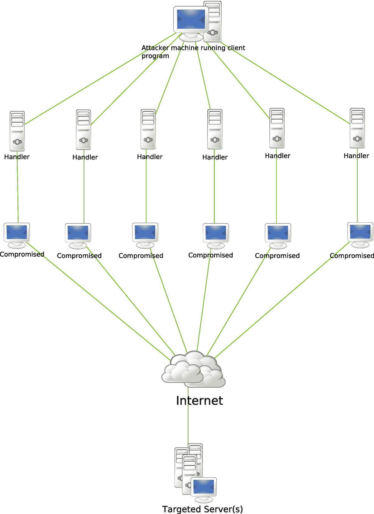
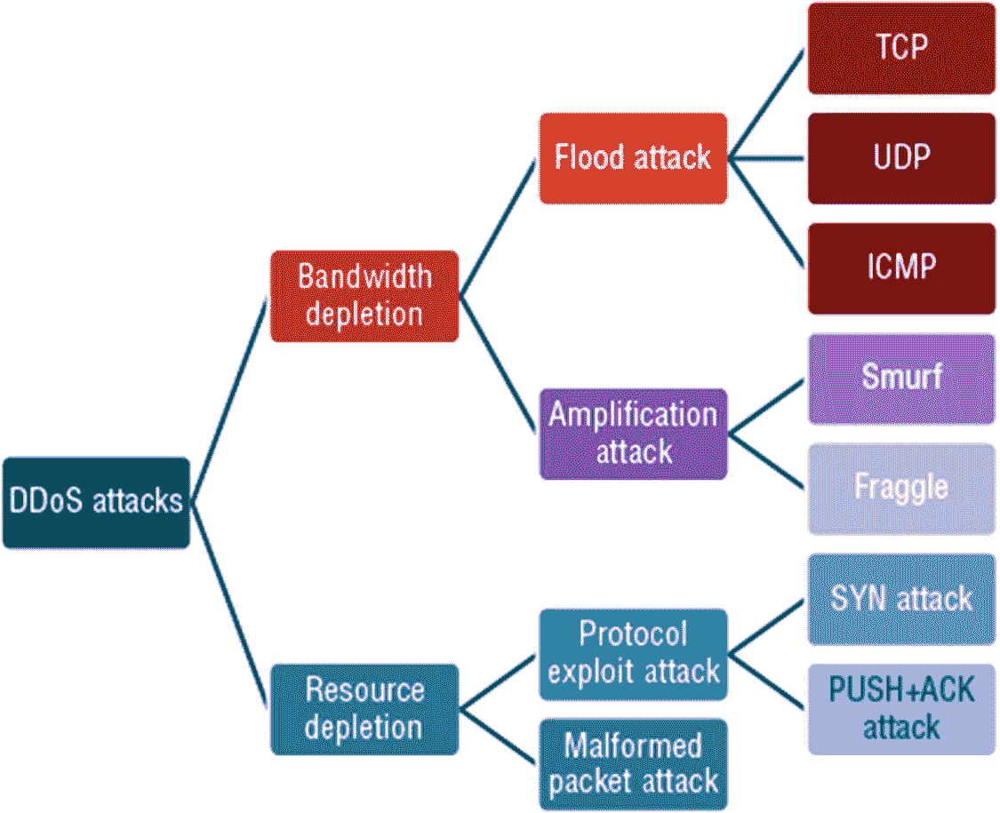
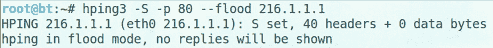
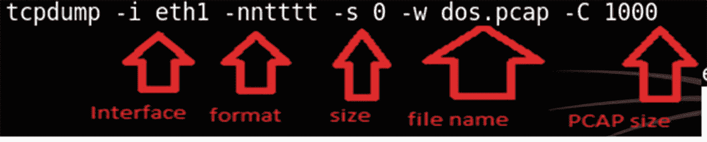

# 七、拒绝服务

拒绝服务(DoS)攻击的示例包括向已识别的系统发送超出其处理能力的流量，向服务发送超出其处理能力的事件，或者通过发送损坏的数据包使 TCP/IP 堆栈崩溃。在本章中，您将学习如何识别和检查 DoS 攻击的症状，并了解如何识别检测技术和对策。

本章结束时，您将能够

1.  识别拒绝服务攻击的特征。

2.  分析拒绝服务攻击的症状。

3.  认识 DoS 攻击技术。

4.  确定检测技术和对策策略。

## 拒绝服务攻击

拒绝服务攻击的目标不是获得对系统的未授权访问，而是阻止合法用户访问该资源。DoS 攻击会导致诸如消耗资源、改变网络组件、消耗带宽以及破坏程序和文件等问题。

## 攻击类型

重点介绍几种类型的拒绝服务攻击。

*   一个 **Smurf** 攻击是当攻击者发送额外的 ICMP 流量到 IP 广播地址，带有受害者的欺骗源 IP。

*   **缓冲区溢出攻击**向应用程序发送过量数据，导致应用程序停机和系统崩溃。

*   死亡攻击的 **ping 发送一个大于允许的 65，536 字节的 ICMP 数据包。**

*   一个**泪滴**攻击操纵碎片的值，使它们重叠，导致接收系统重组数据包的问题，这使它崩溃，挂起或重新启动。

*   一种 **SYN flood** 攻击通过从不响应服务器的响应来利用 TCP 的三次握手。

在针对一个目标的协同攻击中，分布式拒绝服务(DDoS)攻击利用几个受损系统。

## 僵尸网络

bot 是一种运行自动化任务的软件应用程序，可用于良性数据收集、数据挖掘或协调拒绝服务攻击。僵尸网络被称为僵尸网络。僵尸网络可以用来执行这里列出的所有任务:

*   分布式拒绝服务

*   垃圾邮件

*   嗅探流量

*   攻击 IRC 聊天网络

*   安装广告加载项

*   键盘记录

*   操纵在线投票和游戏

*   身份盗窃

## 实现 DDoS 攻击

DDoS 攻击的主要目标是获得大量计算机的管理权限，将它们变成僵尸。通过用特定数据激活僵尸，僵尸会被信号唤醒。使用僵尸也增加了追踪原始攻击者的难度。攻击者制造一种病毒，向目标发送 ping 数据包。他们用这种病毒感染大量电脑，制造僵尸，然后引发僵尸发动攻击。

进行 DDoS 攻击的过程包括以下步骤:

1.  创建一个病毒向目标发送 ping 数据包。

2.  用这种病毒感染大量电脑制造僵尸。

3.  触发僵尸发动攻击。

4.  僵尸攻击目标。

## 分布式拒绝服务攻击

处理程序通常被称为主程序，代理程序被称为守护程序。处理器软件安装在受损的路由器或网络服务器上，而软件代理安装在将执行攻击的受损系统上。代理可以配置为与单个处理程序通信，如图 [7-1](#Fig1) 所示，或者与多个处理程序通信。

图 7-1

DDoS 攻击

基于 IRC 的 DDoS 攻击与此类似，但它安装在网络服务器上，并通过使用 IRC 通信通道将攻击者连接到代理。

## 攻击类别

DDoS 攻击要么耗尽带宽，要么利用和消耗资源。在洪水攻击中，僵尸用 IP 流量淹没受害者，减慢受害者的速度或使系统崩溃。放大攻击使用子网的广播 IP 地址。攻击者通过直接或使用代理发送广播消息来增加流量(见图 [7-2](#Fig2) )。

图 7-2

攻击类别

## 对策

理解处理程序、客户端和代理之间的通信协议和流量是发现网络中的处理程序并禁用它们的关键。预防二次受害者可以通过主动预防技术来实现。保持防病毒程序和软件补丁最新将防止恶意代码插入。

出口过滤用于扫描离开网络的 IP 数据包的报头。建立规则，要求离开组织网络的合法数据包具有正确的源 IP 地址，有助于减少攻击。

入口过滤是一种观察、控制和过滤进入网络的流量的技术，其目标是确保只有合法流量进入，未经授权或恶意的流量不能进入。

复制服务器或增加带宽都是负载平衡技术。节流有助于路由器管理大量的传入流量，以便服务器能够处理这些流量。最小和最大吞吐量控制可用于防止服务器停机。使用诱饵(如蜜罐)可以保护组织的资源，同时提供一种研究攻击者技术的方法。

存储攻击后数据的工具可用于分析攻击期间流量的特殊特征。有了这些数据，就可以进行调整来更新负载平衡和节流对策。

追踪攻击者流量的工具可用于逆向工程攻击。此信息可用于实现不同的过滤技术来阻止流量。事件日志有助于调查。

## 执行拒绝服务攻击

拒绝服务是一种黑客攻击，其中大量流量被发送到主机，而主机不再有能力响应合法用户的请求(见图 [7-3](#Fig3) 、 [7-4](#Fig4) 和 [7-5](#Fig5) )。

图 7-5

DoS 数据包示例

图 7-4

用于发起 DoS 攻击的命令

图 7-3

使用 Tcpdump 捕获网络流量

切勿在隔离的虚拟环境之外使用该工具或这些命令。

## 摘要

本章回顾了拒绝服务攻击和不同类型的攻击，如 Smurf、缓冲区溢出、ping of death、teardrop 或 SYN flood，包括 DoS 攻击中出现的各种症状。它还涵盖了对保护系统安全非常重要的技术和对策。