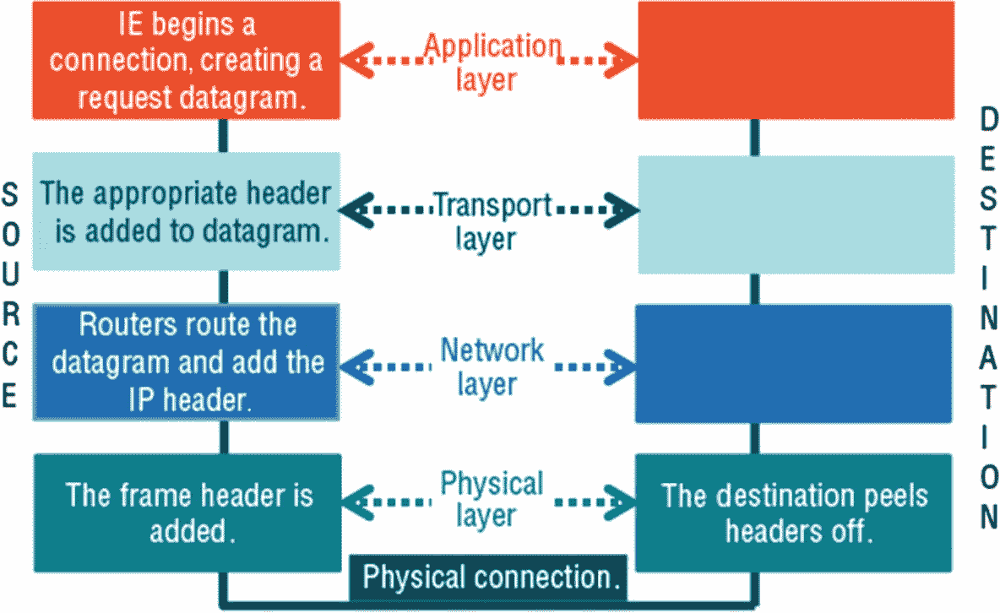
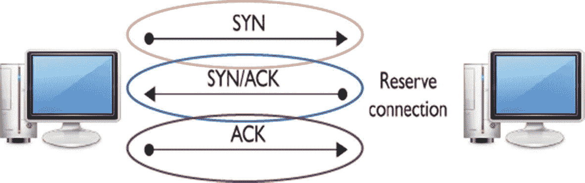
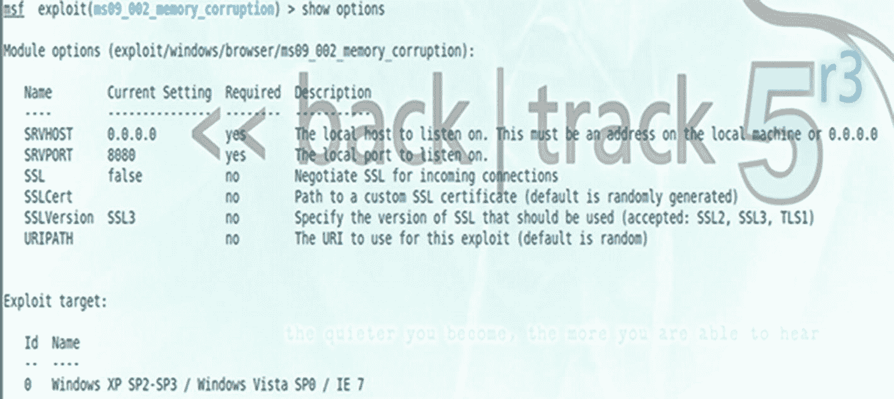
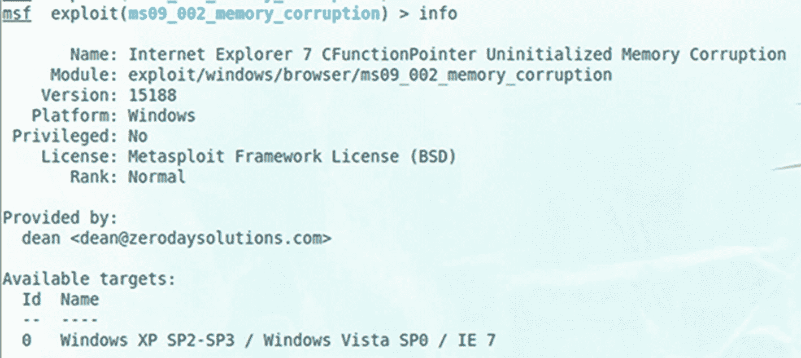
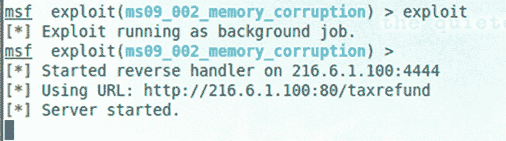
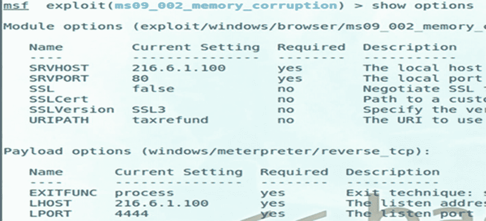
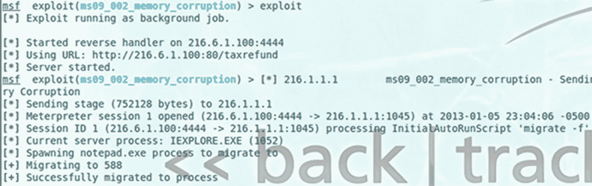
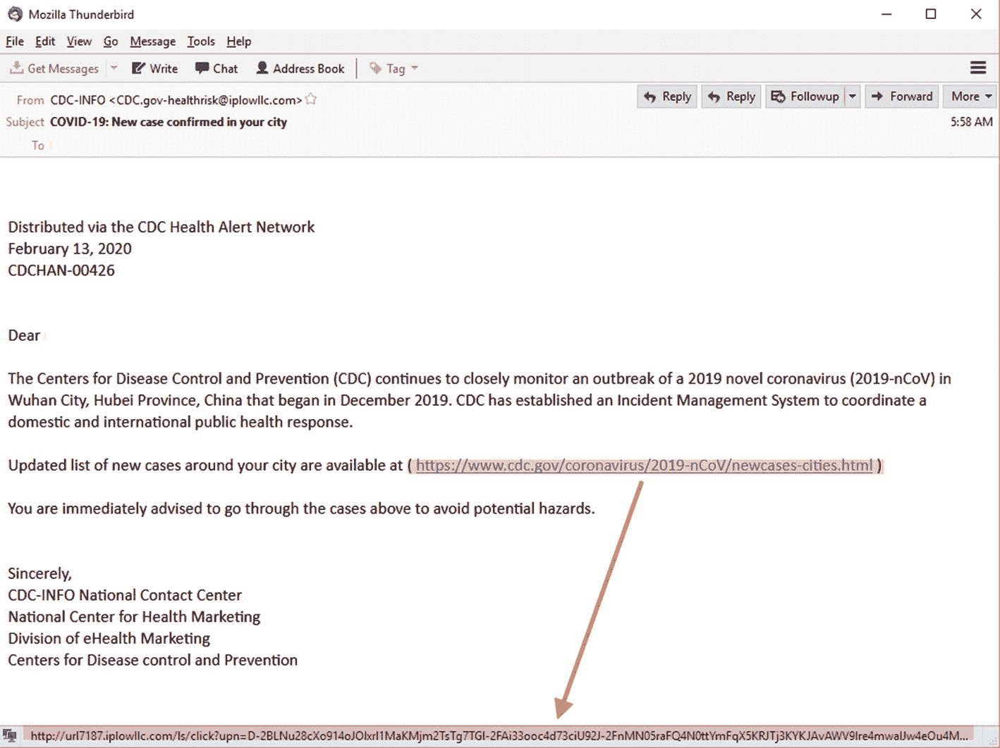
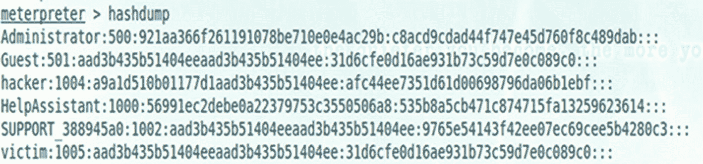

# 八、会话劫持

在本章中，您将了解会话劫持，包括涉及的步骤、不同的类型以及可用于防范这种类型攻击的对策。

本章结束时，您将能够

1.  确定进行会话劫持攻击的正确步骤顺序。

2.  识别不同类型的会话劫持。

3.  识别 TCP/IP 劫持。

4.  描述防止会话劫持的对策。

## 会话劫持

当用户在两台计算机之间的有效计算机会话被攻击者接管时，就会发生会话劫持。在本课中，您将了解攻击者如何窃取有效的会话 id，并使用它进入系统并提取数据。首先，在仔细研究会话劫持的细节之前，首先回顾传输控制协议(TCP)栈以建立坚实的理解基础是很重要的。

## TCP 栈

报头确保传输数据的可靠性。网络层允许数据报从源到目的地每次一跳。数据链路层与物理硬件通信，负责将信号从源设备传送到目的设备。见图 [8-1](#Fig1) 。

图 8-1

TCP 堆栈

## 三次握手

要使用 TCP 在双方之间建立连接，需要使用三次握手。攻击者试图破坏三次握手。攻击者可以发送数据包，如果 TCP 序列很容易预测，这些数据包就会被操纵。攻击者还可以访问未经授权的信息。序列号是随机的，但是随着时间的推移，随机数会重复出现，因为随机性是基于操作系统内部的算法。

TCP 数据段提供初始序列号(ISN)作为每个数据段报头的一部分。每个参与者在握手过程中陈述 ISN，然后该阶段的数字是连续的。参见图 [8-2](#Fig2) 。

图 8-2

三次握手

## 会话劫持的步骤

会话劫持涉及三个重要步骤。有关详细信息，请查看每个步骤。

1.  **追踪连接:**攻击者使用网络嗅探器，以容易预测的 TCP 序列来锁定受害者。攻击者捕获序列号和确认号，并使用这些号码构建数据包。

2.  **去同步连接:**攻击者改变服务器的序列号，去同步主机和目标之间的连接。为此，攻击者向服务器发送空数据，以提高服务器的 SEQ/ACK 数(目标机器没有相同的增量)，从而使服务器和目标不同步。目标没有意识到攻击。

3.  **注入攻击者的数据包:**一旦服务器和目标之间的连接中断，攻击者就能够将数据注入网络或进行中间人攻击。

## 会话劫持的类型

要使主动攻击成功，攻击者必须在目标响应服务器之前猜出序列号。操作系统供应商对初始序列号使用随机值，这使得序列号更难预测。主动攻击接管现有会话，中断连接，并主动参与。被动攻击监视正在进行的会话并使用嗅探器。

## 网络层劫持

网络层劫持包括在客户端和服务器之间的 TCP/UDP 会话中传输数据包时拦截数据包。为了攻击应用层会话，攻击者拥有所需的基本信息。

以下是网络层劫持方法的列表:

*   **TCP/IP 劫持**使用欺骗数据包接管连接。攻击者必须与受害者在同一个网络上。

*   **中间人**使用数据包嗅探器拦截客户端和服务器之间的通信。它还通过攻击者重定向客户端和主机之间的流量。

*   **IP 欺骗**攻击者创建数据包插入到 TCP 会话中，通过使用可信主机的 IP 地址来获得未经授权的访问。

*   **盲目劫持**发生在攻击者预测到受害者发送的序列号，并且连接似乎来自主机的时候。

*   **RST 劫持**发生在攻击者重置目标计算机，并通过攻击者重新路由新建立的会话时。

*   **UDP 劫持**不使用包排序。在服务器响应之前，攻击者向客户端发送一个伪造的服务器回复。

## 应用层劫持

攻击者通过访问会话 id 来控制现有会话。您可以在 URL 中找到嵌入的会话 id。

在 HTML 注入中，攻击者注入由客户端执行的恶意 HTML 代码。会话数据被返回给劫持者。跨站点脚本通过利用 web 应用程序来验证用户输入。

应用层劫持的类型:

*   **嗅探**是在 HTTP 流量未加密时通过主机重定向流量进行攻击。未加密的数据包含会话 id、用户名和密码。

*   **强力攻击**攻击就是尝试多种可能性，直到一个会话 ID 起作用。

*   **误导信任**使用 HTML 感叹和跨站脚本。

其他攻击包括在 URL、表单或 cookies 中嵌入代码。

## 对策

TCP 协议的规范已经改变，使得序列号的预测变得更加困难。具有 32 位字段的 ISN 可能有 43 亿个潜在值。网络管理员可以使用不同的最佳实践来防范会话劫持。它们可以限制传入连接、使用加密、最小化远程访问、使用安全协议、教育用户，以及使用电路级网关防火墙作为互联网协议安全(IPSec)的一部分。

## 浏览器漏洞

对于市场上的不同浏览器，包括 Internet Explorer、Mozilla Firefox、Google Chrome 和 Safari，Metasploit 都有漏洞。然而，浏览器漏洞只有在使用特定版本的操作系统时才起作用。

通过输入适当的命令，可以显示关于该漏洞的信息。您还可以查看该漏洞的选项。见图 [8-3](#Fig3) 和 [8-4](#Fig4) 。

图 8-4

利用选项

图 8-3

利用信息

## 配置的设置

在使用适当的命令设置 SRVHOST、SRVPORT、有效负载、本地主机和 URIPATH 之后，您可以使用`show options`命令查看您的所有设置。`exploit`命令将启动远程连接的监听器。在机器连接到机器或端口 80 之前，不会发生任何利用。见图 [8-5](#Fig5) 和 [8-6](#Fig6) 。

图 8-6

配置的设置

图 8-5

配置设置

## 长矛费西合唱团攻击

熟练的黑客可以创建鱼叉式网络钓鱼攻击电子邮件。通过 HTML 格式、徽标和签名块等策略，它们看起来非常可信。您可以通过将鼠标悬停在链接上来显示链接的真实 IP 地址或 DNS 名称。用户教育是关键。参见图 [8-7](#Fig7) 和 [8-8](#Fig8) 。

图 8-8

利用成功

图 8-7

假的网络链接

## 利用受害者机器

Windows LM(局域网管理器)和新技术局域网管理器(NTLM)散列也可以从系统中转储(图 [8-9](#Fig9) )。在转储时，有可能使用像开膛手约翰或该隐这样的方法来破解密码哈希。攻击者可以利用 Meterpreter 执行权限提升、转储哈希、终止进程和捕获屏幕截图等活动。Metasploit 必须在隔离的实验室环境中运行的机器上使用和评估。它不适合在野外使用。

图 8-9

利用受害者机器

## 摘要

在本章中，您了解了涉及会话劫持的关键因素，以及如何识别用于实现攻击的步骤。您回顾了几种有助于防范此类攻击的对策。