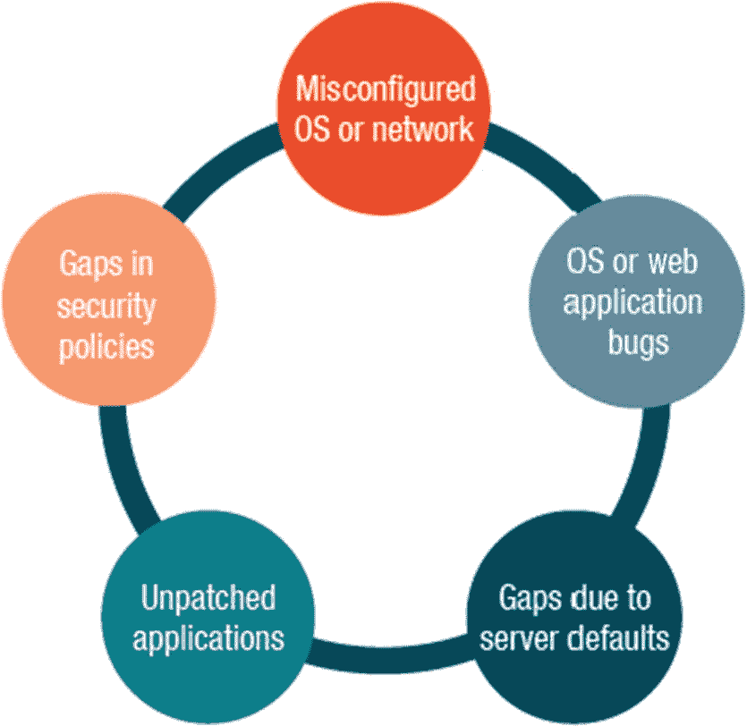
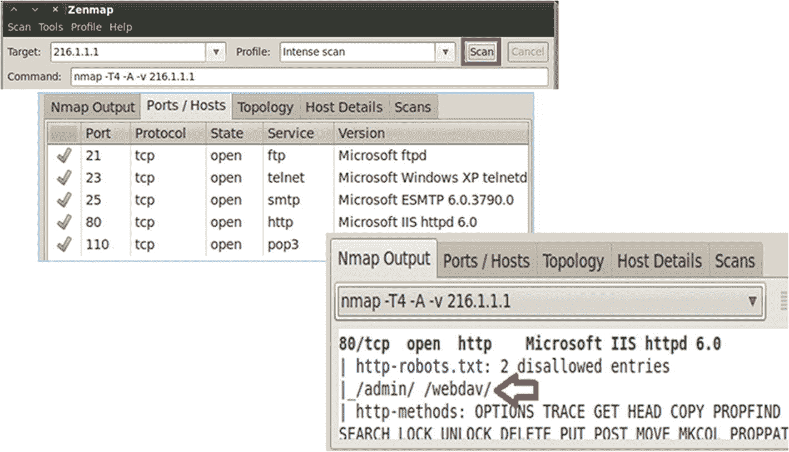
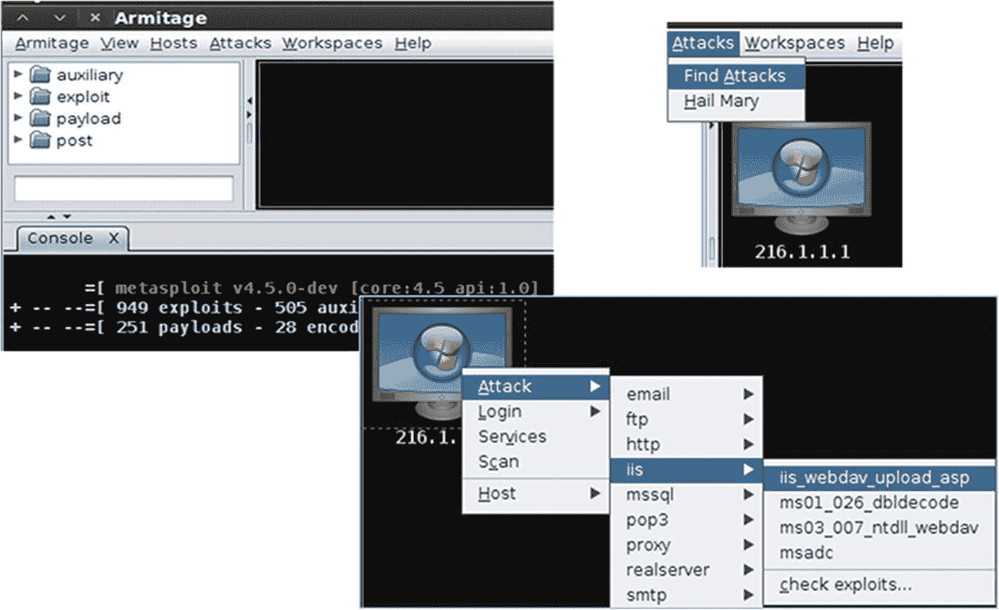
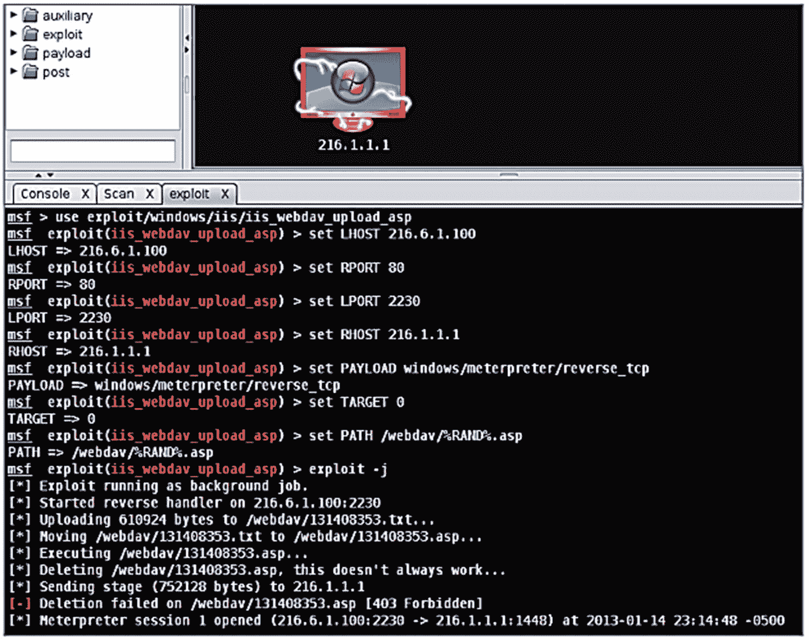
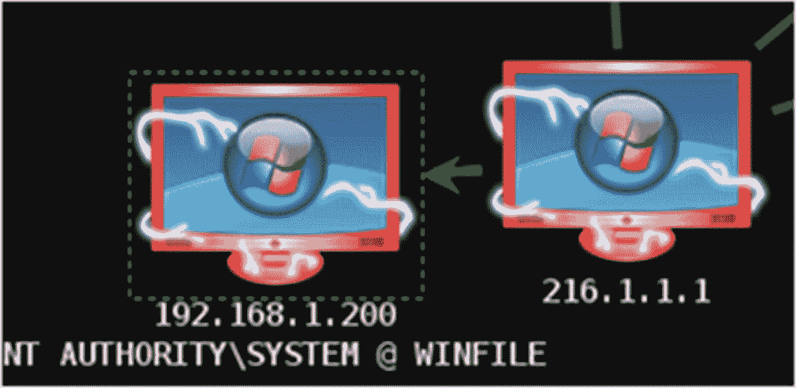
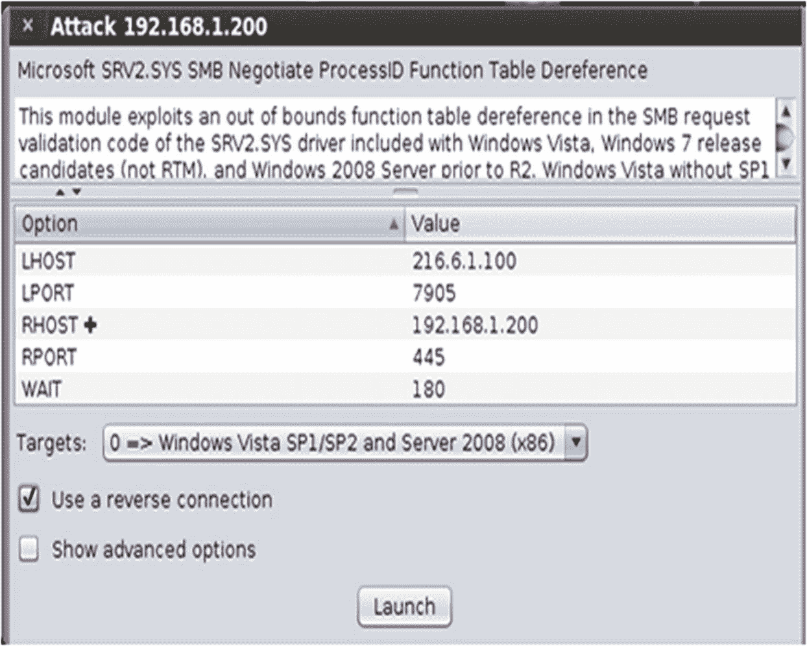
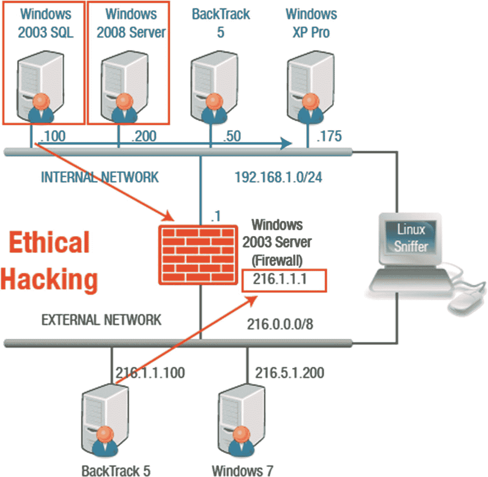
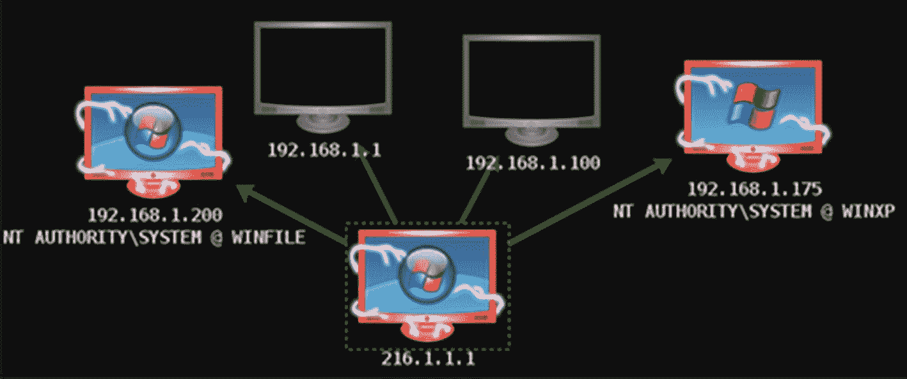

# 九、入侵网络服务器

在这一章中，你将会学到在入侵一个网络服务器的过程中会发生什么。您将了解 web 服务器的基本架构，并了解与之相关的漏洞。您还将了解防止 web 服务器攻击的有效对策。

本章结束时，您将能够

1.  定义 web 服务器架构。

2.  描述 web 应用程序攻击。

3.  探究各种 web 服务器攻击。

## Web 服务器安全漏洞

web 服务器为不同类型的用户带来了不同的问题。例如，网站管理员可能担心网络服务器会通过互联网将局域网暴露在威胁之下。网络管理员可能担心配置不佳的 web 服务器会给本地网络的安全带来漏洞。最终用户可能会担心 ActiveX 或 Java 等活动内容会使应用程序有可能入侵用户的系统。见图 [9-1](#Fig1) 。

图 9-1

Web 服务器安全漏洞

## 风险类型

浏览器端风险会影响最终用户，并且可能包括会使浏览器崩溃或导致滥用个人信息的活动内容。窃听者可以捕获在网络上传输的网络数据。

漏洞和配置错误允许未经授权的远程用户窃取机密信息，执行命令更改配置，检索用于危害系统的基于主机的信息，以及发起 DoS 攻击。

## Web 服务器攻击

网站污损是一种改变网站或网页外观的攻击。宗教和政府网站经常成为黑客行动主义者传播政治信息的目标。这些攻击可能以中间人攻击、暴力攻击、DNS 攻击、SQL 感叹词、目录遍历攻击和远程服务入侵的形式出现。

微软的网络服务器——互联网信息服务(IIS)经常成为攻击的目标。被利用的具体漏洞包括::$数据漏洞、showcode.asp 漏洞、捎带漏洞、缓冲区溢出和 WebDAV/RPC 利用。

## IIS 组件

当您看到 IIS 用来提供功能的各种组件时，web 服务器安全性成为挑战就不足为奇了。IIS 依赖于一组 dll，这些 dll 与主服务器进程一起提供其所有功能。

IIS 的组件包括以下内容:

*   协议侦听器(HTTP.sys)

*   网络服务(万维网服务)

*   激活服务

*   BITS 服务器扩展

*   公共文件

*   FTP 服务

*   FrontPage 服务器扩展

*   IIS 管理器

*   互联网打印

*   NNTP 服务

*   SMTP 服务

## IIS 日志

网络管理员将 IIS 捕获的日志文件作为 web 服务器管理的一个重要部分。将 IIS 日志文件与其他监控记录结合起来，可以强化任何证据，并使其更具可信度。

日志记录的规则包括

1.  配置日志以记录每个可用字段。

2.  用时间戳捕获事件。

3.  确保连续性。

4.  确保原始记录后日志未被修改。

## Web 服务器安全性

无论您使用的是哪种 web 服务器，都可以采取一些措施来提高 web 服务器的安全性。可以使用防火墙；重命名管理员帐户；禁用默认网站；删除未使用的应用程序映射；禁用目录浏览；张贴法律公告；安装服务包、修补程序和模板。并禁用远程管理。

## Web 服务器安全清单

1.  **补丁和更新:**为了降低隐藏有害软件病毒的风险，下载补丁和更新非常重要。它们通过删除不必要的信息来帮助保护，并建立在您对系统的积极支持上。

2.  **审计和日志记录:**审计和日志记录有助于您启用和记录失败的登录尝试，重新定位 IIS 日志文件，锁定服务器，以及保护站点和虚拟目录。

3.  **服务:**减少服务数量或禁用不需要的协议，减少了 web 服务器的攻击面。但是，您必须确保 web 服务器所需的功能没有被大幅削减。您要禁用的协议有 WebDAV、NetBios 和 SMB。

    脚本映射是一种要使用的安全措施，您可以使用。idq，。htw，。伊达，。shtml，。shtm，。stm，。idc，。htr，还有。404.dll 分机的打印机。您还可以使用 ISAPI 过滤器，它监视进出的信息，并修改信息以保护系统免受攻击。

4.  **协议:**禁用来宾帐户和未使用的帐户、重命名管理员帐户以及禁用空用户连接非常重要。您可以做的另一项安全措施是删除管理共享，如 C$和 Admin$。

## Apache Web 服务器安全清单

大多数 web 服务器是基于 Linux 的，并且使用 Apache Web 服务器软件。所示的安全检查表提供了一些特定于 Apache 的指导。尽管保护 web 服务器涉及到更多的内容，但这已经超出了本书的范围。

Apache Web 服务器的安全检查清单如下:

1.  禁用不必要的模块。

2.  作为单独的用户和组运行 Apache。

3.  限制对根目录的访问。

4.  为`conf`和`bin`目录设置权限。

5.  禁用目录浏览。

6.  不允许`.htaccess`。

7.  不要显示或发送 Apache 版本。

## 利用阿米蒂奇攻击网络

使用 Zenmap 运行扫描以找到打开的端口后，滚动到输出选项卡上的`80/tcp`。检查`robots.txt`文件，它限制了 web 机器人可以遍历的目录位置。查看图 [9-2](#Fig2) ，显示使用 Zenmap 扫描 XYZ 公司的公共 IP 地址，然后选择 nmap 输出选项卡。

图 9-2

使用 Zenmap

## 使用阿米蒂奇

这是面向互联网的 Windows 设备，所以你必须攻击 IIS。不幸的是，大多数 IIS 攻击都是针对 Windows 2000 机器的。横幅消息似乎表明是 Windows 2003 服务器。

要尝试 IIS WEBDAV 攻击，右键单击 216.1.1.1 并选择攻击，然后从选项中选择 IIS，然后选择`iis_webdav_upload_asp`。见图 [9-3](#Fig3) 。

图 9-3

IIS WEBDAV 攻击

目标将变为红色(带亮色),表示它已被破坏。

如图 [9-4](#Fig4) 所示，键入以下命令提升权限:

`meterpreter > getsystem`

图 9-4

仪表首选 1

如果攻击者连接到内部网络上的目标，他们可以使用该机器来旋转和定位内部网络上具有私有 IP 地址的其他机器。Armitage 可以在扫描机器时揭示目标机器使用的操作系统和服务包级别。与直接连接到互联网的机器相比，内部网络上的机器上的更多端口可能是开放的。如果攻击者可以连接到另一个受害者，它将显示一个红色边框。参见图 [9-5](#Fig5) 和 [9-6](#Fig6) 。

图 9-6

连接到另一个受害者

图 9-5

配置远程攻击

攻击者现在控制了内部网络上的 Windows 2003 和 2008 机器。攻击者的下一步行动是攻击运行 XP 的工作站。参见图 [9-7](#Fig7) 。

图 9-7

更多受害者

现在，内部网络上应该有三台被入侵的机器。在所有这些 Microsoft Windows 系统上，您还拥有系统级访问权限。获得网络控制权后，攻击者可能会进行利用后的活动，包括安装恶意软件、执行程序、转储哈希、践踏时间、中断服务、终止进程和窃取信息。参见图 [9-8](#Fig8) 。

图 9-8

受损的机器

## 摘要

本章向您介绍了围绕 web 服务器的各种安全问题。这些信息对于服务器管理员来说至关重要，他们必须解决许多安全问题，包括恶意代码、网络安全和服务器错误，以保持系统正常运行。在本课中，您了解了有关 web 服务器的知识，包括它们的体系结构、漏洞以及防范 web 服务器攻击的对策。