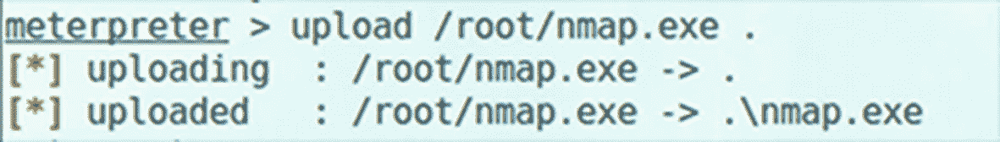
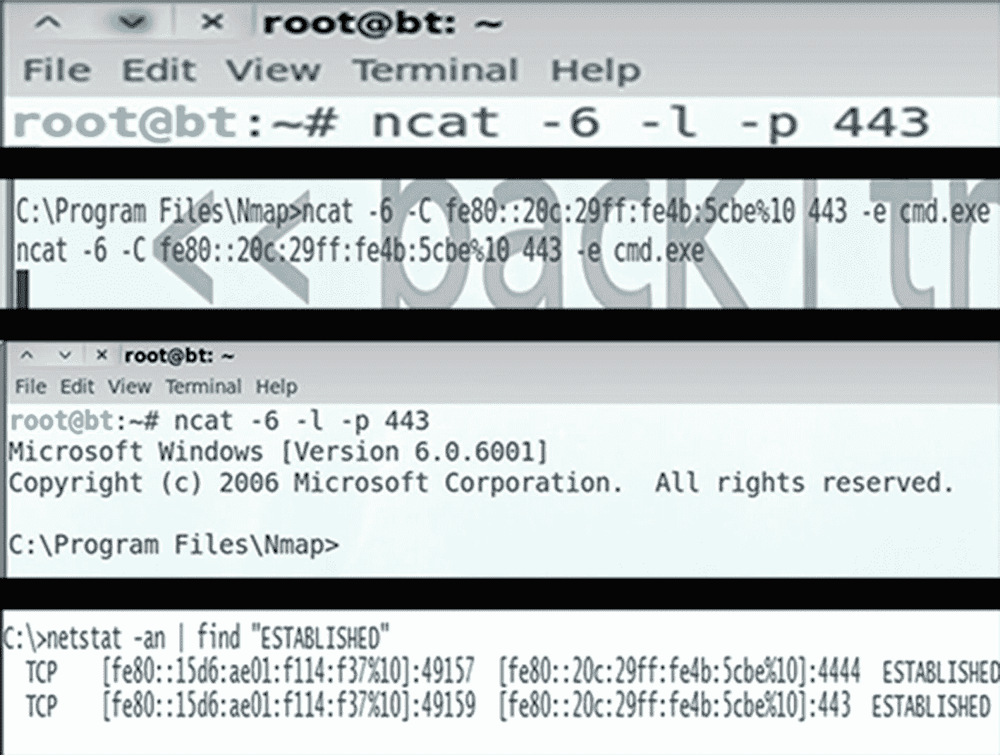

# 十、网络应用的黑客攻击

在这一章中，你将学习如何入侵 web 应用程序组件，以及如何描述在 web 应用程序攻击过程中会发生什么。您还将获得有关有效对策的知识，以帮助保护系统。

本章结束时，您将能够

1.  识别 web 应用程序组件。

2.  描述 web 应用程序攻击。

3.  确定对策。

## Web 应用程序攻击

Web 应用程序攻击有一个过程，下面概述了每个步骤。这些步骤的结果可能是网站受损、内容被篡改、数据被盗或失去客户。

1.  **扫描**是第一步，首先运行端口扫描来查找开放的 HTTP 和 HTTPS 端口。这也有助于确定哪些服务正在运行，并从每个打开的端口检索默认页面。

2.  **信息收集**是攻击者解析每个页面以找到常规链接并确定网站结构和应用程序逻辑时发生的步骤。他们还会检查页面上的注释，这些注释可能有助于获得对受限文件的访问权限。

3.  测试是 web 应用程序攻击的另一个步骤。当攻击者准备好攻击时，他们会对每个应用程序脚本运行一个测试过程，并寻找开发错误。

4.  **策划攻击**发生在攻击者根据收集到的信息选择特定攻击的时候。

5.  **发起攻击**是最后一步，当攻击者追踪每个被识别为易受攻击的 web 应用程序时，就会发生这一步。

## 跨站点脚本攻击

当用户访问网站时，用户可以登录。如果站点使用服务器端脚本，它会生成一个欢迎页面，并在用户的计算机上放置一个 cookie。每当访问网站时，都会检索 cookie。

当用户点击电子邮件时，会插入一个邪恶的脚本，而不是用户名。web 服务器仍然会生成一个欢迎页面，但是用户的浏览器会运行恶意脚本并执行恶意代码，将敏感数据发送到黑客的计算机。见图 [10-1](#Fig1) 。

图 10-1

跨站点脚本攻击

## 对策

许多 HTML 标记可用于传输恶意 JavaScript。可用于防范威胁的对策包括:

*   验证所有表单字段、隐藏字段、标题、cookies 和查询字符串。

*   检查所有来自 HTTP 请求的输入通过 HTML 作为输出的地方的代码。

*   限制输入字段。脚本攻击需要大量的字符。

## SQL 注入

如果应用程序在将用户输入传递给 SQL 语句之前没有正确验证用户输入，SQL 注入攻击就会得逞。攻击者绕过正常的安全措施，直接访问有价值的数据。SQL 注入攻击使用 SQL 语句来控制数据库数据。

应用程序使用 SQL 语句向应用程序验证用户身份，验证角色和访问级别，存储和获取信息，以及链接到其他数据源。对策是不允许未经检查的用户输入到数据库查询中。

## cookie/会话中毒

Cookies 用于维护将个人绑定到 web 应用程序的会话状态。Cookie 中毒允许攻击者注入恶意内容来获取未经授权的信息。

Cookies 包含特定于会话的数据，例如

*   用户 id

*   密码

*   账号

*   购物车内容

*   用户的私人信息

*   会话 id

cookies 有几个用途。一是当你浏览网站时，网站可以“记住”你。持久性 cookie 存储在计算机的硬盘上，而非持久性 cookie 存储在内存中，安全 cookie 通过 SSL 传输。

保存 cookie 带来的威胁是，攻击者可以在访问系统时使用 cookie 进行身份验证，并且他们可以重写会话数据。

要考虑的一些对策包括:

*   不要在系统中存储简单的文本或弱密码。

*   实现 cookie 超时。

*   将 cookie 身份验证凭据绑定到一个 IP 地址。

*   提供注销功能。

*   使用 MAC 来保护 cookie 的完整性。

## 参数/形式篡改

这种攻击利用隐藏或固定字段作为某些操作的唯一安全措施。攻击者将更改这些参数来绕过安全机制。属性参数描述了正在上载的页面的行为。

当使用 GET 方法提交表单时，所有表单参数和值都出现在用户看到的查询字符串中。攻击者可以篡改查询字符串。一个好的对策是对所有表单进行有效性检查。

## 缓冲区溢出

Web 应用程序和服务器软件可能会出现缓冲区溢出错误。如果服务器产品中存在缓冲区溢出，这通常是常识。如果 web 应用程序使用这些库，它就容易受到缓冲区溢出攻击。

对策包括使用服务器端代码验证表单中的输入长度、执行边界检查以及避免不执行边界检查的函数。见图 [10-2](#Fig2) 。

图 10-2

缓冲区溢出

## 错误消息拦截

如果您在网上冲浪时遇到问题，您可能会看到“404–未找到”的错误消息。错误消息还可能包含特定于站点的信息，这将允许攻击者了解有关应用程序体系结构的信息。它们可用于确定 web 应用程序中使用的技术，确定攻击尝试是否成功，并为未来的攻击收集信息。一个有效的对策是使用通用错误消息。

## 其他攻击

针对其他几种 web 应用程序攻击，简要描述了攻击及其对策。

*   **目录遍历**允许攻击者浏览目录和文件。拥有强大的配置可以防止信息泄露。

*   **密码拦截**发生在攻击者寻找数据暂时不受保护的交接点时。为了防止这种情况，您应该使用 SSL 和高级私钥保护。

*   **认证劫持**是指攻击者利用不安全的凭证和身份管理。为了防止这种情况，您应该通过安全通道进行身份验证，并使用 SSL 和高级私钥保护。

*   **日志篡改**发生在攻击者删除日志并更改用户信息以销毁攻击证据的时候。针对日志篡改的预防措施包括数字签名和时间戳日志。

*   **DMZ 协议攻击**将允许进入 DMZ 的协议限制为 FTP、SMTP、DNS、HTTP 和 HTTPS。防范这种攻击的一种方法是使用入侵防御系统。

*   **当攻击者可以修改保护策略、添加新策略以及修改应用程序、系统数据和资源时，就会出现安全管理漏洞**。所有管理功能都应该有防火墙来防止这种类型的攻击。

*   **零日攻击**发生在发现漏洞和发布修正补丁之间。为了防止这种情况，请使用最新的修补程序和补丁，采用防火墙，并启用启发式扫描。

*   **网络访问攻击**当攻击者使用欺骗、桥接、ACL 攻击和堆栈攻击时发生。使用检查网络防火墙、NAT 或网络 ACL 来防止这种攻击。

*   **TCP 分段**是指攻击者将一次攻击分段成多个 TCP 数据包。防范措施包括使用防火墙规则来检查定向到 web 服务器的流量。

## 使用 Nmap

ncat 工具是支持 IPv6 的工具，是 nmap 套件的成员之一。如果 IPv6 流量不受监管，网络上可能检测不到可以使用 IPv6 的工具。Wireshark 使用户能够监控和检查网络上的 IPv6 流量。参见图 [10-3](#Fig3) 至 [10-5](#Fig5) 。

图 10-5

Nmap 扫描

图 10-4

打开反向外壳

图 10-3

上传 Nmap

## 使用 ncat

验证 ncat 已在受害者身上安装并正常运行。见图 [10-6](#Fig6) 。

图 10-6

Ncat 选项

## 建立会话

图 [10-7](#Fig7) 展示了两个 IPv6 连接建立的过程。

图 10-7

建立会话

## 摘要

在本章中，您回顾了几种不同类型的攻击，它们可能发生在 web 应用程序上。您还了解了如何对 web 应用程序攻击进行分类，以及可以用来防范这些类型攻击的对策。