# 十一、SQL 注入

结构化查询语言(SQL)是一种允许与数据库服务器交互的语言。程序员使用 SQL 命令来执行使用数据库的操作。SQL 注入利用未经验证的输入漏洞。攻击者通过在后端数据库上执行的 web 应用程序注入 SQL 命令。

任何接受用户输入以采取行动或执行查询的 web 应用程序都容易受到 SQL 注入的攻击。在本章中，您将了解 SQL 注入，它们是如何工作的，以及管理员可以做些什么来防止它们。

本章结束时，您将能够

1.  检查 SQL 注入攻击。

2.  确定防御 SQL 注入袭击的策略。

## Web 应用程序组件

web 服务器接收请求，并验证用户发出请求的访问权限。web 服务器验证该请求，并查询数据库服务器以满足该请求。数据库服务器接收请求并处理查询。基于查询响应构建网页，并将其返回给浏览器。见图 [11-1](#Fig1) 。

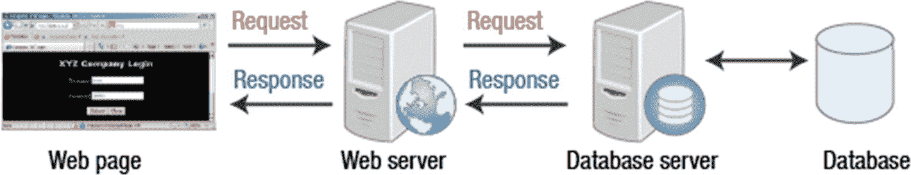

图 11-1

Web 应用程序组件

## SQL 注入分类

一旦发现 SQL 注入漏洞，对攻击者的唯一限制就是他们的 SQL 查询技能。攻击者可以提交一个又一个 SQL 语句，直到后端被映射、更改、查看和控制。SQL 注入分类见图 [11-2](#Fig2) 。

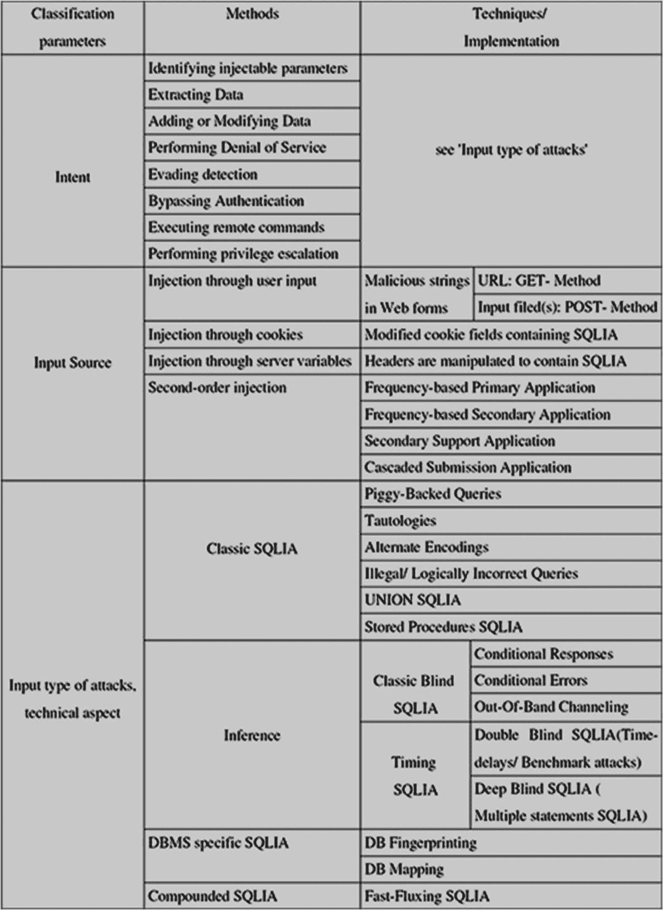

图 11-2

SQL 注入分类

## SQL Server 的 Web 前端

如果一个 web 应用程序链接到一个 SQL 后端数据库，当用户输入信息(如用户名和密码)时，这些值被放在一个 SQL 语句中。见图 [11-3](#Fig3) 。

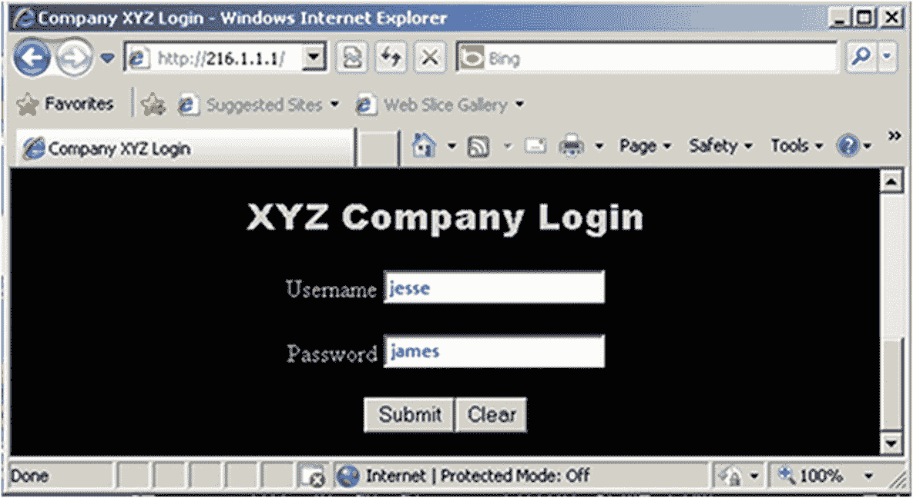

图 11-3

登录页面

在 web 用户提交请求后，输入被放入一个 SQL 语句中(图 [11-4](#Fig4) )。

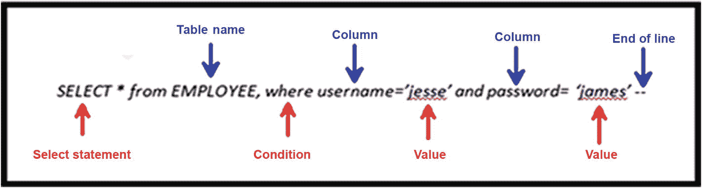

图 11-4

SQL Server 的 web 前端

## 操作输入字段

SQL 注入通过操作语句中的值来工作。例如，在这种情况下，攻击者插入图 [11-5](#Fig5) 中显示的用户名的值`JESSE’ OR 1=1--`。

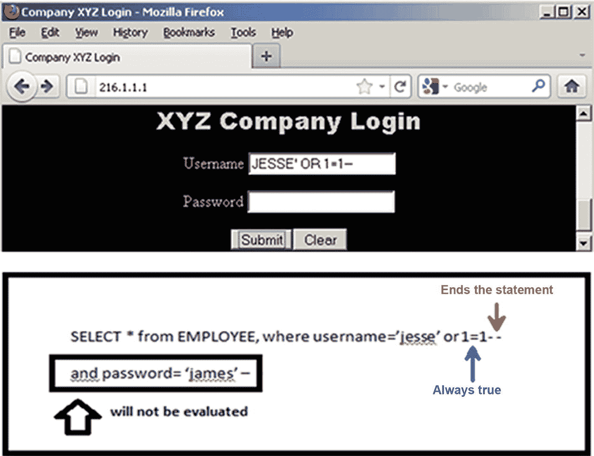

图 11-5

输入字段操作

## SQL 注入尝试失败

如果用户名字段以双破折号结尾，则不会评估 SQL 密码字段。SQL 注入失败的原因是浏览器的 JavaScript 验证了输入。见图 [11-6](#Fig6) 。

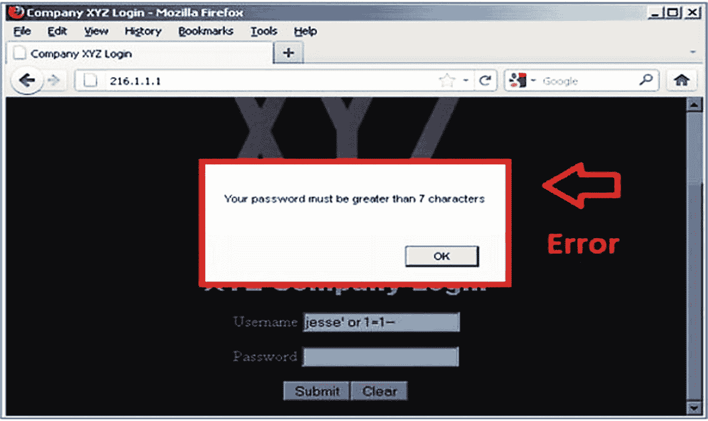

图 11-6

失败的 SQL 注入尝试

## 使用客户端验证

web 应用程序可以使用 JavaScript 来检查输入验证。这是客户端验证的一种形式。您可以在浏览器中禁用 JavaScript。见图 [11-7](#Fig7) 。

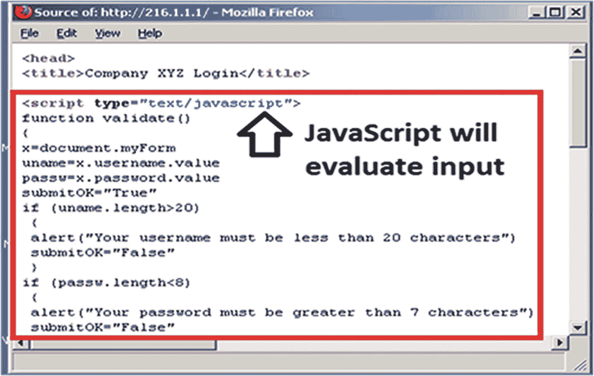

图 11-7

客户端验证

## 成功登录

再次尝试 SQL 注入。显示名字**和**的原因可能是因为他们是该列中的第一个用户。一旦 1=1 被提升为真，登录就成功了。见图 [11-8](#Fig8) 。

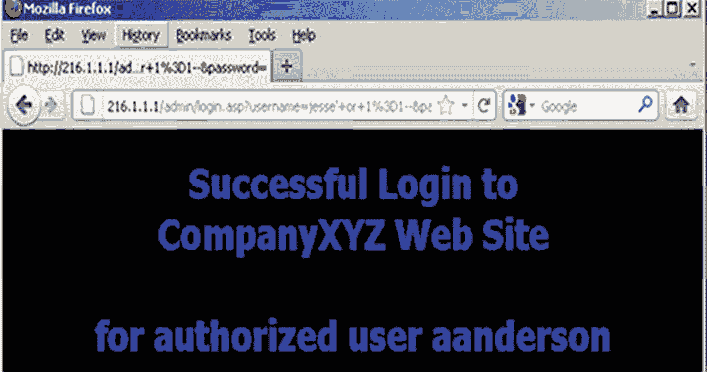

图 11-8

登录成功

## 使用存储过程

要查看数据库中的所有名称和密码，只需使用一个存储过程。这个存储过程被称为`sp_makewebtask`。这个仅在 Microsoft SQL Server 中提供的存储过程生成 HTML 输出。使用显示为用户名的代码。虽然收到了失败的登录名响应，但这并不意味着 SQL 语句没有执行。见图 [11-9](#Fig9) 。

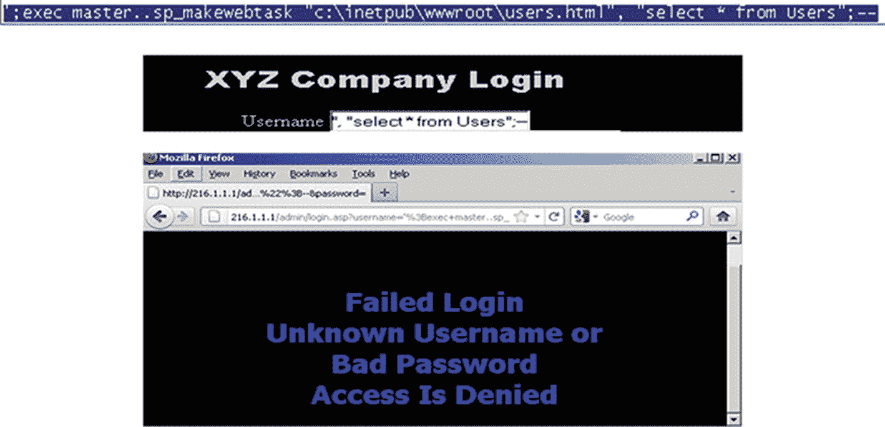

图 11-9

存储过程

## 注射结果

包括所有用户名和密码的整个数据库如图 [11-10](#Fig10) 所示。这可能是信用卡或社会安全号码数据库。

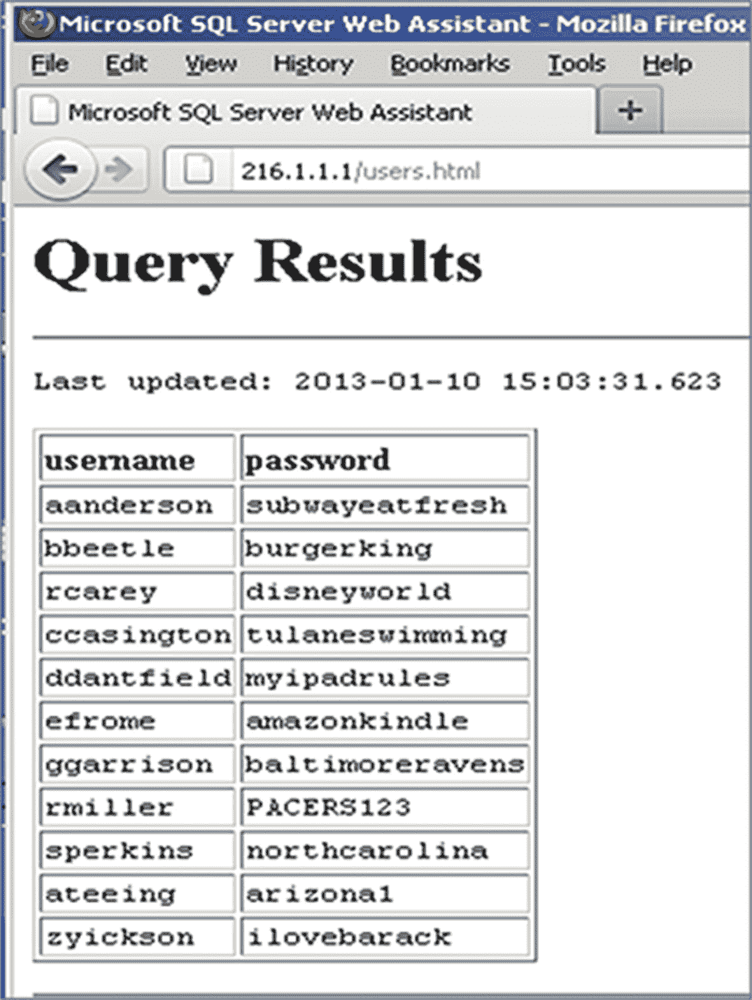

图 11-10

注射结果

## 注入用户名

将用户名和密码注入现有数据库。这允许您登录并访问数据库中的资源。或者，在数据库中，您可以创建一个提供物理或网络访问的帐户。登录到 SQL server 后，您可以验证您的凭证是否已添加，如图 [11-11](#Fig11) 所示。

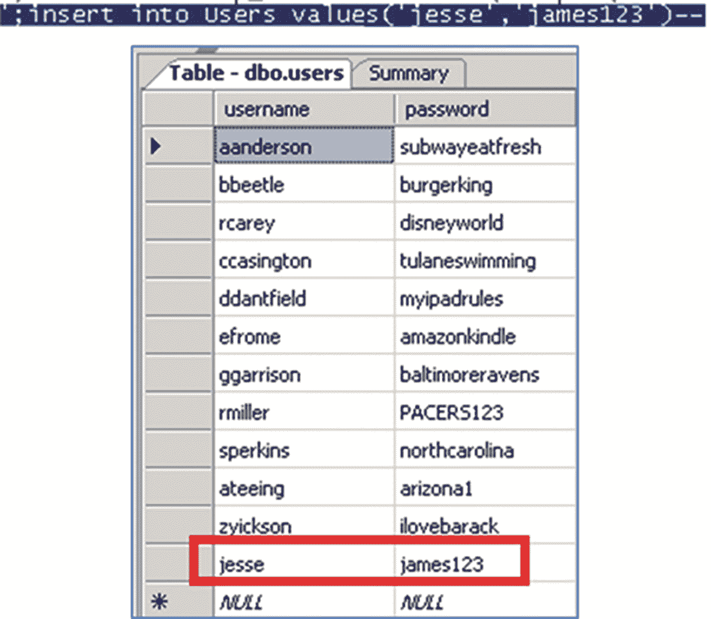

图 11-11

注入用户名

## 对策

正则表达式在克服 SQL 注入中起着重要的作用。最后四个对策特别适用于盲人 SQL 注入。当应用程序接受来自客户端的数据并执行 SQL 查询而没有首先验证输入时，就会发生这种情况。要避免这种情况，请执行以下操作:

1.  为每个用户输入输入一个验证检查。

2.  使用 Salt 存储密码的哈希，而不是以纯文本的形式存储。

3.  检查特定于 SQL 的元字符，如单引号(')或双破折号(-)。

4.  绝不允许客户端提供的数据修改 SQL 语句的语法。

5.  将 web 应用程序与 SQL 隔离开来。

6.  应用程序所需的所有 SQL 语句都应该在数据库服务器的存储过程中。

7.  应用程序应该使用安全的接口执行存储过程。

## 防止 SQL 注入攻击

通过以下几个建议，可以防止 SQL 注入病毒的攻击。预防是开发人员和数据库管理员的责任。

*   使用简单的替换功能将所有单引号转换为双引号。

*   最小化特权。

*   实现一致的编码标准。

*   为 SQL server 设置防火墙。

*   永远不要相信用户的输入。

*   千万不要用动态 SQL。

*   异常应该只提供最少的信息。

## 摘要

在本章中，您了解了 SQL 注入攻击，它们是如何工作的，以及可以用来防止它们的战术类型。您回顾了有助于防止 SQL 攻击的具体对策，从而有助于管理员维护安全性。