# 十二、入侵无线网络

随着组织从有线网络转向无线通信，许多安全问题需要解决。使用无线电波的无线局域网比使用物理线路的局域网更容易被拦截。去酒店、机场或当地的麦当劳。许多组织现在为他们的客户提供无线连接。不幸的是，提供的易用性也伴随着风险的增加。攻击者可能在危及无线网络的组织之外。在本章中，您将了解不同类型的无线网络、身份验证方法以及无线加密的重要性。

本章结束时，您将能够

1.  识别各种类型的无线网络。

2.  确定身份验证方法和无线加密类型。

3.  解释无线黑客的方法。

4.  应用无线命令和工具。

5.  检查明文无线流量、有线等效保密(WEP)流量和 Wi-Fi 保护访问(WPA)流量。

## 无线网络的类型

您应该了解四种类型的无线网络。查看下面列出的每个网络以了解详细信息。

*   **对等网络** **:** 在对等网络中，每台计算机都可以直接与同一网络上的其他计算机进行通信，而无需通过接入点。但是，他们可能无法访问有线局域网。

*   **有线网络的扩展** **:** 如果在有线网络和无线设备之间放置接入点，则有线网络被扩展。接入点将无线局域网连接到有线局域网，因此无线设备可以访问局域网资源。

*   **多个接入点** **:** 多个接入点可用于覆盖更大的区域，使用户能够在覆盖范围内无缝移动。

*   **局域网到局域网无线网络:**局域网到局域网无线网络使用接入点在一个网络上的本地计算机和另一个网络上的计算机之间提供无线连接。

## 无线标准

除了 802.11 标准，还有 802.15.1 和 802.16，802 . 15 . 1 是覆盖蓝牙的 IEEE 标准，802.16 覆盖 WiMAX，是一种长距离无线基础设施。查看表格 [12-1](#Tab1) 以熟悉可用的无线标准范围。

表 12-1

可用的无线标准范围

| 

规格

 | 

速度

 | 

频率范围

 |
| --- | --- | --- |
| 802.11a | 54mbps | 5.2 千兆赫 |
| 802.11b | 11 Mbps | 2.4ghz |
| 802.11g | 11 Mbps/54 Mbps | 2.4ghz |
| 802.11i | 11 Mbps/54 Mbps | 2.4ghz |
| 802.11n | 124-248 Mbps | 2.4 千兆赫/5.2 千兆赫 |

## 服务集标识符

SSID 是无线局域网(WLAN)的唯一名称，最长可达 32 个字符。无线局域网中的所有设备和接入点都必须使用相同的 SSID。SSIDs 不为 WLAN 提供安全性，因为它可以在明文中被嗅探到。许多设备都附带默认 SSIDs。

## 802.1x 身份验证过程

IEEE 802.1x 标准定义了在授权访问网络和认证服务器(例如 RADIUS 服务器)之前用于认证用户的方式。802.1X 通过中间设备(如边缘交换机)运行，如果连接经过适当的身份验证，则允许端口传输正常流量。这可以避免未经授权的客户端访问交换机上的公共端口，将未经授权的用户阻挡在 LAN 之外。

远程身份验证拨入用户服务(RADIUS)是一种客户端/服务器协议，它使用端口 1813 为连接和使用可用网络服务的计算机提供集中的身份验证、授权和记帐。

在 RADIUS 服务器认证了客户端并向接入点(AP)发送了加密的认证密钥之后，AP 在向客户端传输之前生成用逐站单播会话密钥加密的多播/全局认证密钥(步骤 7)。以下步骤概述了认证过程(也如图 [12-1](#Fig1) 所示)。

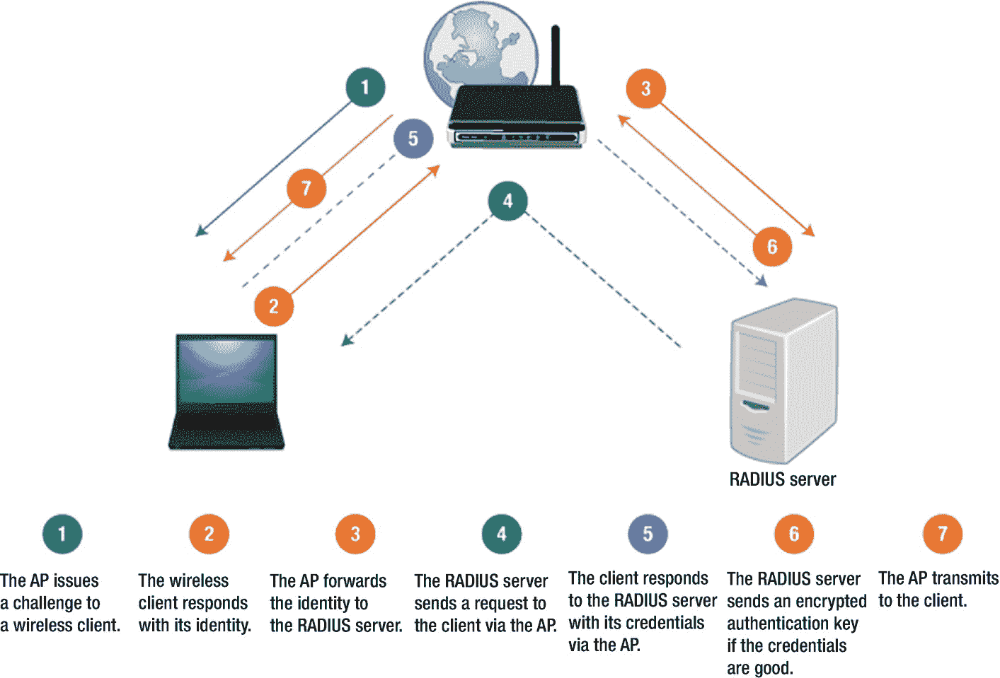

图 12-1

802.1x 身份验证过程

1.  AP 向无线客户端发出质询。

2.  无线客户端以其身份进行响应。

3.  AP 将身份转发给 RADIUS 服务器。

4.  RADIUS 服务器通过 AP 向客户端发送请求。

5.  客户端通过 AP 用其凭据响应 RADIUS 服务器。

6.  如果凭据有效，RADIUS 服务器会发送加密的身份验证密钥。

7.  AP 向客户端传输。

## 802.11 漏洞

信标帧广播 SSID，以便用户可以定位网络。任何工作站都可以模拟另一个工作站或接入点。攻击者可以干扰身份验证和关联，这可以迫使工作站重新进行身份验证和关联过程。

接入点具有 MAC 地址过滤功能。然而，MAC 地址不能提供强大的安全机制，因为它可以被观察和复制。MAC 地址以明文形式出现。每个网卡上都有一个特定的 MAC 地址，该地址可以通过`ifconfig`命令修改。

## 有线等效隐私

有线等效保密旨在为 WLAN 提供与有线 LAN 相当的安全级别，并且是使用 RC4 ( [`www.geeksforgeeks.org/rc4-encryption-algorithm/`](http://www.geeksforgeeks.org/rc4-encryption-algorithm/) )的流密码。流密码算法的输入是以明文和密钥发送的初始化向量(IV)。IV 和密钥的总长度是 64 或 128 位。繁忙的接入点可以在数小时内使用所有可用的 IV 值(224)，然后这些 IV 值被重新使用。有两个问题需要考虑:32 位循环冗余校验(CRC32)不足以确保数据包的加密完整性，并且容易受到字典攻击。

## 保护无线电脑网络安全系统 2

保护无线电脑网络安全系统 2 (WPA2)使用 8 到 63 字节长的 256 位预共享密钥。当用户的密码少于 20 个字符时，他们容易受到离线字典攻击。WPA2 提供两种运作模式:WPA2-个人和 WPA2-企业。WPA2 个人使用设置密码，而 WPA2 企业使用服务器来确认用户。WPA2 接入采用 AES 加密算法来提供政府级的安全性。

## 临时密钥完整性协议

临时密钥完整性协议(TKIP)是 IEEE 802.11i 加密标准的一部分。它是 WEP 的指定继任者，消除了 WEP 的缺点，无需更换设备。TKIP 实现了密钥混合，这意味着在将密钥传递给流密码之前，将密钥与初始化向量相结合。

从 WEP 到 TKIP 的更改包括添加了一个消息完整性协议来防止篡改。TKIP 改变了 IV 选择的规则，所以它现在改变了每个时间段的加密密钥。其他变化是 IV 的大小增加到 48 位，以及一种新的机制来分发和更改广播密钥。

## 四次握手

MIC 是一个消息完整性代码，包括认证。GTK 是用于解密多播和广播流量的组临时密钥。序列号将用于下一个多播或广播帧。图 [12-2](#Fig2) 说明了这一过程。

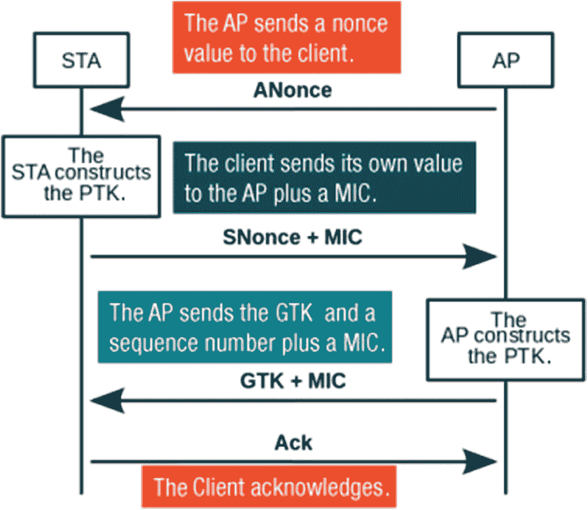

图 12-2

四次握手

## 入侵无线网络

运行 Network Stumbler、被动扫描仪(Kismet 或 KisMAC)或主动信标扫描仪(MacStumbler 或 iStumbler)的笔记本电脑可用于入侵无线网络。Network Stumbler 或 Kismet 会告诉攻击者网络是如何加密的。

## 流氓接入点

未经授权的接入点可以允许任何拥有无线设备的人进入网络。接入点可以通过进入隐形模式来隐藏。像 Network Stumbler 这样的主动扫描器检测不到伪装的接入点。需要被动扫描器来检测隐藏的接入点。用于定位接入点的方法包括请求信标和嗅探空气。可用于隐藏接入点的工具包括 Fakeap、Network Stumbler 和 MiniStumbler。

## ipconfig 命令

无线网卡很可能处于管理模式，这是无线网卡的标准操作模式。使用`iwconfig`，可以将卡置于监控模式。如果在监控模式下操作无线网卡，您可以捕获网卡范围内的所有无线流量。见图 [12-3](#Fig3) 和 [12-4](#Fig4) 。

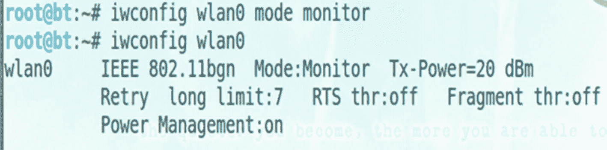

图 12-4

监控模式

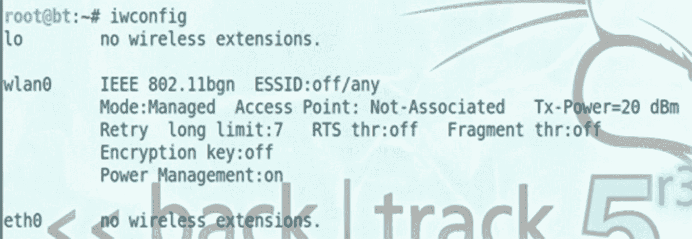

图 12-3

托管代码

## Airodump -ng 命令

如果程序正在运行，MAC 地址和 AP 名称将显示在顶部窗格中(图 [12-5](#Fig5) )。底部窗格显示 AP 的 MAC 地址和站点的 MAC 地址(图 [12-6](#Fig6) )。

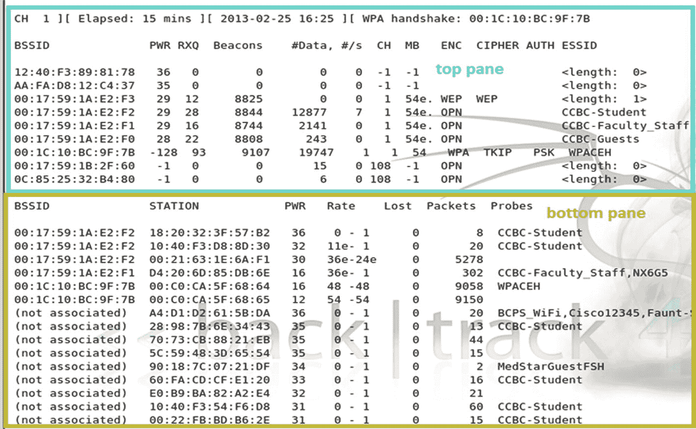

图 12-6

AP 和 MAC 的 MAC 地址

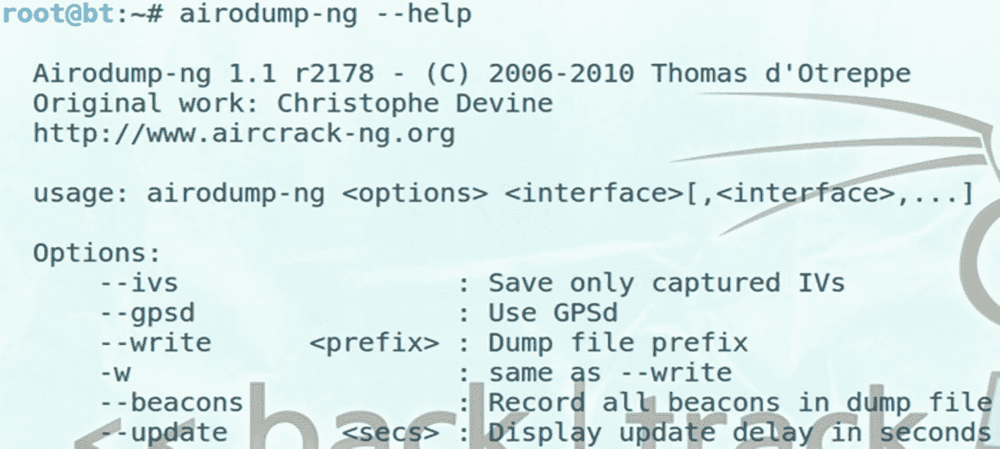

图 12-5

MAC 地址和 AP 名称

## 空中播放命令

`Aireplay-ng`是另一个用于无线目的的命令。该命令用于对 WEP 破解或解除身份验证攻击执行重放攻击。在 WEP 和 WPA 攻击过程中，可以使用取消身份验证攻击将客户端从网络中删除。并非所有卡都支持取消身份验证功能。见图 [12-7](#Fig7) 和 [12-8](#Fig8) 。

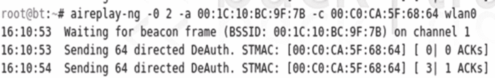

图 12-8

在取消身份验证攻击中使用的 air play–ng 命令

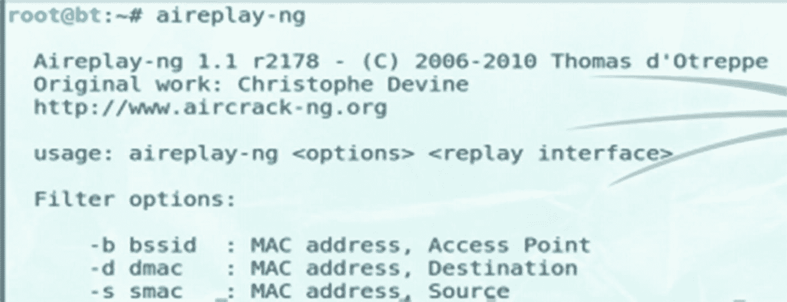

图 12-7

空中播放命令

## 监控不安全的无线局域网

使用不安全的无线网络会带来巨大的安全风险。如果有人使用无线网卡在监控模式下工作，所有进出接入点的流量都会被捕获。这包括查看 DNS 请求、查看 HTTP 流量以及从无线捕获流量中检索图像的能力。参见图 [12-9](#Fig9) 和 [12-10](#Fig10) 。正因为如此，使用加密的无线网络是一个很好的实践，比如 WEP、WPA 或 WPA2。

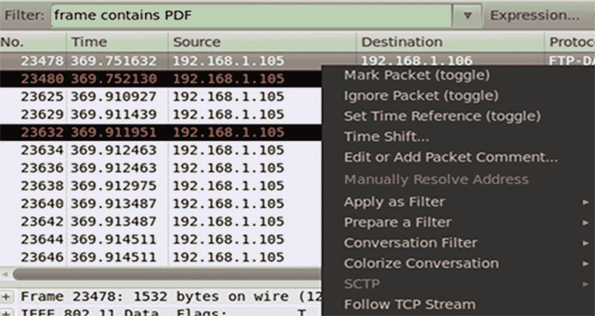

图 12-10

跟随 TCP 流

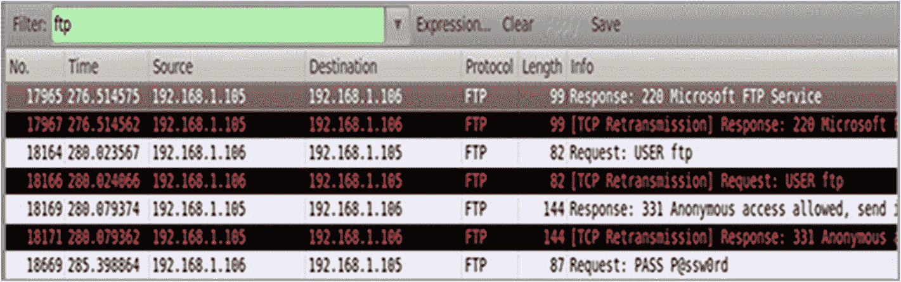

图 12-9

FTP 流量捕获

## 使用空调–天然气

获得 WEP 密钥后(图 [12-11a](#Fig11) 和 [12-11b](#Fig12) ，就可以用`aridecap-ng`解密网络流量了。

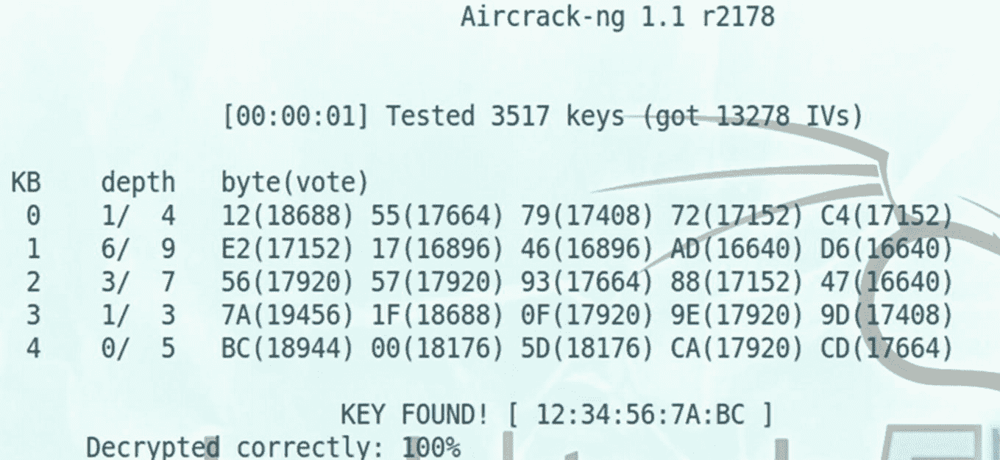

图 12-11b

使用 aircrack-ng 解密

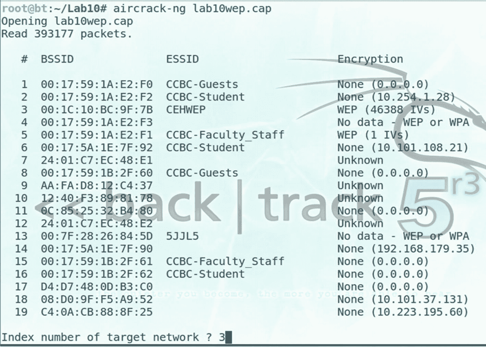

图 12-11a

使用 aircrack-ng 解密

## 摘要

随着使用无线局域网的组织数量的增加，危及网络的风险也在增加。在本章中，您复习了各种类型的无线网络、身份验证方法和无线加密。由于与使用无线局域网相关的问题，您了解了提高安全性对保护系统的重要性。

## 资源

*   RC4: [`www.geeksforgeeks.org/rc4-encryption-algorithm/`](http://www.geeksforgeeks.org/rc4-encryption-algorithm/)