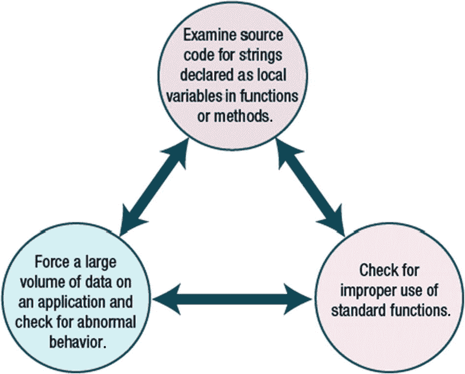

# 十四、缓冲区溢出

当漏洞存在时，黑客可以利用计算机网络中的缺陷。负责组织网络保护的人员必须修补易受攻击的系统。关闭系统上运行的非必要服务也是一个很好的做法。如果系统没有得到适当的管理或保护，它们就可能被黑客利用。在侵入远程系统后，攻击者可以通过设置帐户以及从网络中捕获和过滤信息来采取措施进行巩固。在本章中，您将仔细研究缓冲区溢出和缓冲区溢出对策。

本章结束时，您将能够

1.  定义缓冲区溢出。

2.  识别缓冲区溢出。

3.  识别缓冲区溢出对策。

## 缓冲区溢出

如果攻击者能够找到将任意代码发送到目标系统并让该系统执行代码的方法，攻击者就可以获得对系统及其资源的访问权限。连续的内存块用于存储数据，当复制到缓冲区的数据超过缓冲区的大小时，就会发生缓冲区溢出。漏洞是由人为错误造成的，如开发人员的编程错误、包含错误的编程语言以及没有遵循良好的编程实践。许多程序被设计成允许输入。输入字段可用于向系统发送任意代码。

## 堆栈缓冲区溢出

当程序向堆栈上的缓冲区写入的数据比预期的多时，就会导致堆栈缓冲区溢出。这会导致数据损坏。欲了解更多信息，请访问**堆栈缓冲区溢出** ( [`https://blog.rapid7.com/2019/02/19/stack-based-buffer-overflow-attacks-what-you-need-to-know/`](https://blog.rapid7.com/2019/02/19/stack-based-buffer-overflow-attacks-what-you-need-to-know/) `).`

## 基于堆的缓冲区溢出

堆上的内存由应用程序动态分配。很多时候，程序数据包含在堆中。如果攻击者可以破坏这些数据，攻击者就可以使应用程序覆盖内部结构。更多信息，请访问**基于堆的缓冲区溢出** `(` [`https://cwe.mitre.org/data/definitions/122.html`](https://cwe.mitre.org/data/definitions/122.html) `).`

## 检测缓冲区溢出漏洞

用 C 编写的程序更容易出现缓冲区溢出。标准 C 库提供了许多不执行任何边界检查的函数。

攻击者寻找在函数中声明为局部变量的字符串，并验证边界检查的存在或源代码中安全 C 函数的使用。要检测缓冲区溢出漏洞，您可以检查源代码中声明为函数或方法中的局部变量的字符串，检查标准函数的不当使用，以及在应用程序上强制大量数据并检查异常行为。见图 [14-1](#Fig1) 。

图 14-1

检测缓冲区溢出漏洞

## 防御缓冲区溢出

应用程序开发人员可以做几件事来消除缓冲区溢出，包括对代码进行手动审核、禁用堆栈执行、使用编译器技术以及开发更安全的 C 库支持。

## Nmap(消歧义)

Nmap 是免费的，可以在各种平台上运行，比如微软的 Windows、Mac OS X 和 Linux。它可用于评估网络上的主机，然后识别远程系统运行传输控制协议(TCP)和用户数据报协议(UDP)的端口。要确定远程机器运行的是什么操作系统，您还可以执行操作系统扫描。nmap 给出的操作系统扫描结果通常可能是不确定的，这要求攻击者使用其他技术来准确确定远程操作系统。

Ping 扫描结果显示 192.168.100.0/24 网络中有五台主机处于运行状态。但是，可能有其他主机激活了防火墙，或者没有响应来自 Internet 控制消息协议(ICMP)的请求。见图 [14-2](#Fig2) 。

图 14-2

Nmap(消歧义)

## TCP 扫描

这些端口在连接到互联网的机器上很少可用，但在连接到局域网的 Windows 机器上通常是开放的。在图 [14-3](#Fig3) 的特殊情况下，这些端口是可用的，因为 Windows 2008 服务器管理员在`C:`驱动器上共享了一个名为`share`的文件夹。通常，这些端口在 Windows 系统上是开放的，并且与 Microsoft Windows 的文件和打印共享相关。

图 14-3

TCP 扫描

## 操作系统的指纹

使用 nmap 的扫描提供了不确定的结果(图 [14-4](#Fig4) )。它说操作系统可能是

图 14-4

操作系统指纹

*   微软 Windows 7 专业版

*   微软视窗 Vista SP0 或 SP1

*   Windows Server 2008 SP1 版

*   Windows 7

*   微软视窗 Vista SP2

*   Windows 服务器 2008

## 使用 Metasploit 进行指纹识别

您需要更准确地了解目标计算机运行的是什么操作系统。如果您使用 Metasploit 辅助扫描模块之一，您可以获得更好的结果。见图 [14-5](#Fig5) 。

图 14-5

Metasploit 辅助扫描

使用`show options`命令查看辅助扫描模块的选项。见图 [14-6](#Fig6) 。

图 14-6

显示选项

设置 RHOSTS 后，运行扫描来确定远程机器的操作系统。见图 [14-7](#Fig7) 。

图 14-7

罗斯特

该操作系统被识别为不带 Hyper-V Service Pack 1 的 Windows 2008 标准版。见图 [14-8](#Fig8) 。

图 14-8

不带 Hyper-V Service Pack 1 的 Windows 2008 标准版

## 搜索漏洞

在我们回顾搜索结果时，最后提到了这些漏洞。利用漏洞的名称在 Metasploit 中，还有发布日期、利用漏洞的有效性以及利用漏洞影响的漏洞的概述。由于 Server 2008 于 2008 年推出，我们将寻找 2008 年或更晚出现的漏洞。参见图 [14-9](#Fig9) 。

图 14-9

使用 Metasploit 搜索

## 水表读数器

Meterpreter 是一种高级 Metasploit 有效负载，可让攻击者在攻击得逞后转储哈希、下载数据和执行特定任务。参见图 10-10。一旦散列被转储，诸如开膛手约翰这样的工具可以被用来破解密码。

图 14-10

水表读数器

## 摘要

在本章中，您了解了缓冲区溢出，以及黑客如何利用计算机系统中可能存在的漏洞。您熟悉了入侵检测技术和各种类型的入侵检测系统和防火墙。此外，您还了解了为了识别内部网络上的攻击，应该寻找什么。

## 资源

*   **堆栈缓冲区溢出:** [`https://blog.rapid7.com/2019/02/19/stack-based-buffer-overflow-attacks-what-you-need-to-know/`](https://blog.rapid7.com/2019/02/19/stack-based-buffer-overflow-attacks-what-you-need-to-know/)

*   **基于堆的缓冲区溢出:** [`https://cwe.mitre.org/data/definitions/122.html`](https://cwe.mitre.org/data/definitions/122.html)