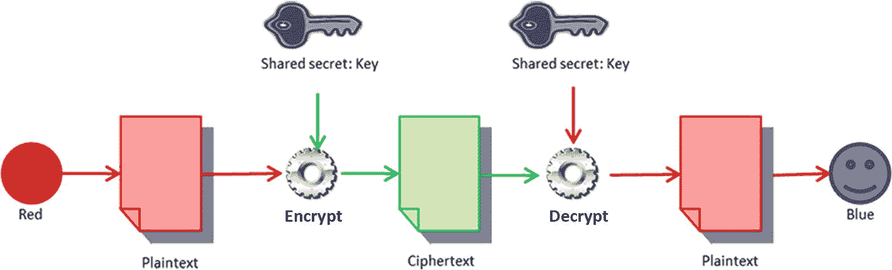
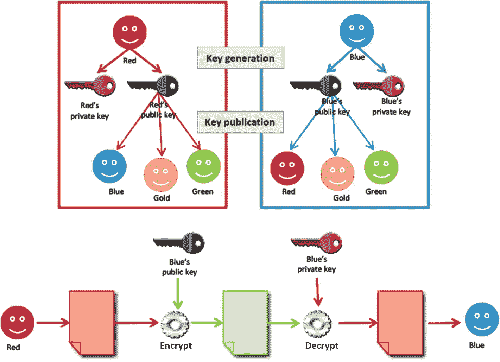
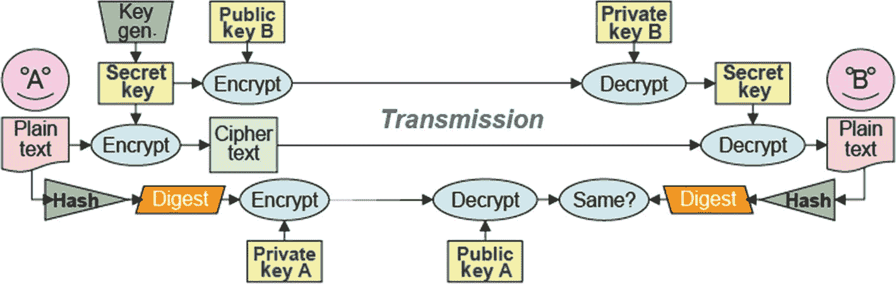
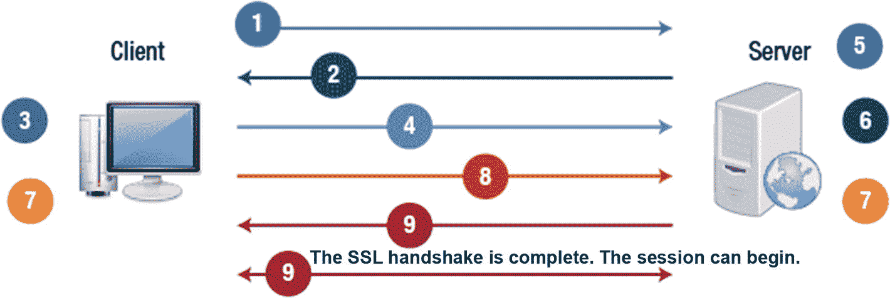
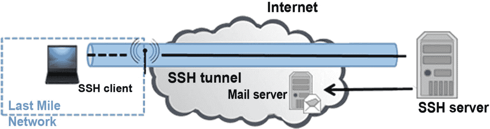
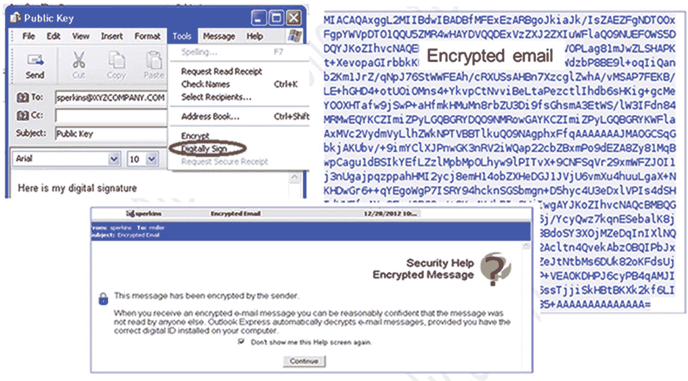

# 十五、密码系统

密码术是一种技术，采用简单、清晰的文本，并对其实现算法以加密它来产生密文，密文在被解密之前似乎是乱码。为了保密，使用了加密。

在本章中，您将了解目前使用的加密算法，以及如何应用加密来维护三个安全原则中的两个，即机密性和完整性。您将了解公钥加密、数字签名以及如何检查加密的电子邮件。

本章结束时，您将能够

1.  认识公钥加密。

2.  识别数字签名。

3.  定义消息摘要。

4.  定义安全套接字层(SSL)。

5.  分析加密邮件。

## 对称加密

即使对于最古老的密码，持有相同的密钥也是基础。双方都需要知道在移位密码中被执行的移位的方向和数量。

所有对称算法，包括不可破解的一次一密法，都是基于这个共享秘密的概念。如前所述，这些方法的挑战是用于密钥管理的框架。见图 [15-1](#Fig1) 。

图 15-1

用于加密和解密的加密公钥和私钥

## 对称算法

您应该熟悉各种对称算法及其主要特征。表 [15-1](#Tab1) 中列出的大多数算法都是分组密码，这意味着它们通过固定的、不变的变换对固定长度的比特组进行操作。如果明文消息的长度不是块长度的倍数，则必须填充明文消息。流密码将密钥和算法应用于数据流中的每个二进制数字，并且可以加密可变长度的明文消息。

表 15-1

对称算法

| 

对称算法

 | 

主要特征

 |
| --- | --- |
| 是吗 | 块大小为 64，密钥长度为 56 位的分组密码 |
| 3 个(共 3 个) | 使用两个或三个密钥，并涉及多次加密，这些加密要经过 DES 算法三次 |
| 俄歇电子能谱 | 一种分组密码，将数据输入分成 128、192 或 256 位的块。密钥大小为 128、192 和 256 位，密钥大小影响算法中使用的轮数 |
| 投 | 对 64 位和 128 位密钥使用 64 位的块大小(对 256 位密钥版本使用 128 位的块大小) |
| RC6 | 在 32 位计算机上运行良好，可以抵抗暴力攻击(128 位块大小，密钥大小:128、192 和 256) |
| RC4 | 使用 8 到 2048 位密钥长度的流密码，最容易受到弱密钥的影响 |
| 河豚 | 块模式密码，使用 64 位块和 32 到 448 位的可变密钥长度。在 32 位机器上，它运行良好。 |
| 想法 | 使用 64 位块大小和 128 位密钥的块模式密码 |

## 不对称加密

不对称加密也称为公钥加密。这种方法依赖于一对密钥——公钥和私钥。这两个密钥在数学上是相关的，但是你不能仅仅因为知道某人的公钥就知道私钥。

生成一个密钥对。公钥被发布到第三方服务器，其他人将能够访问它。用户的私钥与用户在一起(例如，在软件应用程序中)。一个密钥锁定明文或对其加密，另一个密钥解锁密文或对其解密。没有一个键能够单独执行这两个功能。在不损害安全性的情况下，公钥可以被公布，而私钥不能透露给不允许阅读消息的人。

例如，假设您需要向 Blue 发送一条加密消息。你使用 Blue 的公钥(通过第三方服务器访问)加密消息，然后发送给他们。Blue 使用他们的私钥解密消息。即使 Green 截获了消息，他们也无法解密消息，即使他们也可以访问 Blue 的公钥。参见图 [15-2](#Fig2) 中的图示。

图 15-2

如何根据上面的例子加密消息

## 不对称算法

表 [15-2](#Tab2) 中列出了几种不对称算法及其应用方式。

表 15-2

不对称算法

| 

不对称算法

 | 

主要特征

 |
| --- | --- |
| 南非共和国(Republic of South Africa) | 用于加密和数字签名，也使用两个非常大的质数的乘积(长度在 100 到 200 位之间，长度相等) |
| 迪夫-赫尔曼 | 安全套接字层(SSL)协议的一种电子密钥交换方法，支持共享密钥 |
| 签名体制 | 免费使用(从未申请专利),被用作美国政府的数字签名标准 |
| 椭圆曲线加密(ECC) | 基于椭圆曲线工作 |

## 哈希函数

哈希函数用于确保消息或数据没有改变。换句话说，我们谈论的是保持诚信。如果您从互联网上下载一个程序，您可能会看到一个消息摘要值是使用特定的哈希算法标注的。下载文件后，对该文件使用哈希计算器。您的结果应该与网站上提供的值完全匹配。如果值不相同，则意味着文件已经以某种方式被篡改。

## 哈希算法

两种广泛使用的哈希算法是 SHA 和消息摘要。互联网上还有许多工具可以用来计算文件或字符串的哈希值。

*   **SHA:** 对 SHA 算法输入的数据应用压缩函数。它可以占用多达 264 位，然后将其压缩到更低的位数(即，SHA-1 为 160 位)。较长的版本被认为是 SHA-2 (SHA-256、SHA-384 和 SHA-512)。较长的散列结果意味着成功攻击要困难得多。

*   **消息摘要(MD):** MD5 是一种消息摘要算法，它为任意长度的消息生成 128 位哈希，并将消息分成 512 位的块。

## 加密算法使用:保密性

对于存储的数据和传输的数据，保持机密性通常是至关重要的。在这两种情况下，对称加密都是优选的，这是因为它的速度快，还因为被加密的对象的大小会由于某些非对称算法而大大增加。

对于存储的项目，公钥通常是不必要的，因为该项目的加密是为了防止其他人的访问。对于传输的数据，公钥加密通常用于交换密钥，对称加密则用于保持传输数据的机密性。

非对称加密保持机密性，但是它的大小和速度使它更容易保护小单元的机密性，例如电子密钥交换。在所有情况下，算法的复杂性和密钥的长度确保了所讨论数据的机密性。

存储或传输的数据的机密性通过使用加密算法来创建和维护。保持完整性是邮件安全性不可或缺的一部分。哈希函数确定消息的摘要，这确保了消息的完整性。此外，消息的发送者不能再否认他们发送了在电子数据交换中具有重要意义的消息。最后，身份验证使人们能够证明他们是他们所声称的人。

## 加密算法使用:数字签名

哈希函数和非对称加密是数字签名的基础。在签署数字文档时，这两个加密因素都起着至关重要的作用。对于任何人来说，更改未受保护的数字文档确实很方便。重要的是，如果有人在文件上签字后对其进行了修改，则任何更改都可以被识别出来。散列函数用于构建消息的摘要，该摘要是唯一的并且容易被各方复制，以防止文档编辑。这保证了消息的完整性。见图 [15-3](#Fig3) 。

图 15-3

用于创建数字签名的哈希函数和非对称加密

当涉及到在线交易时，数字签名可以提供不可否认性，这对于确保合同或通信的一方首先不能拒绝他们在纸上签名的真实性是很重要的。在这种意义上，不可否认性与确保合同的一方必须承认他们在纸上签名的真实性的能力有关。

## 安全套接字层(SSL)

安全套接字层(SSL)管理通过互联网传输的信息的加密。SSL 使用不对称和对称身份验证机制，并负责执行 SSL 握手。该过程从客户端请求安全连接和服务器响应开始。双方需要就一项被广泛接受的协议达成一致。

## SSL 握手

在 SSL 会话开始时，执行 SSL 握手，设置会话的加密参数。

1.  客户端将其 SSL 版本号、密码设置和特定于会话的数据发送到服务器。

2.  服务器发送相同的以及它自己的证书。如果请求的资源需要客户端身份验证，则服务器会请求客户端的证书。

3.  客户端使用收到的信息进行身份验证。

4.  客户端用服务器的公钥加密一个种子值，并将其发送给服务器。如果服务器请求客户端身份验证，客户端也会发送客户端证书。

5.  如果服务器请求客户端身份验证，服务器会尝试对客户端证书进行身份验证。

6.  服务器使用其私钥来解密秘密，然后生成主秘密。

7.  客户端和服务器都使用主密钥来生成会话密钥，即对称密钥。

8.  客户端通知服务器未来的消息将使用会话密钥加密。

9.  服务器通知客户端相同的信息。

图 [15-4](#Fig4) 说明了上面列出的步骤。客户端或服务器端的步骤代表各自采取的行动。箭头还包括上面列出的每个步骤的编号，以显示发生 SSL 握手时客户端和服务器如何交互。

图 15-4

SSL 握手过程

## 安全外壳(SSH)

SSH 是不安全的 Telnet 应用程序的安全替代方案。Telnet 使用户能够在系统之间进行连接。尽管 Telnet 仍在使用，但它有一些缺点。

SSH 使用 SSH 守护进程在两端的机器之间打开一个受保护的传输通道。这些守护程序通过 TCP 端口 22 发起联系，然后通过更高的端口以安全模式进行通信。SSH 的优势之一是它支持几种不同的加密协议。

SSH 协议提供了自动数据加密、认证和数据压缩等功能。该协议旨在实现灵活性和简单性，并明确设计为减少系统之间的往返次数。在连接时，密钥交换、公钥、对称密钥、消息验证和哈希算法都要经过协商。通过使用根据共享秘密、分组内容和分组序列号确定的消息认证码来确保单个数据分组的机密性。见图 [15-5](#Fig5) 。

图 15-5

使用 SSH 的远程访问协议

## 加密应用

相当好的隐私(PGP)应用程序可以整合到常见的电子邮件程序中，通过利用对称和非对称加密协议的组合来执行大多数日常加密任务。

PGP 的一个与众不同的特性是它可以同时使用对称和非对称加密方法，利用每种方法的优点，同时避免每种方法的缺点。对称密钥用于批量加密，受益于对称加密的效率和速度。对称密钥通过非对称方法传递，利用了这种方法的灵活性。

用于加密数据的加密应用程序如下:

*   TrueCrypt 是一个开源的加密解决方案。它用于基于对称磁盘的文件加密。它包括 AES 密码和构建可拒绝卷的能力，加密存储在加密中，可防止卷检测。TrueCrypt 可以进行文件加密和整盘加密。计算机的整个硬盘驱动器以及操作系统都通过全磁盘加密进行加密。

*   FreeOTFE 就像 TrueCrypt 一样。作为一个开源的、可自由访问的程序，它提供了动态磁盘加密。它可以用几种常见的加密算法，比如 AES，对整个磁盘的文件进行加密。

*   Gnu Privacy Guard (GnuPG)是相当好的隐私(OpenPGP)规范的开源实现。这是一个公钥加密程序，旨在保护电子邮件等电子通信的安全。它的工作方式与 PGP 相同，并提供了一种管理公钥/私钥的方法。文件系统加密已成为保护存储数据的标准手段。甚至内置 AES 加密的硬盘也可以使用。

*   **BitLocker**T2。微软推出了 BitLocker 及其加密文件系统(EFS)。这是一种引导扇区加密方法，有助于保护最新 Windows 操作系统上的数据。BitLocker 使用 AES 加密来自动加密硬盘上的所有文件。所有加密都在后台进行，当需要数据时，解密可以顺利进行。您可以将解密密钥存储在 TPM 或 USB 密钥中。

## 对密码学的攻击

不对称加密也称为公钥加密。这种方法依赖于一对密钥——公钥和私钥。这两个密钥在数学上是相关的，但是你不能仅仅因为知道某人的公钥就知道私钥。

该过程从生成密钥对开始。公钥被发布到第三方服务器，其他人将能够访问它。用户的私钥与用户在一起(例如，在软件应用程序中)。一个密钥锁定明文或对其加密，另一个密钥解锁密文或对其解密。没有一个键能够单独执行这两个功能。在不损害安全性的情况下，公钥可以被公布，而私钥不能透露给不允许阅读消息的人。

例如，假设您需要给 Jane 发送一条加密消息。您使用 Jane 的公钥(通过第三方服务器访问)对消息进行加密，然后发送给她。简用她的私钥解密这条消息。如果 Karl 截获了该消息，即使他也可以使用 Jane 的公钥，他也无法解密该消息。

了解已知的针对加密技术的不同类型的攻击是很重要的。使用 Wireshark 和 tcpdump 会发生被动攻击。主动攻击涉及生日攻击、数学攻击和中间人的使用。高级攻击包括使用密码分析、暴力攻击和模式分析。

## 加密电子邮件

为了加密消息，使用公钥。通过对电子邮件进行数字签名，用户可以将他们的公钥发送给其他用户。然后，用户可以使用发送方给他们的公钥来加密发送给该发送方的消息。见图 [15-6](#Fig6) 。

图 15-6

如何从工具下拉菜单中选择数字签名选项。安全帮助加密邮件告知邮件已被发件人加密

## 摘要

在本章中，您了解了加密是一个过程，用于获取普通可读文本并对其应用算法，加密它以创建密文。在解密之前，这个密文是不可读的。您回顾了加密算法、如何应用加密来确保机密性和完整性、密钥加密、数字签名以及如何分析加密的电子邮件。