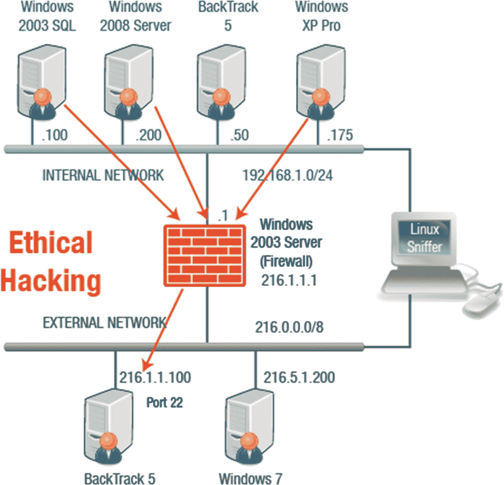
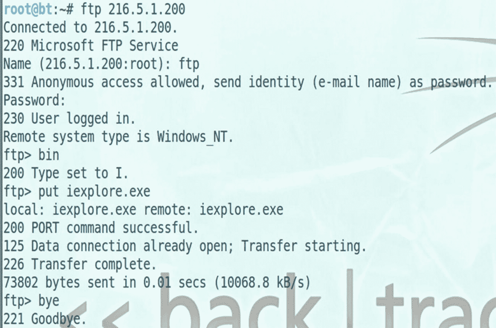

# 十六、渗透测试

在本章中，您将了解安全评估、渗透测试、风险管理和各种测试工具。

本章结束时，您将能够

1.  身份安全评估。

2.  确定渗透测试的步骤。

3.  检查风险管理。

4.  识别各种渗透测试工具。

## 渗透测试概述

*渗透测试*，也被称为*笔测试*，用于模拟攻击者用来获得对网络的未授权访问并危害系统的方法。渗透测试被认为是一种安全评估。

每种类型的评估都有其目的，了解它们之间的差异非常重要。渗透测试评估网络的安全模型，可以帮助管理员和管理层了解攻击的潜在后果。

## 安全评估

安全评估包括使用安全审计、漏洞评估和渗透测试来验证网络资源安全级别的过程。

*   **安全审计:**安全审计主要关注用于设计、实现和管理网络安全的人员和流程。国家标准与技术研究所(NIST)有几个专门的出版物可以用作指南—SP 800-53 用于安全控制的规范，SP 800-53A 用于安全控制有效性的评估。更多信息，请访问**国家标准与技术研究院** ( [`www.nist.gov/`](http://www.nist.gov/) `)`)。

*   **漏洞评估:**漏洞评估扫描网络中已知的安全弱点。漏洞扫描工具将计算机与软件供应商提供的通用漏洞和暴露(CVE)索引和安全公告进行比较。CVE 是一个供应商中立的已报告安全漏洞列表，并且是经过维护的。详情请访问 **CVE 网站** ( [`http://cve.mitre.org/`](http://cve.mitre.org/) `)`)。

在域管理员的安全上下文中运行的漏洞扫描软件将返回与在经过身份验证的用户的上下文中运行不同的结果。

*   渗透测试:渗透测试比漏洞扫描更进了一步，因为它不仅会指出漏洞，还会记录攻击者如何利用漏洞以及如何升级小漏洞。

## 渗透测试的阶段

外部测试可以是黑盒(零知识测试)、灰盒(部分知识测试)或白盒(完全知识测试)。内部测试可用于拥有可用资源的组织。如果内部专业知识不足，建议外包。

对于自动化测试，组织依赖于安全公司。手动测试需要安全专家的专业知识，并且可能是从潜在黑客的角度进行的。

1.  **计划阶段:**在计划阶段，确定规则，设定测试目标。关于目标的信息是在预攻击阶段收集的。收集的信息将构成攻击策略的基础。攻击后，测试人员需要将网络恢复到原始状态。

pen 测试是一种枚举设备，可能会导致系统意外崩溃、数据被破坏或性能受到影响。应正确评估客户风险。在规划阶段起作用的主要因素是客户风险。由于 pen 测试的固有风险，管理层可能希望首先确认测试机构是否有专业责任保险。在规划阶段还需要考虑一些依赖因素。某些步骤需要在其他步骤之前执行。

1.  **预攻击阶段:**预攻击阶段包括识别威胁，以帮助进行风险评估并计算威胁的相对严重性。威胁的业务影响可以分为高、中或低。内部指标使用组织内部可用的数据来评估攻击风险，而外部指标则来自于从组织外部收集的数据。为利用的成功分配概率值允许计算相对危险度。在这个阶段，测试团队将收集尽可能多的关于目标公司的信息。有许多方法可以检索信息，正如所详述的。

2.  **攻击阶段:**攻击阶段涉及目标的实际危害，可能通过利用在预攻击阶段发现的漏洞或使用安全漏洞(如薄弱的安全策略)来获取访问权限。

3.  **攻击后阶段:**测试人员负责将任何系统恢复到测试前状态。请记住，pen 测试的目的是显示安全问题存在的地方，而不是纠正问题。

## 文件

报告详细描述了测试过程中发生的事件以及测试人员执行的活动范围。三种类型的报告可用于文档目的，它们是渗透测试报告、故障树(攻击树)和差距分析。

*   **渗透测试报告**强调发生的事件和活动范围。

*   **故障树** **和** **攻击树**指定根事件并识别与根相关的事件。攻击树特别关注谁，什么时候，为什么，如何，和什么。

*   **差距分析**评估一个组织想要达到的目标和它目前所处的位置之间的差距。外部标准可用作差距分析的一部分，以提供关于组织如何缩小差距的建议。

## 创建有效负载

您可以使用 Metasploit 构建有效负载，当受害者运行它们时，它会连接到攻击者的机器。可以创建 Windows、Linux 和 Mac OS X 操作系统的有效负载。创建有效负载时，您可以定义攻击者的端口号、IP 地址或完全限定的域名(FQDN)和有效负载类型，如 meterpreter 或 Windows 命令外壳。

如果 Windows 用户启动可执行文件，他们的机器将连接到 216.6.1.100 的端口 22(图 16-1 )。为此，攻击者机器需要监听该端口。

图 16-1

网络攻击 1

## 利用受害者机器

创建 MSF 有效负载后，通过 FTP 传输`iexplore.exe`文件。攻击者可以使用 SQL 注入为 FTP 构建应答文件，从而允许他们通过存储过程 xp_cmd shell 上传文件。如果上传的文件是一个 meterpreter 负载，也可以通过 xp_cmd shell 操作它，在攻击者和受害者之间创建一个 meterpreter 会话。见图 16-2 和 16-3 。

图 16-3

运行漏洞利用

图 16-2

FTP 会话

## 摘要

在这一章中，你学习了渗透测试。您了解了安全评估需要什么以及风险管理涉及什么。本章还强调了可以用来进行渗透测试的工具。

## 资源

*   **国家标准技术研究院(NIST):** [`www.nist.gov/`](http://www.nist.gov/)

*   **CVE:**T3`http://cve.mitre.org/`T4】