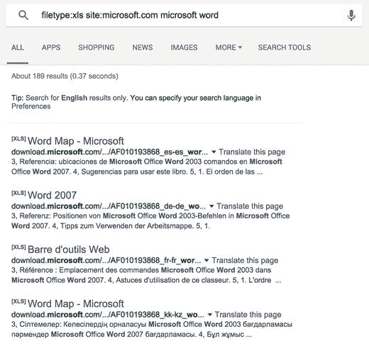
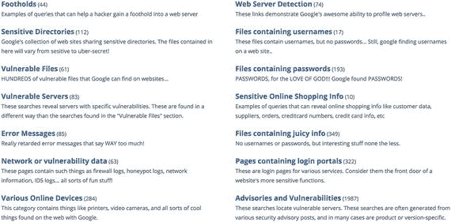
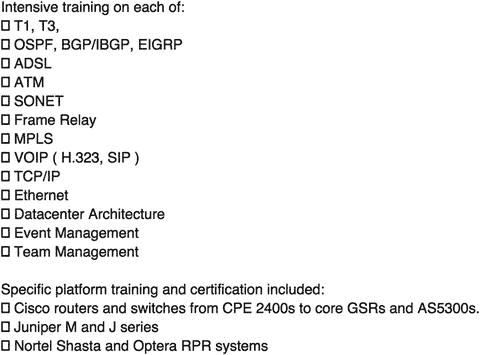
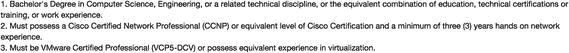
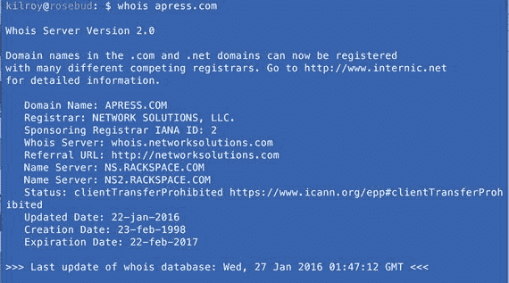
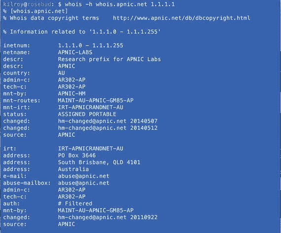

# 二、挖掘信息

我们征服系统的第一步是挖掘目标的信息。幸运的是，在我们生活的这个互联时代，如果你知道如何以及在哪里寻找，有很多信息可以在网上的某个地方找到。信息的容易获得意味着有很多信息是容易获得的。当然，所有这些容易获取的信息都存在隐私问题，但目前我们并不关心隐私。事实上，我们将感谢自由流动的信息，你会发现你可以访问，而不必诉诸任何诡计，欺骗，或违反法律。甚至没有任何潜在的违法行为。在信息变得如此自由和容易获得之前，你可能知道翻垃圾箱和其他获取信息方式的故事。这种策略几乎完全没有必要。

首先，你有谷歌。除了可以通过谷歌获得难以置信的海量信息之外，还有很多技术可以用来改进你的搜索。谷歌提供了多种方法，可以非常准确地找到你要找的信息，这样你就不会费力地浏览大量页面，只为了找到你要找的那一条信息。在你寻找针的时候，你可以把它想象成一个自动干草过滤器。虽然谷歌黑客，如其名，非常强大，但它并不完美。你可能仍然需要做大量的手工过滤和阅读。

除了谷歌，还有很多网站可以用来收集目标的信息。社交网站通常是获取信息的好地方，当然工作网站也是很好的信息库，尤其是在收集你的目标的技术信息时。根据你正在工作的公司的了解程度，你可能会找到大量的信息，这些信息也存储在非常公开的地方。

虽然互联网大部分是分散的，但也有一些情况下存在中央信息库。这些存储库被称为区域互联网注册中心(rir)，它们在获取企业信息方面非常有用。这可能包括有关分配给企业的域名注册和 IP 地址的信息。一般来说，这是公开信息，尽管一些细节，特别是与域名注册相关的细节可能会被掩盖。不过，说到 IP 地址，都是公开的。挖掘这些存储库有时会发现有用的信息，包括联系数据。

使用所有这些网站和策略的组合，你将能够收集关于你的目标的大量信息。

## 谷歌黑客

谷歌黑客这个词听起来非常酷，在某些方面确实如此，其应用远远超出了我们所谈论的范围。然而，尽管名字如此，这绝不是对谷歌的攻击。相反，这是一种使用谷歌在其搜索引擎中实现的大量关键词的方式，以帮助您获得尽可能窄的结果。从你的搜索中返回 1589341 页的日子已经一去不复返了。相反，你可以通过不同类型的搜索得到非常非常具体的信息。这被称为谷歌黑客，但实际上，其他搜索引擎已经实现了许多相同的关键字。如果你真的喜欢另一个搜索引擎，而不是谷歌，你应该试试这些，看看他们是否在那里工作。表 [2-1](#Tab1) 显示了谷歌引入的允许你缩小搜索范围的关键词。

表 2-1。

Google Hacking Keywords

| 操作员 | 描述 |
| --- | --- |
| 给予称号 | 在标题中查找搜索词 |
| 第七 | 仅在标题中查找搜索词，而不在文档的其他地方查找 |
| 伊努埃尔 | 在 URL(地址)中查找搜索词 |
| 阿力努勒 | 类似于 allintitle，只在 URL 中查找搜索项 |
| 螺纹类型 | 您提供文件类型和搜索条件。所有结果都具有该文件类型。 |
| allintext | 搜索将不会看网址，只是在文本中。 |
| 位置 | 把你的搜索范围缩小到一个特定的网站。你必须提供网站以及搜索词。 |
| 环 | 搜索指向页面的链接 |
| 金融家 | 此搜索将只在锚定标签中查找 |
| numrange(数字范围) | 搜索数字 |
| 日期范围 | 结果将在指定的日期范围内 |
| 作者 | 在谷歌群中搜索特定作者。这只适用于谷歌群组。 |
| 组 | 查找组名。这只适用于谷歌群组。 |
| 在主体中 | 搜索帖子中的主题行。这只适用于谷歌群组。 |
| msgid | 在组内搜索消息 ID。 |

谷歌不仅仅是网页搜索引擎。它还用于搜索图像、群组和新闻。谷歌托管群组，类似于邮件列表或旧的新闻组群组。它们可以只在网上使用，但也可以和电子邮件一起使用。此外，谷歌将允许你搜索新闻。这是一种获取谷歌定义的新闻信息来源集合的方式。如果你想知道某个突发事件，你可以搜索谷歌新闻来找到相关信息。

正如你可以从关键词中看到的，你可以开始真正缩小你的主题。作为一个例子，你可以在图 [2-1](#Fig1) 中看到一个搜索，该搜索旨在查找`microsoft.com`站点上所有包含 Microsoft Windows 字样的 Excel 电子表格。为了完成这个特定的搜索，我们使用了`filetype`和`site`关键字。

图 2-1。

Google hacking keywords

当然，除了微软网站上的一系列 Excel 电子表格之外，还有许多更有用的搜索可以让你获得更多有趣的信息。你可以寻找包含目录列表的网站。大多数网站应该关闭目录列表，因为管理员不希望您直接访问那里的所有文件。他们可能会使用一些作为背景文件，这些可能包括密码之类的东西。对于任何配置文件来说尤其如此。

对于服务器负责的每个站点，Web 服务器都有一个根目录或文件夹。从该 Web 服务器提供的所有页面都在该根目录或文件夹下。Web 服务器使用索引页，这意味着如果没有请求特定的页面，就会自动提供特定的页面。如果没有索引页，并且服务器配置为允许索引页，这种情况并不常见，服务器将显示目录中所有文件和文件夹的列表。

为了定位打开了目录列表的网站，我们转向使用另一个关键字`intitle`。当网站显示给定目录中的文件列表时，通常会在页面标题中加入“索引”字样。因此，如果我们使用`intitle`关键字并查找“Index of ”,我们应该会返回打开了目录列表的页面。您可以更进一步，寻找特定的文件类型。例如，如果目录列表中有一个`.txt`文件，这可能会引起特别的兴趣。这可能包括`robots.txt`文件，该文件可能包括 Web 管理员不希望搜索引擎查看的所有文件的列表。这样做的原因通常是这些文件中包含敏感信息，因此网站所有者不希望它们被轻易找到。

如果你发现自己在搜索有趣的东西时不知所措，你可以去谷歌黑客数据库(GHDB)。在撰写本文时，它位于 [`https://www.exploit-db.org/google-hacking-database/`](https://www.exploit-db.org/google-hacking-database/) ，尽管考虑到互联网的流动性，该 URL 可能会随着时间的推移而发生变化。找到它的最好方法是用谷歌快速搜索。谷歌黑客数据库是一个有趣的搜索库，可以用来找到各种各样的结果。在图 [2-2](#Fig2) 中，你可以看到可以找到的搜索类别。你可以做很多事情来寻找属于“物联网”的各种设备。你可以找到网络摄像头，寻找应用程序给出的特定错误信息，找到易受攻击的系统，并使用谷歌黑客进行许多其他非常有针对性的搜索。这是一个很好的起点，如果你的创造力有一点点被挖掘，你要去哪里进行搜索。

图 2-2。

Google Hacking Database categories

GHDB 包括了很多固定的搜索词，不用你自己想就能使用。当然，虽然数据库中有很多诱惑，但是请记住，您只是在与签订了服务合同的客户打交道。开始玩登录门户之类的东西，看看您可以用一些默认用户名和密码完成什么不仅是不道德的，而且如果它超出了您的参与范围或针对您无权访问的网站进行，也可能被视为非法。一如既往，小心行事。为客户工作时，添加`site:`关键词，在客户领域内专门寻找这些问题是很重要的。记住使用 site:关键字将你的搜索限制在你的客户范围内将有助于你远离麻烦。

当你将一些与谷歌黑客相关的技术与你从其他来源获得的信息结合起来时，你也许能够发现一些漏洞。一个很好的例子是，您可以在搜索词中使用`site` `:`标记，比如错误消息，来识别目标公司基础设施中的漏洞。对于 Web 应用程序来说尤其如此。易受攻击的 Web 应用程序通常会生成特定的错误消息。您可以在属于您的目标的网页中搜索错误消息的实例。“谷歌黑客”可以通过查看是否有错误出现在属于你的目标网站的抓取中来节省你的大量时间。

使用谷歌提供的关键词可以给你一些非常有针对性的结果。这些术语中的许多可以组合起来，使您的搜索变得非常强大。如果你有兴趣了解更多或者得到一些如何使你的谷歌搜索更有效的想法，谷歌黑客数据库是一个很好的资源。你可能还会发现，有些关键词在其他搜索网站上也适用。

## 网络社交

谷歌并不是唯一能获得大量有趣信息的地方。在社交网站上可以找到很多东西。如果你做一些明智的搜索，作为一个大的公共论坛，Twitter 可能真的很有帮助。如果你有一个特定的客户，进行如图 [2-3](#Fig3) 所示的搜索。这个特定的示例搜索很无聊，而不是寻找可能包含潜在可利用信息的东西。这本书的出版商只需演示这一过程。如果你正在与一家公司合作，你可能会发现他们张贴工作列表或参考他们正在寻找的特定技能。可能会有一些有用和有趣的帖子与他们内部正在进行的事情有关，任何这些信息都有可能在将来被使用。技术信息永远是黄金，就像他们参考的任何员工技能或与他们合作的任何供应商一样，但可能会有许多其他参考资料可用于以后的社会工程攻击。

图 2-3。

Twitter search results

Twitter 并不是唯一一个可以被搜索信息的社交网站。脸书是另一个这样的网站，虽然它有一系列的权限设置，这可能比 Twitter 更难找到信息。曾经有一个公共应用编程接口(API ),任何人都可以用它来查询脸书的信息。这已经被关闭了。为了得到任何感兴趣的东西，你必须有一个有适当权限的帐户。换句话说，如果你正在寻找一个特定人的帖子，而这些帖子被设置为只对朋友开放，你必须成为那个人的朋友才能获得信息。企业可能会公开帖子，但可用的 API 和信息远不如过去那样开放。虽然 API 通常只用于查询公开的帖子，但你可能会惊讶地发现，有多少帖子是由那些完全不懂的人公开的。几年前，一个年轻人自己写的网站`weknowwhatyouredoing.com`，收集了一些与吸毒和说你公司坏话有关的状态。他之所以能够做到这一点，是因为脸书发布了公共 API。该网站已不存在，因为公共 API 已不存在。

公共 API 不再存在的事实并不意味着你不能连接到脸书，自己浏览一下。脸书的好处是没人能看出你在偷偷摸摸。LinkedIn 就不能这么说了。LinkedIn 也是一个社交网站，但不像脸书那样主要是个人性质的，它更侧重于商业。随着时间的推移，LinkedIn 增加了其他社交网站的各种功能，包括状态更新。这些状态更新可以提供许多有用的信息，有时包括带有一组简短要求的工作可用性。

与其他社交网站不同，LinkedIn 的一个缺点是，如果你访问某人的 LinkedIn 个人资料，他们会收到你访问过的通知。这可能是也可能不是你想要的。然而，LinkedIn 提供了丰富的信息。它或多或少是一个非常公开的来自世界各地的简历库。和简历一样，LinkedIn 的个人资料中包含了很多工作职责的详细信息，这些信息会在他们的工作经历中显示出来。如果您可以看到某人在某家公司工作的技术列表，您就可以确定该公司正在使用的基础架构的类型。你可以在图 [2-4](#Fig4) 中看到一个例子。这是一家公司的员工写的，该公司在网络中使用了 Juniper 和 Cisco 设备。他们还使用了北电的设备。从这个列表中，我们可以确定我们可以寻找漏洞的系统类型。这可能会为我们提供进入网络的途径。

图 2-4。

List of technologies from LinkedIn

LinkedIn 的伟大之处在于，与脸书等其他社交网站不同，信息是公开的。如果人们可以看到彼此和他们所做的事情，LinkedIn 的效果最好。这是寻找潜在雇主或了解更多潜在雇员、供应商或合作伙伴的好方法。这是一个很棒的网站，原因有很多。然而，在定位基础设施信息时，LinkedIn 并不是唯一的来源。任何工作地点都可以使用。在图 [2-5](#Fig5) 中，您可以看到一个未指定公司的安全工程师职位的一小部分工作列表。这份工作列表告诉我们，该公司在其网络中使用 Cisco，并且也与 VMWare 合作。这两个事实都可以在你寻找目标信息时使用。

图 2-5。

Job Listing

虽然这不能告诉我们很多，但这是一个起点。如果你能把它和你已经获得的其他信息放在一起，你可能会得到更多的关注。有时你可以利用各种来源的信息，以便更好地了解你的目标正在发生什么。你可以通过 LinkedIn 等网站从前雇员那里获得信息，他们可能会提供一份他们在雇主那里用过的供应商特定技能的清单。例如，这可能会告诉您目标使用的是 Palo Alto Networks 设备或 Cisco 设备。如果您发现前雇员任职后的工作列表显示了一套不同的设备，您可能会得出这样的结论:这是一个较新的部署，可能还没有解决所有的错误和配置设置，因此它可能是一个成熟的目标。当然，它也可以只是一个单独的位置，尽管在较大的公司中，他们可能会在所有站点使用相同的设备供应商，以实现统一性并节省批量购买的成本。为了确定你在处理什么，你必须在网络上做一些探索，但是你从工作网站上收集的这些信息作为一个起点可能是有价值的。

## 互联网注册中心

在互联网上有业务的公司必须在不同的地方登记信息。随着互联网的发展，存储这些信息的位置数量也在增加。当一个公司注册一个域名，比如`apress.com`，它必须提供存储在互联网名称与数字地址分配机构(ICANN)的联系信息。有许多注册服务商将为消费者提供接口并管理该接口，但所有捕获的数据只有一个存储库。幸运的是，有一个工具可以用来从这个存储库中收集信息。图 [2-6](#Fig6) 显示了工具`whois`在命令行的使用。您只需提供一个域名，whois 就会收集该域名的所有信息。这些数据库的问题是，它们长期以来被用来提取联系人，然后用于各种营销和垃圾邮件目的。因此，许多公司使用“私人”注册，这阻止了`whois`工具透露注册域名的人的联系信息。您将从 whois 查询中获得的信息表明联系信息是隐藏的，因此您不会有任何公司特定的信息。

图 2-6。

Whois request

即使您无法获得联系信息，您也可以从 whois 请求中获得其他信息，这些信息是不可拒绝或阻止的，例如该域名的注册商以及创建日期和该域名信息的最后更新日期。这远不如获取域名相关的名称、电话号码、地址和电子邮件地址有趣，但这是有意义的。您还可能会发现注册尚未转为私有的域名，因此您可能能够获得有关域名注册的其他信息。获取 whois 信息有多种方式，包括在任何类似 Unix 的操作系统上使用命令行 whois 程序，如 Linux 或 Mac OS X，如图 [2-6](#Fig6) 所示。您还可以在任何系统(包括移动设备)上使用 Web 界面。

除了负责域名注册之外，ICANN 还负责通过其下属的一个部门——互联网号码分配机构(IANA)分配互联网协议(IP)地址。IANA 管理 IP 地址和众所周知的端口(网络和电子邮件等众所周知的服务端口)的注册，以及其他事务。IANA 将网络地址块分配给地区互联网注册管理机构(rir)，包括美国互联网号码注册管理机构(ARIN)、欧洲网络研究机构(RIPE)、亚太网络信息中心(APNIC)、拉丁美洲网络信息中心(LACNIC)和非洲网络信息中心(AfriNIC)。每个注册管理机构都维护自己的信息数据库，这些信息表明谁拥有 IP 地址块，以及有关组织及其联系信息的信息。注册有着悠久的传统，如域名和 IP 地址块所有权，至少包括技术和管理联系。如果您使用`whois`查找 IP 地址，您将获得组织信息以及联系信息。担心内部信息泄露的公司通常会隐藏一般的联系信息。

即使在信息是一般性的情况下，您也可以从一个 IP 地址的 whois 查找中收集许多详细信息。在图 [2-7](#Fig7) 中，您可以看到一个针对 IP 地址的 whois 请求。在响应中，您可以看到一个 IP 地址所属的地址范围。您可以查看 IP 地址属于一个小块还是一个大得多的块。这将有助于你确定调查范围。你可能会得到一个单一的 IP 地址，或者你可能会发现一个单一的 IP 地址，如果你没有从你的目标提供更多的信息。得到完整的区块会给你其他的地址，你可以看看。这也将保护你不至于误戳另一个实际上不属于你正在合作的公司的 IP 地址。

图 2-7。

Whois request on an IP address

遗憾的是，Whois 的实现各不相同。一些 whois 实现只会告诉你哪个 RIR 拥有你正在寻找的信息。您可能需要实际指定要查询哪个 RIR。在图 [2-7](#Fig7) 中，可以看到主机`whois.apnic.net`被指定为查询 IP 地址 1.1.1.1 信息的系统。通常，每个 RIR 都有一个名为`whois`的主机名来处理这些查询。对于 APNIC，`whois.apnic.net`处理请求，而对于 ARIN，`whois.arin.net`处理请求。其他 rir 有相似的主机名。在图 [2-7](#Fig7) 中可以看到，该组织拥有区块 1.1.1.0-1.1.1.255。在某些情况下，您可能会看到某个组织拥有一个更大的区块，但另一个组织却获得了一个更具体的区块。能够确定谁拥有特定的地址是非常有帮助的。

在某些情况下，您可能会发现某个特定的 IP 地址被某个公司用作 Web 或电子邮件服务器，而实际上该 IP 地址可能完全属于另一个公司。这可能会告诉你，你的目标公司已经将一些服务外包给一家提供商，而不是在内部托管。

为了让互联网上的每个人都能到达他们想去的地方，有大量的信息可以从一些存储库中获得。这些存储库，即区域性互联网注册中心，可以提供联系地址或 IP 地址范围等信息。你可能还会发现公司很关心他们提供的信息。如果因为被注册商隐藏而没有得到任何联系信息，你会知道该公司至少采取了一些简单的措施来保护自己。这些信息在你前进的过程中可能会很有用，因为你会知道你面对的是一个有一些保护措施的对手。

## 摘要

在这里你可以学到的最重要的技能是谷歌黑客技术。谷歌黑客利用特定的关键字来帮助缩小搜索参数，以获得非常具体的结果。有了这些信息，您可以更好地识别基础架构中的弱点，但您也可能会发现机密备忘录或其他文档，这些文档可能会提供有用的信息，如用户名或密码。许多公司不知道他们的网络访问系统中存储了什么，谷歌可能会定期对这些系统进行搜索和编目。谷歌黑客关键词可以帮助你将你正在搜索的草堆缩小到几缕干草，这可能会模糊你正在寻找的针。即使在渗透测试之外，谷歌黑客也是一项非常有用的技能。你使用这些关键词越多，它们就越成为你的第二天性，从而减少你在谷歌内部查找信息的时间。

你可以在很多地方收集与公司相关的信息，通常不需要接触公司。在当今世界，公司需要在互联网世界中保持存在，并且经常比他们意识到的更有存在，这仅仅是因为他们不能总是控制现任和前任员工的言行。这意味着像脸书、Twitter 和 LinkedIn 这样的社交网站对你这个渗透测试者来说是非常有价值的资源。您通常可以非常容易地确定该公司在其基础架构中使用哪些供应商，这可以帮助您找到进入途径。通常，工作描述或 LinkedIn 简介会非常具体地介绍正在使用的技术。

此外，您还可以利用各种互联网注册中心来维护与域名和 IP 地址相关的所有信息，这些信息在整个互联网上都是全球性的。通常，这些信息会附带物理地址，甚至联系人姓名、电子邮件地址和电话号码。您可以使用这些信息进行网络钓鱼或其他社会工程攻击。根据您使用的攻击技术，这些信息可能比基础设施供应商的技术细节更有价值。

## 练习

1.  使用 Google hacking 技术获得一个网站列表，这些网站可以让您访问具有管理员登录权限的网络摄像头。
2.  使用`whois`，如果您使用 Linux 或 Mac OS，可以从命令行，或者通过许多 Web 界面中的一个，来获取关于进程的所有信息。然后，寻找你正在工作的公司的信息。
3.  使用 whois 收集有关 IP 地址的信息，包括 4.2.2.1 和 8.8.8.8。这两个地址都属于众所周知的域名服务器。
4.  使用 Google hacking 定位已经生成 500 个内部服务器错误响应的 Web 服务器页面。“500 内部服务器错误”表示服务器在处理请求时遇到了问题，可能是编程错误或配置错误。这两种可能性都有可能被利用。
5.  使用谷歌黑客获得可能存储在 ICANN 的 pdf 列表。