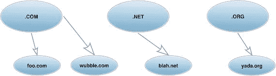
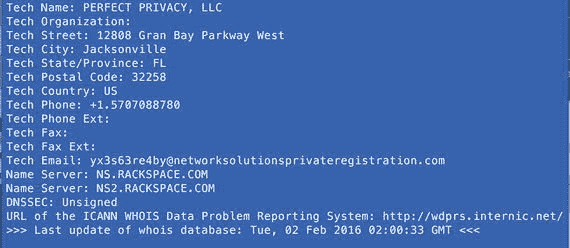
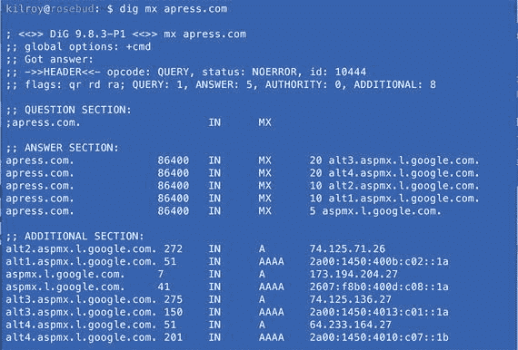
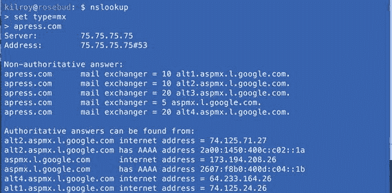
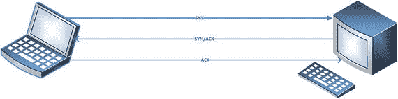
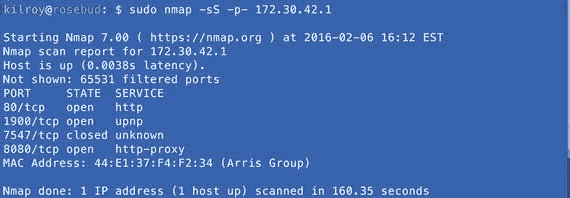
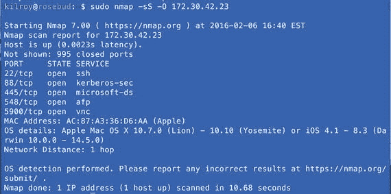
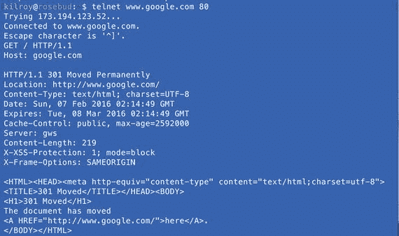

# 三、什么是开放的？

通常在这一点上，无论你是被提供了一些开始的地方，还是你在谷歌或互联网注册表中找到了一些，你至少有一些 IP 地址或主机名可以使用。无论哪种情况，域名系统(DNS)都是下一步要做的事情。至少，更好地理解 DNS 的结构和使用是很重要的。DNS 是互联网协议(IP)地址映射到主机名的地方，反之亦然。有一些真正有用的工具，通常在 DNS 中使用，我们将看看这些工具，因为您可能想更详细地了解您正在查看什么以及它可能在哪里。

在这一点上，我们有一些地方可以开始`—`我们可以使用 DNS 来获得基于我们所拥有的额外信息，无论是 IP 地址还是域名。使用 DNS，我们可以从 IP 地址中查找主机名。DNS 也存储一些叫做资源记录的东西。资源记录指示特定主机名或 IP 地址的功能。使用设计用来查询 DNS 服务器的工具，我们可以获得这些信息，并利用它来更好地了解公司可能使用的系统。我们可以确定 Web 服务器在哪里，使用什么系统发送电子邮件，以及与这些系统相关联的 IP 地址。这些主机名和与它们相关联的 IP 地址将提供一些额外的地方，以便对我们的目标进行更直接的探查和刺激。

找到这些主机的目的是为了让我们能够看到主机上正在运行什么应用程序，因为最终这些应用程序将成为我们的目标。我们可以使用端口扫描器(如 nmap)来确定哪些应用程序正在侦听网络端口。还有其他的端口扫描器，甚至有些比 nmap 更快，但是没有一个更古老或更有用。一旦我们有了端口，nmap 也可以给我们应用程序的名称。我们还可以使用一些其他工具来更直接地与底层应用程序进行交互，从而确定正在运行的确切软件。例如，知道端口 80 上有一个 Web 服务器并不能告诉我们太多。理想情况下，我们希望知道正在使用的软件的名称，如 Apache 或 IIS 或 Nginx，以及版本号。nmap 有时可以获得这些信息，尽管还有其他方式。

## 域名系统

首先，让我们谈谈域名系统(DNS)和它是如何组合在一起的。使用 DNS 的原因是因为人类不能很好地记住数字，而互联网依赖于数字地址，称为 IP 地址。为了让人类能够提供对他们有意义的地址，必须有一个系统能够将人类可读的地址翻译成机器可读的地址，反之亦然。DNS 提供了这个功能，以及其他一些功能。

DNS 是按层次结构组织的。最顶层是顶级域名(TLD)。这些包括。com，。网，。org，。edu 和所有特定于国家的域。您可以在图 [3-1](#Fig1) 中看到 DNS 层级图。顶级域名下面是二级域名。在图中，您可以看到`wubble.com`、`foo.com`以及其他显示为二级域的域名。这些域中的每一个都包含实际的主机名，尽管它们也可能有第三层域，称为子域。例如，如果`wubble.com`有一个小团体想要它自己的子域，举个例子，它可能是`offshoot.wubble.com`。下面你可能有类似 [`www.offshoot.wubble.com`](http://www.offshoot.wubble.com) 的主机名。



图 3-1。

DNS diagram

域名是 DNS 记录(包括主机名)的容器，但域名本身也可以有与之关联的 IP 地址。在图 [3-1](#Fig1) 中，`foo.com`是域名，可能包含主机名 www， [`www.foo.com`](http://www.foo.com) 可能有 172.20.42.5 的 IP 地址，但`foo.com`也可能有自己的 IP 地址。该 IP 地址可能完全不同，比如 172.30.15.6。主机名和域名放在一起， [`www.foo.com`](http://www.foo.com) ，称为完全限定域名(FQDN)。

每个主机名，像 [`www.wubble.com`](http://www.wubble.com) 或 [`www.microsoft.com`](http://www.microsoft.com) `,`实际上只是我们能够使用 IP 地址以外的东西的一种方式，因为我们不像我们那样擅长于将名称与事物联系起来那样擅长于记住数字。当您查找属于某个主机名的 IP 地址时，您会执行一个称为递归 DNS 查询的操作。递归查询意味着你从一个地方开始，它把你指向另一个地方，你不断地做这个过程，直到你得到你正在寻找的答案。你要寻找的所有信息都存储在通常称为域名服务器的系统中。权威名称服务器是拥有关于主机名或 IP 地址的最准确信息的服务器，但是为了到达权威服务器，查询从本地或缓存服务器开始。本地或缓存服务器将启动该过程。

当您寻找主机名的 IP 地址时，首先要做的是从本地高速缓存名称服务器发起对 A 记录或地址记录的请求。这通常是企业内部的服务器或服务提供商提供的服务器。当您去请求 [`www.wubble.com`](http://www.wubble.com) 时，您的客户端将向您的缓存服务器发出请求，该服务器将查看它是否在本地存储了信息。如果没有，它必须从权威服务器上为你找到答案。它首先去的地方是图 [3-1](#Fig1) 所示图表的最顶端。这些被称为根域名服务器，它们提供了关于在哪里可以找到二级域名服务器的信息，二级域名服务器将是该域的权威服务器。因此，缓存服务器将向与。com 域名，它的地址已经知道，寻找与`wubble.com`相关的域名服务器。根服务器将回复所请求的域名服务器的信息。缓存服务器然后向权威 DNS 服务器的 IP 地址发出请求，要求 [`www.wubble.com`](http://www.wubble.com) 。一旦 DNS 找到了`wubble.com`域的权威服务器，缓存服务器就应该停止搜索。

虽然 A 记录是您最常使用的记录，但 DNS 支持许多其他记录类型。SOA 记录或授权开始记录跟踪信息，如该域的区域上次更新的时间。MX 或邮件交换器记录可以告诉您哪个服务器或 IP 地址是发送邮件到特定域的地址。NS 记录指示与域相关联的名称服务器。A 记录是地址记录，指示与主机名相关联的 IP 地址，而 PTR 记录则相反，将 IP 地址解析为主机名。还有 RR 记录，它指示可能与该域相关联的其他资源。CNAME 记录是一个规范名称，它只是一个别名。使用 CNAME 记录，您可以使一个主机名引用另一个主机名。例如，您可能让主机名`transfer`成为`ftp`的 CNAME，主机名`ftp`成为 A 记录。这意味着如果一个 IP 地址改变了，你只需要改变一个 A 记录，但是你有许多主机名都指向同一个地方。

有许多程序可以用来从 DNS 服务器检索信息。最常见的是 dig、nslookup 和 host。每一个都可以使用配置的本地或缓存服务器请求信息，或者可以直接访问特定的名称服务器。虽然您可以使用这些实用程序，但它们都是命令行程序。如果你喜欢图形界面，有程序可以提供。还有一些网站可以用来执行 DNS 查找。为了确定特定域的名称服务器，您可以使用这些实用程序中的任何一个，或者您可以使用`whois`，我们之前使用它来查找关于特定域注册给谁的其他信息。

如果您对一个域名执行一个`whois`查询，您将获得的信息之一将是分配给该域的名称服务器。你可以在图 [3-2](#Fig2) 中看到这一点。该图显示了对`apress.com`的`whois`查找。响应的底部是与域相关联的名称服务器。其中一个是`ns1.rackspace.com`，另一个是`ns2.rackspace.com`。查看主机名，我们可以推断为某个地址处理 DNS 的服务提供商是 Rackspace。任何时候，如果您想知道应该检查哪个 DNS 服务器来直接从源获得权威信息，您可以使用`whois`来获得该域的域名服务器。



图 3-2。

Whois query for name servers

实用程序`dig`非常有用，尽管如果您不熟悉正在查看的内容，解析输出可能会有点困难。然而，`dig`可以用来在命令行上提取不同的记录。图 [3-3](#Fig3) 显示了`dig`的使用。这个特定的请求是寻找邮件交换器(MX)记录。这告诉我们负责接收该域邮件的系统的主机名。每个域至少有一个 MX 记录。从 MX 记录中知道主机名将告诉您，如果您想要使用简单邮件传输协议(SMTP)对组织的接收邮件服务器执行渗透测试，您需要与哪个系统进行交互。



图 3-3。

Using dig

我们最关心的回答在回答部分。本部分显示的数据告诉我们，对于域名`apress.com`，邮件是由 Google 运营的邮件服务器基础设施处理的，或者至少看起来是这样。这可能会告诉我们一些关于他们基础设施的其他信息。在附加部分，`dig`从答案部分查找了与主机名相关的 IP 地址。你可以看到这些都是 A 记录，或者地址记录。如果您有一个 IP 地址，并且想要从中获得一个主机名，那么您将会寻找一个 PTR(指针)记录。CNAME 记录，或规范名称，实际上只是一个别名。例如，你可以设置`web.apress.com`有一个 [`www.apress.com`](http://www.apress.com) 的 CNAME 条目。这意味着，如果您需要更改这两台主机的 IP 地址，您只需更改 [`www.apress.com`](http://www.apress.com) 地址，因为对`web.apress.com`的任何检查都将强制执行对 [`www.apress.com`](http://www.apress.com) 的 A 记录查找，因为它保存了地址。`Web.apress.com`只是对不同主机名的引用。

Dig 是一个非常强大的 DNS 查找工具，但不是唯一的。虽然 dig 和 nslookup 都可以安装在类似 Unix 的操作系统上，但 dig 通常不能在 Windows 系统上使用。因此，nslookup 值得一看。要执行上述查找，您可以参见图 [3-4](#Fig4) 中的步骤。



图 3-4。

Using nslookup

使用 nslookup，我需要做的第一件事是设置我正在寻找的记录类型。在本例中，我要查找 MX 记录，所以我将我的类型设置为 MX。一旦我完成了这些，我需要做的就是输入域名，nslookup 将为我进行查找。您可以直接查询名称服务器。例如，如果我想直接使用 dig 访问权威服务器，我会在命令的末尾添加`@ns.rackspace.com`。同样，使用 nslookup，我只需告诉它我要访问的服务器，它就会查询该服务器，而不是在我的系统上配置的 DNS 服务器。进入 nslookup 后，我可以设置服务器，nslookup 会将所有查询发送到该服务器，直到服务器被更改或我们退出程序。这允许我直接在一个服务器上检查，以避免本地服务器上缓存条目的任何问题。

## 传输协议和端口

互联网协议(IP)是一种网络层协议。如果您不熟悉不同的协议层，您应该查找开放系统互连(OSI)模型。位于 IP 之上的是传输层协议。通常，它们是传输控制协议(TCP)和用户数据报协议(UDP)。这些协议各有不同的功能。如果你绝对地、肯定地必须让它到达那里，并且你想知道它到达那里，你会使用 TCP。这有点像你去邮局时使用递送确认。你会得到类似送货收据的东西。如果你根本不在乎，只是想把它扔在风中，你会使用 UDP。使用 UDP，您会获得一点速度优势，因为没有确保您的消息在另一端被接收的所有开销。使用 TCP，您可以确保不会留下任何数据包。

每种传输层协议都需要一种多路传输流量的方法，这样即使在一台计算机上也可以同时进行多种通信交换。这是通过使用端口来实现的。当数据包在计算机之间(甚至在一台计算机上)发送时，每个数据包都由源端口和目的端口标记，因此计算机可以跟踪它是哪个通信交换的一部分。如果我们没有端口，系统将不知道将入站消息与什么相关联。使用端口，操作系统知道什么应用程序应该得到正在被接收的任何消息。很明显，这在服务器端是正确的，但在客户端也是正确的。当服务器响应时，它必须构建其响应，以便客户端计算机能够将数据包定向到正确的应用程序。因此，服务器利用到达消息中的源端口成为返回消息中的目的端口。传出消息使用的源端口不能在应用程序间重用，这就是为什么操作系统知道如何用返回消息返回到发送消息的应用程序。然而，即使操作系统会跟踪这些信息，这些端口也不会被认为是开放的，因此它们永远不会显示为侦听。当您远程扫描一个系统时，您将永远看不到刚刚用作连接到另一个系统的源端口的端口。

### 端口扫描

端口扫描使我们能够找到主动侦听来自互联网其余部分的连接的端口。这意味着应用程序已经绑定到该端口，并向操作系统表明它准备好接受该端口上的连接。您可以通过使用 telnet client 或 netcat 之类的程序一次连接一个端口来手动进行端口扫描，但最简单和最好的方法是使用端口扫描程序，该程序可以在成千上万个可用端口中自动执行扫描过程。有几种，但使用最广泛的是 nmap。端口扫描程序的目的是与目标系统通信，以触发指示端口是否正在侦听的响应，这是端口扫描器会做的。这取决于您使用的传输协议。TCP 和 UDP 的行为方式完全不同。这是因为 TCP 是面向连接的协议，这是确保承诺的有保证的交付所必需的。相反，UDP 是无连接的。端口扫描器将利用不同传输协议的工作方式来确定端口是打开的(监听)还是关闭的(不监听)。因此，对 TCP 在系统间建立连接的作用有一个基本的了解是很有用的。为了建立从一个系统到另一个系统的连接，TCP 使用所谓的三次握手。

三次握手做了几件事。首先，它确定另一端有人在听。这可以通过双向握手来完成，因此它也保证了声称的发送者在那里，并且通信不是伪造的，通常被称为欺骗。一旦我们知道所讨论的系统已经就位并可以进行通信，三次握手的另一件事就是设置一些必要的信息，以确保消息以正确的顺序被正确接收。

有两个头字段用于确保消息以正确的顺序发送和接收。这是序列号和确认号，它们是同一枚硬币的两面。序列号是用来表示我们在序列中的位置的。确认信息被发送回去，以表明在另一端已经收到了哪些消息。例如，如果我发送了 100 个字节，我的序列号就是 100。如果另一端已经接收到所有的字节，确认号将是 101，以表示它希望看到下一个字节。

使用 nmap，可以通过两种不同的方式使用三次握手。第一种是 SYN 扫描，也称为半开扫描。在我们深入了解这是什么之前，让我们来看看三方握手实际上是什么样子的。我们将快速浏览一些概念，帮助您更好地理解不同类型的扫描及其工作原理。如果你想更深入地了解，网上有很多资源可以让你更深入地了解 TCP/IP 协议族。

在图 [3-5](#Fig5) 中，您可以看到左边的客户端笔记本电脑正在与右边的另一个系统进行通信。客户端系统发送设置了同步(SYN)标志的消息。此外，还有一个序列号的 TCP 字段，它被设置为该消息的一部分。这称为初始序列号(ISN ),它不仅用于确定发送消息的顺序，还用于确定接收消息的顺序。接收系统(您可以将其视为服务器)通过设置确认标志(ACK)来做出响应，表示消息已收到。与 ACK 标志一起，它将确认号字段设置为比接收到的序列号大 1。这告诉客户端，在这种情况下，它期望下一个字节数。除了 ACK 标志和编号之外，服务器还通过初始化自己的序列号来建立自己的通信端，客户端将需要这个序列号。因此，它会设置 SYN 标志和序列号。



图 3-5。

Three-way handshake

服务器可以使用两个单独的消息来发送 SYN 和 ACK，但是从通信流的角度来看，将两个消息放在一个包中更紧凑。现在，客户端已经表明它想要进行通信，并且建立了用于通信的参数。服务器已作出响应，表明它已开始营业，并已确认客户端。建立双向通信通道的最后一步是客户端向服务器确认。一旦发生这种情况，使用 ACK 标志和确认号来指示序列号已被接收，三次握手就完成了，双方准备好发送和接收消息，根据需要根据正在传输的字节数增加序列号和确认号。

### TCP 扫描

SYN 扫描是一种常见的扫描技术，有时也称为半开扫描。在 SYN 扫描中，运行扫描器的系统向目标发送 SYN 消息。目标将通过 SYN/ACK 做出响应，表示端口已打开，或者通过设置了重置(RST)标志的消息做出响应，表示需要重置或关闭通信。这些响应中的任何一个都将告诉扫描器端口的状态，然后可以传递给用户。

这种扫描还有一种可能性，或者您可以使用的任何其他类型的扫描。如果扫描仪没有得到任何反应，这可能意味着一些事情。首先是系统瘫痪了。有些扫描器，如 nmap，会发出 Internet 控制消息协议(ICMP)回应请求，以确定系统是否启动。如果系统用回应应答来响应回应请求，而端口没有响应，这意味着扫描数据包或对扫描数据包的响应被丢弃。使用 TCP，因为它是面向连接的，所以消息将被多次重发，以确保消息不会在传输过程中被简单地丢弃。如果经过多次重试后，仍然没有应答，扫描器将认为数据包被某种过滤器丢弃。结果，您将得到指示该端口正在被过滤的响应，这可能意味着存在某种东西，但只是有防火墙挡路。

默认情况下，像 nmap 这样的扫描器只会扫描有限数量的端口。默认情况下，nmap 将扫描大约 1000 个众所周知的端口。如果您想扫描更多，您可以提供一个逗号分隔的列表或一个范围。你也可以通过在命令行添加一个`-p-`来告诉 nmap 扫描所有 65，536 个端口，如图 [3-6](#Fig6) 所示。扫描的端口越多，完成扫描所需的时间就越长，这也是 nmap 默认使用最有可能被使用的端口的原因之一。图 [3-6](#Fig6) 中的扫描是针对本地网络默认网关的 SYN 扫描。有三个端口显示为打开，一个端口显示为关闭。通常，您不会在列表中看到关闭的端口，因为没有任何理由显示关闭的端口。如果他们不出现，他们被认为是关闭的。在这种情况下，仅从 nmap 扫描结果来看，不清楚为什么会显示关闭的端口。为了确定为什么 nmap 不只是忽略关闭的端口，您必须查看交换的数据包。



图 3-6。

nmap scan

由于我们所做的是半开扫描，我们将目标系统置于半开连接状态，这意味着有一个端口正在等待最终确认。为了防止系统利用保持端口打开的资源，nmap 礼貌地向目标系统发送 RST 消息，指示它应该关闭通信，不要再期待任何东西。可能会注意到许多半开连接，因为半开连接可能是 SYN flood 的指示。半开放连接是指已经收到 SYN 消息并发送了 ACK，但尚未收到返回 ACK 的连接。另一个 TCP 扫描使用`–sT`而不是`–sS`。这是一个连接扫描，这意味着它通过整个三次握手来创建开放的连接，然后将其拆除。这稍微礼貌一点，但是也增加了扫描器和目标之间发送的消息总数。

SYN 泛洪是通过发送大量 SYN 消息，在系统上留下大量半开连接而产生的。目标上的操作系统可能只有有限数量的插槽可用于这些半开连接，因此有可能使目标处于无法接受任何附加连接请求的状态，从而导致拒绝服务。

还有其他类型的扫描使用 TCP 作为传输协议，并利用 TCP 内置的其他标志，但 SYN 扫描和连接扫描通常会为您提供有关打开和关闭端口的信息。其他扫描曾经有助于逃避检测，但除非您正在使用设备非常过时的网络，否则其他类型的扫描不太可能为您提供与两种最常见的扫描有很大不同的详细信息。

### UDP 扫描

虽然您通常连接的大多数服务都使用 TCP 作为传输协议，但并不是所有的服务都这样。其中一些，如 DNS、NTP 和 Syslog，使用 UDP。UDP 扫描的不同之处在于没有定义的发起通信的模式。在 TCP 的情况下，您发送一个 SYN 消息，端口响应指示它是打开的还是关闭的。这在协议中有很好的定义。就 UDP 而言，它应该是快速的和无连接的。这意味着应用程序需要处理诸如消息顺序和确定消息是否已经收到之类的事情。

如果 nmap 向 UDP 端口发送消息，但没有得到应答，这并不意味着什么。这可能意味着端口被关闭并且没有响应。这可能意味着消息被丢弃。这可能意味着有一个应用程序，但该应用程序通常不会对它收到的消息发送响应。因此，nmap 将不得不继续重试该端口，直到它得到一个应答或者干脆放弃，并且它放弃的事实可能实际上意味着或者可能不意味着任何有用的东西。对于 TCP，有与重试相关联的计时规则。这包括回退计时器，以确保您等待可变长度的时间，以防这只是一个计时问题，您在某个地方遇到拥塞。使用 UDP，所有这些都完全取决于应用程序，没有一致的规则。

使用 nmap，您可以使用标记“`–sU`”进行 UDP 端口扫描。您还可以指定要尝试的端口，就像 TCP 扫描一样。TCP 和 UDP 扫描都允许您使用节流参数"`-T`"设置扫描速度您最多可以设置 5 个数字，其中 3 是默认值。较低的油门数字会降低通信速度，这可能有助于减少目标对您的检测。更高的限制数导致通信速度更快。你的扫描会更快，但是你会在很短的时间内向你的目标发送大量的流量，这可能会被警惕的防御者注意到。

尽管基本的 TCP 和 UDP 扫描非常常见，但是您可以使用 nmap 进行许多其他类型的扫描。其他一些方法包括在 TCP 报头中设置不同的标志，如 FIN 扫描或 XMAS 扫描。FIN 扫描设置完成(FIN)标志。圣诞节扫描设置了许多其他奇怪的标志，你永远不会看到在同一时间设置。所有的旗帜都摆好后，据说会让包裹像圣诞树一样亮起来。

### 操作系统和版本扫描

nmap 可以为您获取大量信息，随着您对它的了解越来越多，您甚至可以编写 nmap 可以为您运行的脚本。一条可能非常有用的信息是操作系统的名称和版本。在图 [3-7](#Fig7) 中，你可以看到一个操作系统扫描的例子，它是使用`–O`作为参数请求的。



图 3-7。

nmap operating system scan

您可以将操作系统扫描与另一个扫描(如 SYN 扫描)结合使用。Nmap 利用由 nmap 开发人员维护的指纹数据库来识别目标操作系统。它利用与打开和关闭端口和初始序列号相关的行为，以及与网络通信和协议相关的其他行为。在此处显示的情况下，扫描正确地识别了目标操作系统，但错误地识别了其版本。版本不正确意味着可能还没有被扫描的操作系统的较新版本的指纹。

除了确定正在使用的操作系统之外，nmap 还能够确定正在运行的应用程序和版本。它通过尝试从与服务的交换中提取信息来实现这一点。为了执行版本扫描，您可以向 nmap 提供`-sV`。如果您提供`-A`作为参数，它将进行版本扫描和操作系统扫描。

### 高速扫描

nmap 不是唯一可用的扫描器，尽管它被广泛使用。还有其他扫描仪，如 masscan，可以非常快速地进行大规模网络扫描。像 nmap 这样的工具可以扫描大的地址块，但它并不是专门为这个功能而开发的。因此，nmap 完全有能力进行大型扫描，但是如果您有大量的地址块需要扫描，您可能需要考虑专门为此开发的扫描仪。由于 nmap 被广泛认为是默认使用的扫描仪，像 masscan 这样的较新的扫描仪已经实现了相同的命令行参数，以便兼容。massscan 是专门为大型网络的高速扫描而开发的端口扫描仪。既然你在做同样的工作，没有什么特别的理由去多此一举。指定目标、端口和扫描类型的方式与在 nmap 中相同。使用 masscan，您还可以设置每秒数据包的速度。由于 masscan 不使用系统网络堆栈来创建和发送数据包，因此速度非常非常快。在硬件上运行的 Linux 系统的情况下，这意味着不是在虚拟机中，据说它每秒能够发送超过 150 万个包。这可能足以在您的网络上引起重大问题，因此请确保您有一个非常好的理由以该速度运行，并且您已经通知了负责您正在测试的网络的任何人，以防止中断。如果您正在使用或测试客户的网络，这一点尤其正确。

## 抓取横幅

nmap 可以做的另一个功能是抓取横幅。这意味着它连接到应用程序端口，并获取服务器应用程序在该连接上发出的任何消息。这些被称为横幅或欢迎信息。有时你可以从他们那里得到应用程序的名字和版本号。

识别应用程序和版本是有帮助的，因为通过使用应用程序和版本号，您可以查找可能被利用的漏洞。您可以在很多地方查找这些信息，包括每个供应商，但是您也可以使用常见漏洞和暴露(CVE)项目。你可以在`cve.mitre.org`访问 CVE 项目维护的数据库。CVE 项目是一种供应商中立的跟踪软件漏洞的方式。他们的数据库会给你一个方法在一个地方查找问题。CVE 知识库是获取这些信息的一个地方。它不是唯一的一个，但是它已经存在了超过 15 年，并且相当全面。

虽然 nmap 能够确定应用程序的名称和版本，但是您可能更喜欢自己直接与应用程序服务器进行交互。一个可以用来做这件事的程序是 telnet 客户端。telnet 这个词有点奇怪，因为它可以指客户机、服务器或协议。在我们的例子中，我们将使用您通常用来连接到 telnet 服务器的程序。然而，这并不是这把小小的瑞士军刀能够发挥的唯一功能。实际上，telnet 客户端实际上只是一个程序，它启动一个到您想要的任何端口的 TCP 连接。如果不指定端口，它默认为端口 23，这是 telnet 服务器将侦听的默认端口。如果您连接到 telnet 服务器，客户端将为您完成 telnet 应用程序协议的所有协商。但是，如果您指定了另一个端口，telnet 客户端将只留给您一个到在该端口监听的应用程序的原始连接。在图 [3-8](#Fig8) 中，您可以看到使用 telnet 客户端连接到 Google 的 Web 服务器。



图 3-8。

Using the telnet client

一旦您使用 telnet 建立了与服务器的连接，您将需要知道一些协议命令以获得响应。有些连接，比如到 SSH 服务器的连接，根本不需要任何协议知识。它将只为您提供版本，如下图所示。除了连接之外，SSH 服务器提供了它的协议版本以及应用程序的名称和版本:

```
telnet 172.30.42.23 22
Trying 172.30.42.23...
Connected to 172.30.42.23.
Escape character is '^]'.
SSH-2.0-OpenSSH_6.9

```

然而，并不是所有的服务器都是这样，正如你在图 [3-8](#Fig8) 中看到的。即使使用了正确的协议，服务器也只提供服务器的名称。在这种情况下，我们通过使用命令`GET / HTTP/1.1`指示我们正在使用“协议版本 1.1”在服务器的根处寻找默认网页。除此之外，我们指出我们正在寻找的主机名，因为 HTTP 协议的 1.1 版本提供了在单个 IP 地址上虚拟服务器的可能性。然而，我们得到的回报是，这是`gws`，我们只是碰巧知道它是“谷歌网络服务器”。没有版本号。当然，这是一种安全的操作方式，但并不是所有的软件在信息方面都如此吝啬。

telnet 客户端只能使用 TCP 作为传输协议。如果您想使用 UDP，您将需要使用完全不同的程序。netcat 就是这样一个程序，它也能够使用 TCP，就像 telnet 客户端一样。它还可以在您指定的任何端口上用作 UDP 或 TCP 的监听器。在图 [3-9](#Fig9) 中，你可以看到一个使用 netcat 连接到 UDP 服务器的例子。为了便于演示，netcat 正在连接的服务器是一个简单的 Python 脚本，当消息到达时，它只是用`received`进行回复。真实世界的 UDP 服务不会轻易响应，否则它们的通信将是二进制的，不可读的。


图 3-9。

Using netcat with UDP

为了在 netcat 中使用 UDP，您需要在命令行中指定`–u`。否则，netcat 默认使用 TCP 作为传输协议。Netcat 还支持 IPv4 或 IPv6，这使得它非常通用，因为越来越多的企业开始在其网络中实现 IPv6。服务提供商并不允许 IPv6 从客户端通过他们的网络。因此，您不太可能对客户端进行任何远程 IPv6 测试。然而，您有时很可能从客户端网络内部执行测试，因此您可能需要使用 IPv6。

## 摘要

开始渗透测试时，您会希望在目标网络上找到系统。一旦您找到了有响应的系统，您就需要找到开放的端口。打开的端口将告诉您哪些应用程序正在这些系统上侦听，因为如果没有应用程序在端口上侦听，就不可能有一个端口是打开的。在我们开始检查开放端口之前，您需要理解 IP 地址如何映射到主机名，反之亦然。有几个工具可以与 DNS 一起使用来查找关于目标域的信息。这包括不同类型的主机记录，如邮件交换器。许多信息也与域名相关，尽管有时这些信息是私人的。您可能会获得姓名和电子邮件地址，以便在以后的社交工程攻击中使用。除此之外，您还可以获得与该域相关联的名称服务器，这可能会告诉您该公司正在使用的基础架构的一些信息。

虽然 nmap 是最常见的端口扫描器，并且已经存在了 15 年以上，但它并不是唯一可用的端口扫描器。大多数可用的扫描器与 nmap 做同样的事情，尽管其中一些被设计为在同时扫描大块 IP 地址的情况下更快。使用 nmap，您可以扫描 TCP 和 UDP 端口，并确定底层操作系统。虽然 UDP 扫描非常简单，但是您可以执行多种 TCP 扫描类型。这包括设置不同的 TCP 标志，以便有可能逃避保护或检测。

一旦确定了开放端口，如果可能的话，您将需要确定应用程序和版本。虽然您可以使用 nmap 来收集这些信息，但是您也可以自己使用 telnet 客户端或 netcat 之类的程序来收集这些信息。使用这些程序，您可以自己启动到监听服务的连接，然后如果您向服务器发送协议命令，通常可以得到响应。不是所有的服务都是基于文本的，这意味着你可能不能仅仅发送简单的命令。相反，你可能需要利用一个能为你发送二进制信息的程序，或者你可以自己写一个简单的程序来做这件事。有时，您只是希望能够验证自动化工具提供的响应。这是您可能希望使用 telnet 或 netcat 等手动技术的另一个原因。

## 练习

1.  使用 nslookup 和 dig 获取您个人或公司域的邮件交换记录。如有必要，使用`gmail.com`作为您正在查找的域。
2.  获取与 IP 地址`4.2.2.1`和`8.8.8.8`相关联的主机名。
3.  获取与您公司的 Web 服务器主机名相关联的 IP 地址。从主机名中获得 IP 地址后，反向查找 IP 地址，查看相应的主机名是什么。
4.  对本地网络中的所有主机执行 SYN 扫描。大多数家用网络设备提供/24 网络，这意味着它提供 255.255.255.0 的网络掩码。为了扫描整个网络，您可以提供网络地址，后跟网络掩码或子网位数，如/24。例如，如果您的网络位于 192.168.1.0 上，您应该扫描 192.168.1.0/24。
5.  使用 nmap 或您选择的工具在您的网络上执行全连接 TCP 扫描。看看同步扫描有没有什么不同。
6.  使用 nmap 或您选择的工具在您的本地网络上执行 UDP 扫描。比较 UDP 扫描和 TCP 扫描所用的时间。