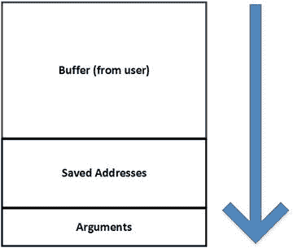
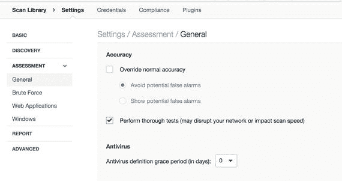
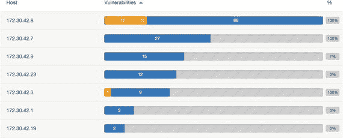
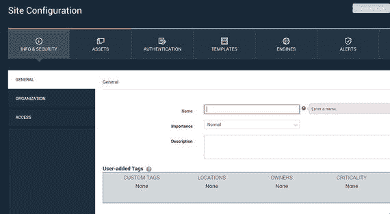
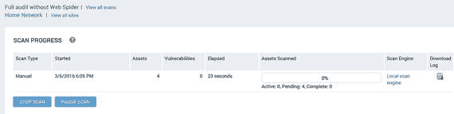
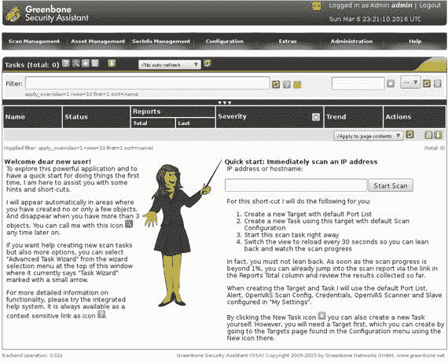

# 四、漏洞

如果您已经一章一章地学习了，现在您已经有了一些响应连接尝试的系统的 IP 地址。您还拥有这些系统上开放的端口列表。你要做的下一件事是弄清楚你如何进入那些系统。您需要知道这些端口背后的应用程序可能存在哪些漏洞。

我们知道，如果有一个开放的端口，就有一个应用程序在监听它。端口不会神奇地打开，如果端口没有打开，操作系统会简单地重置连接。这意味着，如果您在 TCP 连接上收到对连接尝试的响应，您就知道有一个程序在等待您的响应。然而，对于 UDP 应用程序来说，情况稍微复杂一些，因为对于发送到 UDP 端口的消息，没有定义响应。UDP 协议规范没有说明在开放端口上有通信时应该做什么。本质上，根据协议定义，响应完全由应用程序决定，而完全不由操作系统决定。

您的扫描很有可能打开了端口，无论它们是 TCP、UDP 还是其中的一部分。端口号，以及您收集的任何横幅，在您试图找出下一步该怎么做时会有些用处。下一步是寻找漏洞。虽然有很多方法可以手动完成这项工作，但最好的方法是使用漏洞扫描器。如果你正在为一家公司工作，并且你有一个体面的预算，有一些优秀的商业扫描仪。然而，如果你只是想自己做一些学习和调查，或者如果你有一个很小的组织，几乎没有预算，有开源和非常低成本的扫描仪非常好，易于使用。

在我们开始研究这些扫描器之前，我们将回顾一下什么是漏洞，并研究一些识别漏洞的方法。这将包括查看一些常见的扫描仪以及如何使用它们。

## 什么是漏洞？

在你去寻找某样东西之前，你应该知道它是什么。漏洞仅仅是系统中的弱点，无论该系统是软件、硬件设计还是网络。您可能会发现漏洞的原因有很多。这可能只是配置错误，启用了不必要的功能，这些功能可能会被恶意使用。一个例子是意外打开匿名 FTP，这可能允许某人上传大量数据，从而导致磁盘被填满。如果 FTP 服务器可以访问敏感数据，并且打算在用户可以访问之前要求进行身份验证，则同样的错误配置可能会允许从该服务器提取敏感数据。具有大量配置设置的复杂软件，包括 Web 服务器和 Java 应用服务器，仅举几个例子，就容易出现这种错误配置。

就漏洞而言，错误配置并不是唯一的可能性。错误的配置并不总是导致系统能够做一些有趣的事情。这就是我们想要软件缺陷被利用来做有趣的事情的地方。有许多不同类型的错误会导致系统被利用。其中最持久和最常见的是缓冲区溢出。缓冲区是用于存储数据的一块内存。在这种情况下，它将是一个内存块来存储用户提供的一段数据。缓冲区的大小是固定的，如果用户发送的数据比预期的多，那么后续的内存空间就会被超出的部分填满。这是某些编程语言(最著名的是 C 编程语言)没有输入约束的结果。由于输入缓冲区存储在称为堆栈的内存结构中，并且程序要返回的内存位置的地址也存储在内存中，这种特殊类型的漏洞为攻击者打开了大门，攻击者可以通过操纵返回地址来控制执行流，迫使程序转到攻击者控制的一组代码。图 [4-1](#Fig1) 显示了一个堆栈的简单示意图。顶部是内存缓冲区。一旦分配给缓冲区的空间用完，剩余的空间开始流入它下面的所有内容，包括已经保存的地址，以便将执行流返回到调用内存段。



图 4-1。

Stack using a buffer

有一些方法可以修复这种类型的漏洞，包括使堆栈不可执行。您还可以使用一种称为堆栈金丝雀的东西，它是一个随机值，在将执行返回到内存中的调用区域之前会对其进行检查。如果金丝雀是它所期望的那样，寄信人地址就被认为是安全的。如果金丝雀被改变了，程序将会暂停，而不是将控制权返回给攻击者可能已经上传到正在运行的程序中的代码。

我们不会详尽地列出所有不同类型的漏洞，而是会在缓冲区溢出问题上停下来，因为这是一个经典问题，至今仍存在。您可能想看看其他主题，如竞争条件、堆溢出、整数溢出和各种注入攻击。你可以看到溢出是很常见的。大多数情况下，任何时候程序接受用户的输入，用户的输入都应该被认为是完全不可信的，但是程序员并不总是这样做。或者，在试图做正确的事情的过程中，他们可能无意中打开了通往其他事情的大门。无论哪种方式，都有许多不同类型的漏洞。开放 Web 应用程序安全项目(OWASP)每年都会跟踪常见的漏洞。虽然 OWASP 通常专注于 Web 应用程序安全，但不同的漏洞类别通常存在于不同的应用程序类型中。

其他组织，如计算机应急响应小组(CERT ),也跟踪主要漏洞，但与 OWASP 不同，它包括漏洞的类型，CERT 列出具体的漏洞。类似 CERT 的列表是基于实际攻击的。他们根据已报告的攻击信息创建列表。由于已知的攻击，该列表最终成为组织需要立即解决的所有基本漏洞。还有其他组织也有类似的名单。

## 漏洞扫描器

现在我们或多或少知道了什么是漏洞，我们应该开始寻找一些漏洞。毕竟，我们需要找到进入系统的方法来赚取我们的薪水，我们通过利用漏洞来做到这一点。您当然可以通过大量的手工工作来找到这些漏洞，但是如果您使用扫描仪，这要容易得多；有几种可供选择。可能性范围从非常高端的商业扫描仪到开源扫描仪，中间有大量的选择。漏洞扫描器从 20 世纪 90 年代就已经出现了。最早的一个是分析网络的安全管理员工具(撒旦)。撒旦是由 Dan Farmer 和 Wietse Venema 在 20 世纪 90 年代中期开发的。Farmer 和 Venema 都因他们参与的其他安全相关项目而闻名。法默从计算机甲骨文和密码扫描仪开始，其中包括一些专门的漏洞检查。

撒旦附带了一个小脚本，可以让你把撒旦这个词的所有实例都改成圣诞老人，给那些可能被撒旦这个名字冒犯的人。目前的商业扫描仪圣人是基于撒旦。安全审计员的研究助理(SARA)也是撒旦的追随者。

漏洞扫描器通过对系统和软件运行大量测试来工作。这可能包括运行端口扫描来查找打开的端口和侦听应用程序。它还会检查操作系统是什么。基于这些数据，漏洞扫描程序将确定是否存在潜在的漏洞。它实际上并没有利用这些漏洞。它也不能定位未知的漏洞。如果一个软件中有一个缺陷到目前为止还没有被报告，扫描仪就不能将其识别为一个问题。这包括通常所说的零日攻击。零日漏洞是指已经开发了一个漏洞，但该漏洞尚未向软件供应商披露，因此可以修复的软件错误。因此，软件的安装容易受到零日持有者的攻击，直到供应商意识到该漏洞并开发出可以安装的修补程序。

漏洞扫描器从数据库或模块集合中运行。这些测试集需要定期更新，以便跟上存在的大量漏洞。事实是，软件缺陷不断被发现，包括非常旧的软件。

近年来一个值得注意的错误是 ShellShock，这是 Bourne-again shell (bash)中的一个漏洞。这是一个存在了大约二十年的漏洞，但直到最近才被发现。仅仅因为一个软件或者一个操作系统是旧的，并不意味着没有新的错误被发现。

在过去的几十年里，关于研究人员和 bug 猎人，以及当他们发现一个 bug 时应该如何与软件供应商互动，安全社区内部一直存在争论。许多软件供应商长期以来更愿意在任何关于缺陷的事情被公之于众之前有足够的时间来修复缺陷。一旦问题被披露，在供应商修复缺陷之前，恶意用户可以利用这些详细信息来创建和利用漏洞。发布可能被用来暴露无辜和不知情的用户的细节是不道德的。然而，对于供应商来说，不修复他们已经被告知的漏洞也是不道德的。因此，有一个中间地带。像微软这样的公司愿意与研究人员合作，并允许研究人员将自己的发现归功于自己。他们也有一个验证错误并解决它们的过程。其他公司在及时解决问题方面做得不太好，并且通常在安全社区中以不解决问题和不与研究人员合作而闻名。

有像 Bugtraq 和 Full Disclosure 这样的邮件列表，其中经常发布与第三方(如 bug 猎人和研究人员)发现的问题相关的公告。除了了解第三方披露的错误，您还可以了解可用于利用这些漏洞的概念验证代码。

## 扫描漏洞

这里需要注意的是，虽然漏洞扫描器并不实际运行漏洞来确定系统是否易受攻击，但您总是有可能影响系统的运行。仅仅是扫描行为就可能导致系统或应用程序故障。在扫描系统之前，您确实应该向系统所有者提供大量通知，以便他们在受到影响时做好准备。可以使用 Canvas、Core Impact 和 Metasploit 等漏洞利用框架来验证漏洞。

有许多漏洞扫描器。你可以购买软件扫描仪或设备。您可以利用开源解决方案，或者您可以简单地购买一项服务，由提供商通过互联网或专用网络连接为您进行扫描，然后向您提供结果。这里我们将重点介绍 Nessus、Nexpose 和 OpenVAS。首先，查看这些的原因是因为它们很容易获得并且有免费版本。一旦你熟悉了这些是如何工作的，你应该能够使用你遇到的任何其他扫描仪。

当您执行漏洞扫描时，需要了解一些事情。扫描程序将根据您提供的配置及其存储的已发布漏洞数据库，检查所有可能的漏洞。每个扫描仪都有不同的配置选项集。有些比其他的更详细。此外，随着时间的推移，不同的扫描仪已经改变了它们的选项和配置方式。在图 [4-2](#Fig2) 中，您可以看到 Nessus 中高级扫描选项的一部分。Nessus 已经存在很长时间了，是一个备受尊敬的漏洞扫描器。它最初是一个拥有独立客户端的开源扫描仪。目前，您为 Nessus 配置了一个不断发展的 Web 界面。像 Nessus 这样的产品可能会随着时间的推移而改变其界面。在某些时候，界面可能会与您在此屏幕截图中看到的有所不同。



图 4-2。

Nessus options

虽然 Nessus 必须获得商业使用许可，但它的开发商 Tenable Security 确实提供了家庭许可证。使用家庭许可证不需要任何费用，但它严格是非商业性的，它将只允许您扫描多达 16 个 IP 地址。如果你想看看你所有的家庭系统，或者你只是想获得一些在你的家庭系统上使用它的经验，你可以下载 Nessus。然而，为了在商业环境中使用它，包括作为顾问，你需要支付商业许可证。当前的 Nessus 产品提供了许多预配置的模板，包括用于支付卡行业(PCI)合规性审计的扫描模板。

一旦选择了所有选项，就可以开始扫描了。该界面旨在为您提供即时反馈。在图 [4-3](#Fig3) 中，您可以看到显示扫描结果的图表。此图表显示了被发现具有运行系统的 IP 地址，以及每个 IP 地址发现的每种类型漏洞的数量。漏洞从左到右排列，最严重和最关键的漏洞位于条形的左侧，最不严重的信息性发现位于条形的右侧。在这个特殊的例子中，大部分的发现只是信息性的。虽然有一些与第一个列表 172.30.2.8 相关的重要发现，但它并不是一个很大的数字，并且显示的红色长条几乎不可见。如果我把鼠标放在红色的长条上，Nessus 显示有一个重要的发现。



图 4-3。

Nessus results

扫描器通常能够检查远程和本地漏洞。远程漏洞是一种不需要您在系统上的漏洞。您可以在任何能够通过网络连接访问系统的地方。本地漏洞是指需要用户打开系统会话的漏洞。这可能意味着坐在计算机前，甚至通过远程连接协议(如远程桌面协议(RDP)、安全外壳(SSH)或 Telnet)进行连接。如果您连接到系统，可以运行安装在系统上的程序，则您拥有本地连接，可以触发本地漏洞。

Nessus 扫描会检查远程漏洞，因为如果我在网络上，扫描仪就只能看到这些。包括 Nessus 在内的一些扫描仪将允许您提供本地凭据。您可以使用安全外壳(SSH)连接、服务器消息块(SMB)、Telnet 或其他类型的远程访问进入。提供凭据将允许您作为本地系统的授权用户获得扫描程序可以找到的所有漏洞的列表。这可能包括过时的软件包或系统上的错误配置，这可能会将系统暴露给想要执行恶意或未经授权的操作的本地用户。扫描器通过网络登录到被扫描的系统，以获得进行本地检查所需的本地访问权限。

任何本地扫描都将限于已通过身份验证的用户被授予的权限。管理用户通常拥有系统的完全运行权限，而其他用户可能无法识别所有已安装软件的所有漏洞。

许多管理员可能对本地漏洞不太感兴趣。原因是，为了获得对漏洞的访问权限，攻击者必须使用远程漏洞或一组授权的凭据获得对系统的访问权限。一些管理员和组织会认为触发本地漏洞的唯一方式是攻击者对系统进行物理访问。组织有时认为他们的员工完全值得信任，因此本地漏洞不值得花费资源来修复。如果您运行的 Web 服务器相当坚固，那么您可能会担心更新系统上的某些库可能会影响站点的功能。保持网站的功能性很重要。如果用户不能利用由于更新而损坏的页面，说系统更新了新软件不会让任何人感觉更好。

更新软件有可能导致停机。一些系统对停机更敏感，因此请求对这些系统进行更新需要一个广泛的过程来证明更新的重要性。

当然，Nessus 不是唯一可用的扫描仪。虽然它是商用的，但它并不是唯一一款免费的商用扫描仪。Rapid7 提供的 Nexpose 也有社区版。Nexpose 的社区版本与 Nessus 的家庭许可证有类似的限制。社区许可证允许您访问所有功能，但您只能访问 16 个目标。除了个人使用，这通常会使它不切实际。如果您必须一次扫描 16 台主机，那么即使只扫描 254 台主机的 C 类地址，也要花费相当长的时间，然后导出数据并清除数据库，然后才能重新开始。社区版本对于在家学习和测试是有好处的，但是如果你想在真实的环境中使用它，它真的没有太大的意义。

使用 Nexpose 的一个优点是它可以与 Metasploit 集成。Metasploit 是一个漏洞利用框架，因此集成意味着您可以在很短的时间内从漏洞识别快速转移到验证和/或利用。就像 Nessus 一样，Nexpose 也有一个 Web 界面。Nexpose 和 Nessus 之间的一个很大区别是 Nexpose 的组织方式。Nessus 提供了您可以用来开始工作的扫描和策略，Nexpose 添加了组织和站点。这种详细程度对于可能有许多客户的顾问来说非常有用。他们想要区分他们的客户，甚至他们的客户站点。您创建了一个存储组织信息(包括联系人)的站点，因此您最终会得到一个与您的扫描相关的更全面的信息数据库。在图 [4-4](#Fig4) 中，你可以看到启动 Nexpose 扫描的样子。您可以点击通过许多信息收集屏幕，但它可能有助于存储这些信息。



图 4-4。

Nexpose scan start

从屏幕截图中，您可以看到收集的所有信息。您可以使用主机列表、地址范围和一组排除规则来跟踪与组织关联的所有资产。您可以选择想要使用的模板，也可以设置凭证，就像使用 Nessus 一样。使用 Nexpose，您可以拥有多个用户并对组织设置访问控制。通过这种方式，您可以向可能需要查看结果以开展补救活动的其他用户提供访问权限。一旦建立了拥有所有资产、凭据和访问控制的组织，您就可以开始扫描或设置开始扫描的时间。一旦扫描开始，您将会看到一个进度指示，如图 [4-5](#Fig5) 所示。与典型的进度条不同，它提供了结果的快速摘要，包括迄今为止的漏洞计数。



图 4-5。

Nexpose Progress

在继续讨论结果之前，我们要看的最后一个扫描仪是 OpenVAS。OpenVAS 以开源 Nessus 的副本作为新项目的基础开始了它的生命。从那以后，OpenVAS 的架构和界面经历了几次变化。最初，OpenVAS 有一个独立的应用程序，但它已经从修改后的应用程序转向像其他扫描仪一样的网络界面。您可以在图 [4-6](#Fig6) 中看到基于 Web 的界面的入口点。这台扫描仪的工作方式和其他的相似。您有扫描策略和目标。如果要进行本地扫描，您需要提供凭据。有了 OpenVAS，你可以直接从应用程序的首页进行快速扫描。你插入一个目标，点击开始扫描，OpenVAS 就上路了。



图 4-6。

OpenVAS

一旦完成扫描，您将获得一个潜在漏洞列表。请记住，这些只是潜在的漏洞，而不是确认可利用的漏洞。您仍然需要手动验证它们。这需要使用像 Canvas、Core Impact 或 Metasploit 这样的利用框架。在下一章中，我们将更仔细地研究如何利用漏洞。同时，您应该仔细阅读漏洞类型。你可以通过你正在使用的扫描仪做到这一点。扫描器对它们发现的漏洞有很好的解释，包括补救建议。对于 Nexpose，您将获得到 Metasploit 模块和漏洞数据库网站的链接。这种额外的帮助将使您更快地验证问题。

OpenVAS 默认安装为 Kali Linux 的一部分。事实上，Kali Linux 已经默认安装了很多您可能想要使用的工具。还安装了 Metasploit，您可能也想安装 Nexpose。

但是，在某些情况下，您可以手工进行验证。有些验证非常简单，您可以使用我们之前讨论过的一些技术，比如手动直接连接到服务器。通常，结果的详细信息将提供足够的信息，以便您能够通过轻松复制扫描程序的操作来验证漏洞。如果没有，您可能需要使用其他技术或工具，如漏洞工具包。

## 起毛

如前所述，漏洞扫描器的一个问题是，它们只发现已知的问题，并在数据库中列出。在您可以用漏洞扫描器找到某个东西之前，其他人需要先找到它，以便可以为扫描器创建一个模块。如果您的环境中有自己开发的应用程序，扫描程序不会做任何事情来识别这些应用程序中的问题。为了发现您自己开发的应用程序中的问题，您需要进行一些有针对性的安全性测试。但是，您也可以利用其他工具和技术来帮助您。有一段时间，fuzzing 是一种非常流行的技术，用于识别自主开发的应用程序中的漏洞。它的使用有所减少，但其背后的想法是合理的。模糊化的概念是在应用程序中插入意想不到的输入，希望应用程序以有趣的方式失败并暴露漏洞。旨在发现错误的消极测试有时会被排除在高质量的程序之外。这些测试程序通常更侧重于正面测试，这是为了确保程序按预期工作，而不是试图专门寻找 bug。使用模糊化技术可以发现许多输入验证错误。

目前仍在使用并积极开发的 fuzzing 工具之一是 Peach。Peach 是一个开源的 fuzzer，它使用 XML 脚本来告诉它做什么。例如，下面显示了用于针对 Web 服务器生成 HTTP 请求的 XML:

```
<DataModel name="HttpRequest">

        <String value="GET / HTTP/1.0" />

</DataModel>

     <StateModel name="TheStateModel" initialState="TheState">

             <State name="TheState">

                     <Action type="output">

                             <DataModel ref="HttpRequest" />

                     </Action>

             </State>

     </StateModel>

     <Agent name="LocalAgent" location="http://127.0.0.1:9000">

             <Monitor name="Debugger" class="debugger.WindowsDebugger">

                     <Param name="Command" value="C:\Peach\samples\CrashableServer\release\CrashableServer.exe"/>

                     <Param name="Params" value="192.168.1.195"/>

             </Monitor>

             <Monitor name="Network" class="network.PcapMonitor">

                     <Param name="filter" value="tcp"/>

             </Monitor>

     </Agent>

     <Test name="HttpRequestTest" description="HTTP Request GET Test">

             <Agent ref="LocalAgent" />

             <StateModel ref="TheStateModel"/>

             <Publisher class="tcp.Tcp">

                     <Param name="host" value="192.168.1.195" />

                     <Param name="port" value="4242" />

             </Publisher>

     </Test>

     <Run name="DefaultRun" description="HTTP Request Run">

             <Test ref="HttpRequestTest" />

             <Logger class="logger.Filesystem">

                     <Param name="path" value="c:\peach\logtest" />

             </Logger>

     </Run>

```

使用 Peach，您可以创建一个数据模型。数据模型告诉 Peach 如何构造从 Peach 到测试中的应用程序的输出。在我们的例子中，我们只是发出一个简单的 HTTP 请求，所以它是一个字符串。当然，根据您测试的应用程序，您可以创建更复杂的数据模型。一旦有了数据模型，就需要建立状态模型。状态模型用于连接多个数据模型，以进行更复杂的协议通信。根据应用程序的工作方式和您想要测试的内容，您可以在您的状态模型中使用许多数据模型。一旦您有了状态模型，您需要创建一个测试。测试将包括一个发布者，它指示 Peach 如何与应用程序通信。您可以使用 TCP 或 UDP 客户端进行网络通信，也可以只生成一个文件来打开应用程序。您还必须咨询代理。代理定义了一个监视器。

监视器实际上是测试中最重要的部分，因为它检查应用程序是否崩溃。如果您可以使一个应用程序崩溃，但是您不知道您已经这样做了，那么您可能还没有开始运行测试。Peach 允许许多方法来处理这个问题，包括使用调试器。如果您配置了一个好的监视器，Peach 能够确定测试中的应用程序何时崩溃。监视器将识别产生崩溃的输入，此时问题可以交给应用程序开发人员来解决。崩溃的应用程序打开了大门，创造一个漏洞，将让您控制程序。桃子本身不会为你做那件事。为此，您需要创建自己的漏洞或使用漏洞框架。

Peach 提供了一个社区版，但是开发者正试图从他们花了数年开发的程序中获利。其中一个原因是因为像 Codenomicon 这样的公司已经销售 fuzzing 工具有一段时间了。开发自己软件的组织应该在他们的测试套件中添加模糊化工具，以确保软件尽可能健壮。

Codenomicon 是一家来自芬兰奥卢大学 PROTOS 项目的公司。PROTOS 项目使用了一个 Java 引擎，通过一些常用的协议来运行一些异常的测试用例。他们的一项测试最终发现了 ASN.1 协议在许多简单网络管理协议(SNMP)实现中的一个重大问题。在宣布之前，花了一年时间与世界各地的供应商谈判，才解决了这个问题。PROTOS 项目也发现了其他网络协议的重大问题。

## 摘要

一旦有了主机列表，就可以创建一个源列表，并将其输入到漏洞扫描程序中。当然，漏洞扫描器也可以自己发现主机和端口。您可以免费获得一些漏洞扫描器，这样您就可以练习您的漏洞扫描技术。这些扫描仪包括 Nessus、Nexpose 和 OpenVAS。也有许多其他商业扫描仪可用。虽然他们都执行相同的任务，但他们都以不同的方式执行任务。一些公司会以比其他公司更快的速度给他们的扫描仪软件添加新的测试。这对于某些测试情况很重要，但对于其他情况则不然。

完成漏洞扫描后，您需要验证并理解已识别的漏洞。一些扫描仪会提供大量的细节来帮助你进行检查。像 Nexpose 这样的扫描器可以直接链接到 Metasploit 这样的工具，如果您在同一个系统上安装了这两个工具，可以节省一点时间。

对于自主开发的应用软件，您可能希望使用像 Peach 这样的模糊化工具对输入验证中的漏洞进行一些不太具体的测试。像 Peach 这样的工具的问题是，即使你能找到使应用程序崩溃的方法，Peach 也不会让你控制执行的流程。这将需要一些额外的知识，如何操纵程序作为崩溃的一部分。像 Metasploit 这样的漏洞利用框架可以帮助您快速开发漏洞。

## 练习

1.  安装 Nexpose 并对其中一个可利用的系统执行扫描。记下打开的端口和发现的漏洞。
2.  安装 Nessus Home 的副本，并对其中一个可利用的系统执行扫描。将 Nessus Home 和 Nexpose 的研究结果进行比较。
3.  使用 Kali Linux 中的 OpenVAS 扫描您的一个可利用系统。