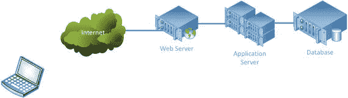
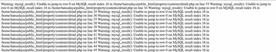
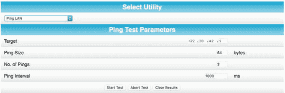
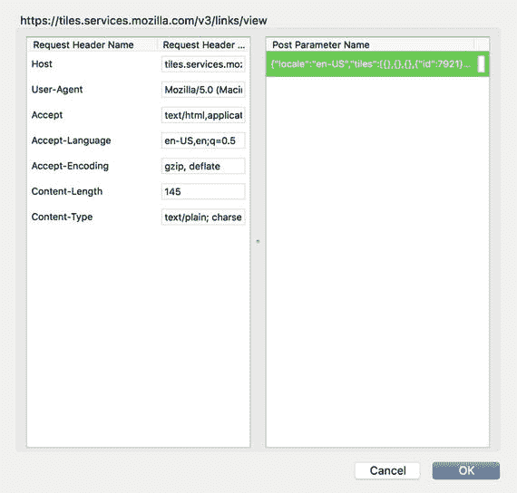
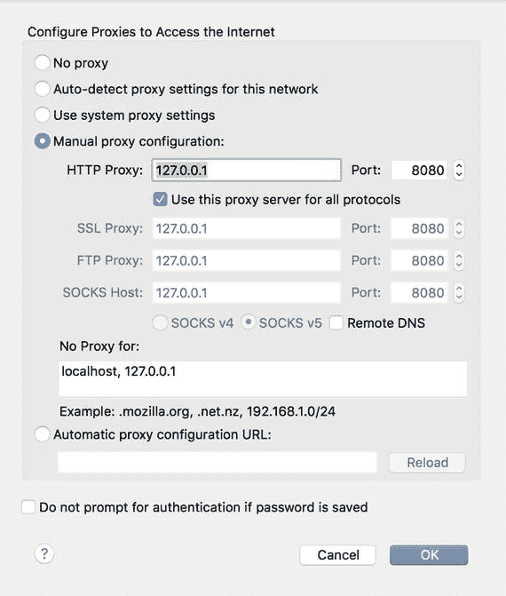
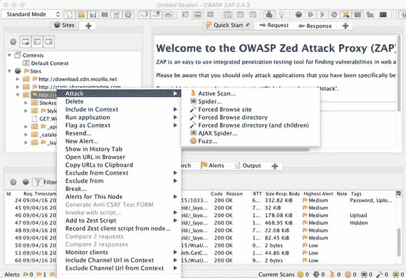
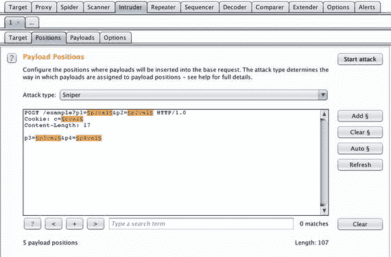
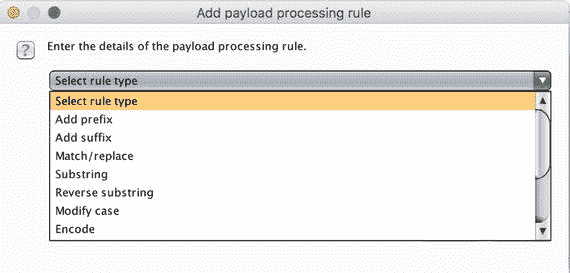
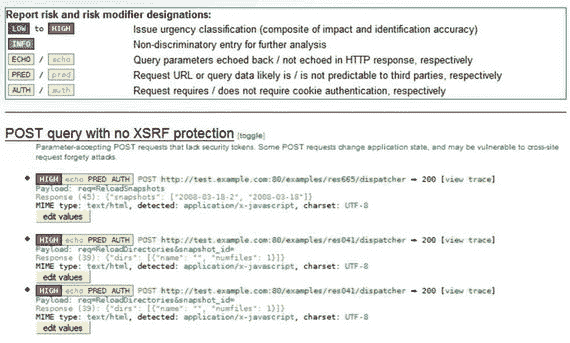

# 六、破坏网站

当执行渗透测试任务时，Web 应用程序通常是您的大部分发现的位置。Web 应用程序特别容易受到攻击，因为它们通常不会像其他服务那样受到保护。当一个组织将一个系统放入其基础设施中时，该系统通常位于防火墙之后。这可能是网络防火墙，也可能是驻留在系统本身上的主机防火墙。Web 应用程序的特点是它们是位于开放端口上的程序。它们被明确地暴露在防火墙之外，因为它们存在的意义就在于为防火墙另一侧的用户提供服务。这与向公司内部的用户开放文件共享端口完全不同，因为虽然内部可能有恶意用户，但人数要少得多，也更容易监控。

出于本章的目的，由于界限变得相当模糊，我们将讨论使用基于 Web 的技术交付的编程功能。这意味着用户正在使用 Internet Explorer、Chrome 或 Firefox 等浏览器来使用其他地方提供的功能。程序代码的任何执行都可以发生在用户的浏览器中或通信的服务器端。虽然浏览器通常被认为是一个查看器，有时被称为瘦客户端，但有相当多的功能可以在浏览器中处理，而不需要在服务器端执行任何操作。当我们谈论 Web 技术时，我们谈论的是超文本传输协议(HTTP)、超文本标记语言(HTML)、可扩展标记语言(XML)以及可以在服务器端运行的编程语言，如 Java。NET 语言或 PHP。此外，Web 应用程序可能会在客户端(用户的浏览器)使用 Javascript。移动应用程序逐渐取代了浏览器中的瘦客户端应用程序，但通信流和后端系统最终往往是一样的。

还有其他与网络应用相关的网络安全挑战。在某些方面，它几乎就像一个一站式商店，因为如果攻击者能够破坏 Web 应用程序，攻击者就可以访问它背后的数据库，而该数据库可能包含用户名、密码、信用卡、地址和许多其他可能有用的个人信息。Web 应用程序是通向信息库的大门，信息库可能被窃取、修改或破坏。这使它们成为一个目标，而且在许多情况下是一个容易的目标，因为传统的网络防火墙没有做任何事情来抵御这些攻击，因为它们通常看起来就像普通的 Web 流量一样。

永远记住潜在攻击者的目标。在信息技术或信息安全行业工作了很长时间的人可能会继续对对手是谁以及他们在追求什么有古怪的想法，认为这些是在父母的地下室里玩电子游乐设施的孩子。这一点毋庸置疑，因为了解真正的对手是谁将有助于让人们明白为基础架构提供足够保护的重要性。通常，对手是有资金和动机的。这是一项业务，他们追求任何可以用来盈利的东西，无论是可以出售用于身份盗窃的个人数据，还是可以用作网络农场或出租的攻击农场的系统。数据存在的任何地方都肯定是目标。

使 Web 应用程序成为攻击者和渗透测试者的目标丰富的环境的另一个问题是，有太多许多年前编写的 Web 应用程序没有得到更新，因为它们仍然工作得很好。这些应用程序中有许多是在对与保护 Web 应用程序相关的挑战有很好的理解之前编写的。

作为一名研究 Web 应用程序攻击的渗透测试人员，有一种方法可以提供很大的价值，那就是鼓励与您合作的公司开发能够提供更多攻击保护的应用程序代码。鼓励公司实现更强大的应用层防御，如 Web 应用防火墙和库，以便更好地验证用户输入，这将使这些公司处于更有利的位置，以击退他们所面临的对手。这也会让你处于一个有利的位置，因为如果你能帮助他们变得更好，他们会继续回来找你，因为你让他们花的钱物有所值。从长远来看，没有人喜欢这样的人，他把石头扔进所有的窗户，却没有至少指出玻璃店在哪里。

理解 Web 应用程序的通用架构将有助于您更好地理解您正在测试的是什么。毕竟，不是所有的攻击都是相同的，因为每个攻击都可能针对架构中的不同元素。一旦您看到了这个架构，您就可以很好地理解当今存在的一些常见攻击。Web 应用程序攻击的一个问题是，定期会出现新的攻击。随着越来越多的技术被开发出来，使得应用程序变得更加有趣和有用，更多的攻击成为可能。这是一个非常可靠的经验法则。从开发人员开始向 Web 应用程序添加功能的那一刻起，他们就降低了应用程序抵御攻击的能力，除非他们特别关注提高其安全性和保护能力。更多的代码和与用户更多的交互意味着更多的复杂性，而复杂性总是安全性的敌人。

## 网络架构

在这一节中，我们将回顾实现 Web 应用程序的一些常见方法。显然，当你开始测试越来越多的应用程序时，你会遇到分歧。同样重要的是要认识到，我们将着眼于逻辑架构，而不是物理架构。当涉及到物理实现时，逻辑组件可能分布在几台计算机上，或者所有的逻辑功能可能存在于单个硬件系统中。还需要考虑虚拟机。在很大程度上，物理架构与攻击应用程序无关。组件在哪里并不重要，尽管有些实现可能比其他实现更容易受到攻击。

最终，任何 Web 应用程序的目标都是为用户提供服务。因此，无论应用程序在拥有它的企业中是什么样子，用户都是等式的一部分。用户的 Web 浏览器是应用程序的界面。图 [6-1](#Fig1) 显示了一个典型的 Web 应用程序的逻辑架构。左边是用户系统，它是用户界面，有时被称为应用程序的表示层。您正在查看的模型有时被称为 n 层模型。左边是装有网络浏览器的客户端计算机。它通常通过互联网连接到 Web 服务器。在企业内部使用的 Web 应用程序的情况下，有时称为内部网，这种连接不会发生在互联网上，而是发生在企业的本地网络上。我们将在本章的后面讨论这个模型的其余层。



图 6-1。

Web application architecture

Web 应用程序在体系结构中的所有系统上运行，每个系统可能都有编程组件；因此，可执行代码可以驻留在架构内的任何地方。这增加了复杂性，带来了潜在的错误和漏洞，但也增加了可以用来更好地保护应用程序的层。在客户端，笔记本电脑所在的地方，可能有一些 Javascript。这可以用来验证输入，或者简单地使界面的呈现更好、更用户友好。

浏览器知道如何呈现从 Web 服务器获得的超文本标记语言(HTML)。Web 服务器通过使用超文本传输协议(HTTP)传输 HTML 文档来与浏览器通信。HTTP 是一种可以被人直接读写的明文协议，在传输 HTML 文档本身之前，它使用报头来指示请求的内容和提供的内容。协议本身指出了可以使用的报头及其含义。它没有指定 HTTP 可以承载什么，因为 HTTP 头本质上封装了数据或媒体。部分头将指定内容是什么，以便告诉客户端(浏览器)预期的内容，从而可以正确解析内容。下面的示例头集包括请求和从服务器返回给客户端的响应，请求是客户端发送的 HTTP，用于向服务器指示请求的内容:

```
GET / HTTP/1.1
Host: www.microsoft.com

HTTP/1.1 200 OK
Server: Apache
ETag: "6082151bd56ea922e1357f5896a90d0a:1425454794"
Last-Modified: Wed, 04 Mar 2015 07:39:54 GMT
Accept-Ranges: bytes
Content-Length: 1020
Content-Type: text/html
Date: Wed, 30 Mar 2016 01:28:59 GMT
Connection: keep-alive

```

请求的第一部分是指示客户机如何与服务器交互的动词。最常见的是，你会看到`GET`或`POST`，这取决于你是请求还是发送信息。令人困惑的是，`GET`和`POST`可能可以互换使用，但在概念层面上，`GET`请求是您在请求内容时发送的请求，如果您正在向服务器发送数据，例如您填写了一个表单并将其内容发送给服务器进行处理，您将发送一个`POST`。在动词之后，客户端指示它正在请求的资源的路径。资源的路径是客户端正在使用的 HTTP 版本。由于我们使用的是 HTTP 1.1 版，协议要求下一行包含所请求的网站名称，因为 HTTP 1.1 协议允许在同一地址托管多个网站。有了客户端提供的主机名，Web 服务器就可以传送正确的内容。

在图中，第二个文本块是服务器返回给客户端的响应。在响应中，第一行指示 HTTP 的版本，然后是响应代码和一条指示响应代码含义的短消息。这个特殊的响应代码是您最有可能看到的代码，因为它表示成功。还有许多其他的响应代码，组合成数百个。例如，如果您要获得一个 500 级的消息，它将指示 Web 应用程序中的一个错误。如果你看到一个 100 级的消息，它将是一个信息性的消息，而 200 级的消息将表示成功。服务器提供的其余头是关于服务器将提供给客户机的内容。

### 业务逻辑和数据

Web 服务器的背后是业务逻辑层，为了提供容错、冗余或负载平衡，Web 服务器实际上可以是多个 Web 服务器。这是程序实际存在的地方。Web 服务器与客户机通信以提供一个接口，但是业务逻辑层包括所有的程序组件，告诉应用程序如何与用户交互。这可以包括识别用户和确定如何向用户呈现信息。例如，用户可能有能力改变界面的外观以最适合他或她的需要。应用服务器，无论是。NET、Java、Ruby on Rails 或其他类型的应用服务器将负责查找用户的信息，并决定将什么 HTML 发送给用户，以使界面看起来像用户想要的样子。

HTML 的挑战之一是它是无状态的。HTML 中没有任何东西可以维护一个身份和一个应用程序状态，以指示客户端在特定对话中的位置。在使用 Web 界面并要求用户登录的应用程序中，服务器无法知道用户是否成功通过了身份验证。HTTP 根本无法跟踪这一点。然而，HTTP 确实提供了创建头字段和传递参数的能力。这两个特性允许应用程序在客户端之间传递信息。一种方法是使用 cookies。查看以下标题，包括一个`Set-Cookie`标题:

```
Status=OK - 200
Cache-Control=no-store
Pragma=no-cache
Content-Length=1364
Content-Type=application/x-javascript
Expires=Wed, 31 Dec 1969 23:59:59 GMT
Last-Modified=Sat, 02 Apr 2016 00:28:15 GMT
Accept-Ranges=bytes
Server=Microsoft-IIS/8.5
Set-Cookie=HumanClickSiteContainerID_72961245=Secondary5; path=/hc/72961245
p3p=CP="NON BUS INT NAV COM ADM CON CUR IVA IVD OTP PSA PSD TEL SAM"
Date=Sat, 02 Apr 2016 00:28:14 GMT

```

一旦设置了 cookie，它就存储在客户机上，以后可以检索。使用 cookie，客户端可以提供身份验证已经发生的证据。认证完成后，服务器在客户机上设置一个 cookie。当客户机与服务器通信时，它将 cookie 传回以证明它已经通过了身份验证。如果 cookie 没有被适当地绑定到存储它的系统，它可能会被其他人使用。这也是为什么浏览器可以防止第三方网站访问 cookies 的原因之一。如果这些没有到位，恶意网站将能够很容易地获取它们，并使用它们来访问您之前已经验证过的网站。

应用服务器特别负责创建发送给客户机的 cookies。然后，应用服务器需要检查 cookie，并跟踪它所处的任何状态。例如，如果你正在买东西，服务器需要知道你是谁，以便确定你是否临时存储了一件商品，以便以后付款。应用服务器负责处理使这些功能正常工作所需的所有逻辑。应用服务器需要一个地方来维护持久信息。通常，这将使用关系数据库服务器来完成。结构化查询语言(SQL)用于处理向数据库服务器添加数据和从数据库中检索数据。

我们使用的数据库，通常称为 SQL 数据库，实际上是关系数据库。SQL 是用于与这些数据库交互的语言。这些被称为关系数据库，因为它们通常是这样创建的，即数据库中的表通过键字段之间的关系与其他表相关联。有许多方法来处理数据在磁盘上的存储，这是留给供应商来实现的。作为与数据交互的语言，SQL 本身是相对标准化的。

应用服务器需要知道如何与数据库服务器交互。如果两台服务器在不同的计算机系统上，这意味着两台服务器之间需要网络连接。这也意味着应用程序服务器需要存储认证信息，以便能够登录到数据库服务器。如果攻击者能够危及应用服务器的安全，那么攻击者就可以获得该身份验证信息。它可以被检索并用于直接攻击数据库，而不需要通过 Web 服务器和应用程序服务器。

该体系结构中还有其他潜在的漏洞。许多应用服务器，尤其是 Java 应用服务器，通过 Web 界面利用控制台进行管理。这些控制台通常可以通过一个独立的网络端口进行访问，该端口不同于应用服务器监听客户端请求的 Web 端口。体系结构前面的任何防火墙都应该阻止来自 Internet 的对该端口的访问，但是如果防火墙配置错误，或者攻击者能够访问 Web 服务器，他们就能够访问应用服务器控制台。这可能允许攻击者部署应用程序档案，然后让他们更直接地访问应用程序服务器。

### 建筑保护

虽然图 [6-1](#Fig1) 中的图表显示了一个典型的应用程序设置，但它忽略了一些细节，而这些细节既可以提高性能，又可以提供额外的安全性。Web 服务器前面通常是网络防火墙。这种网络防火墙将阻止对除 Web 服务器上必要端口之外的所有内容的访问，这些端口通常是 80 和 443。当然，这种方法的问题是，如果有人攻击 Web 服务器，他们很可能会攻击应用层本身，这意味着流量将从端口 80 或 443 进入。因此，典型的网络防火墙通常不会为 Web 服务器提供真正的保护，除了阻止它不应该监听的端口。

您在图中看到的 Web 服务器可能根本不是传统意义上的 Web 服务器，这意味着它可能不是运行 Apache、Nginx 或 IIS 作为 Web 服务器软件的 Linux 或 Windows 系统。相反，它可能是一个硬件设备，接收 Web 请求，然后将它们传递给后面的一组 Web 服务器。这些设备被称为负载平衡器，用于防止单个 Web 服务器被请求淹没。负载平衡器的工作是将请求分散到位于负载平衡器后面的不同 Web 服务器上。负载平衡器本身实际上可以是多个设备。该体系结构可以使用多个负载平衡器来处理大量的 Web 请求，并且如果一个负载平衡器出现故障，至少还有一个负载平衡器来接收请求，直到出现故障的负载平衡器可以重新联机。

防火墙和 Web 服务器之间的另一个组件是 Web 应用防火墙(WAF)。Web 应用程序防火墙用于拦截所有 Web 请求，以确定它们是否遵循适当的 HTTP 规则，并确定请求中是否有任何可能是攻击流量的内容。它使用模式匹配来做到这一点。当我们稍后查看不同类型的攻击时，您将对 WAF 可能寻找的模式类型有所了解。通过位于客户机和 Web 或应用服务器之间，WAF 有能力拒绝请求，如果它看起来可能是恶意的，并可能导致数据泄露。当然，像这样坐在中间，不得不基于模式匹配做出决定，WAF 有可能会降低 Web 通信的速度。

了解 Web 体系结构中的不同层非常重要，因为您可能需要使用特殊的技术来让您的攻击穿透应用服务器或数据库服务器。

### 异步 Javascript 和 XML (AJAX)

传统上，与 Web 服务器的交互需要用户点击一个链接，键入一个地址，或者点击一个提交按钮，然后交互才返回给用户。这在很大程度上是一种用户驱动的模型，您可能会认为它本质上是“拉动式”的。为了让任何网页获得新内容，用户必须向 Web 服务器发出请求，并等待响应。这对现代的交互式网络应用来说是不够的，尤其是当它们要取代本地客户端应用的时候。现代的 Web 应用程序要求服务器能够监控客户机的行为，比如移动鼠标，然后定期将数据推送到客户机。至少，应该有一种方法可以让客户端从 Web 服务器获取数据更新，而不需要用户发出手动刷新命令或单击链接。

这就是异步 Javascript 和可扩展标记语言(XML)的用武之地。异步 Javascript 和 XML (AJAX)利用浏览器中运行的 Javascript 定期向 Web 服务器发出更新请求。使用 XML 将更新发送回浏览器，而不是用 HTML 创建一个全新的网页。然后，XML 用于更新显示的页面中包含的数据，而不改变页面本身的 HTML。在下面的代码中，您可以看到脸书发出的对其中一个请求的响应。您可能会注意到，当您查看脸书网站上的页面时，该页面会不时自动更新。它能做到这一点是因为它有 Javascript 在后台安静地运行，定期从服务器取回数据。

```
Status=OK - 200
Pragma=no-cache
Cache-Control=private, no-cache, no-store, must-revalidate
Expires=Sat, 01 Jan 2000 00:00:00 GMT
Content-Type=application/x-javascript; charset=utf-8
x-content-type-options=nosniff
x-frame-options=DENY
Vary=Accept-Encoding
Content-Encoding=gzip
x-fb-debug=b0AT4soImxp7cwHkRXb5WBgj/8cn1RuBK6F2bbjDDCfj4ex0VPZUpJbngipmK9enhnXdMWQrY6Lp4LZFjFcF/g==
Date=Sun, 03 Apr 2016 21:00:32 GMT
Content-Length=1256
X-Firefox-Spdy=h2

```

了解现代 Web 应用程序使用 AJAX 可能会为您提供一种额外的方法，通过干扰或操纵这些 AJAX 请求和响应来操纵服务器。

## 常见的 Web 应用攻击

开放 Web 应用程序安全项目(OWASP)负责跟踪当前的 Web 应用程序漏洞。你可以通过访问他们的网站获得最新的列表。我们将看看一些更常见的网络漏洞。除了查看攻击的结构，我们还将讨论攻击针对架构的哪个方面。

### 跨站点脚本(XSS)

跨站点脚本(XSS)攻击是一种针对客户端系统的注入式攻击。可以在网页浏览器中运行的脚本语言，如 Javascript，被注入到网页中。然后，不知情的用户会访问该页面，攻击者提供的脚本会在用户的浏览器中运行。有两种类型的 XSS 攻击。第一种叫做存储的或持久的 XSS。这意味着攻击者已经设法将脚本存储在数据库中，以便当用户访问网站时，脚本显示在网页中。例如，这可能在博客帖子的评论栏中。因为脚本是由浏览器处理的，所以用户永远看不到它，甚至不知道它正在运行。有了这样的攻击，你可以在网站上种下种子，然后等待不知情的用户访问来获得好处。

第二种类型的 XSS 攻击称为反射攻击。利用反射攻击，攻击者创建一个 URL，并在 URL 中嵌入脚本，调用易受 XSS 攻击的页面。对于这种攻击，攻击者需要用包含脚本的参数创建 URL，然后将其发送给用户。这可以通过在基于 HTML 的消息中使用附加脚本来隐藏实际 URL 的电子邮件来完成。因为额外的参数和脚本可能会泄露它。

攻击本身非常简单。您提供了一组 HTML 标记，表明您有一个脚本。当它出现在 Web 浏览器中时，浏览器会看到脚本标签并运行标签中的内容。一个非常简单的例子是:

```
<script>alert('this page is vulnerable to XSS');</script>

```

这不是很有趣，因为它所做的只是弹出一个对话框，说“该页面易受 XSS 攻击”，这肯定会提醒用户发生了一些事情。更有趣的是编写从用户那里窃取信息的 Javascript。由于来自第三方的页面不应该能够窃取代表其他站点存储的信息，您可以使用 XSS 攻击来收集这些信息，然后将其传输到另一个站点，攻击者稍后可以在那里收集这些信息。这方面的一个例子是这样的:

```
<script>document.write('')</script>

```

这个小攻击使用`document.cookie`从页面获取 cookie，并将其嵌入到一个 URL 中。URL 位于图像标签中，这意味着浏览器将向该 URL 发送请求。URL 甚至不必存在，因为请求将被放入日志中，稍后可以解析该日志以获取 cookies 和 IP 地址。在多个站点受到攻击的情况下，对`goodsite.php`的引用可以指示 cookie 来自哪个站点。当然，使用这种技术也有可能窃取其他信息。

像在`document.write`或`document.cookie`中一样，使用`document`后跟一个方法或属性，这就是文档对象模型(DOM)。DOM 是一种将 Web 页面转换成可以使用 document 对象访问的对象集合的方法。此外，文档有类似于`write`的方法，可以访问这些方法来对文档执行操作。在我们的例子中，我们从该脚本所在的文档中收集 cookie，并使用`write`方法将 cookie 放入 URL，这将最终将 cookie 发送到恶意服务器。

XSS 攻击源于未正确验证的输入。在大多数情况下，没有理由接受 HTML 标签作为输入。事实上，在大多数情况下，你不需要接受任何一个< or >作为输入。因此，Web 应用程序程序员应该对输入进行适当的调整，以确保这些类型的字符不被原样接受，而是被转换为更安全的选项，如 HTML 变体`&lt;`和`&gt;`，它们让浏览器呈现小于和大于字符，而不实际使用这些字符，因为它们可能被解释为试图创建 HTML 标记。

### SQL 注入

SQL 注入攻击是针对数据库服务器的攻击，攻击者将代码传递到数据库中，由数据库服务器本身直接执行。结构化查询语言(SQL)代码被插入到网页上的表单中，SQL 被一路传递回数据库，并在那里执行。为了了解这种特定的攻击是如何工作的，让我们来看看一些非常简单的代码，这些代码旨在获取用户列表，其中字段`username`等于传递给这段特定代码的值:

```
$query = "SELECT * FROM users WHERE username = '" + $username "';";
$result = mysql_query($query);

```

正常情况下，剧本会把弗雷德、伍布尔、珍妮特、阿提克斯或佐伊作为例子。如果您提供用户名，您将获得与您提供的用户名相关的所有信息。相反，如果您提供一段 SQL 来改变查询，就像下面这样，您将得到完全不同的结果:

```
' OR '1' = '1

```

一旦用变量进行了所有替换，您最终得到的是一段如下所示的 SQL:

```
SELECT * FROM users WHERE username = '' or '1' = '1';

```

该查询的重要部分是`'1' = '1'`部分，因为`OR`告诉 SQL 评估所有行以确定整个语句的真实性。我们可能永远不会遇到用户名为空(`''`)的情况，但是`'1'`将总是等于`'1',`，所以数据库中的每一行对于这样的语句都是真的。因此，根据脚本的结果部分是如何创建的，您可能会得到一个完整的`users`表转储。

SQL 注入攻击最重要的部分是大致了解 SQL 可能是什么样子。最终，您需要做的是完成现有的 SQL，以便执行的语句有意义。如果试图缩短传递给数据库的 SQL 的一部分，可以使用注释字符。这意味着您可能需要知道应用程序下面的数据库服务器是什么。不同的数据库服务器使用不同的字符序列来表示注释，但是注释总是被数据库服务器忽略。因此，如果您想让它忽略程序代码中您提供的内容之后的所有内容，您可以使用注释序列。根据您使用的服务器，注释可能会用`--`或`#`或`/* */`来表示。

SQL 注入攻击可能是所有网络攻击中最需要经验的，因为它们不像运行一大块 SQL 那么简单。您需要理解您要注入的表单域的作用，这样您就可以做出正确的选择，哪些 SQL 可以在那里工作，哪些不可以。然后，您需要知道基于数据库服务器的类型，哪些 SQL 语句将会起作用。收集这些信息的一种方法是触发一个错误。图 [6-2](#Fig2) 显示了一条错误信息，该信息是从一个显然使用 MySQL 作为其服务器的网站上获得的。我们可以这样说，因为函数调用被引用为错误发生的地方，`mysql_result()`。在这个特殊的错误中，我们还幸运地揭示了 Web 服务器上正在使用的目录结构。



图 6-2。

MySQL error message

SQL 注入漏洞通常是不正确的输入验证的结果。如果您使用的是特殊字符，如`--`、`;`、`#`或某些引用字符，则输入可能有问题。

这里讨论的许多攻击，尤其是 SQL 注入，可能需要大量的反复试验才能奏效。这涉及到很多因素，包括应用程序的过滤，这可能是不够的。

### 命令注入

像 SQL 注入一样，命令注入漏洞也可能是由于不正确地验证输入造成的。当用户通过输入字段发送操作系统命令时，就会发生命令注入攻击，由于 Web 应用程序处理输入的方式，即它将原始输入发送给操作系统进行处理，用户可以在服务器上执行操作系统命令。在大多数情况下，您不能仅仅将操作系统命令发送到输入字段中，但是在某些情况下，输入字段会触发与操作系统相关的东西，例如在您有一个控制面板应用程序的情况下。一些 Web 应用程序用于控制设备，因此它们可能需要将命令传递到操作系统中进行处理。图 [6-3](#Fig3) 显示了一个例子，这是一个无线接入点的诊断页面。此页面为管理员提供了 ping IP 地址的能力。该页面可能会将收集到的 IP 地址发送到操作系统，以便在那里使用 ping 实用程序，并返回显示输出。



图 6-3。

Using ping from a Web application

要利用此漏洞，您需要知道您使用的是什么操作系统。理想情况下，您应该允许正在执行的任何命令按预期运行，然后提供一个命令分隔符，这个字符告诉操作系统等待同一行上传递的另一个命令。命令分隔符表示第一个命令已经完成，第二个命令即将开始。在 Linux 系统中，这可能是`;`字符，在许多编程语言中可以用来表示第一条语句或命令的结束。您也可以传递`&&`来指示如果第一条语句成功，那么运行第二条语句。两个&符号一起构成一个逻辑`and`操作符。如果第一个命令失败，第二个命令将不会运行。

使用命令注入攻击，恶意用户可以执行 Web 用户有权在命令行上执行的任何操作。Web 服务器运行在特定用户的上下文中。命令注入攻击将在该用户的上下文中运行，因此用户可以通过命令注入攻击执行任何操作。这是使用尽可能少的权限运行 Web 服务器的众多原因之一。

### XML 外部实体攻击

一些 Web 应用程序利用可扩展标记语言(XML)将消息从客户端传递到服务器，反之亦然。如果攻击者能够拦截、操纵或创建这些消息，攻击者就能够将请求传递到服务器，服务器将会以类似于命令注入攻击的方式处理这些请求。这里显示了一个示例:

```
<?xml version="1.0" encoding="ISO-8859-1"?>
 <!DOCTYPE wubble [  
   <!ELEMENT wubble ANY >
   <!ENTITY xxe SYSTEM "file:///c:/boot.ini" >]><wubble>&xxe;</wubble>

```

这个小的 XML 示例将从 Windows 系统的 C:驱动器的根目录返回`boot.ini`文件的内容。在 Linux 系统上，您可能会传递类似于`/etc/passwd`的东西来获取系统上的用户列表。在这种情况下，我们使用`SYSTEM`标识符让 XML 解析器知道它应该使用系统用引用的外部实体的内容替换引号中的标识符。利用这种攻击，恶意用户可以从系统上的文件中收集内容，或者让系统从另一个网站检索信息。XML 外部实体攻击是针对进行 XML 解析的服务器的攻击。

### 点击劫持攻击

网页作为界面呈现给用户的内容已经变得非常复杂。实现这一点的一种方法是允许通过页面呈现多个层。然而，这种功能为所谓的点击劫持攻击打开了大门，在这种攻击中，攻击者创建一个模糊层，让用户在他们看不到的层上做一些事情。虽然看起来好像用户在点击一个东西，但是这个点击实际上被传递到了被遮蔽的较低层。用户可能会点击一个链接，他们认为这个链接会让他们参加免费抽奖，但实际上他们所做的是在脸书页面上点击一个产品的 Like 按钮。这让该产品获得了很多人为的喜欢。攻击者可能会在呈现给用户的人工按钮或链接下放置许多其他动作。这种攻击，因为它劫持了用户的点击，在某种程度上，实际上是对用户的攻击，这取决于用户在流氓层下真正点击的行为。

### 跨站点请求伪造

跨站点请求伪造(CSRF)攻击是针对用户的攻击。这种攻击使用包含隐藏请求的恶意网页。这有时被称为 POST 攻击的 GET。在大多数情况下，当您向 Web 服务器发送信息或请求它执行某个动作时，您发送的是一个`POST`请求，该请求通常通过单击一个按钮来触发。该按钮可能与一个 Web 表单相关联，这将触发在一个`POST`请求中向服务器发送所有表单数据。如果您有一个接受带有 URL 参数的`GET`请求的 Web 应用程序，您可以隐藏该请求，如下面的 HTML 所示。

```


```

img 标签将向服务器发出一个`GET`请求，由于它实际上并不检索图像，所以没有在页面上放置内容的风险。为了限制任何东西出现的风险，您可以将大小限制为 1 像素乘 1 像素，如示例所示。任何人都不会注意到一个像素。与此同时，你可以让页面看起来完全像任何吸引用户的东西。交易请求是在幕后处理的，尤其是如果用户最近登录了银行，所以有一个活动的身份验证 cookie，用户根本不知道它已经发生了。

防止这种攻击的一种方法是不允许通过`GET`请求进行编程访问。然而，`POST`请求不能使用 img 标签之类的东西来完成。相反，您需要一个可以由页面生成的操作。还可以使用其他保护措施，包括检查 referrer，这是一个指示请求来自哪个页面的标题。如果推荐人与您自己的域不匹配，最好不要允许请求继续。这些保护措施并非万无一失，但它们会使这类请求更加难以继续。

### 规避攻击

这种类型的攻击通常会与另一种攻击结合使用。这是一种格式化信息的方式，这样它可以通过一些程序性的输入检查。例如，如果有人在寻找`<script>`，而您提供了`%3Cscript%3E`，解析器将找不到它。这里没有使用字符`<`和`>`，而是展示了一种叫做 URL 编码的技术。许多字符不能在 URL 中使用，因为浏览器或 Web 服务器可能会错误地解释它们，并以您不希望的方式改变请求。而是使用替换字符。对于 URL 编码，您可以使用一个`%`来表示您有一个对应于 ASCII 值的十六进制值。为了解码，你在 ASCII 表中查找十六进制值，你将找到实际的字符。

在某些情况下，寻找输入错误的解析器可能相当严格。他们可能会寻找类似于`<script>`或`<SCRIPT>`甚至`%3Cscript%3E`的东西，但他们可能很难识别出`%3CScRiPt>`，因为它混合了各种情况，也混合了 URL 编码和非 URL 编码。

沿着 URL 编码的路线，您可以使用十六进制编码。通过使用`#x`和一个 ASCII 字符值，您提供了字符而没有提供实际的字符，因为`#x`是一个明确的指示符，表示有一个字符要出现。如果翻译发生在过滤器之后，您就已经完成了攻击。

因为您试图绕过程序员编写的过滤器和转换器，所以您需要找到一种传递信息的方式，这种方式与他们所寻找的方式有点不同。通过使用 URL 编码、十六进制编码、大小写混合以及其他操作和处理请求的方式，找到以不同方式组合数据的方法可能会超过他们正在寻找的列表。每种可能性都必须至少有一行代码。这非常耗时，所以你创建请求的方式越多，通过过滤器的机会就越大。

## 测试策略

有许多方法可以执行 Web 应用程序测试。一种简单的方法是使用 Web 浏览器并执行手动测试。然而，这限制了您从呈现给您的界面中可以访问的内容。最有趣的攻击通常发生在请求离开浏览器之后，到达服务器之前。拦截请求以进行修改的一个非常简单的方法是使用 Firefox 浏览器和 TamperData 插件。您可以在图 [6-4](#Fig4) 中看到使用中的 TamperData。TamperData 将向您呈现一个请求，该请求在从浏览器发送之后，但在通过网络发送之前发送到服务器。它将允许您对标题以及任何参数进行更改。



图 6-4。

TamperData in Firefox

虽然这是一项非常有价值的技术，但是使用起来也非常繁琐，尤其是对于来回传输大量请求的更复杂的 Web 应用程序。不断地将许多请求传递到不同的站点，包括分析页面，只是为了得到您确实想要操作的一个请求，这可能需要做大量的工作。使用自动化工具可能会比手动完成所有这些工作容易得多。有许多商业工具可以用来进行 Web 应用程序测试，但是也有免费的、开源的、低成本的替代工具，稍后会详细介绍。除了这些可以用来执行大量测试的自动化工具之外，还有一些程序可以在您浏览站点时，简单地位于您和执行测试的服务器之间。在某些情况下，这可能与您已经用来执行大量自动化扫描和测试的工具相同。然而，情况并非总是如此。

最后，您可能会对您的目标服务器进行模糊攻击。模糊攻击是一种向服务器发送意外或格式错误的请求，以查看应用程序如何处理它们的方式。您可以破坏应用程序，或者只是收集一些关于服务器或应用程序的附加信息，这些信息可用于其他攻击。

### 自动化工具

手动测试可能非常乏味，尤其是当您正在测试的 Web 应用程序具有任何规模时。在测试过程中，你需要得到一个网站上所有页面的完整列表。这个过程通常被称为爬行。你当然可以自己点击一个网站上的所有页面并记下来，但是让别人帮你做要容易得多。自动化工具将使这一过程变得更加容易。有许多程序或套件可以用来为您执行一些初始工作。这些工具包括商业工具和开源工具。虽然这些程序做的事情本质上是相同的，但是它们以不同的方式执行。你可以把它想成有不同的工作流程，你可能会发现一个比另一个更适合你的工作方式。

开放 Web 应用安全项目(OWASP)有一个 Web 应用测试工具，叫做 Zed 攻击代理(ZAP)。ZAP 充当代理，这意味着它拦截来自 Web 浏览器的请求，这些浏览器已经配置为使用 ZAP 作为 Web 代理，以便可以操纵这些请求。图 6-5 显示 Firefox 被配置为使用 ZAP 作为代理。一旦您在浏览器中配置了代理设置，来自浏览器的所有 Web 请求都将被发送到代理，以便转发到请求要到达的服务器。



图 6-5。

Proxy settings in Firefox

ZAP 不仅仅处理来自网络浏览器的请求。它也可以用来自己发起请求。ZAP 可以用来测试已知的漏洞，包括前面提到的那些。它通过向 Web 服务器发起请求，然后分析响应来做到这一点。除了在站点上运行主动扫描或蜘蛛，正如您在图 [6-6](#Fig6) 的上下文菜单中看到的，您还可以进行强制浏览。这意味着 ZAP 将试图定位网站中任何页面都不涉及的目录和文件。不提供页面链接可能是一种对搜索它的人隐藏它的方式。强制浏览将试图定位这些隐藏的测试资源。



图 6-6。

Using OWASP ZAP to attack

在图 [6-6](#Fig6) 中，您可以在窗口的下部看到一些扫描结果。发现有问题的请求会被标记出来。为了识别漏洞，ZAP 依赖于来自 Web 服务器的响应，包括错误代码和搜索响应中的特定单词。显示的一些请求被标记为中等风险问题，而其他请求被标记为低风险问题。与 Nessus 和 Nexpose 等自动漏洞扫描器一样，您需要手动验证 ZAP 识别的是有效的漏洞。

虽然有许多高价位的商业扫描仪，但有一种低价扫描仪有免费版本，而且功能很多，那就是 Burp Suite。Burp Suite 提供了一些非常好的功能，这是其他扫描仪无法以完全相同的方式提供的。其中之一是入侵者功能，它为您提供了一种以独特的方式与 Web 服务器进行交互的方式。您可以让 Burp Suite 将一个值列表传递到 Web 应用程序中，以便(例如)尝试暴力登录。在同一个功能中，Burp Suite 提供了许多不同的方法来操作传递给应用程序的值。使用入侵者，选择您希望 Burp Suite 操作的参数，如图 [6-7](#Fig7) 所示。



图 6-7。

Selecting parameters in Burp Suite

Burp 允许您获取它有记录的任何请求，并将该请求发送给入侵者函数。原始请求被发送到“入侵者”选项卡，在这里您可以对请求进行更改，然后选择参数。当您添加一个参数时，Burp 会用一个突出显示的参数名称替换请求中的原始值，并创建一个可以填充变量数据的位置。您将需要“有效负载”标签中的参数值。Burp 提供了许多不同的攻击类型，具体取决于您要替换多少个值，以及您是否希望使用不同的有效负载分别检查它们。以下是 Burp Suite 提供的攻击类型:

*   狙击手——这是一种使用单一有效载荷的攻击。如果有多个位置正在测试，所有位置都将在选定有效负载的情况下一次测试一个。
*   攻城锤——这种攻击也是单一有效载荷攻击。如果有多个位置，每个有效负载选项将同时放入所有位置，并发出请求。
*   pitchfork–pitchfork 攻击使用多个有效载荷，其中每个位置都用指定有效载荷集中的新有效载荷值同时测试。
*   集束炸弹——集束炸弹攻击也使用多种有效载荷，但不是同时测试每个位置，这是一种组合攻击。如果您有三个位置要测试，那么您将遍历有效载荷集中这三个位置的所有可能组合。使用这种方法并不是检查特定的应用程序如何响应无效的输入，而是检查应用程序如何响应输入集合。这种攻击是您尝试暴力登录时会选择的攻击，因为您希望对照每个密码检查每个用户名。

选择有效载荷`—`后，有许多预定义的有效载荷集，或者您可以创建自己的`—`您也可以选择任何操作，或有效载荷处理规则，您希望 Burp 对有效载荷进行处理。您可以使用这些操作进行更改，比如改变大小写、执行编码或解码，或者对发送到服务器的请求进行其他更改。在图 [6-8](#Fig8) 中，你可以看到可以添加到入侵者攻击中的有效载荷处理选项列表。



图 6-8。

Payload processing options in Burp Suite

当然，Burp 和 ZAP 都有很多这里没有提到的其他功能。当您使用这些工具或任何其他商业和开源测试工具继续深入 Web 应用程序测试时，您会发现您看到的是更高级的功能，例如更复杂的入侵者功能或 ZAP 的模糊功能。顺便说一下，这里提到的两个工具的一个优点是它们都可以在多个平台上运行，因为它们都是用 Java 编写的。如果你的系统支持 Java，它将运行这些程序。

不要因为扫描仪报告有问题就认为实际上有问题。在某些情况下，扫描器可能会出于完全良性的原因查看响应中存在的一段文本。在你报告发现之前，一定要核实你所发现的。您可以通过查看扫描仪的操作并尝试重复它来手动完成此操作，或者也可以像重新运行攻击一样简单。像 Burp 和 ZAP 这样的工具可以让你重放一个特定的请求，这样你就可以实时看到它做了什么。这些工具为您提供请求和响应。总是可视化地查看响应，这可能需要使用工具或外部浏览器来呈现响应，以便您可以看到行为，而不是试图可视化地解析大量的 HTML 和 Javascript。

### 被动扫描

像 ZAP 和 Burp Suite 这样的扫描仪很棒。他们有一个他们了解的攻击列表，他们将对目标运行这些攻击，看看会发生什么，以便确定是否存在漏洞。但是，当它们运行扫描时，噪音会很大。这意味着他们发送大量的流量到网站非常快。这意味着测试可以被检测到，这可能不是你想要发生的。另一种针对 Web 应用程序的方法是使用被动扫描器，如 rat proxy。Rat proxy 由专门研究被动扫描技术的 Michal Zalewski 编写。Zalewski 认为，无需执行任何攻击或发送任何可能泄露您正在做什么的流量，就可以确定目标的许多信息。他还有另外一个工具，叫做 p0f，可以用来评估网络流量。顾名思义，Rat proxy 就像代理一样工作，就像 ZAP 和 Burp Suite 一样。您将浏览器配置为通过 rat 代理运行，并让 rat 代理根据它看到的内容做出一些决定。您可以在图 [6-9](#Fig9) 中看到一个示例报告。



图 6-9。

Rat Proxy report sample

Rat proxy 确定与发现相关的潜在风险，然后向您提供一些想法，说明它为什么将特定请求标识为有问题。为了验证 rat 代理发现，您必须查看报告中提供的跟踪。缺点是，如果你可以这么说的话，rat 代理要工作，你需要通过它发送请求。没有自动抓取或扫描来查看页面。它根据通过它发送的页面进行所有评估。简而言之，为了让 rat 代理工作，您需要与您试图测试的服务器进行交互。

## 实践网站

在您尝试使用这些工具和技术对付付费客户之前，您可能想在实践环境中尝试一下。幸运的是，有几种方法可以做到这一点。你可以为你的任何操作系统免费获得一个像 Apache 这样的网络服务器，并建立一个你自己的网站。一旦你有了一个网站，你就可以开始填充内容(和漏洞)。或者，您可以对许多开源 Web 应用程序进行测试。任何像 Drupal 或 WordPress 这样的内容管理系统都是一个很好的目标，因为它们有很多潜在的编程元素，你可以与之交互。另外，一般来说，在默认安装中有很多页面，您无需做太多工作就可以使用。

然而，这种方法的问题在于，你可能会付出很多努力，却得不到很多满足感。如果您使用的是最新版本的网络软件，这一点尤为重要。更好的方法是建立一个内置漏洞的网站。幸运的是，这样的网站随处可见。Web Goat 是一个很好的起点，它是一个 Java Web 应用程序，提供了一个研究攻击技术的地方。这有点像教程，因为你可以得到一些提示来帮助你。Web Goat 是 OWASP 提供的，就像 ZAP 一样。Web Goat 还提供了一些案例视频，展示了攻击在 Web Goat 中是如何进行的。这是一个以高度互动的方式学习如何进行网络攻击的好方法。

如果你只是想把一些页面安装到一个 Web 服务器上，这样你就可以使用它们了，这里也有一些选项。一个很好的选择是该死的易受攻击的 Web 应用程序(DVWA)。DVWA 提供了您可以处理的不同类别的攻击类型。DVWA 的一个优点是你可以调整它的安全级别。这使得应用程序更难被利用。如果你从一个低设置开始，你应该能够得到一个非常简单的攻击工作。如果你达到中等强度，你可能需要使用一些躲避技巧来使攻击有效。您还可以在 Web 应用程序上看到入侵检测系统的行为，因为 PHP-IDS 是 DVWA 安装的一部分。bWAPP 是与 DVWA 类似的另一个易受攻击的 Web 应用程序。

谷歌还维护着一个名为 Gruyere 的易受攻击的网络应用。Gruyere 是一种多孔奶酪，只是为了解释名字中的笑话。如果你不想安装和维护你自己的 Web 服务器，Gruyere 可能是一个不错的选择，但是它的组织方式和刚才提到的不一样。没有明确的类别可以让你知道应该尝试哪种攻击类型。相反，如果您在线连接到 Gruyere 应用程序(有一个版本您可以自己安装)，您将看到该应用程序的一个实例，并且您必须找到存在的不同漏洞。幸运的是，如果你真的陷入困境，有一些关于这个应用程序的页面会给你一些帮助。

## 摘要

Web 应用程序无处不在，这就是为什么学习如何攻击它们是如此重要的技能的原因之一。与前几章讨论的其他类型的攻击非常相似，让 Web 应用程序以一种有用的方式崩溃需要来自大量经验的技能，以及大量的反复试验。你当然可以将扫描仪对准网络应用程序，你会得到一些结果，但这些结果可能不是很准确。最好以理解 Web 应用程序架构为起点。并非所有的 Web 应用程序都是以相同的方式设计的，但是您通常可以预期有一个 Web 服务器在端口 80 或端口 443 上处理 HTTP 请求。Web 服务器背后是一些应用程序逻辑。这可以使用运行在 Web 服务器上的语言来完成，比如 PHP，也可以在使用 Java 或。网络语言。在应用程序逻辑的背后通常是一个数据库，其中存储了应用程序的所有持久数据。这可能包括客户信息、登录信息，或者只是应用程序从中提取以生成页面的内容集合。数据库是一切的幕后推手，因为一般来说，数据库是最敏感信息所在的地方，所以它应该是最难访问的系统。

虽然许多攻击归结于不正确地验证用户的输入，但是攻击 Web 应用程序有许多不同的方式，并且不同的攻击可能集中在应用程序体系结构的不同方面。例如，SQL 注入攻击的目标是数据库，而跨站点脚本攻击的目标是客户端或用户。并非所有的攻击类型都是相同的，由于应用程序有如此多的级别，因此很有可能造成混乱并引发问题。

有许多程序可用于执行 Web 应用程序测试。这些包括你的网络浏览器插件，以及本质上是独立测试套件的商业工具。你可以使用低成本或免费的选项，如 ZAP 或 Burp 套件。你的一些决定将归结于你有多少预算和你需要做的有多彻底。随着您获得更多的工作，如果您发现它们更适合您的工作流程以及您对攻击的看法，您可能会升级到更昂贵的工具。最终，最重要的方面是找到你想要的工作方式，因为当你使用这个工具时，你会有一些安慰。当然，您选择的工具还需要能够生成利用漏洞的攻击，要么允许您自己创建它们，要么让工具为您进行攻击。如果你发现一个评价很高的工具，而你对它不是很熟悉，你可能不会像使用一个你很熟悉的工具那样从中获得很多。

幸运的是，当您开始时，有很多选择可以获得用于实践和培训的测试环境。您可以使用安装在您自己系统上的真实、实时的 Web 应用程序，或者您可以抓取故意破坏的 Web 应用程序，以便确保您能够侵入它们。OWASP 维护着这些应用程序的列表，您可以在那里找到您喜欢的应用程序。

最后，在这里需要注意的是，你永远不应该在你没有控制或者没有得到网站运营商的许可去扫描的网站上运行任何主动的测试、扫描或者爬行。未经许可运行这些工具是引起执法机构注意的好方法。永远保持在本地。

## 练习

1.  获取一个该死的易受攻击的 Web 应用程序或 Web Goat 的副本，并尝试利用一些内置的漏洞。
2.  下载 OWASP Zed 攻击代理的副本。使用 ZAP 浏览一些网站，看看它的表现如何。不要运行任何攻击。
3.  下载一份打嗝套装。浏览一些使用 Burp Suite 的网站，看看它的表现如何。不要运行任何攻击。
4.  在您控制的系统上安装 Web 应用程序。用 ZAP 用主动扫描攻击它。
5.  在您控制的系统上安装 Web 应用程序。使用 Burp 套件通过主动扫描来攻击它。