# 一、NMAP 简介

漏洞评估和渗透测试变得越来越重要，尤其是在最近几年。组织通常拥有存储敏感数据的复杂资产网络。这些资产暴露在来自组织内部和外部的潜在威胁之下。为了全面了解组织的安全状况，进行漏洞评估是必不可少的。

理解漏洞评估和渗透测试之间的明显区别很重要。为了理解这种差异，让我们考虑一个真实的场景。你注意到邻居的门没有锁好，而且邻居不在家。这是一个漏洞评估。现在，如果你真的打开邻居的门，进入房子，那么这是一个渗透测试。在信息安全环境中，您可能会注意到 SSH 服务正在使用弱凭证运行；这是漏洞评估的一部分。如果你真的使用这些凭证来获取访问权限，那么这就是一个渗透测试。执行漏洞评估通常是安全的，而渗透测试如果不以受控方式执行，可能会对目标系统造成严重损害。

因此，漏洞评估是进行渗透测试的基本前提之一。除非您知道目标系统上存在哪些漏洞，否则您将无法利用它们。

执行渗透测试需要一个计划周密的方法。这是一个多步骤的过程。以下是渗透测试的一些阶段:

*   信息收集:信息收集是渗透测试生命周期中最重要的阶段。这个阶段也被称为*侦察*。它涉及使用各种被动和主动技术来收集尽可能多的关于目标系统的信息。详细的信息收集为渗透测试生命周期的后续阶段奠定了坚实的基础。

*   *枚举*:一旦你有了目标的基本信息，枚举阶段就使用各种工具和技术来详细探查目标。它包括找出在目标系统上运行的确切服务版本。

*   *漏洞评估*:漏洞评估阶段包括使用各种工具和方法来确认目标系统中已知漏洞的存在。

*   *获得访问权限*:从上一阶段开始，您已经有了目标可能存在的漏洞列表。现在，您可以尝试利用这些漏洞来访问目标系统。

*   *提升权限*:您可以通过利用特定的漏洞来访问您的目标系统；但是，访问可能会受到限制。要渗透得更深，您需要使用各种技术，并将权限提升到最高级别，如管理员、root 等。

*   *保持访问权限*:既然你已经努力获得了目标系统的访问权限，你当然会希望它持续下去。这个阶段包括使用各种技术来使对目标系统的访问持久化。

*   *覆盖轨迹*:渗透过程可能会创建垃圾文件、修改配置文件、更改注册表项、创建审计日志等等。掩盖你的踪迹包括清理掉之前阶段留下的所有痕迹。

为了在这些阶段执行各种任务，有数百种工具、脚本和实用程序可用。Kali Linux 等 Linux 发行版甚至提供捆绑工具来执行这些任务。

被可用的工具数量淹没是很自然的。然而，有一些工具非常强大和灵活，它们可以单独执行所有这些阶段的大多数任务。

这本书是关于三个这样的工具:NMAP、OpenVAS 和 Metasploit。仅仅拥有这三个工具就可以提供广泛的渗透测试能力。

表 [1-1](#Tab1) 描述了如何在渗透测试生命周期的不同阶段使用这些工具。

表 1-1

笔测试阶段的工具

| 

渗透测试阶段

 | 

工具

 |
| --- | --- |
| 情报收集 | NMAP，metasploit |
| 枚举 | NMAP，metasploit |
| 脆弱性评估 | open vas！open vas！open vas |
| 获得访问权限 | 渗透测试指南 |
| 提升权限 | 渗透测试指南 |
| 保持访问 | 渗透测试指南 |
| 覆盖轨道 | 渗透测试指南 |

从这个表中可以明显看出，这三个工具能够在渗透测试生命周期的所有阶段执行任务。

这本书关注这三个工具，并帮助你开始了解这些工具的基础知识。这一章将涉及 NMAP。

## NMAP(消歧义)

既然你对渗透测试生命周期的不同阶段以及需要什么工具有了一个相当好的想法，让我们继续我们的第一个工具，NMAP。您将了解 NMAP 的各种特色，包括以下内容:

*   安装 NMAP

*   通过 ZENMAP 使用 NMAP

*   了解 NMAP 港口国

*   用 NMAP 进行基本扫描

*   了解 TCP 扫描与 UDP 扫描

*   枚举目标操作系统和服务

*   微调扫描

*   使用 NMAP 脚本

*   从 Python 调用 NMAP

### NMAP 安装

NMAP 可以安装在基于 Windows 和 Unix 的系统上。要在 Windows 上安装 NMAP，只需进入[`https://nmap.org/download.html`](https://nmap.org/download.html)*下载可执行文件并安装即可。*

 *对于基于 Unix 的系统，您可以从命令行安装 NMAP。像 Kali Linux 这样的安全发行版默认安装了 NMAP。但是，对于其他常规发行版，需要单独安装。

对于基于 Debian 的系统，你可以简单地使用命令`apt install nmap`，如图 [1-1](#Fig1) 所示。此命令将安装 NMAP 以及所有必需的依赖项。

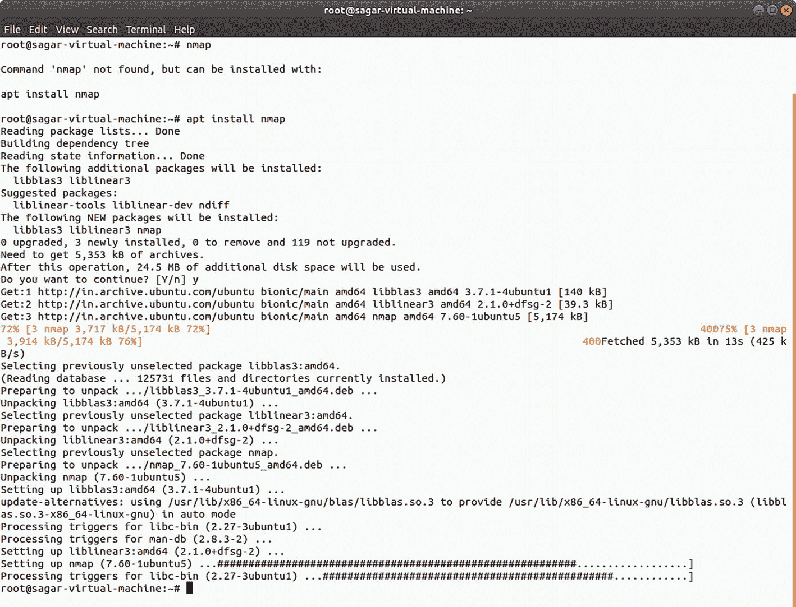

图 1-1

在基于 Debian 的系统上安装 NMAP

### NMAP 和 ZENMAP 简介

NMAP 最初是一个命令行实用程序。在 Linux 终端上，您可以简单地输入命令`nmap`来开始。图 [1-2](#Fig2) 显示了`nmap`命令的输出。它显示扫描目标需要配置的各种参数和开关。

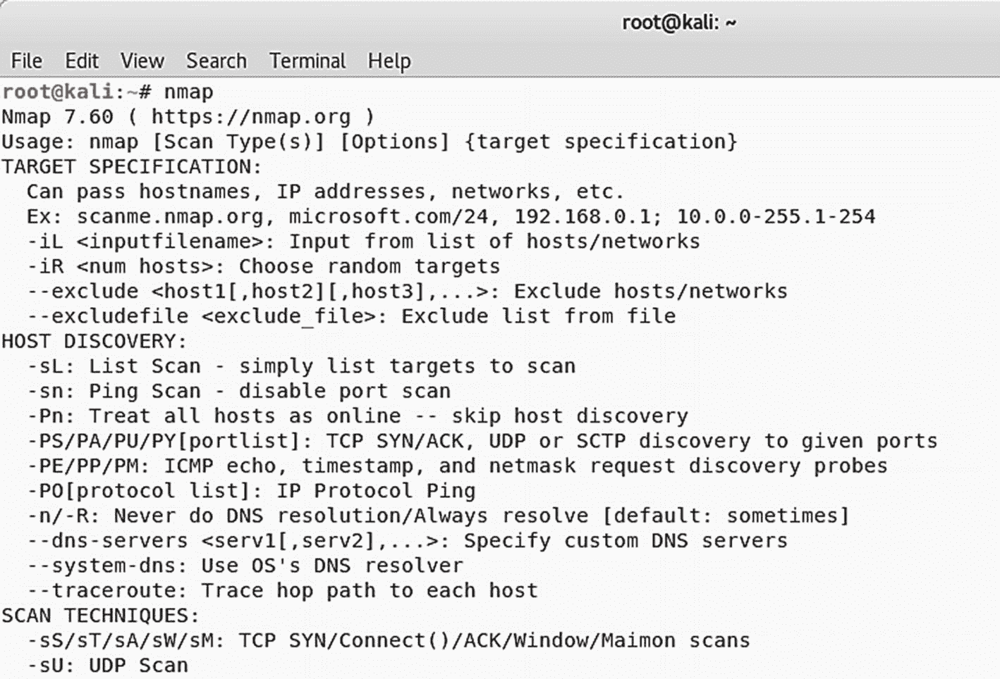

图 1-2

终端上 nmap 命令的输出

ZENMAP 是 NMAP 的图形前端。它以更加用户友好的方式提供相同的功能。ZENMAP 是默认 Kali Linux 安装的一部分，可以在应用程序➤信息收集➤ ZENMAP 访问。图 [1-3](#Fig3) 显示了初始 ZENMAP 屏幕。ZENMAP 界面有三个主要的可配置设置。

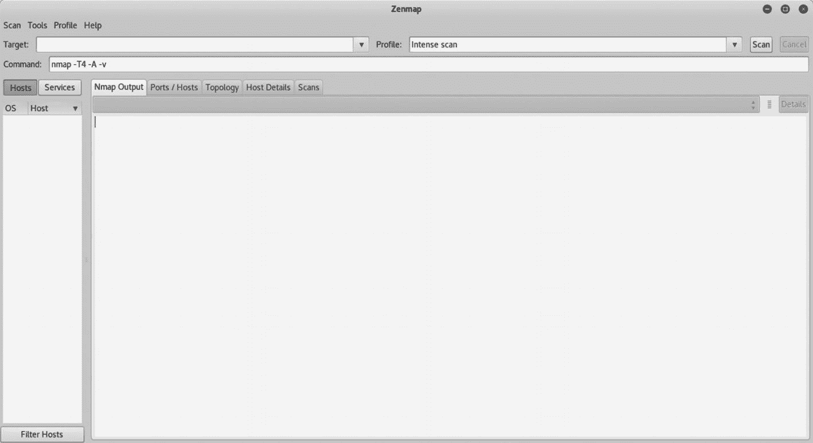

图 1-3

ZENMAP 的初始屏幕/界面

*   *目标*:这可以是单个 IP 地址、多个 IP 的列表或整个子网。

*   *配置文件* : ZENMAP 有几个预定义的扫描配置文件。配置文件根据 NMAP 可用的扫描类型进行分类。您可以在可用的配置文件中进行选择，也可以根据您的要求进行自定义扫描。

*   *命令*:一旦你输入一个目标并选择一个预定义的配置文件，ZENMAP 将自动填充命令字段。如果要根据预定义的配置文件执行自定义扫描，也可以使用此字段。

### NMAP 港口国

虽然当前版本的 NMAP 能够执行许多任务，但它最初是作为一个端口扫描器开始的。NMAP 有某些方法来检测目标系统上的端口是打开还是关闭的。NMAP 使用预定义的状态检测目标端口的状态，如下所示:

*   *Open*:Open 状态表示目标系统上的应用程序正在主动监听该端口上的连接/数据包。

*   *关闭*:关闭状态表示没有任何应用程序监听该端口。但是，将来端口状态可能会更改为开放。

*   *Filtered*:Filtered 状态表示防火墙、过滤器或某种网络障碍阻塞了端口，因此 NMAP 无法确定它是打开还是关闭。

*   *未过滤*:未过滤状态表示端口正在响应 NMAP 探针；然而，不可能确定它们是打开的还是关闭的。

*   *打开/过滤*:打开/过滤状态表示端口被过滤或打开；然而，NMAP 并不能精确地确定国家。

*   *关闭/过滤*:关闭/过滤状态表示端口被过滤或关闭；然而，NMAP 并不能精确地确定国家。

### 使用 NMAP 进行基本扫描

NMAP 是一个复杂的工具，有许多选项和开关可用。在本节中，您将看到从最基本的扫描开始的各种 NMAP 使用场景。

在开始实际扫描之前，需要注意的是 NMAP 是一个噪声很大的工具。它会产生大量网络流量，有时会消耗大量带宽。许多入侵检测系统和入侵防御系统可以检测和阻止 NMAP 流量。据说，在一台主机上进行基本的默认 NMAP 扫描会产生超过 4MB 的网络流量。因此，即使您对整个子网进行基本扫描，也会产生大约 1GB 的流量。因此，在完全了解所用开关的情况下执行 NMAP 扫描至关重要。

#### 单个 IP 上的基本扫描

命令如下:

```
nmap -sn <target IP address>

```

让我们从对单个目标进行基本的 ping 扫描开始。ping 扫描不会检查任何打开的端口；但是，它会告诉你目标是否活着。图 [1-4](#Fig4) 显示了对单个目标 IP 地址执行 ping 扫描的输出。

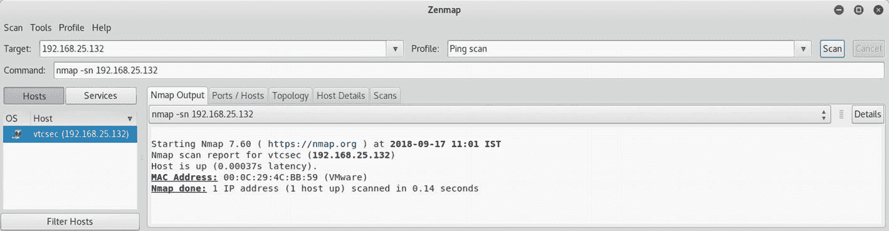

图 1-4

在单个 IP 地址上完成基本 NMAP 扫描的输出

#### 对整个子网进行基本扫描

命令如下:

```
nmap -sn <target IP subnet>

```

在实际情况下，您可能需要检查多个 IP 地址。要快速了解给定子网中哪些主机处于活动状态，您可以对整个子网进行 NMAP ping 扫描。子网只是网络的逻辑划分。扫描整个子网可以让您了解网络中存在哪些系统。图 [1-5](#Fig5) 显示了在子网 192.168.25.0-255 上执行的 ping 扫描的输出。您可以看到，在 255 台主机中，只有 7 台主机正常运行。现在，您可以进一步探查这七个主机，并获得更详细的信息。

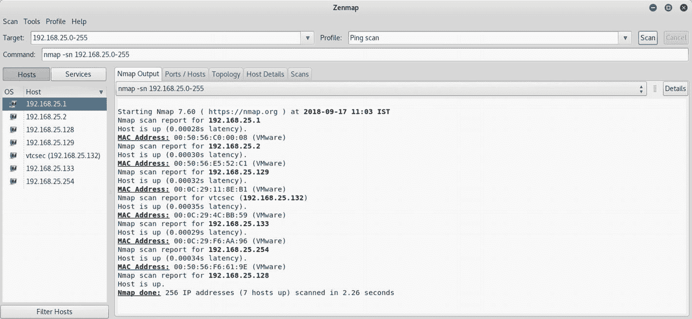

图 1-5

子网中完成的基本 NMAP 扫描的输出

#### 使用输入文件扫描

命令如下:

```
nmap -sn -iL <file path>

```

可能有这样一种情况，您需要扫描大范围的 IP 地址。您可以将它们全部放在一个文件中，并将该文件提供给 NMAP 引擎，而不是以逗号分隔的格式输入到 NMAP。图 [1-6](#Fig6) 显示了包含 IP 地址列表的`hosts.txt`文件的内容。

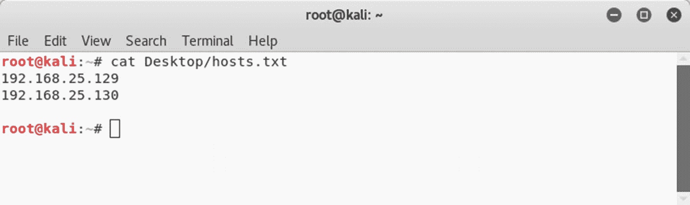

图 1-6

包含要扫描的 IP 地址列表的主机文件

现在你可以简单地将`hosts.txt`文件传送给 NMAP 并执行扫描，如图 [1-7](#Fig7) 所示。

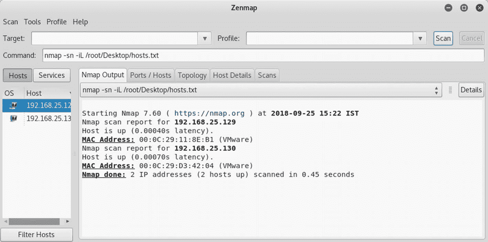

图 1-7

hosts.txt 文件中列出的多个 IP 地址上完成的基本 NMAP 扫描的输出

#### 原因扫描

命令如下:

```
nmap --reason<target IP address>

```

在正常的 NMAP 扫描中，您可能会得到一个开放端口的列表；但是，您不会知道 NMAP 报告某个特定端口开放的原因。NMAP 原因扫描是一个有趣的选项，其中 NMAP 为每个报告为开放的端口提供原因，如图 [1-8](#Fig8) 所示。NMAP 扫描基于请求和响应中设置的 TCP 标志。在这种情况下，开放端口是根据 TCP 数据包中设置的 SYN 和 ACK 标志检测到的。

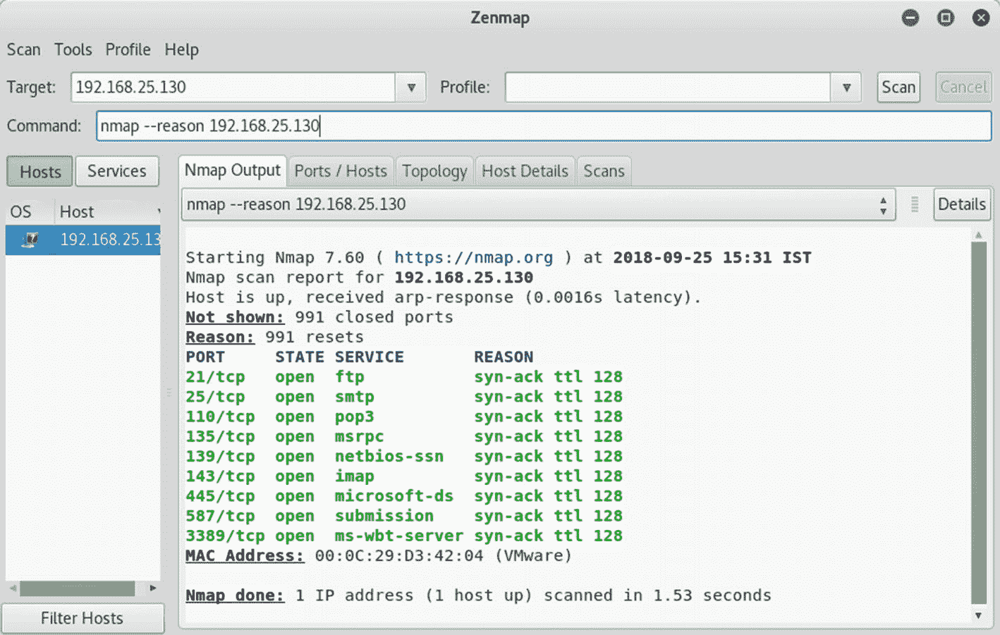

图 1-8

在单个 IP 地址上完成原因 NMAP 扫描的输出

#### 支持的协议

命令如下:

```
nmap -sO<target IP address>

```

作为信息收集和侦察的一部分，了解目标所支持的 IP 协议可能是有价值的。图 [1-9](#Fig9) 显示该目标支持两种协议:TCP 和 ICMP。

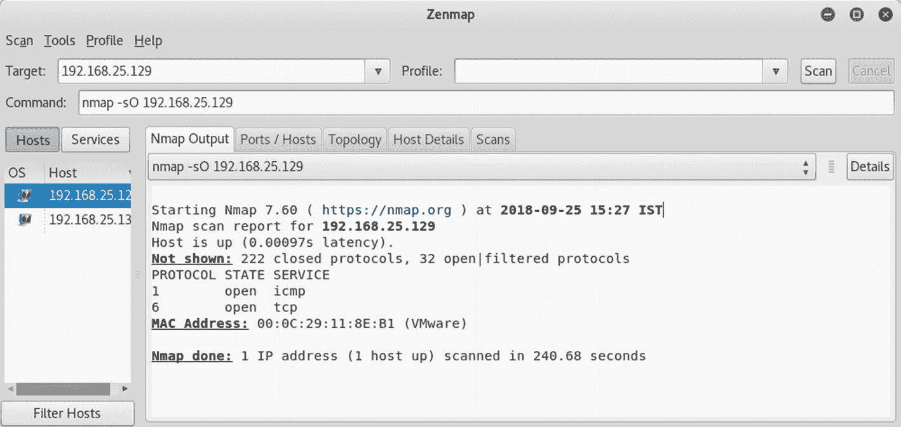

图 1-9

在单个 IP 地址上完成 NMAP 协议扫描的输出

#### 防火墙探测器

在一个充满防火墙、入侵检测系统和入侵防御系统的企业网络中，您的 NMAP 扫描很可能不仅会被检测到，还会被阻止。NMAP 提供了一种方法来探测其扫描是否被任何中间设备过滤，如防火墙。图 [1-10](#Fig10) 显示 NMAP 扫描的 1000 个端口全部未过滤；因此，不存在任何过滤设备。


图 1-10

针对单个 IP 地址完成的 NMAP 防火墙探测的输出

#### 拓扑学

ZENMAP 有一个有趣的特性，可以帮助你可视化网络拓扑。假设您对子网进行了 ping 扫描，发现几台主机还活着。图 [1-11](#Fig11) 显示了您发现处于活动状态的主机的网络拓扑图。可以使用 ZENMAP 界面中的拓扑选项卡来访问该图。

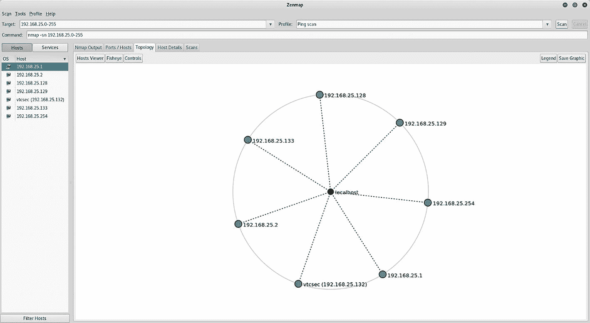

图 1-11

ZENMAP 中的主机拓扑图

#### 快速 TCP 扫描

命令如下:

```
nmap -T4 -F<target IP address>

```

现在您已经有了子网内活动主机的列表，您可以执行一些详细的扫描来找出端口和运行在这些端口上的服务。您可以设置目标 IP 地址，选择快速扫描作为配置文件，然后执行扫描。图 [1-12](#Fig12) 显示了扫描的输出，突出显示了目标上打开的几个端口。

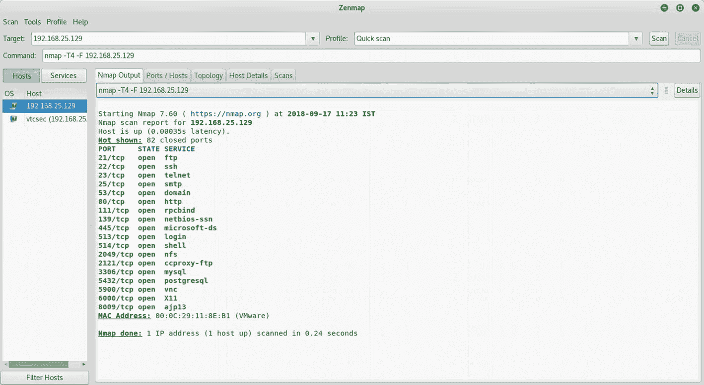

图 1-12

对单个 IP 地址进行快速 TCP NMAP 扫描的输出

#### 服务枚举

命令如下:

```
nmap -sV<target IP address>

```

既然您已经有了一台活动的主机，并且也知道了哪些端口是开放的，那么是时候枚举与这些端口相关联的服务了。例如，您可以看到端口 21 是打开的。现在您需要知道哪个服务与它相关联，以及服务的服务器的确切版本是什么。可以使用`nmap -sV <target IP address>`命令，如图 [1-13](#Fig13) 所示。`-sV`开关代表服务版本。枚举服务及其版本提供了大量信息，可用于构建进一步的攻击。

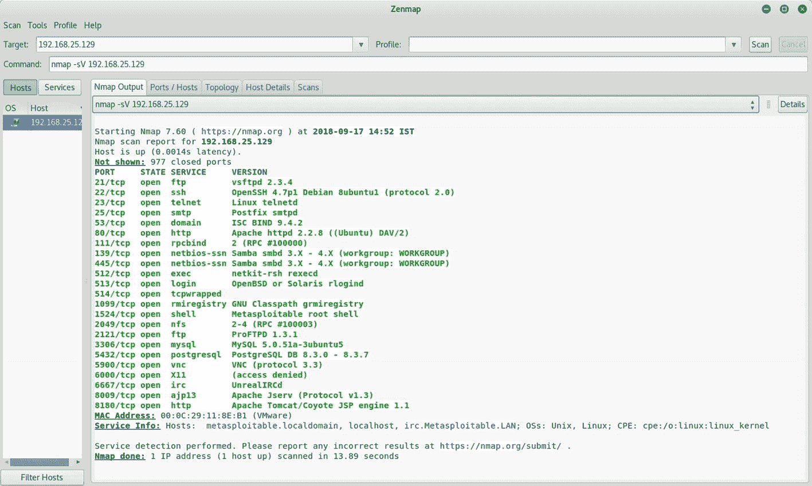

图 1-13

对单个 IP 地址进行 NMAP 服务扫描的输出

#### UDP 端口扫描

命令如下:

```
nmap -sU -p 1-1024<target IP address>

```

到目前为止，您所做的所有扫描都只提供了有关 TCP 端口的信息。但是，目标也可能有在 UDP 端口上运行的服务。默认的 NMAP 扫描只探测 TCP 端口。您需要专门扫描 UDP 端口和服务。要扫描常见的 UDP 端口，可以使用命令`nmap -sU -p 1-1024 <target IP address>`。`-sU`参数将告诉 NMAP 引擎专门扫描 UDP 端口，而`-p 1-1024`参数将限制 NMAP 只扫描 1 到 1024 范围内的端口。还需要注意的是，UDP 端口扫描比普通 TCP 扫描花费的时间要长得多。图 [1-14](#Fig14) 显示了示例 UDP 扫描的输出。

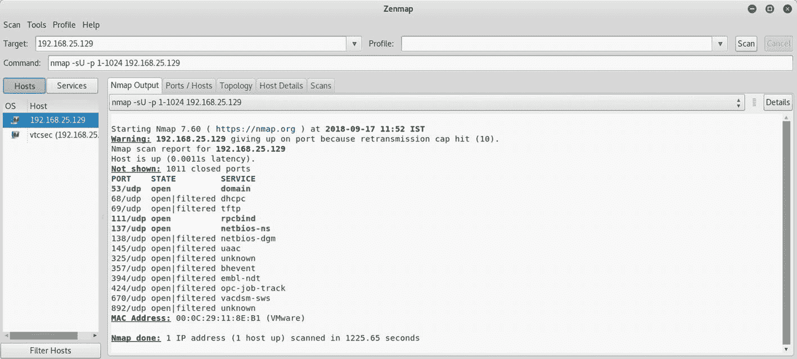

图 1-14

在单个 IP 地址上完成基本 NMAP UDP 扫描的输出

#### 操作系统检测

命令如下:

```
nmap -O<target IP address>

```

现在您已经知道如何探测开放端口和枚举服务，您可以更进一步，使用 NMAP 来检测目标运行的操作系统版本。可以使用命令`nmap -O <target IP address>`。图 [1-15](#Fig15) 显示了 NMAP 操作系统检测探头的输出。可以看到目标运行的是基于内核 2.6.X 的 Linux。

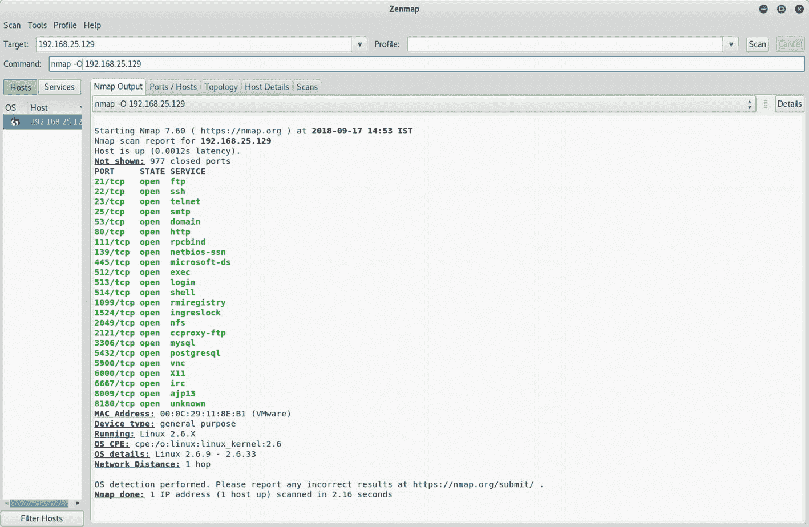

图 1-15

对单个 IP 地址进行 NMAP 操作系统检测扫描的输出

#### 密集扫描

命令如下:

```
nmap -T4 -A -v <target IP address>

```

到目前为止，您已经使用 NMAP 执行了一些单独的任务，例如端口扫描、服务枚举和操作系统检测。但是，可以用一个命令执行所有这些任务。您可以简单地设置您的目标 IP 地址，并选择密集扫描配置文件。NMAP 将进行 TCP 端口扫描，枚举服务，此外还会运行一些高级脚本来提供更多有用的结果。例如，图 [1-16](#Fig16) 显示了 NMAP 密集扫描的输出，它不仅枚举了一个 FTP 服务器，还突出显示了它启用了匿名 FTP 访问。

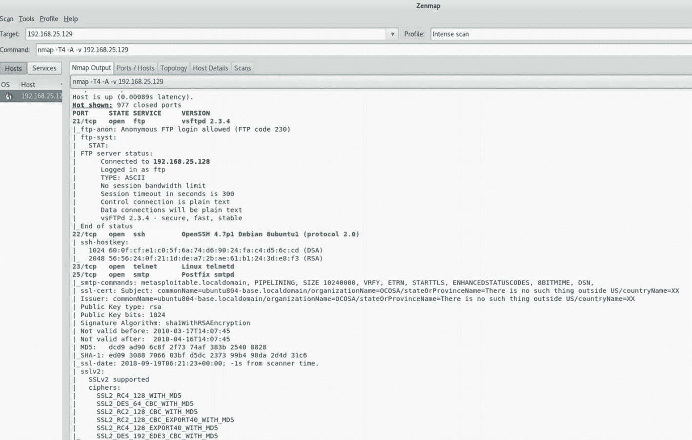

图 1-16

在单个 IP 地址上完成的密集 NMAP 扫描的输出

### NMAP 剧本

NMAP 长期以来一直是从一个基本的端口扫描器发展而来的。它比一个端口扫描器更强大和灵活。NMAP 的功能可以使用 NMAP 脚本进行扩展。NMAP 脚本引擎能够执行允许深入目标枚举和信息收集的脚本。NMAP 有大约 600 种不同用途的文字。在 Kali Linux 中，可以在`/usr/share/nmap/scripts`找到脚本。下一节将讨论如何使用 NMAP 脚本来枚举各种 TCP 服务。

#### HTTP 枚举

HTTP 是许多主机上的常见服务。默认情况下，它运行在端口 80 上。NMAP 有一个枚举 HTTP 服务的脚本。可以使用命令`nmap –script http-enum <target IP address>`调用它。图 [1-17](#Fig17) 显示了`http-enum`脚本的输出。它显示了 web 服务器上托管的各种有趣的目录，这些目录可能有助于构建进一步的攻击。

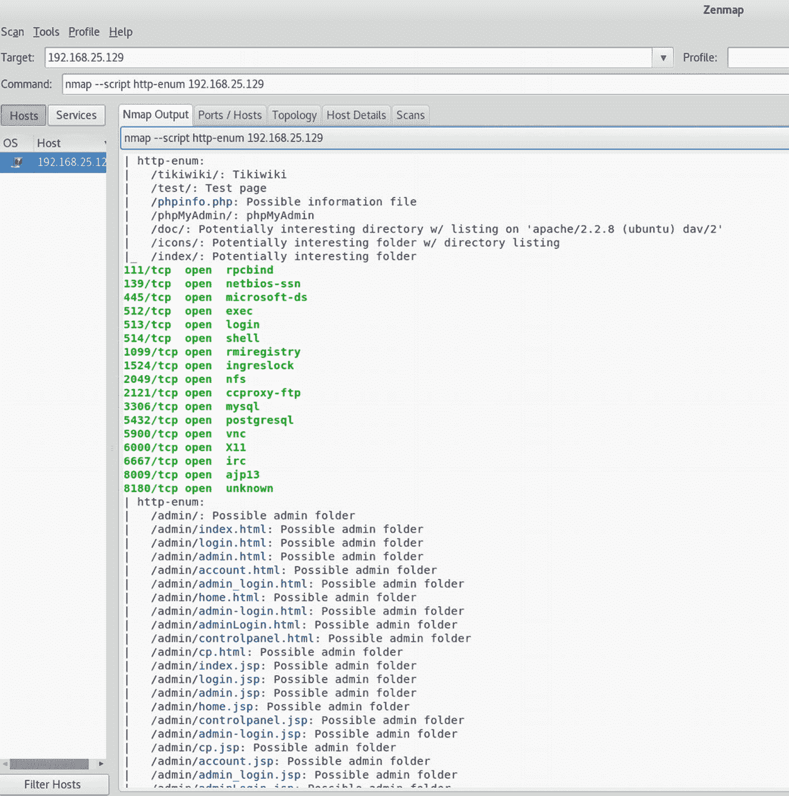

图 1-17

针对目标 IP 地址执行的 NMAP 脚本 http-enum 的输出

#### HTTP 方法

HTTP 支持使用各种方法，如 GET、POST、DELETE 等。有时这些方法在 web 服务器上是不必要的。您可以使用 NMAP 脚本`http-methods`，如图 [1-18](#Fig18) 所示，枚举目标系统上允许的 HTTP 方法。


图 1-18

针对目标 IP 地址执行的 NMAP 脚本 http-方法的输出

以下是一些用于 HTTP 枚举的附加 NMAP 脚本:

*   `http-title`

*   `http-method-tamper`

*   `http-trace`

*   `http-fetch`

*   `http-wordpress-enum`

*   `http-devframework`

*   `http NSE Library`

#### SMB 枚举

服务器消息块(SMB)是广泛用于网络文件共享的协议。SMB 通常在端口 445 上运行。因此，如果您找到一个端口 445 打开的目标，您可以使用 NMAP 脚本进一步枚举它。您可以使用命令`nmap -p 445 –script-smb-os-discovery <target IP address>`调用 SMB 枚举。`-p 445`参数触发脚本对目标上的端口 445 运行。图 [1-19](#Fig19) 中显示的脚本输出将给出确切的 SMB 版本、使用的操作系统和 NetBIOS 名称。

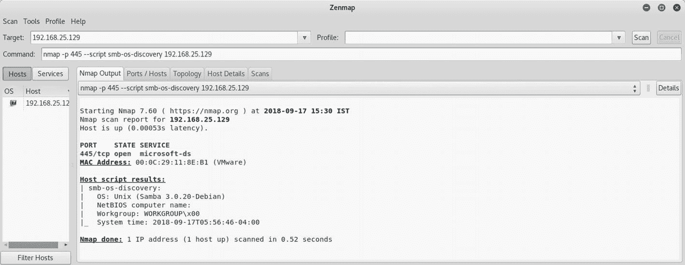

图 1-19

针对目标 IP 地址执行的 NMAP 脚本 smb-os 发现的输出

另一个有用的 NMAP 脚本是`smb-enum-shares`，如图 [1-20](#Fig20) 。它列出了目标系统上的所有 SMB 共享。

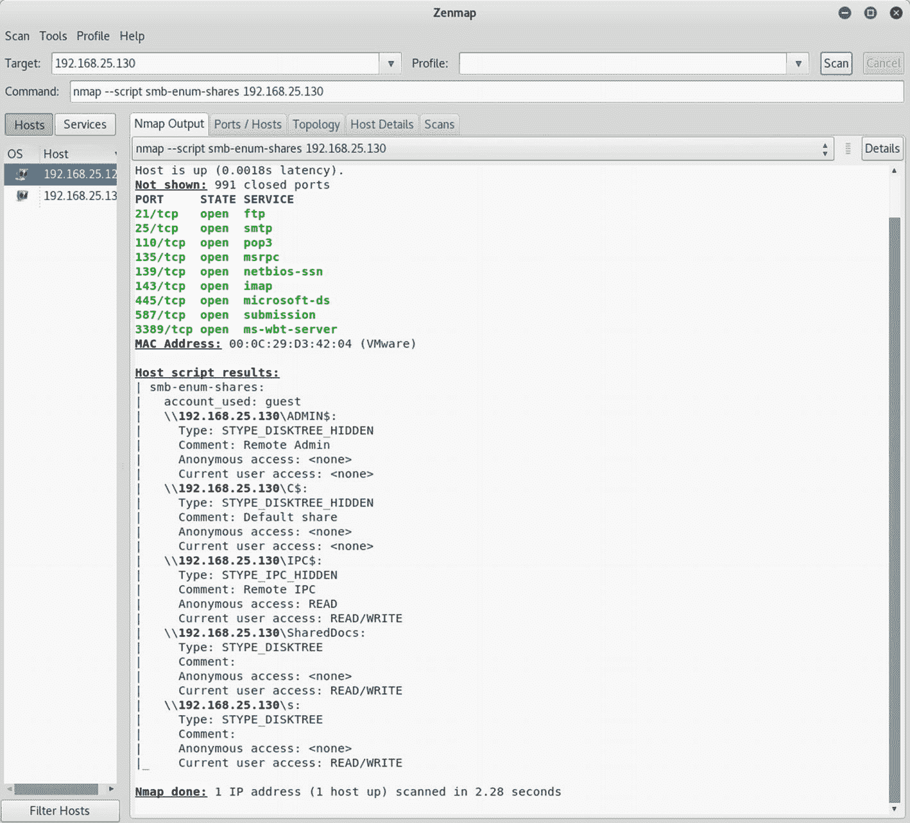

图 1-20

针对目标 IP 地址执行的 NMAP 脚本 smb-enum-shares 的输出

以下是一些用于 SMB 枚举的附加 NMAP 脚本:

*   `smb-vuln-ms17-010`

*   `smb-protocols`

*   `smb-mbenum`

*   `smb-enum-users`

*   `smb-enum-processes`

*   `smb-enum-services`

#### DNS 枚举

域名系统确实是互联网的主干，因为它完成了将主机名称转换为 IP 地址的重要工作，反之亦然。默认情况下，它运行在端口 53 上。枚举一个 DNS 服务器可以给出很多有趣和有用的信息。NMAP 有几个用于枚举 DNS 服务的脚本。图 [1-21](#Fig21) 显示了显示其版本详细信息的 DNS 服务器枚举。

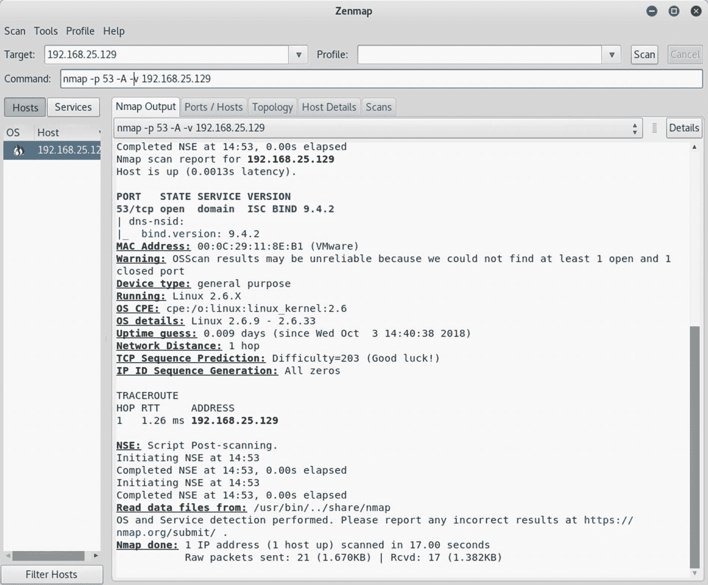

图 1-21

针对目标 IP 地址执行的 DNS 枚举的输出

以下是一些用于 DNS 枚举的附加 NMAP 脚本:

*   `dns-cache-snoop`

*   `dns-service-discovery`

*   `dns-recursion`

*   `dns-brute`

*   `dns-zone-transfer`

*   `dns-nsid`

*   `dns-nsec-enum`

*   `dns-fuzz`

*   `dns-srv-enum`

#### FTP 枚举

文件传输协议(FTP)是系统间传输文件最常用的协议。默认情况下，它运行在端口 21 上。NMAP 有多个脚本来枚举 FTP 服务。图 [1-22](#Fig22) 显示了两个脚本的输出。

*   `ftp-syst`

*   `ftp-anon`

输出显示了 FTP 服务器版本的详细信息，并揭示了服务器正在接受匿名连接。

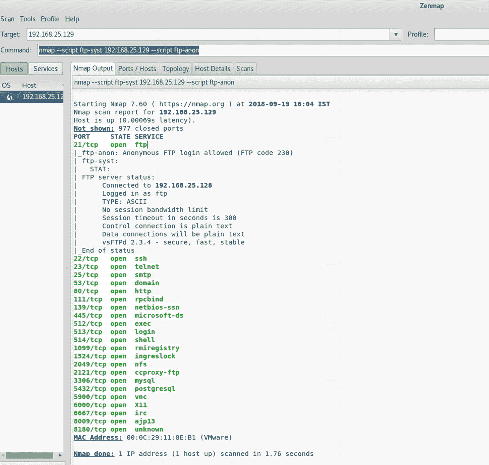

图 1-22

针对目标 IP 地址执行的 NMAP 脚本 ftp-syst 和 ftp-anon 的输出

由于目标正在运行 vsftpd 服务器，您可以尝试另一个 NMAP 脚本，该脚本将检查 FTP 服务器是否易受攻击。可以使用脚本`ftp-vsftpd-backdoor`，如图 [1-23](#Fig23) 所示。

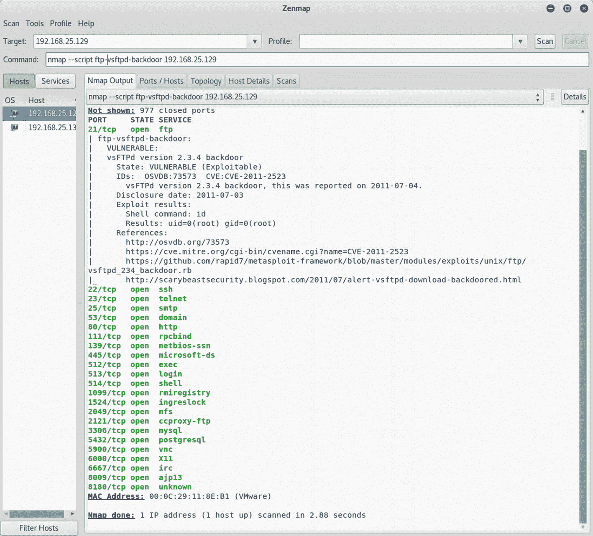

图 1-23

针对目标 IP 地址执行的 NMAP 脚本 ftp-vsftpd-backdoor 的输出

结果表明，FTP 服务器易受攻击；您将在本书的后面学习如何利用它。

以下是一些用于 FTP 枚举的附加 NMAP 脚本:

*   `ftp-brute`

*   `ftp NSE`

*   `ftp-bounce`

*   `ftp-vuln-cve2010-4221`

*   `ftp-libopie`

#### MySQL 枚举

MySQL 是最流行的开源关系数据库管理系统之一。默认情况下，它运行在端口 3306 上。NMAP 有枚举 MySQL 服务的脚本。枚举一个 MySQL 服务可以揭示许多潜在的信息，这些信息可能被进一步用来攻击目标数据库。图 [1-24](#Fig24) 显示了`mysql-info`脚本的输出。它显示了协议版本细节、服务器功能和使用中的 salt 值。

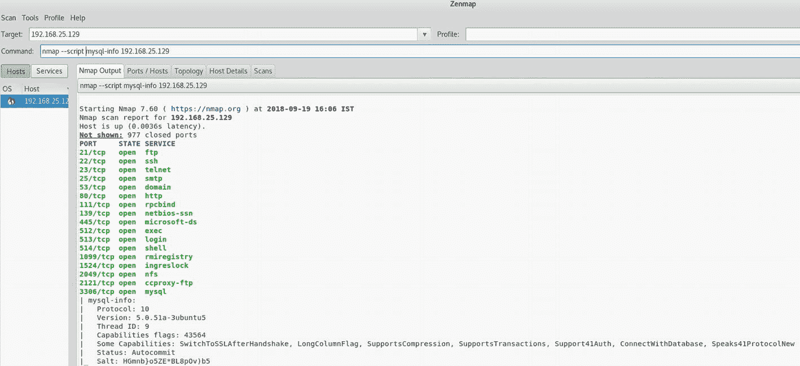

图 1-24

针对目标 IP 地址执行的 NMAP 脚本 mysql-info 的输出

以下是一些用于 MySQL 枚举的附加 NMAP 脚本:

*   `mysql-databases`

*   `mysql-enum`

*   `mysql-brute`

*   `mysql-query`

*   `mysql-empty-password`

*   `mysql-vuln-cve2012-2122`

*   `mysql-users`

*   `mysql-variables`

#### SSH 枚举

安全外壳(SSH)协议广泛用于安全的远程登录和管理。与 Telnet 不同，SSH 加密流量，使通信安全。默认情况下，它运行在端口 22 上。NMAP 有枚举 SSH 服务的脚本。图 [1-25](#Fig25) 显示了`ssh2-enum-algos`脚本的输出。它列出了目标 SSH 服务器支持的不同加密算法。

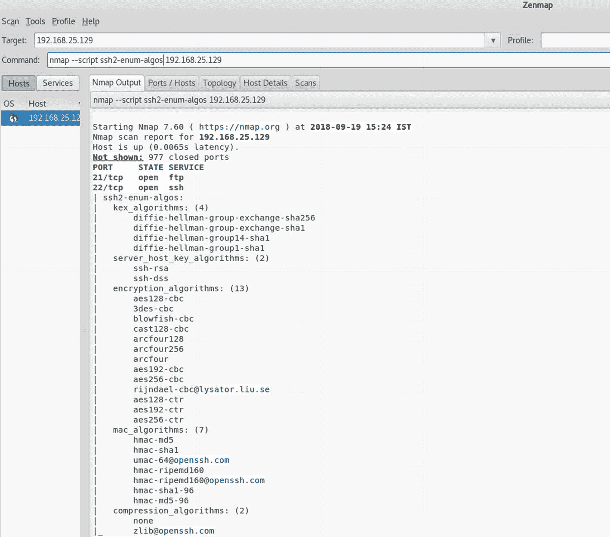

图 1-25

针对目标 IP 地址执行的 NMAP 脚本 ssh2-enum-algos 的输出

以下是一些用于 SSH 枚举的附加 NMAP 脚本:

*   `ssh-brute`

*   `ssh-auth-methods`

*   `ssh-run`

*   `ssh-hostkey`

*   `sshv1`

*   `ssh-publickey-acceptance`

#### SMTP 枚举

简单邮件传输协议(SMTP)用于传输电子邮件。默认情况下，它运行在端口 25 上。NMAP 有几个用于枚举 SMTP 服务的脚本。这些 NMAP 脚本可能会暴露 SMTP 服务器中的几个弱点，如开放中继、接受任意命令等。图 [1-26](#Fig26) 显示了`smtp-commands`脚本的输出。它列出了目标 SMTP 服务器正在接受的各种命令。

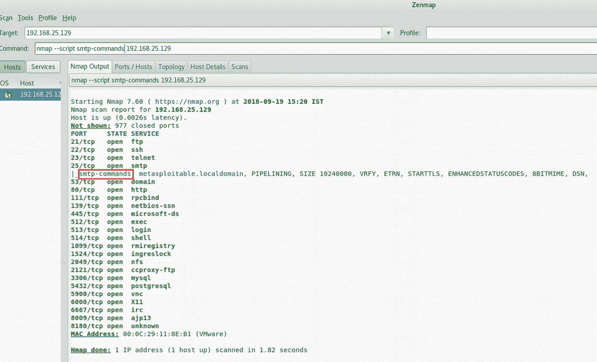

图 1-26

NMAP 脚本 smtp 的输出-针对目标 IP 地址执行的命令

许多 SMTP 服务器错误地启用了开放中继。这使得任何人都可以不经过身份验证就连接到 SMTP 服务器并发送邮件。这确实是一个严重的缺陷。NMAP 有一个名为`smtp-open-relay`的脚本，用于检查目标 SMTP 服务器是否允许开放中继，如图 [1-27](#Fig27) 所示。

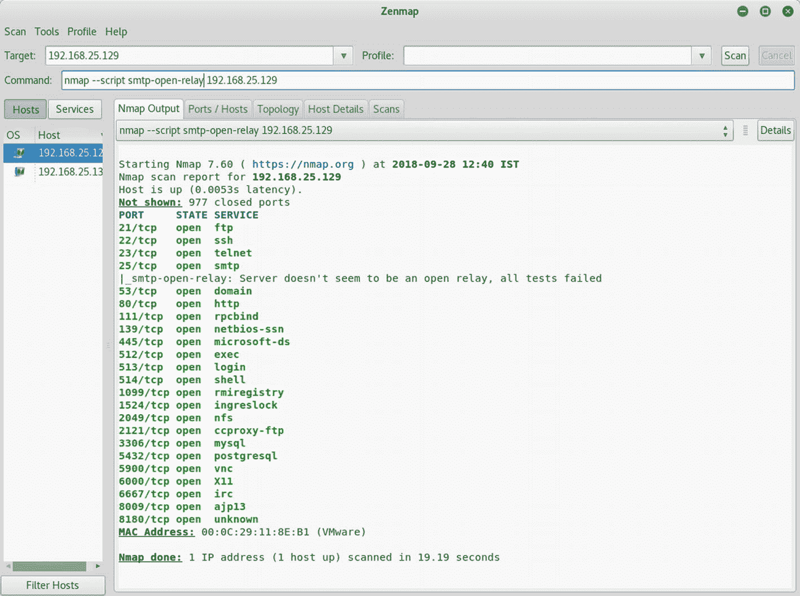

图 1-27

针对目标 IP 地址执行的 NMAP 脚本 smtp-open-relay 的输出

以下是一些用于 SMTP 枚举的附加 NMAP 脚本:

*   `smtp-enum-users`

*   `smtp-commands`

*   `smtp-brute`

*   `smtp-ntlm-info`

*   `smtp-strangeport`

*   `smtp-vuln-cve2011-1764`

#### VNC 枚举

虚拟网络计算(VNC)协议通常用于远程图形桌面共享。默认情况下，它运行在端口 5900 上。NMAP 有几个脚本来枚举 VNC 服务。图 [1-28](#Fig28) 显示了`vnc-info`脚本的输出。它显示了协议版本详细信息以及身份验证类型。

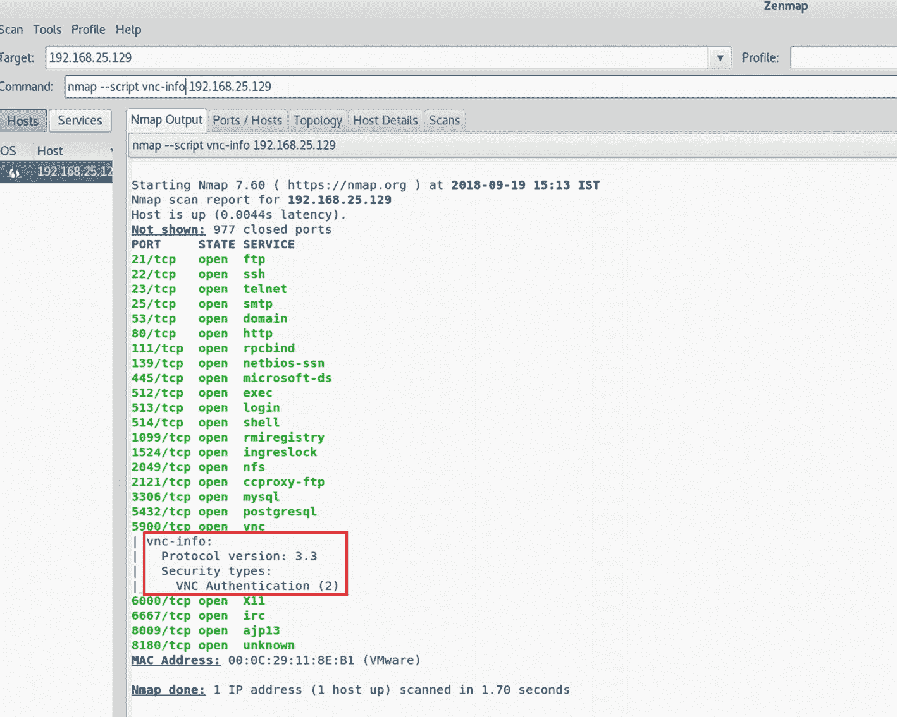

图 1-28

针对目标 IP 地址执行的 NMAP 脚本 vnc-info 的输出

以下是 VNC 枚举的一些附加 NMAP 脚本:

*   `vnc-brute`

*   `realvnc-auth-bypass`

*   `vnc-title`

#### 服务横幅抓取

系统上运行的任何服务通常都有一个与之相关联的横幅。横幅通常包含服务器版本信息，甚至可能包含特定于组织的信息，如免责声明、警告或一些公司电子邮件地址。抓住服务横幅以获得更多关于目标的信息当然是值得的。NMAP 脚本`banner`探测目标上运行的所有服务并抓取它们的横幅，如图 [1-29](#Fig29) 所示。

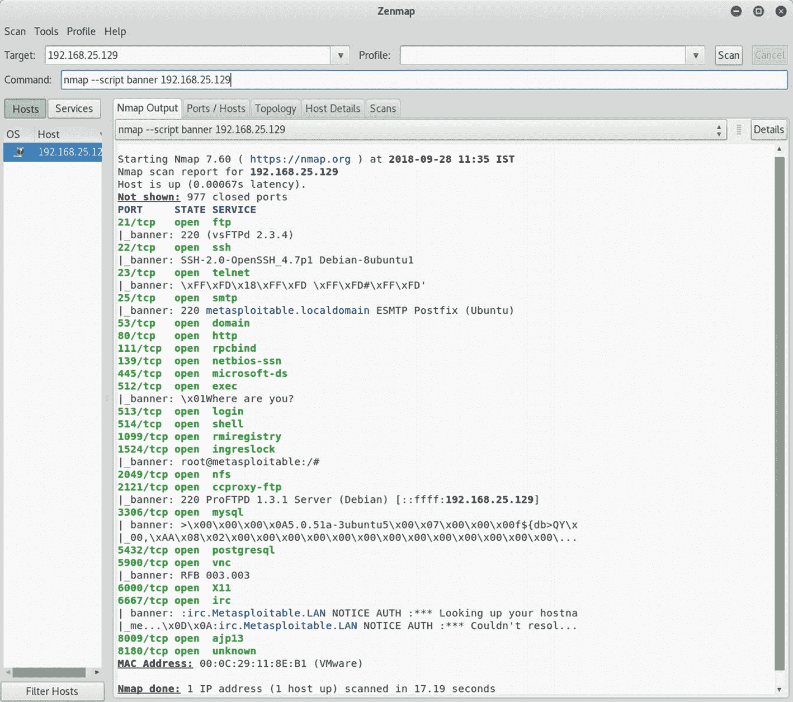

图 1-29

针对目标 IP 地址执行的 NMAP 脚本横幅的输出

#### 检测漏洞

到目前为止，您已经看到了端口扫描和枚举的 NMAP 功能。现在，您将了解如何使用 NMAP 进行漏洞评估。虽然不如 Nessus 和 OpenVAS 等漏洞扫描器全面，但 NMAP 肯定可以进行基本的漏洞检测。NMAP 借助通用漏洞和暴露(CVE)id 来实现这一点。它根据目标上运行的服务搜索匹配的 CVE。要将 NMAP 变成一个漏洞扫描器，你首先需要下载并安装一些额外的脚本。图 [1-30](#Fig30) 显示了所需脚本的安装。首先导航到目录`/usr/share/nmap/scripts`，然后克隆两个`git`目录，如下所示:

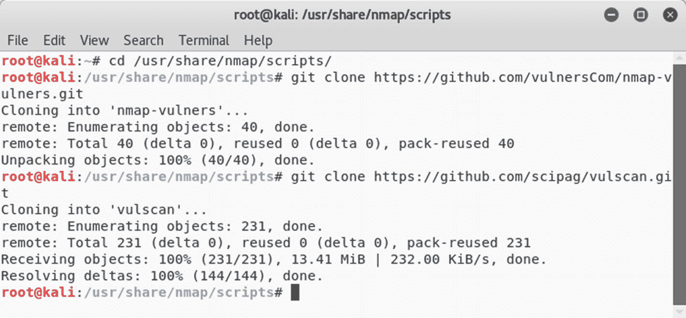

图 1-30

Git 将 nmap-vulners 克隆到本地目录

*   [T2`https://github.com/vulnersCom/nmap-vulners.git`](https://github.com/vulnersCom/nmap-vulners.git)

*   [T2`https://github.com/scipag/vulscan.git`](https://github.com/scipag/vulscan.git)

一旦下载了所需的脚本，就可以对目标执行它们了。可以使用`nmap -sV –script nmap-vulners <target IP address>`命令，如图 [1-31](#Fig31) 所示。

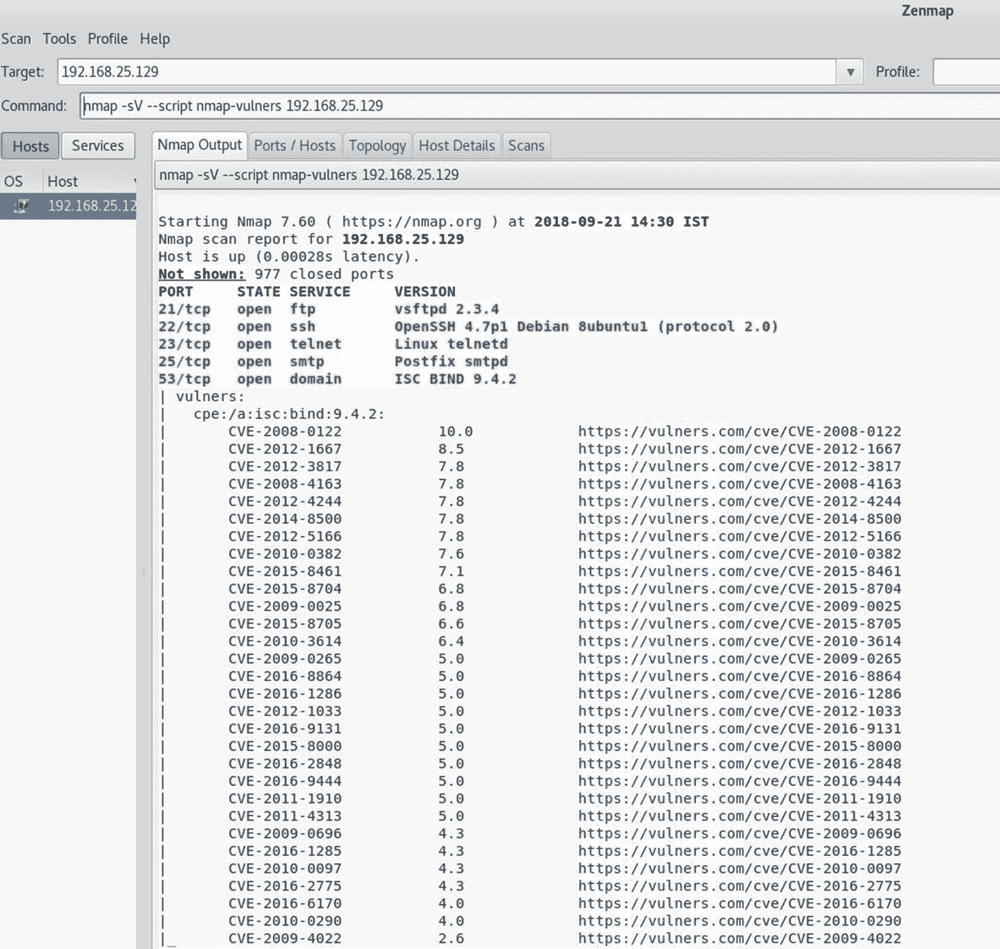

图 1-31

针对目标 IP 地址执行的 NMAP 脚本 nmap-vulners 的输出

有趣的是，您可以看到许多 CVE 可以与运行在 TCP 端口 53 上的 ISC BIND 9.4.2 兼容。此 CVE 信息可用于进一步攻击目标。还可以看到几个运行 Apache httpd 2.2.8 服务器的 TCP 端口 80 的 CVE，如图 [1-32](#Fig32) 所示。

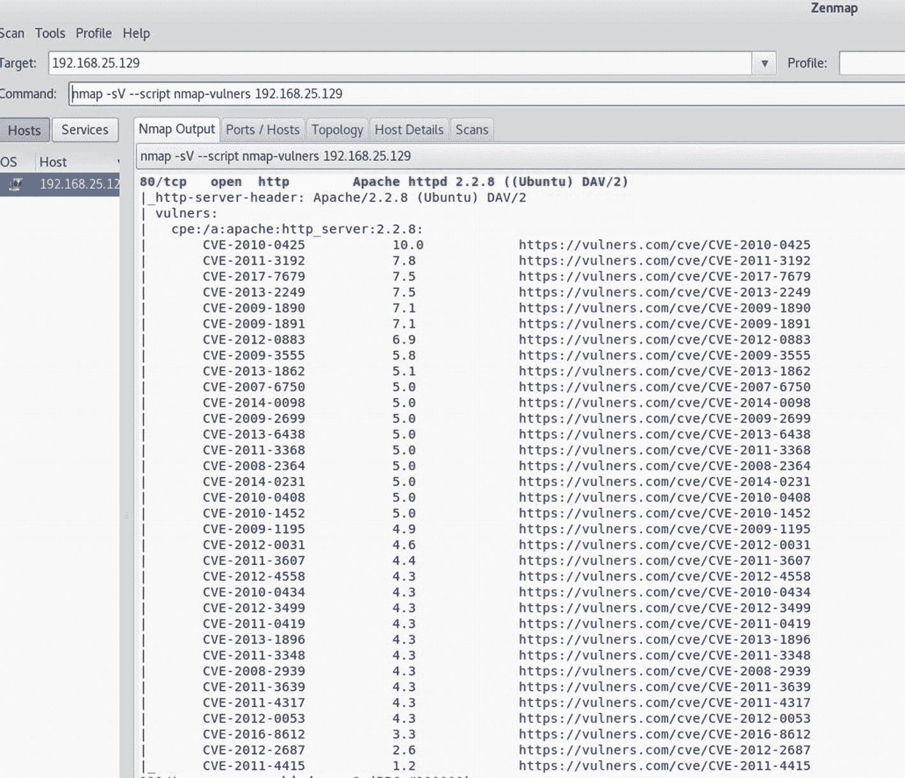

图 1-32

针对目标 IP 地址执行的 NMAP 脚本 nmap-vulners 的输出

### NMAP 产量

到目前为止，您已经浏览了各种有用的 NMAP 功能。值得注意的是，NMAP 产生的输出可以提供给许多其他安全工具和产品。因此，您必须了解 NMAP 能够生成的不同输出格式，如下所示:

| 

转换

 | 

例子

 | 

描述

 |
| --- | --- | --- |
| `-oN` | `nmap 192.168.25.129 -oN output.txt` | 对目标 IP 地址执行扫描，然后将正常输出写入文件`output.txt` |
| `-oX` | `nmap 192.168.25.129 -oX output.xml` | 对目标 IP 地址执行扫描，然后将正常输出写入 XML 文件`output.xml` |
| `-oG` | `nmap 192.168.25.129 -oG output.grep` | 对目标 IP 地址执行扫描，然后将 greppable 输出写入文件`output.grep` |
| `--append-output` | `nmap 192.168.25.129 -oN file.file --append-output` | 对目标 IP 地址执行扫描，然后将扫描输出附加到以前的扫描文件中 |

### NMAP 和 Python

在本章中，您已经看到了 NMAP 的众多功能，以及 NMAP 如何有效地用于信息收集、枚举和主动扫描。NMAP 还可以从各种编程语言中调用和执行，这使得它更加强大。Python 是一种用于通用编程的解释型高级编程语言。Python 确实是用户友好的，而且极其灵活。它有一套丰富的现成库，可用于执行各种任务。深入 Python 语言基础和语法的细节超出了本书的范围。假设您对 Python 有一些基本的了解，这一节将讨论如何使用 Python 来调用和自动化 NMAP 扫描。

Python 默认安装在大多数基于 Unix 的系统上。但是，您需要单独安装 NMAP 库。在基于 Debian 的系统上，你可以简单地使用命令`pip install python-nmap`，如图 [1-33](#Fig33) 所示。该命令将安装所需的 NMAP 库。

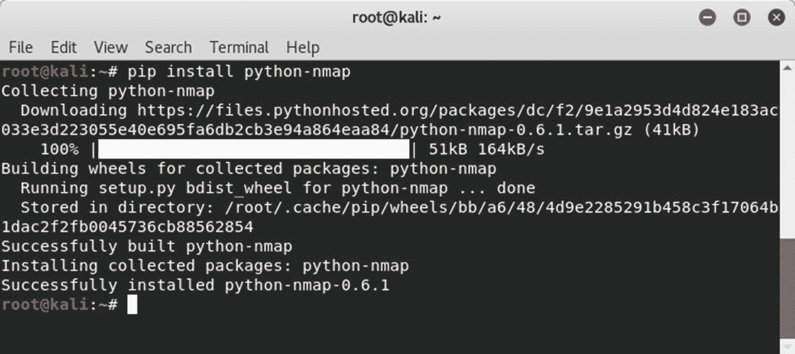

图 1-33

在基于 Debian 的系统上安装 python-nmap 库

现在您已经安装了所需的 NMAP 库，通过键入`python`命令从终端启动 Python 解释器，并导入 NMAP 库，如下所示:

```
root@kali:~# python
Python 2.7.14+ (default, Dec  5 2017, 15:17:02)
[GCC 7.2.0] on linux2
Type "help", "copyright", "credits" or "license" for more information.
>>> import nmap
>>>

```

现在可以创建一个名为`nmp`的新对象来调用`PortScanner`函数。然后对目标 IP 地址 127.0.0.1 和端口 1 到 50 发起新的扫描，如下所示:

```
>>> nmp = nmap.PortScanner()
>>> nmp.scan('127.0.0.1', '1-50')

```

扫描完成并向您提供以下输出:

```
{'nmap': {'scanstats': {'uphosts': '1', 'timestr': 'Fri Sep 21 14:02:19 2018', 'downhosts': '0', 'totalhosts': '1', 'elapsed': '1.06'}, 'scaninfo': {'tcp': {'services': '1-50', 'method': 'syn'}}, 'command_line': 'nmap -oX - -p 1-50 -sV 127.0.0.1'}, 'scan': {'127.0.0.1': {'status': {'state': 'up', 'reason': 'localhost-response'}, 'hostnames': [{'type': 'PTR', 'name': 'localhost'}], 'vendor': {}, 'addresses': {'ipv4': '127.0.0.1'}, 'tcp': {22: {'product': 'OpenSSH', 'state': 'open', 'version': '7.7p1 Debian 4', 'name': 'ssh', 'conf': '10', 'extrainfo': 'protocol 2.0', 'reason': 'syn-ack', 'cpe': 'cpe:/o:linux:linux_kernel'}}}}}

```

虽然前面的输出是原始的，但肯定可以使用许多 Python 函数进行格式化。运行初始扫描后，您可以探索不同的功能来检索特定的扫描详细信息。

#### 扫描信息（）

`scaninfo()`函数返回扫描细节，如使用的方法和探测的端口范围。

```
>>> nmp.scaninfo()
{'tcp': {'services': '1-1024', 'method': 'syn'}}

```

#### 所有主机()

`all_hosts()`函数返回所有被扫描的 IP 地址列表。

```
>>> nmp.all_hosts()
['192.168.25.129']

```

#### 状态()

`state()`函数返回被扫描的 IP/主机的状态，比如它是启动还是关闭。

```
>>> nmp['192.168.25.129'].state()
'up'

```

#### 按键()

`keys()`函数返回扫描过程中发现的所有开放端口的列表。

```
>>> nmp['192.168.25.129']['tcp'].keys()
[512, 513, 514, 139, 111, 80, 53, 22, 23, 25, 445, 21]

```

#### has_tcp()

`has_tcp()`函数检查在对目标 IP 地址进行扫描的过程中，是否发现某个特定端口处于打开状态。

```
>>> nmp['192.168.25.129'].has_tcp(22)
True

```

#### 命令行()

`command_line()`函数返回在后台运行以产生输出的确切的 NMAP 命令。

```
>>> nmp.command_line()
'nmap -oX - -p 1-50 -sV 127.0.0.1'

```

#### 主机名()

`hostname()`函数返回您作为参数传递的 IP 地址的主机名。

```
>>> nmp['127.0.0.1'].hostname()
'localhost'

```

#### 所有协议()

`all_protocols`函数返回目标 IP 地址支持的协议列表。

```
>>> nmp['127.0.0.1'].all_protocols()
['tcp']

```

现在您已经知道了从 Python 调用 NMAP 的基本函数，您可以编写一些简单的 Python 代码，使用一个循环来扫描多个 IP 地址。然后，您可以使用各种文本处理函数来清理和格式化输出。

## 摘要

在本章中，您学习了漏洞评估和渗透测试的概念。现在，您已经了解了渗透测试生命周期的不同阶段，以及 NMAP、OpenVAS 和 Metasploit 的重要性，它们能够执行渗透测试生命周期所有阶段的大多数任务。

本章向您简要介绍了 NMAP 工具的基本知识和要点，并深入探讨了如何使用脚本扩展 NMAP 功能。这一章还提到了将 NMAP 与 Python 脚本相结合。

## 自己动手做练习

*   在 Windows 和 Ubuntu 上安装 NMAP。

*   使用 NMAP 命令行在目标系统上执行 UDP 扫描。

*   使用 NMAP 检测目标系统上的操作系统。

*   在目标系统上使用 NMAP 密集扫描。

*   使用各种 NMAP 脚本来枚举目标系统上的服务。

*   编写一些 Python 代码，扫描目标系统上的 1 到 500 个端口。*