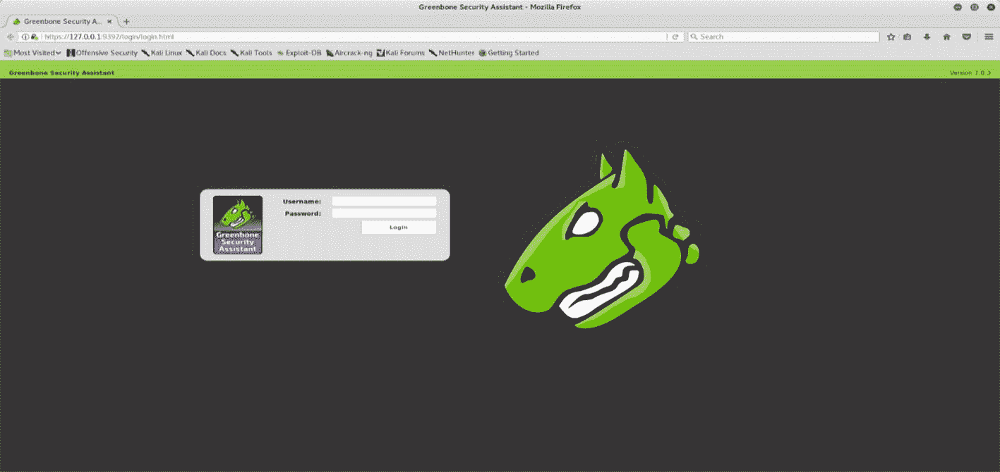
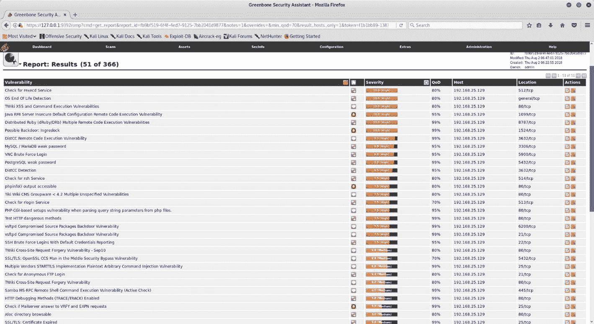

# 二、OpenVAS

在上一章中，您了解了 NMAP 及其功能。在本章中，您将了解如何使用 OpenVAS 执行漏洞评估。具体来说，本章包括以下内容:

*   OpenVAS 简介

*   设置 OpenVAS

*   将 NMAP 结果导入 OpenVAS

*   漏洞扫描

*   报告

### 注意

OpenVAS 的目的仅限于漏洞扫描，不像 NMAP 和 Metasploit 能够做更多的事情。从这个角度来看，本章涵盖了所有重要的 OpenVAS 任务。这将为下一章中 OpenVAS 与 Metasploit 的集成做好准备，真正的乐趣将从这一章开始。

## OpenVAS 简介

在上一章中，你了解了 NMAP。NMAP 不仅仅是一个端口扫描器。例如，您使用 NMAP 进行漏洞检测。但是，它有一定的局限性。NMAP 主要检测有限的已知 cv。因此，您肯定需要一个更好的解决方案来执行漏洞评估。以下是一些受欢迎的选择:

*   涅索斯

*   连锁姿势

*   科力斯卫士

*   open vas！open vas！open vas

这些产品是成熟的，并且在工业中广泛使用。在本书的范围内，您将学习 OpenVAS 平台。它免费供社区使用，并提供了许多有用的功能。

OpenVAS 是开放漏洞评估系统的缩写。它不仅仅是一个工具，而是一个由多个服务和工具组成的完整框架，提供了一个全面而强大的漏洞扫描和漏洞管理解决方案。

就像防病毒解决方案有检测已知恶意软件的签名一样，OpenVAS 有一套网络漏洞测试(nvt)。nvt 是使用插件进行的，这些插件是使用 Nessus 攻击脚本语言(NASL)代码开发的。OpenVAS 中有超过 50，000 个 nvt，并且正在定期添加新的 nvt。

## 装置

OpenVAS 提供了多种安装选项，包括 Docker 容器。它可以安装在各种操作系统上。然而，开始使用 OpenVAS 最简单、最快速的方法是下载 OpenVAS 虚拟设备。OpenVAS 虚拟设备 ISO 镜像可从 [`https://www.greenbone.net/en/install_use_gce/`](https://www.greenbone.net/en/install_use_gce/) 下载。

使用这种虚拟设备的好处是，它已经具备了所有的依赖项，并且一切都已设置好。你所需要做的就是下载 ISO 镜像，在 VMware/VirtualBox 中启动它，并设置一些基本的东西，OpenVAS 很快就会启动并运行。

启动下载的 ISO 后，选择设置选项即可开始，如图 [2-1](#Fig1) 所示。

图 2-1

OpenVAS 虚拟机初始安装屏幕

然后启动设置，如图 [2-2](#Fig2) 所示。

图 2-2

OpenVAS 安装和设置

现在您需要创建一个新用户，用于管理目的，如图 [2-3](#Fig3) 所示。

图 2-3

为 OpenVAS 管理员设置用户

然后为新创建的用户设置密码，如图 [2-4](#Fig4) 所示。

图 2-4

为 OpenVAS 管理用户设置密码

一旦您设置了管理凭证，安装将重新启动，您将看到引导菜单，如图 [2-5](#Fig5) 所示。

图 2-5

OpenVAS 开机功能表

接下来，您将看到命令行控制台，如图 [2-6](#Fig6) 所示，您需要在这里输入之前设置的凭证。

图 2-6

OpenVAS 虚拟机命令行控制台

您可以看到 OpenVAS 设置已经完成，其 web 界面已经在`http://192.168.25.136`可用。您可以尝试访问 web 界面，如图 [2-7](#Fig7) 所示。

图 2-7

带有登录字段的 OpenVAS web 界面

同时，您需要引导进入操作系统并进行一些额外的设置更改，如图 [2-8](#Fig8) 所示。

图 2-8

OpenVAS 设置和用户配置

您需要创建一个新的管理员用户，并设置用户名和密码，如图 [2-9](#Fig9) 所示。

图 2-9

OpenVAS 虚拟机用户配置

你用的 OpenVAS 版本是社区版，不需要任何密钥。但是，如果您想使用商业版本，那么您需要输入订阅密钥。现在可以跳过这一步，如图 [2-10](#Fig10) 所示。

图 2-10

OpenVAS 订阅密钥上传屏幕

## OpenVAS 管理

在上一节中，您看到了如何通过下载现成的虚拟机设置来设置 OpenVAS。现在，在进入实际的扫描部分之前，您需要设置一些东西作为管理的一部分。

### 订阅源更新

提要是 OpenVAS 绝对必要的组成部分。如果您的 OpenVAS 设置有旧的提要，那么您可能会错过检测最新的漏洞。因此，在开始任何扫描之前准备好最新的提要是至关重要的。要检查当前的馈送版本，请转到附加➤馈送状态，如图 [2-11](#Fig11) 所示。您可以看到提要已经 54 天没有更新了。

图 2-11

OpenVAS 订阅源状态，包含过期的订阅源

要更新提要，您可以到终端键入命令`openvas-feed-update`，如图 [2-12](#Fig12) 所示。只要确保你有一个活跃的互联网连接来更新源。

图 2-12

更新 OpenVAS 漏洞源

订阅源更新需要一些时间；完成后，您可以再次进入 OpenVAS web 界面并检查提要状态。现在你应该看到进给状态是当前的，如图 [2-13](#Fig13) 所示。

图 2-13

OpenVAS feed 状态，已更新

### 用户管理

OpenVAS 工作在客户机-服务器架构中，多个用户可以连接到一个中央服务器。因此，创建和管理用户和组非常重要。在创建用户之前，您需要准备好一些用户组。要创建新的 OpenVAS 用户组，请进入管理➤用户组，如图 [2-14](#Fig14) 所示。

图 2-14

OpenVAS 用户管理控制台

创建和配置所需的组后，您可以创建新用户，并根据他们的权限级别将他们分配到特定的组。要创建新用户，请进入管理➤用户，如图 [2-15](#Fig15) 所示。

图 2-15

向 OpenVAS 添加新用户

虽然 OpenVAS 允许您在本地创建和管理用户，但它也允许您使用轻量级目录访问协议(LDAP)进行集中式用户管理。可以通过转到管理➤ LDAP 来配置 LDAP 设置，如图 [2-16](#Fig16) 所示。

图 2-16

LDAP 认证的 OpenVAS 配置

类似地，OpenVAS 也可以配置为针对 RADIUS 服务器进行身份验证。可以在管理➤ RADIUS 配置 RADIUS 服务器设置，如图 [2-17](#Fig17) 所示。

图 2-17

RADIUS 身份验证的 OpenVAS 配置

### 仪表盘

OpenVAS 有一个丰富的仪表板，默认情况下是它的主页。仪表板提供了任务、主机、nvt 等的集中视图，如图 [2-18](#Fig18) 所示。每个人口统计可以导出为 CSV 格式。

图 2-18

带有人口统计数据的 OpenVAS 仪表板

### 调度程序

在企业环境中，可能会发生需要在工作时间以外运行扫描的情况。在这种情况下，OpenVAS 调度程序非常方便。调度程序可在配置➤调度时访问，并可用于在特定时间触发扫描，如图 [2-19](#Fig19) 所示。

图 2-19

OpenVAS 扫描计划程序

### 垃圾桶

如果您碰巧删除了 OpenVAS 中的任何实体，然后需要恢复它们，可以通过垃圾桶恢复它们。您可以在 Extras ➤垃圾桶处获取，如图 [2-20](#Fig20) 所示。

图 2-20

用于查看和恢复已删除项目的 OpenVAS 垃圾桶

### 帮助

虽然 OpenVAS 中的大多数任务都很简单，很容易找到，但您可能需要一些特定主题的帮助。OpenVAS 有全面的帮助文档，您可以在帮助➤目录中访问，如图 [2-21](#Fig21) 所示。

图 2-21

OpenVAS 帮助内容

## 漏洞扫描

现在，您已经设置了 OpenVAS 并使用更新的提要运行，您可以开始扫描活动目标了。在这里，您将首先尝试扫描一个 Linux 系统。登录 OpenVAS web 界面，如图 [2-22](#Fig22) 所示。

图 2-22

OpenVAS 登录页

下一步是创建新的扫描任务。要创建新的扫描任务，请转到扫描➤任务，如图 [2-23](#Fig23) 所示。

图 2-23

OpenVAS 仪表板和任务向导

现在，您可以选择启动一个简单的任务向导，或者使用一个提供更多扫描灵活性的高级任务向导。现在，您将从简单任务向导开始，如图 [2-24](#Fig24) 所示。你需要做的就是输入目标 IP 地址，然后点击开始扫描。

图 2-24

在 OpenVAS 中启动新的漏洞扫描

注意，OpenVAS 有几个预定义的扫描配置文件。根据具体要求，您可以选择以下扫描配置文件之一:

*   发现

*   完整和快速

*   完整快速终极版

*   饱满而且非常深

*   完整和非常深刻的终极

*   主机发现

*   系统发现

对于默认扫描，选择完整和快速配置文件。

扫描开始，你可以看到扫描状态被设置为正在运行，如图 [2-25](#Fig25) 所示。如果需要，扫描的“处理措施”选项卡提供了暂停和恢复扫描的各种方法。

图 2-25

OpenVAS 任务状态仪表板

扫描完成后，您可以转到“扫描➤结果”查看扫描过程中发现的漏洞，如图 [2-26](#Fig26) 所示。现在扫描已经完成，您只需在 OpenVAS web 控制台中查看扫描结果，或者以您选择的格式下载一份综合报告。

图 2-26

OpenVAS 扫描结果

也可以过滤掉漏洞结果。例如，您可能只想查看与 HTTP 相关的漏洞。只需转到扫描➤结果，在过滤选项卡上，输入过滤标准，如图 [2-27](#Fig27) 所示。

图 2-27

OpenVAS 扫描结果和过滤器

## OpenVAS 附加设置

到目前为止，您已经看到了如何设置 OpenVAS 虚拟机并开始进行漏洞扫描。OpenVAS 是一个灵活的漏洞管理系统，提供了很多定制。本节讨论一些额外的 OpenVAS 设置，您可以根据自己的需求选择配置。

### 表演

OpenVAS 当然是一个资源密集型工具。它会消耗大量内存和 CPU。因此，在扫描大量系统时，关注其性能是值得的。要查看性能数据，请进入 Extras ➤性能，如图 [2-28](#Fig28) 所示。您可以通过筛选日期来查看自定义时间段的性能数据。

图 2-28

OpenVAS 资源和性能管理摘要

### CVSS 计算器

通用漏洞评分系统(CVSS)是许多安全产品用来计算漏洞严重性的基准。CVSS 在计算漏洞分数之前会考虑多个参数。OpenVAS 提供了一个现成的 CVSS 计算器，您可以使用它来计算漏洞分数。您可以在 Extras ➤ CVSS 计算器访问 CVSS 计算器，如图 [2-29](#Fig29) 所示。你可以在 [`https://www.first.org/cvss/`](https://www.first.org/cvss/) 找到更多关于 CVSS 的细节。

图 2-29

OpenVAS CVSS 计算器

### 设置

OpenVAS 是一个高度可配置的系统，有许多设置。在一个地方获得所有设置及其值的概述会非常有用。您可以进入 Extras ➤我的设置，如图 [2-30](#Fig30) 所示，了解到目前为止配置的设置概况。

图 2-30

OpenVAS 管理设置

## 报告

到目前为止，您已经学习了如何有效地使用 OpenVAS 扫描目标系统。扫描完成后，下一个重要步骤是生成详细的报告。拥有一份全面的报告极其重要，因为它将帮助管理员修复已发现的漏洞。OpenVAS 支持多种报告格式，如下所示:

*   匿名 XML

*   汪

*   客户终端设备（Customer Premise Equipment 的缩写）

*   CSV 主机

*   CSV 结果

*   超文本标记语言

*   重复测试生成程序

*   乳液

*   近带边

*   便携文档格式

*   拓扑 SVG

*   文本文件（textfile）

*   ISM Verinices

*   ITG Verinices

*   可扩展置标语言

要生成所需格式的报告，进入扫描➤报告，从下拉菜单中选择格式，点击旁边的向下箭头下载报告，如图 [2-31](#Fig31) 所示。

图 2-31

导出扫描结果

该报告包含详细的漏洞信息，如图 [2-32](#Fig32) 所示。

图 2-32

OpenVAS HTML 扫描报告

对于每个已识别的漏洞，报告包含以下详细信息:

*   摘要

*   漏洞检测结果

*   影响

*   解决办法

*   受影响的软件/操作系统

*   漏洞洞察

*   漏洞检测方法

*   产品检测结果

*   参考

## 摘要

本章为您提供了 OpenVAS 的基本概述，从它的设置到使用它执行漏洞评估。下一章将向您介绍通用的 Metasploit 框架，并帮助您理解 NMAP 和 OpenVAS 如何与 Metasploit 集成。

## 自己动手做练习

*   在 VirtualBox 或 VMware 中设置 OpenVAS。

*   使用 OpenVAS 扫描一台 Windows 主机和一台基于 Unix 的主机。

*   生成 HTML 和 PDF 格式的漏洞报告。