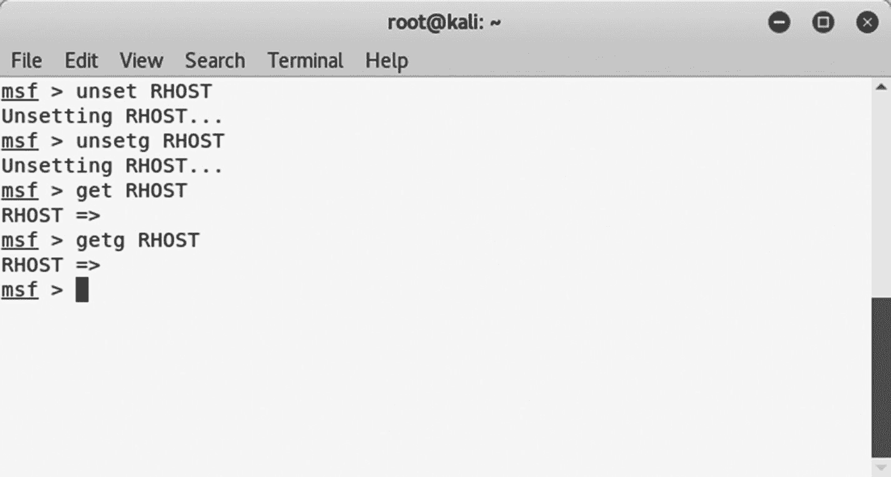
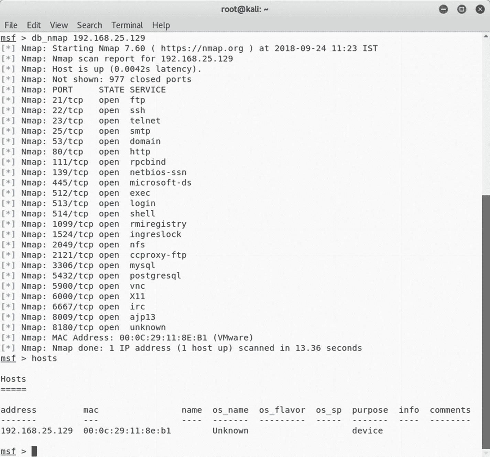
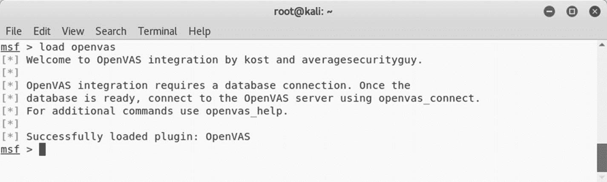
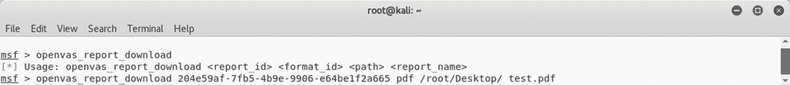

# 三、渗透测试指南

前两章介绍了 NMAP 和 OpenVAS，您可以使用它们来执行信息收集、枚举和漏洞评估。接下来，本章将介绍 Metasploit 的基础知识，这将帮助您完成渗透测试生命周期的剩余阶段。具体来说，本章包括以下内容:

*   Metasploit 简介

*   Metasploit 结构概述

*   基本命令和配置

*   从 Metasploit 调用 NMAP 和 OpenVAS 扫描

*   使用 Metasploit 扫描服务

*   仪表首选基础

## Metasploit 简介

Metasploit 发布于 2003 年，当时 H.D Moore 用 Perl 开发了一个可移植的网络工具。在 2007 年，使用 Ruby 对其进行了修订。当 Rapid 7 在 2009 年收购 Metasploit 项目时，该项目获得了商业认可和普及。

Metasploit 不仅仅是一个工具。这是一个完整的框架。它非常健壮和灵活，有大量的工具来执行各种简单和复杂的任务。它有一种独特的能力来执行渗透测试生命周期中几乎所有的任务。通过使用 Metasploit，您不需要重新发明轮子；您只需要关注渗透测试的目标，所有的支持行为都可以使用框架的不同组件来执行。

虽然 Metasploit 功能强大，但是您需要清楚地了解它的结构和组件，以便有效地使用它。

Metasploit 有三个可用版本。

*   metasploit pro

*   Metasploit 社区

*   Metasploit 框架

对于本书的范围，我们将使用 Metasploit 框架版本。

## 元质体的解剖和结构

在开始实际的框架命令之前，首先需要理解 Metasploit 的结构。了解整个 Metasploit 结构的最好和最简单的方法就是浏览它的目录。在 Kali Linux 中，Metasploit 默认位于`/usr/share/metasploit-framework`，如图 [3-1](#Fig1) 所示。

图 3-1

Metasploit 目录结构

您可以看到 Metasploit 有一个定义良好的结构，将它的各种组件分成不同的类别。

在高层次上，Metasploit 可以被可视化，如图 [3-2](#Fig2) 所示。

图 3-2

Metasploit 的各种组件

### 助动词

辅助是使 Metasploit 如此灵活的模块。Metasploit *辅助*只不过是专门为执行任务而编写的一段代码。例如，您可能想要检查特定的 FTP 服务器是否允许匿名访问，或者您的 web 服务器是否容易受到 heartbleed 攻击。对于所有这些任务，都有一个辅助模块。

事实上，Metasploit 有 1000 多个辅助模块，分为 19 个类别。以下是 Metasploit 中可用的辅助类别:

| 管理 | 分析 | Bnat 公司 |
| 客户 | 爬行者 | 文档 |
| 两个 | 文件格式 | 福尔扎尔斯！福尔扎尔斯！福尔扎尔扎尔扎尔扎尔扎尔扎尔扎尔扎尔扎尔扎尔扎尔扎尔扎尔扎尔扎尔扎尔扎尔 |
| 聚集 | 句法分析程序 | 可移植文档格式文件的扩展名（portable document format 的缩写） |
| 扫描仪 | 计算机网络服务器 | 嗅探器 |
| 愚弄 | 炒 | （同 VoiceoverInternetProtocol）网络电话 |
| 汉化版 |   |   |

### 有效载荷

您已经了解到，漏洞是用来攻击易受攻击组件的一段代码。漏洞利用代码可能会成功运行，但是一旦漏洞利用成功，您希望发生什么是由有效负载定义的。简单来说，*有效载荷*是在执行一个漏洞利用后需要执行的动作。例如，如果您想为您的系统创建一个反向 shell，那么您需要为此选择适当的 Metasploit 有效负载。Metasploit 大约有 42 个有效负载，分为以下类别:

| 挑选 | 陌生人 | 阶段 |

### 利用

漏洞是 Metasploit 极其重要的一部分。该框架的整个目的是为各种漏洞提供利用。*漏洞利用*是将在目标系统上执行以利用漏洞的实际代码。Metasploit 在 17 个类别中有超过 1，800 个漏洞。

以下是 Metasploit 中可用的各种攻击类别:

| [计]高级交互执行程序（Advanced Interactive Executive） | 机器人 | 苹果公司 |
| bs 迪 | 拨号上网 | 火狐浏览器 |
| 操作系统 | 问题 | 伊里克斯 |
| Linux 操作系统 | 主机 | 多（前缀） |
| novell 公司出的网络操作系统 | 系统 | 操作系统 |
| Unix 操作系统 | Windows 操作系统 |   |

### **编码器**

Metasploit 帮助您生成各种各样的负载，您可以通过多种方式将这些负载发送到目标。在此过程中，您的有效负载很可能会被目标系统上的防病毒软件或任何安全软件检测到。这就是编码器能有所帮助的地方。编码器使用各种技术和算法来混淆有效载荷，使其不被防病毒软件检测到。Metasploit 有大约 40 个编码器，分为十类，如下所示:

| 煤矿管理局 | 一般的 |
| 米普斯贝 | 简单的 |
| 服务器端编程语言（Professional Hypertext Preprocessor 的缩写） | 告别... |
| 红宝石 | 平流层过程及其在气候中的作用 |
| X64 | X86 |

### **开采后活动(Post)**

一旦您使用任何可用的漏洞获得了对目标系统的基本访问权限，您就可以使用 post 模块来进一步渗透目标系统。这些模块可帮助您完成所有开发后活动，包括以下内容:

*   将用户权限提升至 root 或管理员

*   正在检索系统凭据

*   窃取 cookies 和保存的凭据

*   捕获目标系统上的击键

*   执行自定义 PowerShell 脚本以执行其他任务

*   使访问持久

Metasploit 有大约 311 个开发后模块，分为以下 11 个类别:

| [计]高级交互执行程序（Advanced Interactive Executive） | 机器人 |
| 加拿大白鲑 | 火狐浏览器 |
| 五金器具 | 杜松 |
| Linux 操作系统 | 多（前缀） |
| 系统 | 操作系统 |
| Windows 操作系统 |   |

## 基本命令和配置

现在您已经了解了 Metasploit 的基本结构和剖析，可以开始使用它的接口了。要访问 Metasploit，打开终端，键入命令`msfconsole`，如图 [3-3](#Fig3) 所示。

图 3-3

MSFconsole 的初始屏幕

### 帮助

一旦你打开了 MSFconsole，你就可以使用`help`命令获得所有基本命令的信息，如图 [3-4](#Fig4) 所示。

图 3-4

MSFconsole 中 help 命令的输出

### 版本

漏洞很快就会被发现，相应的漏洞利用代码通常也会很快发布。因此，Metasploit 保持最新并拥有最新的漏洞利用代码集是非常重要的。为了确保框架版本是最新的，可以使用`version`命令，如图 [3-5](#Fig5) 所示。然后，您可以将这个版本与 Metasploit Git 存储库中可用的版本进行比较。

图 3-5

MSFconsole 中 version 命令的输出

### 连接

我们都知道 Telnet、SSH 和 Netcat 等工具可以帮助我们进行远程管理。Metasploit 有一个名为`connect`的内置实用程序，可用于建立连接并与远程系统交互。它支持 SSL、代理、旋转和文件传输。`connect`命令需要有效的 IP 地址和端口才能连接，如图 [3-6](#Fig6) 所示。

图 3-6

MSFconsole 中 connect 命令的输出

### 历史

MSFconsole 完全是在命令行上操作的，对于要执行的每个任务，都需要键入一些命令。要查看到目前为止你在 MSFconsole 中使用过的命令，可以使用`history`命令，如图 [3-7](#Fig7) 所示。

图 3-7

MSFconsole 中 history 命令的输出

### 设置和设置 g

Metasploit 有一些变量需要在执行任何模块或利用之前设置。这些变量有两种类型。

*   *局部*:局部变量是有限的，只对单个实例有效。

*   *全局*:全局变量一旦定义，就适用于整个框架，并且可以在任何需要的地方重用。

`set`命令用于定义局部变量的值，而`setg`命令用于定义全局变量的值，如图 [3-8](#Fig8) 所示。

图 3-8

MSFconsole 中 set 和 setg 命令的输出

### 得到和得到

在上一节中，您看到了如何设置局部和全局变量的值。一旦这些值被设置，你可以使用`get`和`getg`命令查看这些值，如图 [3-9](#Fig9) 所示。`get`命令获取局部变量的值，而`getg`命令获取全局变量的值。

图 3-9

MSFconsole 中 get 和 getg 命令的输出

### 未设置和未设置

`unset`命令用于删除分配给局部变量的值，而`unsetg`命令用于删除分配给全局变量的值，如图 [3-10](#Fig10) 所示。

图 3-10

MSFconsole 中 unset 和 unsetg 命令的输出

### 救援

在进行渗透测试项目时，可能会配置大量的全局变量和设置。你当然不想丢失这些设置；`save`命令将当前配置写入文件，如图 [3-11](#Fig11) 所示。

图 3-11

MSFconsole 中 save 命令的输出

### 信息

Metasploit 中有大量可用的模块和插件。不可能知道他们所有人。无论何时你想使用任何模块，你都可以使用`info`命令找到更多关于它的细节，如图 [3-12](#Fig12) 所示。只需将模块名作为参数提供给`info`命令来获取它的详细信息。

图 3-12

MSFconsole 中 info 命令的输出

### 抗高血压药

Metasploit 基于 Ruby。它提供了一个交互式 Ruby (irb) shell，您可以在其中执行自己的定制命令集。该模块增强了 Metasploit 的后期开发能力。只需输入`irb`命令，如图 [3-13](#Fig13) 所示，进入 irb shell。要了解更多 Ruby 编程，请参考 [`https://www.ruby-lang.org/en/`](https://www.ruby-lang.org/en/) 。

图 3-13

MSFconsole 中 irb 命令的输出

### 显示

在本章的开始部分，您看到了 Metasploit 的各种组件，包括辅助、利用、有效负载等等。使用`show`命令，如图 [3-14](#Fig14) 所示，可以列出每个类别的内容。例如，您可以使用`show auxiliary`命令列出框架中所有可用的辅助模块。

图 3-14

MSFconsole 中 show 命令的输出

### 线轴

您已经看到了`save`命令，它将配置写入文件。在一个特定的场景中，您可能希望保存您执行的所有模块和命令的输出。`spool`命令，如图 [3-15](#Fig15) 所示，将所有控制台输出记录到指定文件。

图 3-15

MSFconsole 中 spool 命令的输出

### 制造商

自动化在任何框架中都扮演着重要的角色。将一堆重复的任务自动化总是有助于节省时间和精力。如图 [3-16](#Fig16) 所示的`makerc`命令通过将 Metasploit 任务保存为脚本来帮助您自动化这些任务。

图 3-16

MSFconsole 中 makerc 命令的输出

### 数据库启动

考虑到 Metasploit 的复杂性，必须存在一些数据库来存储任务的数据是微不足道的。默认情况下，Metasploit 与 PostgreSQL 数据库集成在一起。首先需要通过执行`systemctl start postgresql`命令，然后执行`msfdb init`命令来启动数据库服务，如图 [3-17](#Fig17) 所示。

图 3-17

终端中 systemctl 和 msfdb init 命令的输出

### 数据库状态

一旦初始化了数据库，就可以通过执行 MSFconsole 中的命令`db_status`来确认 Metasploit 已经连接到它，如图 [3-18](#Fig18) 所示。

图 3-18

MSFconsole 中 db_status 命令的输出

### 工作空间

有时，您可能需要同时处理多个渗透测试项目。您肯定不希望混淆来自多个项目的数据。Metasploit 提供了高效的工作空间管理。对于每个新项目，您可以创建一个新的工作区，从而将项目数据限制在该工作区内。如图 [3-19](#Fig19) 所示的`workspace`命令列出了可用的工作空间。您可以使用命令`workspace -a <name>`创建一个新的工作空间。

图 3-19

MSFconsole 中 workspace 命令的输出

## 从 Metasploit 调用 NMAP 和 OpenVAS 扫描

本节介绍如何从 Metasploit 控制台中调用和启动 NMAP 和 OpenVAS 扫描。

### NMAP(消歧义)

你在本书前面已经了解了 NMAP。您看到了 NMAP 可以从命令行界面或 ZENMAP 图形用户界面触发。然而，还有另一种方法来启动 NMAP 扫描，那就是通过 Metasploit 控制台。

将 NMAP 扫描结果导入到 Metasploit 中，然后进一步利用开放的服务会很有帮助。有两种方法可以实现这一点。

图 3-21

使用 db_nmap 命令从 MSFconsole 调用 NMAP

*   *从 MSFconsole* 内部调用 NMAP:Metasploit 提供命令`db_nmap`，可以直接从 Metasploit 控制台内部启动 NMAP 扫描，如图 [3-21](#Fig21) 所示。

图 3-20

MSFconsole 中 db_import 和 hosts 命令的输出

*   *导入 NMAP 扫描*:您知道 NMAP 能够以 XML 格式生成和保存扫描输出。您可以使用`db_import`命令将 NMAP XML 输出导入到 Metasploit 中，如图 [3-20](#Fig20) 所示。

一旦 NMAP 扫描完成，您可以使用`hosts`命令来确保扫描完成并且目标被添加到 Metasploit 数据库中。

### open vas！open vas！open vas

您已经对 OpenVAS 很熟悉了，因为您在前几章中已经对它的大部分特性有所了解。然而，Metasploit 提供了集成 OpenVAS 的能力，以便在框架内执行任务。在您可以从 MSFconsole 实际执行任何 OpenVAS 任务之前，您需要通过执行命令`load openvas`来加载 OpenVAS 插件，如图 [3-22](#Fig22) 所示。

图 3-22

将 OpenVAS 插件加载到 MSFconsole 中

一旦 OpenVAS 加载到 MSFconsole 中，您就可以执行许多任务。您可以使用`openvas_help`命令，如图 [3-23](#Fig23) 所示，列出所有可能的任务。

图 3-23

MSFconsole 中 openvas_help 命令的输出

OpenVAS 服务器可能运行在本地或某个远程系统上。你需要使用命令`openvas_connect`连接到 OpenVAS 服务器，如图 [3-24](#Fig24) 所示。您需要提供用户名、密码、OpenVAS 服务器 IP 和端口作为该命令的参数。

图 3-24

使用 MSFconsole 中的 openvas_connect 命令连接到 OpenVAS 服务器

一旦连接到 OpenVAS 服务器成功，您需要使用命令`openvas_target_create`创建一个新的目标，如图 [3-25](#Fig25) 所示。您需要提供测试名称、目标 IP 地址和注释(如果有的话)作为这个命令的参数。

图 3-25

使用 MSFconsole 中的 openvas_target_create 命令为 OpenVAS 扫描创建新目标

创建新目标后，需要使用`openvas_config_list`命令选择扫描轮廓，如图 [3-26](#Fig26) 所示。

图 3-26

MSFconsole 中 openvas_config_list 命令的输出

选择扫描配置文件后，就可以创建扫描任务了。命令`openvas_task_create`可用于创建新任务，如图 [3-27](#Fig27) 所示。您需要提供扫描名称、注释(如果有)、配置 ID 和目标 ID 作为该命令的参数。

图 3-27

在 MSFconsole 中使用命令 openvas_task_create 创建新的 OpenVAS 扫描任务

现在扫描任务已经创建，您可以使用命令`openvas_task_start`启动扫描，如图 [3-28](#Fig28) 所示。您需要提供任务 ID 作为该命令的参数。

图 3-28

使用 MSFconsole 中的 openvas_task_start 命令运行新创建的 OpenVAS 任务

扫描需要一段时间才能完成。一旦扫描完成，您可以使用命令`openvas_report_list`查看报告，如图 [3-29](#Fig29) 所示。

图 3-29

在 MSFconsole 中使用 openvas_report_list 命令列出 OpenVAS 报告

现在扫描已经完成，报告也准备好了，您可以使用`openvas_report_download`命令下载报告，如图 [3-30](#Fig30) 所示。您需要提供报告 ID、报告格式、输出路径和报告名称作为该命令的参数。

图 3-30

在 MSFconsole 中使用 oepnvas_report_download 命令保存 OpenVAS 报告

## 使用 Metasploit 辅助工具扫描和利用服务

Metasploit 为扫描、枚举和利用各种服务和协议提供了广泛的利用和辅助模块选择。本节介绍了一些辅助模块，并针对常用协议进行了探讨。

### 域名服务器(Domain Name Server)

在前一章中，你学习了如何使用 NMAP 来枚举一个 DNS 服务。Metasploit 还有几个辅助模块，可用于 DNS 侦察。

图 [3-31](#Fig31) 显示了`/auxiliary/gather/enum_dns`模块的使用。您需要做的就是配置目标域并运行该模块。它返回相关的 DNS 服务器作为结果。

图 3-31

辅助模块 enum_dns 的使用

### 文件传送协议

假设在进行 NMAP 扫描时，您发现您的目标在端口 21 上运行 FTP 服务器，并且服务器版本是 vsftpd 2.3.4。

您可以使用`search`函数来查明 Metasploit 是否对 vsftpd 服务器有任何利用，如图 [3-32](#Fig32) 所示。

图 3-32

搜索 vsftpd 漏洞的输出

这里您将使用漏洞利用`/unix/ftp/vsftpd_234_backdoor`来利用易受攻击的 FTP 服务器。您可以将目标 IP 地址配置为`RHOST`变量，然后运行漏洞利用，如图 [3-33](#Fig33) 所示。

图 3-33

使用 vsftpd _ 234 _ 后门漏洞成功利用目标

攻击成功，您可以通过命令外壳访问目标系统。

### 超文本传送协议

超文本传输协议(HTTP)是主机上最常见的服务之一。Metasploit 有许多漏洞和辅助工具来枚举和利用 HTTP 服务。辅助模块`auxiliary/scanner/http/http_version`，如图 [3-34](#Fig34) 所示，枚举 HTTP 服务器版本。基于确切的服务器版本，您可以更精确地规划进一步的开发。

图 3-34

辅助模块 http_version 的输出

很多时候，web 服务器的目录并不直接公开，并且可能包含有趣的信息。Metasploit 有一个名为`auxiliary/scanner/http/brute_dirs`的辅助模块，用于扫描此类目录，如图 [3-35](#Fig35) 所示。

图 3-35

辅助模块 brute_dirs 的输出

### 远端桌面协定

远程桌面协议(RDP)是微软为远程图形管理开发的专有协议。如果你的目标是基于 Windows 的系统，那么你可以执行一个叫做`auxiliary/scanner/rdp/ms12_020_check`的辅助模块，如图 [3-36](#Fig36) 所示。它检查目标是否易受 MS-12-020 漏洞的攻击。您可以在 [`https://docs.microsoft.com/en-us/security-updates/securitybulletins/2012/ms12-020`](https://docs.microsoft.com/en-us/security-updates/securitybulletins/2012/ms12-020) 了解关于此漏洞的更多详情。

图 3-36

辅助模块 ms12_020_check 的输出

### 服务器信息块

在上一章中，您使用了 NMAP 来枚举 SMB。Metasploit 为 SMB 的枚举和利用提供了许多有用的辅助模块。

对 SMB 模块的简单搜索获取结果，如图 [3-37](#Fig37) 所示。

图 3-37

SMB 相关模块和漏洞的搜索查询输出

您可以使用一个名为`auxiliary/scanner/smb/smb_enumshares`的辅助模块，如图 [3-38](#Fig38) 所示。您需要将`RHOST`变量的值设置为目标 IP 地址的值。该模块返回结果以及目标系统上的共享列表。

图 3-38

辅助模块 smb_enumshares 的输出

另一个流行的 SMB 利用漏洞是 MS-08-67 netapi。可以使用漏洞利用`exploit/windows/smb/ms08_067_netapi`，如图 [3-39](#Fig39) 。您需要将变量`RHOST`的值设置为目标系统的 IP 地址。如果攻击成功运行，您将看到 Meterpreter shell。

图 3-39

使用漏洞 ms08_067_netapi 成功利用目标系统

### 嘘

安全外壳(SSH)是安全远程管理的常用协议之一。Metasploit 有许多用于 SSH 枚举的辅助模块。您可以使用辅助模块`auxiliary/scanner/ssh/ssh_version`，如图 [3-40](#Fig40) 所示。您需要将`RHOST`变量的值设置为目标值。该模块执行并返回目标上运行的确切 SSH 版本。这些信息可用于进一步开发。

图 3-40

辅助模块 ssh_version 的输出

### 远程桌面

虚拟网络计算(VNC)是一种用于图形远程管理的协议。Metasploit 有几个用于枚举和利用 VNC 的模块。图 [3-41](#Fig41) 显示了`auxiliary/scanner/vnc/vnc_login`模块的使用。您需要将`RHOST`变量的值设置为目标系统的 IP 地址。该模块使用内置的密码字典，并试图进行暴力攻击。一旦该模块完成执行，它将为您提供 VNC 密码，您可以使用该密码登录。

图 3-41

辅助模块 vnc_login 的输出

## 仪表首选基础

Meterpreter 是 Metasploit 解释器的缩写。它是一种高级 Metasploit 负载，使用内存中的 DLL 注入技术与目标系统进行交互。它提供了几个有用的后期开发工具和实用程序。

## Meterpreter 命令

Meterpreter 是一种高级有效载荷，用于执行各种开发后活动。以下是一些可以帮助您浏览 Meterpreter 的基本命令。

### 核心命令

表 [3-1](#Tab1) 描述了一组核心 Meterpreter 命令，可以帮助您在目标系统上完成各种与会话相关的任务。

表 3-1

Meterpreter 命令

| 

命令

 | 

描述

 |
| --- | --- |
| `?` | 显示帮助菜单 |
| `background` | 当前会话的背景 |
| `bgkill` | 终止后台 Meterpreter 脚本 |
| `bglist` | 列出正在运行的后台脚本 |
| `bgrun` | 将 Meterpreter 脚本作为后台线程执行 |
| `channel` | 显示信息或控制活动频道 |
| `close` | 关闭频道 |
| `disable_unicode_encoding` | 禁用 unicode 字符串编码 |
| `enable_unicode_encoding` | 启用 Unicode 字符串编码 |
| `exit` | 终止抄表员会话 |
| `get_timeouts` | 获取当前会话超时值 |
| `guid` | 获取会话 GUID |
| `help` | 显示帮助菜单 |
| `info` | 显示关于开机自检模块的信息 |
| `irb` | 进入 irb 脚本模式 |
| `load` | 加载一个或多个抄表员扩展 |
| `machine_id` | 获取附加到会话的计算机的 MSF ID |
| `migrate` | 将服务器迁移到另一个进程 |
| `pivot` | 管理透视侦听器 |
| `quit` | 终止抄表员会话 |
| `read` | 从通道读取数据 |
| `resource` | 运行存储在文件中的命令 |
| `run` | 执行 Meterpreter 脚本或 post 模块 |
| `sessions` | 快速切换到另一个会话 |
| `set_timeouts` | 设置当前会话超时值 |
| `sleep` | 强制 Meterpreter 进入静默状态，然后重新建立会话 |
| `transport` | 改变当前的传输机制 |
| `uuid` | 获取当前会话的 UUID |
| `write` | 将数据写入通道 |

### Stdapi:系统命令

表 [3-2](#Tab2) 描述了一组基本的系统命令，这些命令提供了一系列系统任务，如进程列表和删除、执行命令、重启等。

表 3-2

系统命令

| 

命令

 | 

描述

 |
| --- | --- |
| `clearev` | 清除事件日志 |
| `drop_token` | 放弃任何活动的模拟令牌 |
| `execute` | 执行命令 |
| `getenv` | 获取一个或多个环境变量值 |
| `getpid` | 获取当前进程标识符 |
| `getprivs` | 尝试启用当前进程可用的所有特权 |
| `getsid` | 获取运行服务器的用户的 SID |
| `getuid` | 获取运行服务器的用户 |
| `kill` | 终止一个进程 |
| `localtime` | 显示目标系统的本地日期和时间 |
| `pgrep` | 按名称过滤进程 |
| `pkill` | 按名称终止进程 |
| `ps` | 列出正在运行的进程 |
| `reboot` | 重新启动远程计算机 |
| `reg` | 修改远程注册表并与之交互 |
| `rev2self` | 在远程机器上调用`RevertToSelf()` |
| `shell` | 放入系统命令外壳 |
| `shutdown` | 关闭远程计算机 |
| `steal_token` | 试图从目标进程窃取模拟令牌 |
| `suspend` | 暂停或恢复进程列表 |
| `sysinfo` | 获取有关远程系统的信息，如操作系统 |

### Stdapi:用户界面命令

表 [3-3](#Tab3) 列出了帮助您从目标系统获取远程屏幕截图和击键的命令。

表 3-3

用户界面命令

| 

命令

 | 

描述

 |
| --- | --- |
| `enumdesktops` | 列出所有可访问的桌面和窗口站 |
| `getdesktop` | 获取当前的 Meterpreter 桌面 |
| `idletime` | 返回远程用户空闲的秒数 |
| `keyscan_dump` | 转储击键缓冲区 |
| `keyscan_start` | 开始捕获击键 |
| `keyscan_stop` | 停止捕获击键 |
| `screenshot` | 抓取交互式桌面的屏幕截图 |
| `setdesktop` | 更改 Meterpreter 的当前桌面 |
| `uictl` | 控制一些用户界面组件 |

### Stdapi:网络摄像头命令

表 [3-4](#Tab4) 描述了从连接到您的受损系统的网络摄像头获取实时图片和视频流的有效命令。

表 3-4

网络摄像机命令

| 

命令

 | 

描述

 |
| --- | --- |
| `record_mic` | 从默认麦克风录制音频 *x* 秒 |
| `webcam_chat` | 开始视频聊天 |
| `webcam_list` | 列出网络摄像机 |
| `webcam_snap` | 从指定的网络摄像头拍摄快照 |
| `webcam_stream` | 播放来自指定网络摄像头的视频流 |

### Stdapi:音频输出命令

表 [3-5](#Tab5) 描述了一个帮助您在受损系统上播放音频文件的命令。

表 3-5

音频输出命令

| 

命令

 | 

描述

 |
| --- | --- |
| `play` | 在目标系统上播放音频文件，磁盘上不写入任何内容 |

### Priv:提升命令

表 [3-6](#Tab6) 描述了帮助您将权限提升到最高级别的命令，可能是 root 或管理员。

表 3-6

提升命令

| 

命令

 | 

描述

 |
| --- | --- |
| `getsystem` | 试图将您的权限提升到本地系统的权限 |

### Priv:口令数据库命令

表 [3-7](#Tab7) 描述了帮助您从受损系统获取原始密码散列的命令。

表 3-7

密码数据库命令

| 

命令

 | 

描述

 |
| --- | --- |
| `hashdump` | 转储 SAM 数据库的内容 |

### Priv: Timestomp 命令

表 [3-8](#Tab8) 描述了一个命令，它是 Metasploit 反伪造功能的一部分。

表 3-8

时间戳命令

| 

命令

 | 

描述

 |
| --- | --- |
| `timestomp` | 操作文件的 MACE 属性 |

## 使用流量计

为了熟悉 Meterpreter，我们先利用 SMB MS08-067 netapi 漏洞远程访问一个目标系统，如图 [3-42](#Fig42) 所示。攻击成功了，你得到了 Meterpreter 外壳。

图 3-42

使用漏洞 ms08_067_netapi 成功利用目标系统

### 系统信息表

一旦您利用漏洞攻击了目标，您需要检查目标的一些基本细节，如确切的操作系统版本、计算机名称、域、体系结构等等。Meterpreter 提供了一个名为`sysinfo`的命令，可以用来收集目标的基本信息，如图 [3-43](#Fig43) 所示。

图 3-43

Meterpreter 中 sysinfo 命令的输出

### 限位开关（Limit Switch）

Meterpreter `ls`命令可用于列出受损系统当前目录下的文件，如图 [3-44](#Fig44) 所示。

图 3-44

远程受损系统上文件的 Meterpreter 列表中辅助 ls 命令的输出

### 色彩

一旦您获得了对目标系统的访问权，您必须了解您在该系统上拥有什么用户权限。拥有 root 或管理员级别的权限是最理想的，较低的权限访问意味着对您的操作有很多限制。Meterpreter 提供了一个名为`getuid`的命令，如图 [3-45](#Fig45) 所示，该命令检查受损系统上的当前权限级别。

图 3-45

Meterpreter 中 getuid 命令的输出

### 提权

一旦您使用适用的漏洞获得了对目标系统的访问权限，下一个合乎逻辑的步骤就是检查权限。使用`getuid`命令，您已经测量了您当前的特权级别。您可能没有获得根或管理员级别的访问权限。因此，为了最大化攻击渗透，提升您的用户权限非常重要。Meterpreter 帮助您提升权限。打开 Meterpreter 会话后，您可以使用`getsystem`命令，如图 [3-46](#Fig46) 所示，将权限提升至管理员权限。

图 3-46

Meterpreter 中 getsystem 命令的输出

### 屏幕上显示程序运行的图片

在系统受损后，看一眼目标系统上运行的桌面 GUI 是很有趣的。Meterpreter 提供了一个名为`screenshot`的实用程序，如图 [3-47](#Fig47) 所示。它只是拍摄目标系统上当前桌面的快照，并将其保存在本地根文件夹中。

图 3-47

Meterpreter 中屏幕截图命令的输出

图 [3-48](#Fig48) 显示了从受损系统中捕获的桌面屏幕。

图 3-48

在远程受损系统上运行的桌面的屏幕截图

### hashdump

在一次成功的系统入侵之后，您肯定希望获得该系统上不同用户的凭证。打开 Meterpreter 会话后，您可以使用`hashdump`命令从受损系统中转储所有 LM 和 NTLM 哈希，如图 [3-49](#Fig49) 所示。一旦你有了这些哈希，你就可以把它们提供给各种离线哈希破解程序，并以纯文本的形式获取密码。

图 3-49

辅助模块 vnc_login 的输出

### Searchsploit

到目前为止，您已经了解到 Metasploit 拥有丰富的辅助工具、漏洞、有效负载、编码器等集合。但是，有时 Metasploit 中可能不存在针对某个漏洞的利用代码。在这种情况下，您可能需要将所需的漏洞利用从外部来源导入到 Metasploit 中。Exploit-DB 是各种平台漏洞的综合来源，Searchsploit 是一个帮助在 Exploit-DB 中搜索特定漏洞的实用程序。图 [3-50](#Fig50) 显示了使用 Searchsploit 工具寻找与当前相关的漏洞。

图 3-50

使用 Searchsploit 工具搜索与 uTorrent 相关的漏洞

## 摘要

本章向您介绍了 Metasploit 的各个方面，从框架和辅助结构到利用 ast 服务。您还学习了如何利用 Metasploit 功能来集成 NMAP 和 OpenVAS。已经学习了各种 Metasploit 有效负载、辅助工具和利用，在下一章中，您将学习应用这些技能来利用易受攻击的机器。

## 自己动手做练习

*   浏览 Metasploit 目录并了解其结构。

*   尝试各种命令，如`set`、`setg`、`unset`、`unsetg`、`spool`等等。

*   从 MSFconsole 启动 NMAP 扫描。

*   在 MSFconsole 中使用 OpenVAS 对目标系统执行漏洞评估。

*   探索各种辅助模块，并使用它们来扫描 HTTP、FTP、SSH 等服务。

*   尝试 Meterpreter 的不同功能，如`getsystem`和`hashdump`。