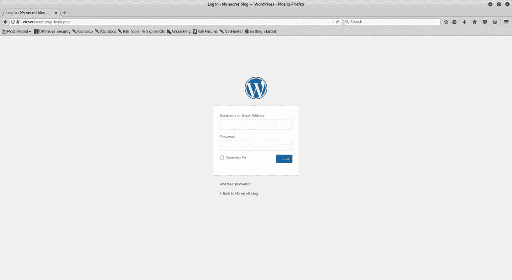

# 四、用例

在前三章中，您已经熟悉了基本工具 NMAP、OpenVAS 和 Metasploit。您详细了解了每个工具，以及它们如何相互集成以提高效率。

现在是时候将所有的知识整合在一起，并应用到实际场景中了。在本章中，您将应用到目前为止所学的各种技术来利用易受攻击的系统并获得对它的访问。

## 创建虚拟实验室

在实际生产系统中尝试你新学到的技能并不总是可能的。因此，您可以在自己的虚拟实验室中以受限的方式尝试您的技能。

Vulnhub ( [`https://www.vulnhub.com`](https://www.vulnhub.com) )是一个提供下载系统的网站，这些系统被故意设置为易受攻击。您只需下载一个系统映像，并在 VirtualBox 或 VMware 中启动它。

出于本案例研究的目的，请访问 [`https://www.vulnhub.com/entry/basic-pentesting-1,216/`](https://www.vulnhub.com/entry/basic-pentesting-1,216/) 并下载该系统。下载后，使用 VirtualBox 或 VMware 启动它。系统的初始启动屏幕如图 [4-1](#Fig1) 所示。

图 4-1

目标系统的初始引导屏幕

您没有登录系统的任何凭证，因此您必须使用笔测试技能才能进入系统。

## 进行侦察

在 Kali Linux 中，启动 ZENMAP 对该目标进行端口扫描和服务枚举，如图 [4-2](#Fig2) 所示。

图 4-2

在目标系统上完成的 NMAP 密集扫描的输出

在 ZENMAP 输出中，您可以看到以下端口是打开的:

*   运行 ProFTPD 1.3.3c 的端口 21

*   运行 OpenSSH 7.2p2 的端口 22

*   运行 Apache httpd 2.4.18 的端口 80

基于此输出，您有三种可能的方法来破坏系统。

*   在 Metasploit 中搜索并执行 ProFTPD 1.3.3c 的任何漏洞

*   针对在端口 22 上运行的 SSH 的强力用户凭证

*   探索是否有任何应用程序托管在端口 80 上

## 利用系统

当您尝试使用浏览器在端口 80 上访问系统时，您将获得如图 [4-3](#Fig3) 所示的默认 web 服务器页面。

图 4-3

目标系统上的默认登录网页(端口 80)

现在您将再次回到 NMAP，这次您将使用 NMAP 脚本`http-enum`，而不是端口扫描，如图 [4-4](#Fig4) 所示。

图 4-4

在目标系统上执行的 http-enum NMAP 脚本的输出

脚本的输出告诉您，web 服务器上有一个名为`secret`的文件夹，其中可能有您感兴趣的内容。

收到关于服务器上的`secret`文件夹的输入后，尝试访问它，如图 [4-5](#Fig5) 所示。

图 4-5

浏览托管在目标 web 服务器上的秘密目录

你可以看到一个屏幕，暗示它是某种基于 WordPress 的博客。然而，该网页似乎是破碎和不完整的。

当你试图加载页面时，浏览器会寻找`vtcsec`主机。这意味着您需要配置您的系统来解析这个主机名。你可以简单的打开终端，然后在文本编辑器中打开文件`/etc/hosts`，如图 [4-6](#Fig6) 所示。

图 4-6

编辑/etc/hosts 文件以添加新的主机条目

接下来，添加新的一行:`192.168.25.132 vtcsec`。

在终端中，运行以下命令:`gedit /etc/hosts`。

现在，您已经在 hosts 文件中进行了必要的更改，让我们再次尝试访问 web 界面。接口载荷，如图 [4-7](#Fig7) 所示。

图 4-7

目标系统上的 WordPress 博客主页

通过检查图 [4-8](#Fig8) 所示的页面，很明显这个应用程序是基于 WordPress 的。

图 4-8

目标系统上的 WordPress 登录页面

接下来，您需要凭证来进入应用程序的管理控制台。您有三种方式获得它们，如下所示:

*   猜凭据；很多时候，默认凭证是有效的。

*   使用类似 Hydra 的密码破解工具来破解凭证。

*   使用 Metasploit 辅助模块`auxiliary/scanner/http/wordpress_login_enum`对应用程序凭证发起暴力攻击。

在这种情况下，应用程序具有默认的 admin/admin 凭据。

现在您有了应用程序凭证，您可以使用 Metasploit 上传一个恶意插件到 WordPress，这将给予您远程 shell 访问。WordPress 插件是一段现成的代码，你可以导入到 WordPress 安装中，以启用额外的功能。你可以使用 MSFconsole 中的`search`命令来查找任何与 WordPress 管理相关的漏洞，如图 [4-9](#Fig9) 所示。

图 4-9

Metasploit 中 wp_admin 漏洞的搜索查询输出

你现在需要使用漏洞利用`exploit/unix/webapp/wp_admin_shell_upload`，如图 [4-10](#Fig10) 所示。您需要配置参数`USERNAME`、`PASSWORD`、`TARGETURI`和`RHOST`。

图 4-10

针对目标系统利用 wp_admin_shell_upload 漏洞获取 Meterpreter 访问权限

该漏洞通过将恶意插件上传到 WordPress 并最终给予您所需的 Meterpreter 访问权限而成功运行。

在最初的 NMAP 扫描中，您发现您的目标也在端口 21 上运行 FTP 服务器。FTP 服务器版本是 ProFTPd 1.3.3。您可以检查 Metasploit 是否利用了此 FTP 服务器版本。使用`search`命令。

有趣的是，Metasploit 确实利用了 ProFTPd 服务器。可以使用`exploit/unix/ftp/proftpd_133c_backdoor`，如图 [4-11](#Fig11) 所示。您需要配置的只是`RHOST`变量。

图 4-11

proftpd 搜索查询的输出和目标系统上 proftpf_133c_backdoor 漏洞的执行

攻击代码成功运行，并在目标系统上给你一个外壳。

因此，你成功地用两种不同的方式利用了你的目标，一种是通过 WordPress，另一种是通过 FTP 服务器。恭喜你！